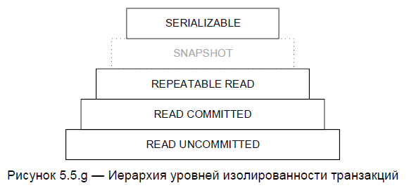
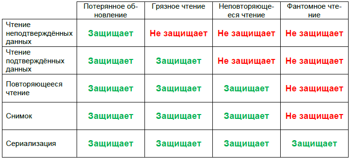

# Всегда ли транзакции изолированы друг от друга? Рассказать про уровни изоляций
---

**Реляционные базы данных в примерах, 2021, (Святослав Куликов):**

Уровень изолированности транзакций (transaction isolation level) — условное значение, показывающее, насколько внутреннее состояние
базы данных в момент выполнения транзакции доступно другим, одновременно выполняемым транзакциям.

*Упрощённо: насколько параллельно (одновременно) выполняемые транзакции «защищены» друг от друга.*

Прежде, чем мы рассмотрим сами уровни, необходимо пояснить, какие типичные проблемы могут возникать при одновременном доступе к одним и тем же данным нескольких транзакций.  
**Потерянное обновление (lost update)** — сохраняются только те изменения данных, которые были выполнены позже всего.
*Очень упрощённый пример: несколько сотрудников в офисе ругаются по поводу настроек кондиционера, т.е. кто-то его включает, кто-то выключает, кто-то делает теплее, кто-то холоднее — не важно, кто и что сделал ранее, кондиционер всегда настроен так, как его настроили «в самый последний момент».*  
**Грязное чтение (dirty read)** — становится доступным временное состояние данных, которые в дальнейшем будут удалены или изменены в силу отмены работавшей с ними транзакции.
*Очень упрощённый пример: ребёнок подслушал, что родители собираются подарить ему на день рождения велосипед, и радостный побежал рассказывать об этом друзьям; через пять минут родители передумали.*  
**Неповторяющееся чтение (non-repeatable read)** — происходит изменение одних и тех же данных за время работы транзакции (т.е. при повторном чтении ранее прочитанных данных получается новый результат).
*Очень упрощённый пример: вы решили попить чаю; заглянули в шкафчик и посмотрели, какой там есть чай; пока вы грели чайник, кто-то заменил в шкафчике имевшийся там чай на другой (или вообще на кофе); вы снова открываете шкафчик и сильно удивляетесь, т.к. только что видели там другую картину.*  
**Фантомное чтение (phantom reads)** — происходит изменение количества строк, подпадающих под выборку (в силу добавления или удаления строк или изменения значений в их полях).
*Очень упрощённый пример: вы хотите сфотографировать трёх сидящих на ветке воробьёв; пока вы отвлеклись на настройки фотоаппарата, прилетело ещё два воробья.*  
Ключевое отличие неповторяющегося и фантомного чтения состоит в природе их возникновения: при неповторяющемся чтении меняются сами данные, а при повторном чтении меняется количество данных (т.е. добавляются или удаляются строки).

Теперь рассмотрим сами уровни изолированности. Когда транзакция выполняется с неким уровнем изолированности, СУБД обеспечивает такой транзакции «защиту» от тех или иных описанных выше проблем. Уровни изолированности представляют собой иерархию, где каждый следующий (более высокий) уровень включает в себя все «защитные механизмы» предыдущих (более низких) уровней.  

**Чтение неподтверждённых данных, грязное чтение (read uncommitted, dirty read)** — допускает чтение незафиксированных (т.е. до подтверждения или отмены транзакции) изменений — выполненных любой транзакцией (как той, что производит чтение, так и выполняющихся параллельно с ней).
Этот уровень обеспечивает отсутствие потерянных обновлений, т.е. если несколько параллельных транзакций изменяют одни и те же данные, в итоге эти данные будут иметь значение, полученное последовательным применением всех внесённых изменений. Все остальные проблемы (грязное чтение, неповторяющееся чтение, фантомное чтение) продолжают оставаться актуальными.  
Физически для защиты от потерянного обновления применяется блокировка изменяемых данных, т.е. изменения одних и тех же данных, выполняемые параллельно, на самом деле выполняются последовательно (выстраиваются в очередь).  
Никакие операции чтения на данном уровне изоляции не блокируются.  
**Чтение подтверждённых данных (read committed)** — допускает чтение всех изменений, выполненных самой транзакцией, и только подтверждённых (зафиксированных) изменений, выполненных другими (параллельными) транзакциями.
Этот уровень обеспечивает отсутствие потерянных обновлений и грязного чтения, при этом допускаются неповторяющееся чтение и фантомное чтение.  
Физически данный уровень реализуется с использованием блокировки или версионирования данных:  

- при блокировке транзакция, изменяющая данные, блокирует чтение этих данных для параллельных транзакций, выполняемых на уровне read committed и более высоких;

- при версионировании СУБД создаёт новую версию (копию) изменяемых данных для той транзакции, которая эти данные изменяет, а всем остальным (параллельным) транзакциям предоставляет доступ к старой (неизменённой) версии.

Оба варианта имеют множество преимуществ и недостатков, а также особенностей реализации, потому подробности можно найти только в документации по конкретной версии вашей конкретной СУБД.  
**Повторяющееся чтение (repeatable read)** — допускает только чтение изменений, выполненных самой транзакцией, а прочитанные ею данные становятся недоступными для изменения параллельным транзакциям.  
Этот уровень обеспечивает отсутствие потерянных обновлений, грязного чтения и неповторяющегося чтения, но допускает фантомное чтение.  
Физически данный уровень реализуется через блокировку прочитанных данных, что запрещает параллельным транзакциям изменять соответствующие строки таблиц. Но параллельные транзакции могут вставлять новые строки, что может порождать проблему фантомного чтения.  
**Снимок (snapshot)** — является частным (более высоким) случаем повторяющегося чтения, поддерживается не всеми СУБД, и допускает только чтение изменений, выполненных самой транзакцией, а прочитанные ею данные остаются доступны для изменения параллельным транзакциям (в этом состоит основное отличие от уровня повторяющегося чтения).  
**Сериализация (serializable)** — допускает только такое выполнение изменений данных, словно все модифицирующие данные транзакции выполняются не параллельно, а последовательно.  
Этот уровень обеспечивает отсутствие всех проблем, т.е. потерянных обновлений, грязного чтения, неповторяющегося чтения и фантомного чтения.
Физически это достигается за счёт управления очередью транзакций и сложной системы блокировок. Это самый надёжный в плане точности работы с данными уровень изолированности транзакций, но он же — и самый медленный с точки зрения производительности.

Для простоты и наглядности сведём информацию о том, «что от чего защищает» в единую таблицу  

Всё это разнообразие позволяет достичь оптимального сочетания необходимой защищённости данных, точности и производительности операций.