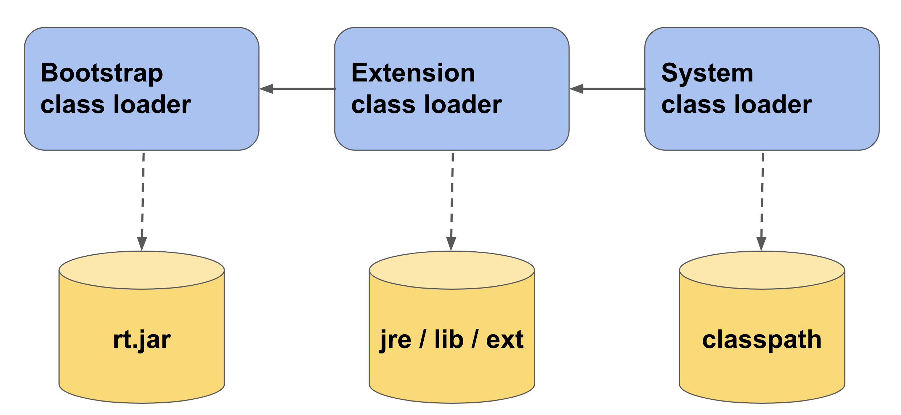

# Как происходит загрузка класса? Какие класс лоадеры знаете?
---

## Class loader

__Загрузчики классов__ — это специальные классы, которые являются частью JVM. Они загружают классы в память и делают их доступными для выполнения. 
Загрузчики работают со всеми классами: и с нашими, и с теми, которые непосредственно нужны для работы Java.

Lazy loading - механизм отложенной загрузки классов в Java. Это значит, что загрузка классов не будет выполняться до тех пор, 
пока в приложении не встретится обращение к классу.

### Иерархия загрузчиков классов

* __Bootstrap classloader.__ 
Это базовый загрузчик, который загружает все системные классы из архива rt.jar. 
При этом, есть небольшое отличие между загрузкой классов из rt.jar и наших классов: когда JVM загружает классы из rt.jar, 
она не выполняет все этапы проверки, которые выполняются при загрузке любого другого класс-файла т.к. JVM изначально известно, 
что все эти классы уже проверены. Поэтому, включать в этот архив какие-либо свои файлы не стоит.

* __Extension classloader.__
Загружает классы расширений из папки jre/lib/ext. Допустим, вы хотите, чтобы какой-то класс загружался каждый раз при старте Java машины. 
Для этого вы можете скопировать исходный файл класса в эту папку, и он будет автоматически загружаться.

* __System classloader.__ 
Загружает классы из classpath’а, который мы указали при запуске приложения.

Процесс загрузки классов происходит по иерархии:

1. В первую очередь мы запрашиваем поиск в кэше System Class Loader (кэш системного загрузчика содержит классы, которые уже были им загружены);
2. Если класс не был найден в кэше системного загрузчика, мы смотрим кэш Extension Class Loader;
3. Если класс не найден в кэше загрузчика расширений, класс запрашивается у загрузчика Bootstrap.
4. Если класс не найден в кэше Bootstrap, он пытается загрузить этот класс. Если Bootstrap не смог загрузить класс, он делегирует загрузку класса загрузчику расширений. 
Если на этот момент класс будет загружен, он остается в кэше у Extension classloader, а загрузка класса является завершенной.

## Classpath

__Classpath__ – это параметр, который указывает приложениям где искать пользовательские классы. 

Для того, чтобы указать JVM откуда загружать пользовательские классы, нужно воспользоваться переменной CLASSPATH. 
Устанавливать ее мы можем в следующих местах:
1) В глобальных переменных операционной системы.
2) Дополнительным аргументом в утилите cli java (`java -cp HelloWorld.jar Hello`, `-cp` сокращенно от `-classpath`).
3) В манифесте jar-архива.

## Ссылки

- [Removed rt.jar and tools.jar in JDK 9](https://docs.oracle.com/en/java/javase/12/migrate/index.html#JSMIG-GUID-A78CC891-701D-4549-AA4E-B8DD90228B4B)

