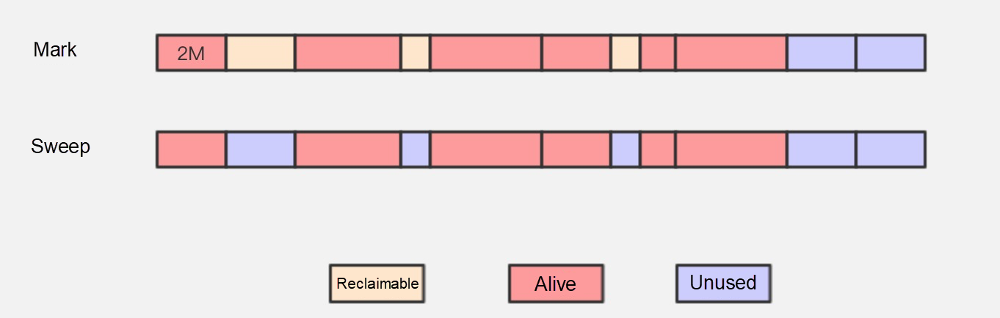
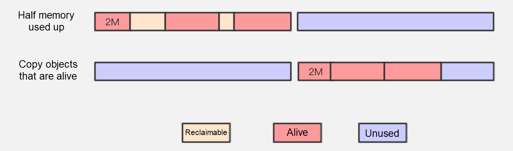
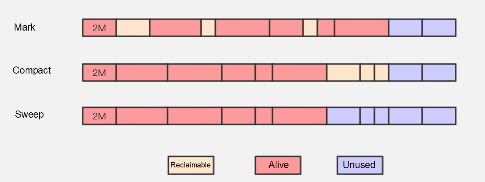
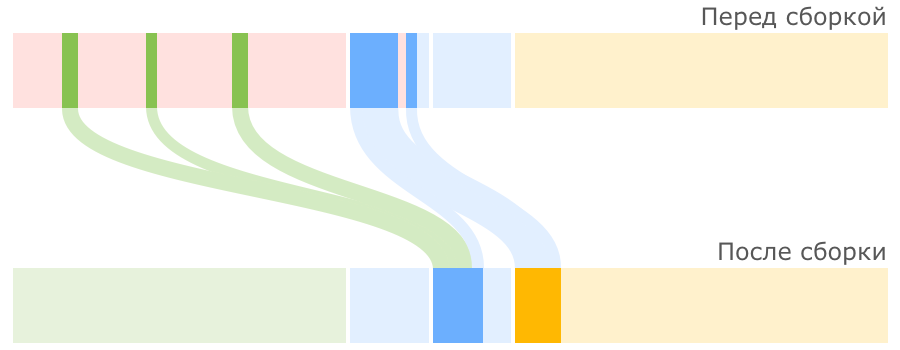
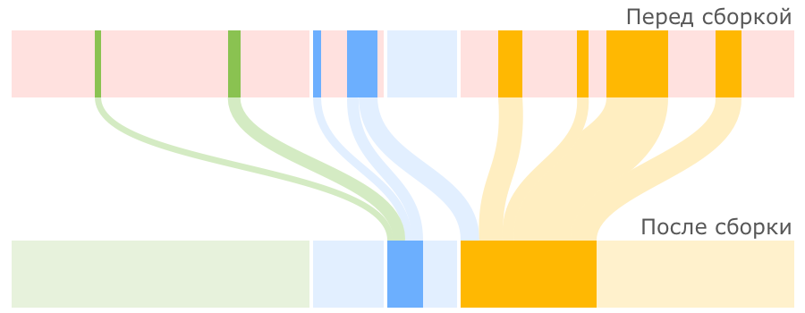
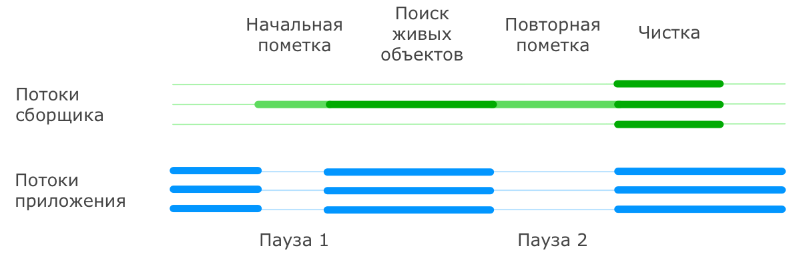
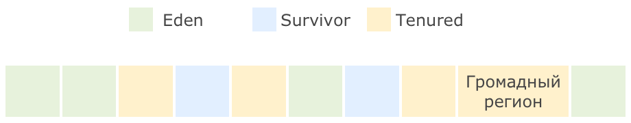
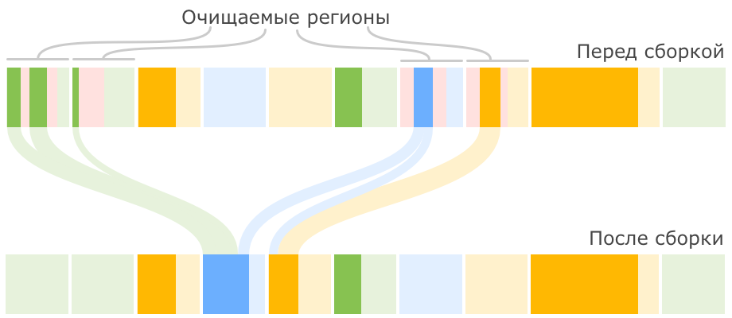

# Как происходит сборка мусора в JVM? Что такое GC roots и какие бывают? Какие виды GC знаете? 
---

## Garbage Collectors

В Java процесс работы с памятью скрыт от программиста: JVM сама занимается выделением памяти и ее очисткой. Процесс очистки памяти называется Garbage Collection.
Из названия следует, что GC занимается очисткой памяти от "мусора", т.е. удаляет неиспользуемые объекты из памяти. Весь процесс состоит из двух частей:  
* mark – обход дерева объектов и поиск достижимых ссылок из корневых объектов (GC Roots).
* sweep – удаление неиспользуемых объектов.

#### Поиск мусора
1. Reference counting – у каждого объекта счетчик ссылок. Когда он равен нулю, объект считается мусором. В случае обнаружения цикличных ссылок, объекты считаются недостижимыми, если на них не ссылаются никакие другие объекты.
2. Tracing - объект считается не мусором, если до него можно добраться с корневых точек.

#### GC Roots:
* Классы, загруженные системным ClassLoader'ом. Эти классы никогда не могут быть выгружены.
* Активные потоки.
* Локальные переменные, параметры методов.
* Объекты, используемые в мониторе для синхронизации.
* JNI (Java Native Interface).
* Объекты, огражденные от сборки мусора самим JVM.

#### Проблемы при работе Garbage Collector
При обычном удалении объектов появляется фрагментация памяти, и под новые объекты достаточно большого объема
просто не найдется достаточного непрерывного куска памяти, хотя в сумме памяти хватает. Поэтому требуется занимаемые
объекты как-то "сжимать" или переносить в другую область памяти (Survivor Space).
В момент, когда происходит манипуляции с памятью все потоки переводятся в режим ожидания (Stop The World - STW)
потому что ссылки становятся невалидными и их требуется перезаписать все сразу.

Момент STW крайне критичен, т.к. для приложений с большим размером heap (8Gb, например) время простоя может быть вплоть до нескольких секунд,
что недопустимо на боевых серверах. Так же процесс сборки мусора затратен с точки зрения ЦП, т.к. требует больших вычислений достижимости объектов. 
(если вы в мониторинге видите скачок ЦП, то имеет смысл сразу фазу GC, возможно причина в этом).

#### Разделение памяти Heap
Heap – основной сегмент памяти, где хранятся все ваши объекты. Heap делится на два подсегмента, Old Generation и Young Generation.
Young Generation в свою очередь делится на Eden и два сегмента Survivor. По-умолчанию Young Generation занимает одну треть всей кучи,
а Old Generation, соответственно, две трети. При этом каждый регион Survivor занимает одну десятую Young Generation поколения,
то есть Eden занимает восемь десятых.

* _Eden Space_ — в этой области выделяется память под все создаваемые программой объекты.
* _Survivor Space_ — здесь хранятся перемещенные из Eden Space объекты после первой сборки мусора. Объекты, пережившие несколько сборок мусора, перемещаются в следующую сборку Tenured Generation.
* _Tenured Generation_ хранит долгоживущие объекты. Когда данная область памяти заполняется, выполняется полная сборка мусора (full GC).
```
                      ______________________
                     |    Survivor Space    |
                     v                      v
||===========================================================================||
||                  ||          ||          ||                               ||
||                  ||          ||          ||                               ||
||       Eden       ||    S0    ||    S1    ||          Tenured              ||
||                  ||          ||          ||                               ||
||                  ||          ||          ||                               ||
||===========================================================================||
 ^              Young Generation            ^^         Old Generation        ^
 |__________________________________________||_______________________________|
```


### Алгоритмы GC
#### Mark-Sweep Algorithm
Алгоритм помечает неиспользуемые объекты и просто удаляет их. В результате работы получается сильно фрагментированная область памяти.


### Copying Algorithm
Алгоритм делит всю доступную память на два участка, только один участок активен в момент времени. После получения списка живых объектов,
они копируются в другую область памяти, а текущая область полностью очищается.  


### Mark-Compact Algorithm
Алгоритм похож на Mark-Sweep алгоритм, но он решает проблему фрагментации памяти: все живые объекты сдвигаются к началу блока памяти.


### Реализации GC
#### SerialGC и ParallelGC
Когда нет места в Eden, запускается GC, живые объекты копируются в S1. Вся область Eden очищается. S1 и S2 меняются местами.
При последующих циклах в S1 будут записаны живые объекты как из Eden, так и из S2. После нескольких циклов обмена S1 и S2 или заполнения области S2,
объекты, которые живут достаточно долго, перемещаются в Old Generation. Когда после очередной сборки мусора места не хватает уже в Young Generation,
то запускается сбор мусора в Old Generation (наряду со сборкой Young Generation). В old Generation объекты уплотняются (алгоритм Mark-Sweep-Compact).
В случае, если объект достаточно велик, он сразу размещается в Tenured (Old Generation) чтобы не таскать его между областями.

Перенос объектов между Eden -> Survivor -> Old Generation  


Full GC  
    
ParallelGC то же, что и SerialGC, но использует для работы несколько потоков. Включается параметром `-XX:+UseParallelGC`

#### CMS (Concurrent Mask Sweep)
Принцип работы с Young Generation такой же, как и в случае алгоритмов Serial и Parallel, отличия в том, что данный алгоритм
разделяет младшую (Young Generation) и старшую (Old Generation) сборку мусора во времени. Причем сбор мусора в Old Generation происходит в отдельном потоке,
независимо от младшей сборки. При этом сначала приложение останавливается, сборщик помечает все живые объекты доступные из GC Root напрямую,
затем приложение вновь начинает работу, а сборщик проверяет объекты доступные по ссылкам из этих самых помеченных,
и также помечает их как живые. Эта особенность создает так называемые плавающие объекты, которые помечены как живые,
но таковыми по факту не являющимися. Но они будут удалены в следующих циклах. Т.е. пропускная способность растет, STW уменьшается,
но требуется больше места для хранения плавающих объектов.  

Сборщик CMS достаточно интеллектуальный, он старается разносить во времени малые и старшие сборки мусора,
чтобы они совместно не создавали продолжительных пауз в работе приложения. Для этого он ведет статистику по прошедшим сборкам
и исходя из нее планирует последующие. Отдельно следует рассмотреть ситуацию, когда сборщик не успевает очистить Old Generation до того момента,
как память полностью заканчивается. В этом случае работа приложения останавливается, и вся сборка производится в последовательном режиме.  
В этом алгоритме уплотнения нет. Т.е. область Old Generation фрагментирована. Включается параметром `-XX:+UseConcMarkSweepGC`.

#### G1 (Garbage First)
Здесь память разбивается на множество регионов одинакового размера. Размер этих регионов зависит от общего размера кучи и по умолчанию выбирается так,
чтобы их было не больше 2048, обычно получается от 1 до 32 МБ. Исключение составляют только так называемые громадные (humongous) регионы,
которые создаются объединением обычных регионов для размещения очень больших объектов.  

Разделение регионов на Eden, Survivor и Tenured в данном случае логическое, регионы одного поколения
не обязаны идти подряд и даже могут менять свою принадлежность к тому или иному поколению.  
Малые сборки выполняются периодически для очистки младшего поколения и переноса объектов в регионы Survivor,
либо их повышения до старшего поколения с переносом в Tenured. Над переносом объектов трудятся несколько потоков,
и на время этого процесса работа основного приложения останавливается. Это уже знакомый нам подход из рассмотренных ранее сборщиков,
но отличие состоит в том, что очистка выполняется не на всем поколении, а только на части регионов, которые сборщик сможет очистить
не превышая желаемого времени. При этом он выбирает для очистки те регионы, в которых, скопилось наибольшее количество мусора
и очистка которых принесет наибольший результат. Отсюда как раз название Garbage First — мусор в первую очередь.

G1 для полной сборки (тут она называется mixed) существует процесс, называемый циклом пометки (marking cycle),
который работает параллельно с основным приложением и составляет список живых объектов.
* Initial mark. Пометка корней (с остановкой основного приложения) с использованием информации, полученной из малых сборок.
* Concurrent marking. Пометка всех живых объектов в куче в нескольких потоках, параллельно с работой основного приложения.
* Remark. Дополнительный поиск не учтенных ранее живых объектов (с остановкой основного приложения).
* Cleanup. Очистка вспомогательных структур учета ссылок на объекты и поиск пустых регионов, которые уже можно использовать для размещения новых объектов. 
Первая часть этого шага выполняется при остановленном основном приложении.  


После окончания цикла пометки G1 переключается на выполнение смешанных сборок. Это значит, что при каждой сборке
к набору регионов младшего поколения, подлежащих очистке, добавляется некоторое количество регионов старшего поколения.
Количество таких сборок и количество очищаемых регионов старшего поколения выбирается
исходя из имеющейся у сборщика статистики о предыдущих сборках таким образом, чтобы не выходить за требуемое время сборки.
Как только сборщик очистил достаточно памяти, он переключается обратно в режим малых сборок.
Включается параметром `-XX:+UseG1GC`.

## Ссылки
1. [https://medium.com/@alitech_2017/how-does-garbage-collection-work-in-java-cf4e31343e43](https://medium.com/@alitech_2017/how-does-garbage-collection-work-in-java-cf4e31343e43)
1. [Troubleshoot Memory Leaks](https://docs.oracle.com/en/java/javase/11/troubleshoot/troubleshoot-memory-leaks.html)
1. [Understand the OutOfMemoryError Exception](https://docs.oracle.com/javase/8/docs/technotes/guides/troubleshoot/memleaks002.html) 
1. [OutOfMemoryError: поймай, если сможешь](https://habr.com/ru/post/359300/)
1. [Garbage Collection наглядно](https://habr.com/ru/post/112676/)
1. [JVM Tuning](https://docs.gigaspaces.com/latest/production/production-jvm-tuning.html)
1. [What Causes OutOfMemoryError?](https://dzone.com/articles/what-causes-outofmemoryerror)
1. [Память Java процесса по полочкам](https://www.youtube.com/watch?v=kKigibHrV5I)
1. [JVM: краткий курс общей анатомии](https://www.youtube.com/watch?v=-fcj6EL9rc4)
1. [https://topjava.ru/blog/java-memory-leaks](https://topjava.ru/blog/java-memory-leaks)
1. [Дюк, вынеси мусор! (3 части)](https://habr.com/ru/post/269621/)
1. [Shenandoah GC](https://wiki.openjdk.java.net/display/shenandoah/Main)
1. [Garbage Collector Wiki](https://en.wikipedia.org/wiki/Garbage_collection_%28computer_science%29)