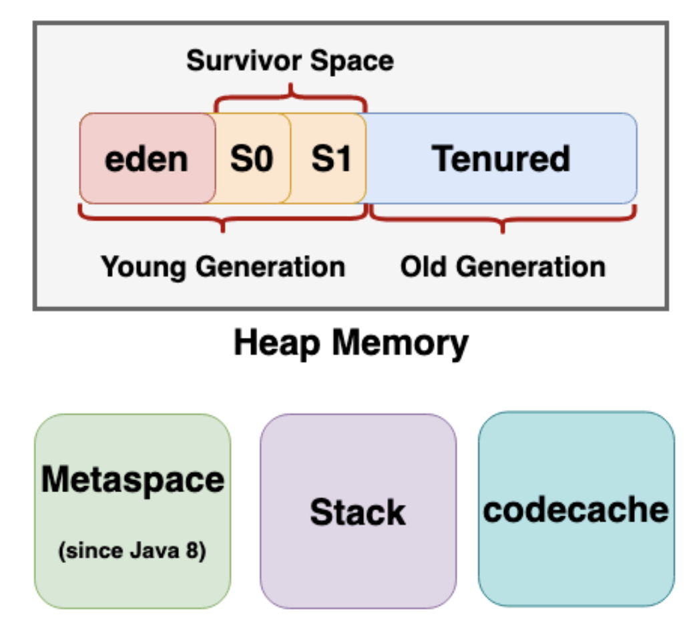

# На какие области делится память JVM? Для чего используется каждая из них?
---

## Устройство памяти в Java

```
||===============================||
||                               ||
||    ||===================||<---||---|
||    ||     New Gen       ||    ||   |
||    || (Eden + Survivor) ||    ||   |
||    ||===================||    ||   | Heap
||    ||                   ||    ||   |
||    ||     Old Gen       ||    ||   |
||    ||===================||<---||---|
||                               ||
||       Metaspace & Stack       ||
||                               ||
||        Native Memory          ||
||===============================||
```

Память делится на Heap, Metaspace и stack.
* heap – основной сегмент памяти, используется для выделения памяти под объекты и JRE классы. Создание нового объекта происходит в heap, здесь работает GC.
* metaspace – хранятся метаданные о классе и статические поля: там хранятся либо примитивы, либо ссылки на объекты/массивы,
которые сами по себе аллоцированы в heap. Metaspace в Java 8 пришел на замену PermGen, основное отличие которой — возможность динамически расширятся,
ограниченная по умолчанию только размером нативной памяти. Опционально можно задать размер через аргумент `-XX:MaxMetaspaceSize`.
В боевых окружениях желательно всегда задавать размер Metaspace. В случае возникновения ошибки, лечится увеличением MetaSpace, либо
добавлением памяти.
* stack – стековая память в Java работает по схеме LIFO: всякий раз, когда вызывается метод, в памяти стека создается новый блок,
который содержит примитивы и _ссылки_ на другие объекты в методе. Каждый поток имеет свой стек, примитивы и ссылки на локальные переменные хранятся в стеке.
Как только метод заканчивает работу, блок также перестает использоваться, тем самым предоставляя доступ для следующего метода.
Объекты в куче доступны с любой точки программы, в то время как стековая память не может быть доступна для других потоков.

```
[ STACK ]                          [ HEAP ] 
int a: 10;                     ->  MyWrapperObject@21f03b70====||
double b: 10.4;                |   ||     int someField: 11    ||
MyWrapperObject@21f03b70 ------|   ||     String@10112222  ---------- 
......                             ||==========================||    |
                                                                     |
                                                                     |
                                    String@10112222============||<----
                                    || ...                     ||
                                    || ...                     ||
                                    }}=========================||
```


## OutOfMemoryError и StackOverflowError 
При работе с памятью в Java мы обычно сталкиваемся с ошибками OutOfMemoryError.
Эта ошибка вылетает когда недостаточно мета для аллокации нового объекта в heap,
GC не может очистить место и heap больше не может расширится.  
Приведем самые распространенные случаи ошибок, связанных с памятью:

### StackOverflowError
**Причина:** при каждом вызове метода в стеке создается новый блок и туда кладутся аргументы, с какими был вызван метод, и локальные переменные.
В результате при глубокой рекурсии память, выделенная под стек, просто заканчивается. 
**Решение:** развернуть рекурсию с помощью стека, либо сократить количество локальных переменных и передаваемых аргументов.

### OutOfMemoryError: Requested array size exceeds VM limit
**Причина:** приложение пытается аллоцировать массив больше чем размер heap.
**Решение:** чаще всего связано с тем, что приложение _ошибочно_ пытается создать такой большой массив.
В случае, если такое поведение корректно, то требуется увеличить heap.

### OutOfMemoryError: Java heap space
**Причина:** объект не может быть создан в heap. Ошибка не всегда свидетельствует об утечке памяти, иногда просто означает,
что заданы некорректные лимиты. Объем памяти регулируется параметрами `-Xms` и `-Xmx`, нижний и верхний размер соответственно.
Иногда нижнюю и верхнюю границу устанавливают равными, например, на серверах где будет только одно приложение,
т.к. в случае динамического увеличения требуется лишнее время на работу с памятью.
**Решение:** увеличить размер heap `-Xmx`.

### OutOfMemoryError: Metaspace
**Причина:** как говорилось выше, в Metaspace хранится метаданные классов и статические поля. Все статические поля инициализируются
OutOfMemoryError вылетает когда не остается места для создания нового класса.
**Решение:** увеличить размер Metaspace `-XX:MetaspaceSize`.

###  OutOfMemoryError: GC Overhead limit exceeded
**Причина:** выбрасывается Java машиной в случае, если GC работает постоянно, тем самым критически замедляя работу приложения.
Если Java процесс тратит 98% времени на GC и при этом очищает всего 2% свободного места, это повторяется как минимум 5 раз, то выбрасывается исключение
OutOfMemoryError: GC Overhead limit exceeded.  
**Решение:** добавление памяти в heap.  
В ParallelGC и CMS возможно отключение такого поведения ключом `-XX:UseGCOverheadLimit`.

### OutOfMemoryError: Unable to create new native thread
**Причина:** приложению не хватает ресурсов, чтобы создать новый поток. Чаще всего причина в том, что мы упираемся в лимит открытых дескрипторов на поток в ОС.
Проверить это можно вызвав команду `ulimit -u`.  
Т.к. поток создается не в JVM, а на уровне ОС, в редких случаях это связано с тем, что на самой ОС не хватает ресурсов. Например, на машине 6Gb, 5Gb отдано под heap, 512Mb Metaspace,
под ОС остается только 512Mb.
**Решение**: проверить лимит количества дескрипторов или увеличить память.

## Утечки памяти

Существует множество способов получить утечку памяти, рассмотрим несколько из них:
* _finalize методы_ – вместо того, чтобы освободить память при очередном цикле GC, такие объекты помещаются в специальную очередь для вызова finalize.
Для обработки этой очереди используется специальный демон, он имеет приоритет, и если в программе есть потоки с большим приоритетом, то он может начать не успевать разбирать эту очередь. 
* _статические поля и singleton классы_ – статические объекты хранятся в памяти все время работы приложения.
* _thread-local переменные_ – такие переменные хранятся в связке с потоком, но т.к. потоки переиспользуются в пулах, следовательно, эти переменные не будут собраны GC.
* _незакрытые ресурсы_ – всякий раз, когда создается новое соединение или открывается поток, JVM выделяет память для этих ресурсов.
В случае, если эти ресурсы не закрыты, может возникнуть блокировка памяти, тем самым делая их недоступными для сборщика мусора.
В том числе, это может произойти даже в случае возникновения исключения, которое не позволит программе выполнить код, отвечающий за закрытие ресурсов.
* _нестатические внутренние классы_ – каждый нестатический внутренний класс по умолчанию имеет неявную (скрытую) ссылку на класс в котором он находится.
Если мы используем этот объект внутреннего класса в нашем приложении, то даже после того, как объект внешнего класса завершает свою работу,
он не будет утилизирован GC. 
* _неверная реализация `equals` и `hashCode`_ – если для ключа в `HashMap`, `HashSet` используется объект, то он должен корректно реализовывать методы `equals` и `hashCode`,
т.к. иначе может быть ситуация, когда в коллекцию добавляется уже _существующий_ объект, но `equals` и `hashCode` отработали неправильно и _такой же_ объект снова был добавлен.  

## Ключи JVM
1. -XX:+HeapDumpOnOutOfMemoryError – dump в случае OutOfMemory.
1. -Xms, -Xmx – размер heap. Иногда задают равными, чтобы не требовалось дополнительного выделения памяти.
1. -XX:MetaspaceSize – размер Metaspace.
1. -Xss – размер стека.