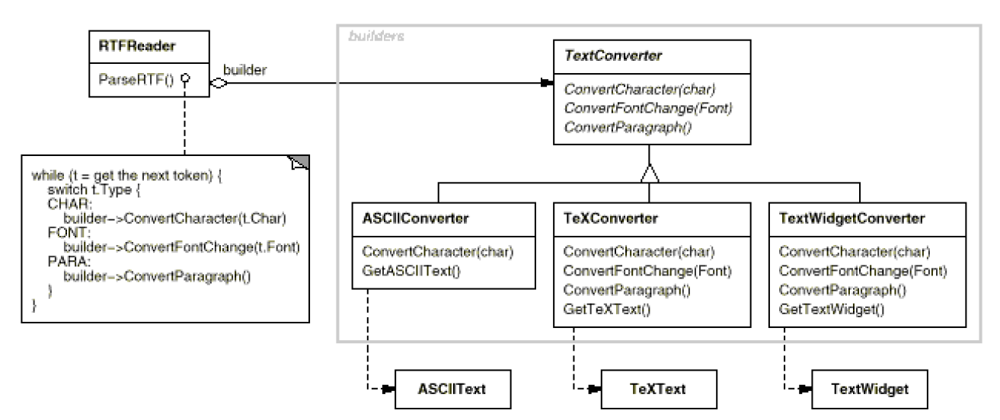
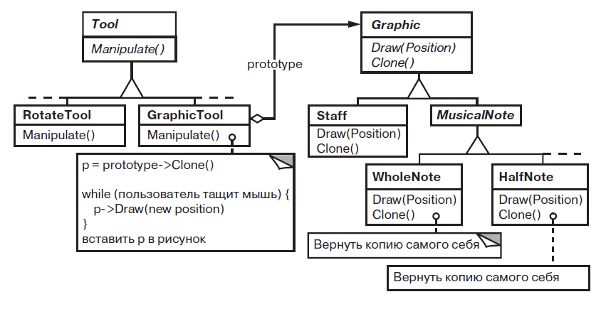
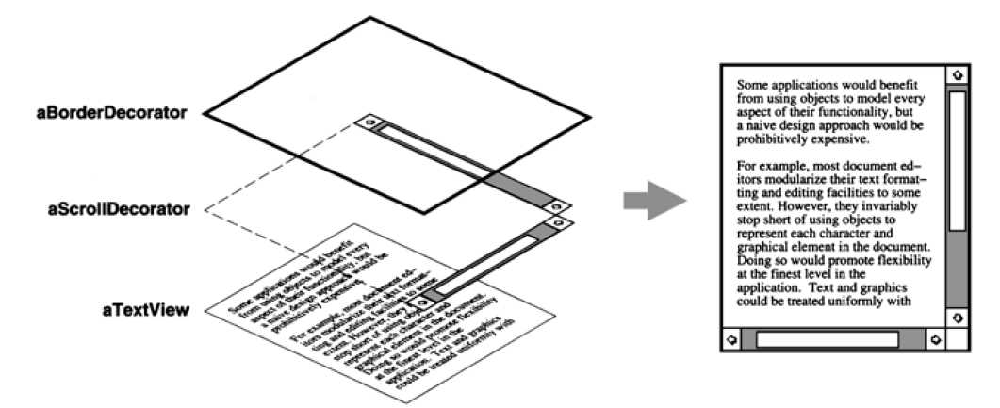
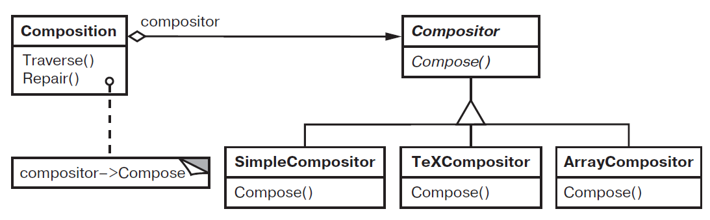

# Паттерны проектирования. Приемы объектно-ориентированного проектирования, 2015, (Гамма, Хелм, Джонсон, Влиссидес)

---

## Предисловие

    Эта книга предназначена для опытных разработчиков, знакомых с объектно-ориентированным программированием и проектированием. Она описывает паттерны проектирования – простые и элегантные решения типичных задач ООП. Для их применения не требуются специальные языки или сложные методы, однако они обеспечивают большую гибкость и возможность повторного использования кода. Книга предлагает подходы, которые помогут создавать более модульные и понятные конструкции. Она не является вводной, поэтому может потребовать нескольких прочтений для полного понимания.

## Глава 1. Введение в паттерны проектирования

    Проектирование объектно-ориентированных программ требует учета множества факторов для обеспечения гибкости и возможности повторного использования. Опытные разработчики используют проверенные решения из прошлого, избегая необходимости "изобретать велосипед". Повторяющиеся паттерны, включающие классы и взаимодействующие объекты, помогают создавать гибкие и элегантные архитектуры. 

    Авторы книги поставили целью документировать опыт разработки объектно-ориентированных программ в виде паттернов проектирования, чтобы облегчить их применение другими разработчиками. Каждый паттерн имеет свое название и объяснение роли в проектировании. Это позволяет быстрее находить правильные решения и избегать ошибок. 

    Книга включает только те паттерны, которые многократно доказали свою эффективность в разных системах. Они представлены в едином формате каталога, что делает их доступными даже для начинающих проектировщиков.

### 1.1 Что такое паттерн проектирования

    Паттерн проектирования - это многократно используемый элемент проектирования программного обеспечения, который описывает структуру и последовательность действий, необходимых для достижения определенной цели. Он инкапсулирует знания о том, как решать задачи проектирования, и предлагает общие решения, которые можно применять снова и снова.

Основные элементы паттерна проектирования:

1. **Имя**: Уникальное название, которое идентифицирует паттерн.
2. **Задача**: Проблема проектирования, которую решает паттерн. Обычно формулируется в виде вопроса или задачи.
3. **Решение**: Описание подхода или структуры, которая решает задачу. Включает описание классов, объектов, их ролей и взаимодействий.
4. **Результаты**: Ожидаемые последствия применения паттерна, включая плюсы и минусы, ограничения и компромиссы.

### 1.2 Паттерны проектирования в схеме MVC в языке Smalltalk

    В Smalltalk80 для построения интерфейсов используется MVC, которое отделяет модель от представления, реализуя взаимодействие "подписка/уведомление". Это позволяет присоединять к одной модели несколько представлений и создавать новые без изменения модели. MVC также поддерживает вложенные представления через класс CompositeView, который является подклассом View и управляет вложенными представлениями. Изменение реакции представления на действия пользователя возможно благодаря использованию объекта Controller, что является примером паттерна проектирования стратегия. Основные отношения в схеме MVC описываются паттернами наблюдатель, компоновщик и стратегия.

1. **Observer (Наблюдатель):**
   
   - **Назначение:** Наблюдатель регистрируется в модели для уведомления о ее изменениях и передачи их в вид.
   - **Взаимодействие:** Наблюдение за состоянием модели и передача изменений в вид, что позволяет пользователю видеть актуальные данные.

2. **Strategy (Стратегия):**
   
   - **Назначение:** Адаптация поведения интерфейса к изменениям в модели.
   - **Применение:** Используется в контроллере для управления реакцией интерфейса на изменения в модели, обеспечивая синхронизацию между двумя слоями MVC: моделью и видом.

3. **Composite (Компоновщик):**
   
   - **Назначение:** Объединение небольших компонентов в единую сущность, создающую более сложное поведение.
   - **Применение:** Применяется для объединения объектов в более сложные структуры, такие как документы, редакторы и пользовательские интерфейсы.

**Роли паттернов в MVC**

1. Модель отвечает за хранение данных и их обновление.
2. Вид (View) отображает данные модели пользователю.
3. Контроллер (Controller) управляет поведением вида, адаптируя его к изменениям модели.

**Взаимодействия паттернов**

- *Observer* регистрируется в модели для наблюдения за изменениями и передачи их в вид.
- *Strategy* адаптирует поведение интерфейса в зависимости от текущего состояния модели, делая систему более гибкой.
- *Composite* помогает объединить небольшие компоненты в более сложные структуры, повышая сложность и функциональность системы.

Эти паттерны обеспечивают эффективное взаимодействие между компонентами MVC, позволяя разработчикам создавать более гибкие и эффективные системы.

### 1.3. Описание паттернов проектирования

    Каждый паттерн проектирования представляет собой отдельное решение определенной задачи проектирования, и их описание организовано по единой схеме. Эта схема включает в себя:

1. Pattern Name and Classification   
   
   - Имя шаблона лаконично передает его суть. Хорошее имя жизненно важно, потому что оно станет частью вашего словаря. Классификация шаблона отражает схему, которую мы вводим в разделе 1.5.

2. Intent   
   
   - Краткое утверждение, отвечающее на следующие вопросы: Что делает шаблон проектирования? Какова его логика и намерение? Какую конкретную задачу проектирования он решает?

3. Also Known As
   
   - Другие широко известные названия шаблона, если таковые имеются.

4. Motivation
   
   - Сценарий, иллюстрирующий проблему проектирования и то, как структура классов и объектов в шаблоне решает эту проблему. Этот сценарий поможет вам понять более абстрактное описание шаблона, которое последует далее.

5. Applicability
   
   - Когда можно применять паттерн проектирования? Какие примеры плохого дизайна он может исправить? Как распознать эти ситуации?

6. Structure   
   
   - Представление классов в паттерне с использованием нотации на основе метода моделирования объектов (OMT). Также используются диаграммы взаимодействий для иллюстрации последовательностей запросов и сотрудничества между объектами. Приложение В подробно описывает эти обозначения..

7. Participants
   
   - Классы и/или объекты, участвующие в паттерне проектирования, и их обязанности.

8. Collaborations
   
   - Как участники сотрудничают для выполнения своих обязанностей.

9. Consequences
   
   - Как паттерн поддерживает свои цели? Какие компромиссы и результаты связаны с использованием этого паттерна? Какую часть структуры системы он позволяет изменять независимо?

10. Implementation
    
    - О каких ловушках, советах или техниках следует знать при реализации паттерна? Есть ли проблемы, специфичные для языка программирования?

11. Sample Code
    
    - Фрагменты кода, иллюстрирующие, как можно реализовать этот паттерн на C++ или Smalltalk.

12. Known Uses
    
    - Примеры использования паттерна в реальных системах. Включены хотя бы два примера из разных областей.

13. Related Patterns
    
    - Какие паттерны проектирования тесно связаны с этим? В чем заключаются важные различия? С какими другими паттернами следует использовать этот?

### 1.4 Каталог паттернов проектирования

    Каталог содержит 23 шаблона проектирования. Их названия и намерения перечислены ниже, чтобы дать вам обзор.

**Abstract Factory (Абстрактная фабрика)**  
Предоставляет интерфейс для создания семейств связанных или зависимых объектов без указания их конкретных классов.

**Adapter (Адаптер)**  
Преобразует интерфейс одного класса в другой интерфейс, который ожидают клиенты. Адаптер позволяет классам работать вместе, даже если у них несовместимые интерфейсы.

**Bridge (Мост)**  
Разделяет абстракцию и реализацию так, чтобы они могли изменяться независимо друг от друга.

**Builder (Строитель)**  
Разделяет создание сложного объекта от его представления таким образом, чтобы один и тот же процесс построения мог создавать разные представления.

**Chain of Responsibility (Цепочка ответственности)**  
Избегает связывания отправителя запроса с получателем, предоставляя нескольким объектам возможность обработать запрос. Объекты выстраиваются в цепочку, и запрос передается вдоль этой цепи до тех пор, пока какой-то объект не обработает его.

**Command (Команда)**  
Инкапсулирует запрос в виде объекта, позволяя параметризовать клиентов различными запросами, ставить запросы в очередь или регистрировать их, а также поддерживать отменяемые операции.

**Composite (Компоновщик)**  
Составляет объекты в древовидные структуры для представления иерархий целого и частей. Компоновщик позволяет клиентам одинаково обрабатывать отдельные объекты и композиции объектов.

**Decorator (Декоратор)**  
Динамически добавляет дополнительные обязанности к объекту. Декораторы предоставляют гибкую альтернативу наследованию для расширения функциональности.

**Facade (Фасад)**  
Обеспечивает унифицированный интерфейс к набору интерфейсов подсистемы. Фасад определяет высокоуровневый интерфейс, который упрощает использование подсистемы.

**Factory Method (Фабричный метод)**  
Определяет интерфейс для создания объекта, но позволяет подклассам решать, какой класс инстанцировать. Фабричный метод позволяет классу откладывать инстанцирование на под-классы.

**Flyweight (Приспособленец)**  
Использует совместное использование для эффективной поддержки большого количества мелких объектов.

**Interpreter (Интерпретатор)**  
Для заданного языка определяет представление его грамматики наряду с интерпретатором, который использует это представление для интерпретации предложений на этом языке.

**Iterator (Итератор)**  
Предоставляет способ доступа к элементам агрегатного объекта последовательно без раскрытия его внутренней реализации.

**Mediator (Посредник)**  
Определяет объект, инкапсулирующий взаимодействие набора объектов. Посредник способствует слабой связи, предотвращая прямое обращение объектов друг к другу, и позволяет варьировать их взаимодействие независимо.

**Memento (Хранитель)**  
Не нарушая инкапсуляцию, захватывает и сохраняет внутреннее состояние объекта, чтобы позже восстановить объект в это состояние.

**Observer (Наблюдатель)**  
Определяет отношение зависимости типа «один ко многим» между объектами, так что когда один объект меняет свое состояние, все зависящие от него автоматически уведомляются и обновляются.

**Prototype (Прототип)**  
Указывает типы создаваемых объектов с помощью прототипического экземпляра и создает новые объекты путем копирования этого прототипа.

**Proxy (Заместитель)**  
Предоставляет суррогат или заглушку для другого объекта для управления доступом к нему.

**Singleton (Одиночка)**  
Гарантирует наличие только одного экземпляра класса и предоставляет глобальную точку доступа к этому экземпляру.

**State (Состояние)**  
Позволяет объекту менять свое поведение, когда изменяется его внутреннее состояние. Объект будет казаться меняющим свой класс.

**Strategy (Стратегия)**  
Определяет семейство алгоритмов, инкапсулируя каждый из них и делая их взаимозаменяемыми. Стратегия позволяет алгоритмам меняться независимо от клиентов, использующих их.

**Template Method (Шаблонный метод)**  
Определяет структуру алгоритма в операции, откладывая некоторые шаги на подклассы. Шаблонный метод позволяет подклассам переопределять определенные шаги алгоритма, не изменяя его общую структуру.

**Visitor (Посетитель)**  
Представляет операцию, которая должна быть выполнена над элементами структуры объекта. Посетитель позволяет определить новую операцию без изменения классов элементов, над которыми она выполняется.

### 1.5 Организация каталога

    Шаблоны проектирования различаются по уровню детализации и степени абстракции. Поскольку существует множество шаблонов проектирования, нам нужен способ организовать их. Этот раздел классифицирует шаблоны проектирования, чтобы мы могли ссылаться на группы связанных шаблонов. Классификация помогает быстрее изучить шаблоны в каталоге и может направить усилия по поиску новых шаблонов.

Паттерны классифицированы по двум критериям:

1. Цель отражает то, что делает шаблон:
   
   - Порождающие паттерны: связаны с созданием объектов.
   - Структурные паттерны: касаются композиции объектов и классов.
   - Паттерны поведения: описывают взаимодействие объектов и их поведение.

2. Уровень, определяет, относится ли шаблон преимущественно:
   
   - к классам (статические, установленные во время компиляции)
   - к объектам (динамические, изменяющиеся во время выполнения).
   
   В таблице 1.1 указано соответствие целей и уровней.


    Порождающие паттерны уровня классов возлагают задачу создания объекта подклассам, а порождающие паттерны уровня объектов — другим объектам. Структурные паттерны уровня классов используют наследование для композиции классов, а структурные паттерны уровня объектов описывают способы сборки объектов из частей. Поведенческие паттерны уровня классов описывают алгоритмы и потоки управления через наследование, а поведенческие паттерны уровня объектов показывают, как объекты совместно выполняют задачу, которую один объект сделать не способен.

    Существует несколько способов организации паттернов. Некоторые паттерны часто используются вместе, например, Composite с Iterator или Visitor. Другие паттерны могут быть альтернативами, например, Prototype нередко заменяет Abstract Factory. Некоторые паттерны приводят к похожим результатам, несмотря на разные цели. Так, структура Composite и Decorator имеет сходства. Еще одним способом организации паттернов является анализ ссылок друг на друга в разделе "Похожие паттерны". Графическое представление этих связей показано на рисунке:


### 1.6 Как решать задачи проектирования с помощью паттернов

1. **Finding Appropriate Objects (Поиск подходящих объектов)**
   
   Объектно-ориентированные программы состоят из объектов, объединяющих данные и методы их обработки. Запросы являются единственным способом заставить объект выполнять операцию, а операции — единственным способом изменить внутренние данные объекта. Это называется инкапсуляцией.
   Разделение системы на объекты — сложная задача, зависящая от множества факторов, таких как гибкость, производительность, эволюция и повторное использование. Существует множество подходов к объектно-ориентированному проектированию, но ни один из них не считается универсально лучшим.
   Многие объекты в дизайне происходят из модели анализа, но часто появляются классы без аналогов в реальном мире. Примеры включают низкоуровневые классы, такие как массивы, и высокоуровневые абстракции, такие как паттерн Composite, который позволяет унифицированно обрабатывать объекты. Эти абстракции важны для создания гибкого дизайна.
   Паттерны проектирования помогают выявлять менее очевидные абстракции и соответствующие им объекты. Например, объекты, представляющие процесс или алгоритм, встречаются редко при анализе, но они играют ключевую роль в создании гибких и повторно используемых дизайнов.

2. **Determining Object Granularity (Определение степени детализации объекта)**
   
   Паттерны проектирования помогают решать вопросы представления различных уровней систем в виде объектов. Например, паттерн Facade представляет целые подсистемы, а Flyweight поддерживает большое число мелких объектов. Другие паттерны, такие как Abstract Factory, Builder, Visitor и Command, определяют способы создания и взаимодействия объектов для выполнения конкретных задач.

3. **Specifying Object Interfaces (Определение интерфейсов объекта)**
   
   Операции, объявленные объектом, имеют сигнатуру, включающую имя операции, параметры и возвращаемое значение. Совокупность всех сигнатур операций объекта образует интерфейс объекта, через который отправляются запросы. Тип определяет конкретную реализацию интерфейса, и объект может иметь несколько типов. Интерфейсы могут содержать другие интерфейсы как подмножества, и два объекта одного типа должны делиться лишь частью своих интерфейсов.
   Интерфейсы фундаментальны в объектно-ориентированных системах, так как объекты известны только через свои интерфейсы. Динамическое связывание означает, что запрос не привязан к конкретной реализации до времени исполнения, позволяя объектам с одинаковыми интерфейсами заменять друг друга во время работы. Полиморфизм упрощает определение клиентов, разъединяет объекты и позволяет изменять отношения между ними во время выполнения.
   Паттерны проектирования помогают определять интерфейсы, идентифицируя ключевые элементы и типы данных, передаваемых через интерфейс. Например, паттерн Memento требует определения двух интерфейсов: ограниченного для клиентов и привилегированного для исходного объекта.

4. **Specifying Object Implementations (Определение реализации объектов)**
   
   Реализация объекта определяется его классом, который задает внутренние данные и операции, которые объект может выполнять. Объекты создаются путем инстанцирования класса. Наследование позволяет определить новые классы на основе существующих классов. Подкласс включает все данные и операции родительского класса. Абстрактный класс предназначен для определения общего интерфейса для подклассов и не может быть инстанцирован. Конкретные классы реализуют все абстрактные операции. Наследование классов позволяет легко определять семейства объектов с похожей функциональностью. Миксин-классы предоставляют дополнительную функциональность другим классам и требуют множественного наследования.

5. **Class versus Interface Inheritance (Наследование класса и наследование интерфейса)**
   
   Важно понимать разницу между классом объекта и его типом. Класс объекта определяет его внутреннюю структуру и реализацию операций, тогда как тип объекта относится только к его интерфейсу — набору запросов, на которые он может отвечать. Один объект может иметь много типов, и объекты разных классов могут иметь одинаковые типы.
   Языки программирования, такие как C++ и Eiffel, используют классы для определения как типа объекта, так и его реализации. В отличие от этого, в Smalltalk переменным не присваиваются типы, поэтому компилятор не проверяет соответствие типов объектов типу переменной. Отправка сообщения требует проверки того, реализует ли класс получателя сообщение, но не требует проверки того, является ли получатель экземпляром определенного класса.
   Также важно понимать разницу между наследованием классов и наследованием интерфейсов (или подтипированием). Наследование классов определяет реализацию объекта на основе другой реализации. В противоположность этому, наследование интерфейсов описывает, когда один объект может использоваться вместо другого.
   Хотя большинство языков программирования не поддерживают явное разделение между наследованием интерфейса и реализацией, люди делают это различие на практике. Например, в Smalltalk программисты обычно считают, что подклассы являются подтипами, хотя есть некоторые известные исключения. В C++ программисты манипулируют объектами через типы, определенные абстрактными классами.
   Многие шаблоны проектирования зависят от этого различия. Например, объекты в цепочке ответственности должны иметь общий тип, но обычно у них нет общей реализации. В шаблоне Composite компонент определяет общий интерфейс, но композит часто определяет общую реализацию. Шаблоны Command, Observer, State и Strategy часто реализуются с использованием абстрактных классов, которые являются чистыми интерфейсами.
   
   Наследование классов позволяет быстро создавать новые виды объектов на основе старых, расширяя функциональность приложения и повторно используя существующую. Однако важным аспектом наследования является возможность определения семейств объектов с одинаковым интерфейсом, что необходимо для полиморфизма. Когда наследование используется правильно, все классы, производные от абстрактного класса, будут иметь общий интерфейс, что делает их подтипами абстрактного класса.
   Манипуляция объектами исключительно через интерфейс, определенный абстрактным классом, имеет две важные выгоды:
   
   1. Клиенты остаются независимыми от конкретных типов объектов, пока эти объекты соответствуют ожидаемому интерфейсу.
   
   2. Клиенты не знают о классах, реализующих эти объекты, зная только об абстрактном классе, определяющем интерфейс.
      
      Это значительно снижает зависимости между подсистемами, приводя к принципу повторного использования объектно-ориентированного дизайна: программирование к интерфейсу, а не к реализации. Этот принцип широко применяется в шаблонах проектирования, представленных в книге.
      Конечно, где-то в системе нужно инстанцировать конкретные классы, и шаблоны создания объектов (Abstract Factory, Builder, Factory Method, Prototype и Singleton) позволяют сделать это прозрачно. Эти шаблоны обеспечивают написание системы в терминах интерфейсов, а не реализаций.

6. **Putting Reuse Mechanisms to Work (Механизмы повторного использования)**
   
   Шаблоны проектирования помогают использовать объекты, интерфейсы, классы и наследование для создания гибкого и многократно используемого ПО.
   
   **Наследование и композиция**
   
   Наследование класса и композиция объектов являются основными способами повторного использования функциональности в объектно-ориентированных системах. Наследование позволяет определять реализацию одного класса через другой, видя внутренние механизмы родительского класса (принцип прозрачного ящика). Оно поддерживается языками программирования и облегчает модификацию существующих реализаций, но имеет ограничения: невозможно изменить реализацию во время выполнения, и тесная связь между подклассами и родительскими классами может нарушить инкапсуляцию.
   
   Композиция объектов предполагает создание сложной функциональности через объединение объектов с четкими интерфейсами (черный ящик). Это дает гибкость благодаря динамическому определению связей во время выполнения и уменьшает зависимость от конкретной реализации, улучшая инкапсуляцию. Однако требует тщательного проектирования интерфейсов и увеличивает количество объектов в системе.
   
   Второе правило объектно-ориентированного проектирования гласит: *предпочитать композицию наследованию класса*, чтобы уменьшить размер классов и иерархий, делая систему более управляемой и гибкой.
   
   **Делегирование**
   
   Делегирование делает композицию таким же мощным средством повторного использования, как и наследование. При делегировании объект-получатель передает обработку запроса другому объекту (уполномоченному). Это позволяет избежать жестких зависимостей, характерных для наследования, и делает возможным изменение поведения объекта во время выполнения программы.
   
   Пример: вместо наследования класса `Rectangle` классом `Window`, можно поместить в `Window` переменную типа `Rectangle` и делегировать ей операции, относящиеся к прямоугольникам. Таким образом, `Window` не является прямоугольником, а содержит его.
   
   Преимущества делегирования включают гибкость в изменении поведения объектов во время выполнения и простоту композиции поведений. Недостатки связаны с повышенной сложностью понимания динамических программ и некоторой потерей производительности.
   
   Делегирование широко применяется в таких паттернах проектирования, как Состояние (где объект делегирует запрос объекту, представляющему его текущее состояние), Стратегия (обработка запроса делегируется объекту, представляющему стратегию его исполнения) и Посетитель (операция, выполняемая над элементами составного объекта, делегируется посетителю).
   
   **Наследование и параметризованные типы**
   
   Параметризованные типы (также называемые обобщенными типами или шаблонами) представляют собой еще один метод повторного использования функциональности в объектно-ориентированных системах. Этот метод позволяет определять тип без указания конкретных типов, которые он использует. Вместо этого отсутствующие типы передаются в параметрах в момент использования.
   
   Примером может служить класс списка (`List`), параметризованный типом элементов, которые в него добавляются. Можно создать список целых чисел, передав тип `integer` в качестве параметра, или список строк, передав тип `String`. Компилятор создает отдельные версии класса для каждого типа элементов.
   
   Параметризованные типы предлагают альтернативу наследованию класса и композиции объектов. Они позволяют изменять типы, используемые классом, но, в отличие от композиции объектов, не поддерживают изменение поведения во время выполнения. В отличие от наследования, они не позволяют предоставлять реализацию по умолчанию, которую можно модифицировать в подклассах.
   
   Выбор метода зависит от требований проекта и ограничений реализации. В данной книге параметризованные типы не используются активно, но иногда применяются для реализации паттернов в C++.

7. **Relating Run-Time and Compile-Time Structures (сравнение структур времени выполнения и компиляции)**
   
   Структуры объектно-ориентированной программы на этапе выполнения сильно отличаются от структуры исходного кода. Исходный код фиксирован на этапе компиляции и состоит из классов с неизменными отношениями наследования, тогда как на этапе выполнения программа представляет собой сеть взаимодействующих объектов, которая постоянно изменяется.
   
   Важно понимать разницу между агрегированием и осведомленностью объектов. Агрегирование означает владение одним объектом другим или ответственность за него, в то время как осведомленность (ассоциация) указывает на знание одного объекта о существовании другого, без какой-либо ответственности. Эти отношения могут быть реализованы одинаково в разных языках программирования, но различаются по смыслу и применению.
   
   Паттерны проектирования помогают строить сложные структуры времени выполнения и управлять ими. Примеры таких паттернов включают Компоновщик, Декоратор, Наблюдатель и Цепочку Обязанностей. Понимание этих паттернов необходимо для анализа и управления структурами программы на этапе выполнения.

8. **Designing for Change (Проектирование с учетом будущих изменений)**
   
   Системы нужно проектировать с расчетом на будущее развитие. Если не учитывать возможность изменений, это может привести к полному перепроектированию системы, что потребует переработки классов, модификации клиентов и повторного тестирования. Такие изменения дороги и затрагивают многие части системы. Паттерны позволяют гибко модифицировать отдельные аспекты системы без влияния на другие её части, делая её менее уязвимой перед изменениями.
   
   Вот некоторые типичные причины перепроектирования, а также паттерны, которые позволяют этого избежать:
   
   - Создание объекта путем явного указания класса связывает вас с конкретной реализацией, а не интерфейсом. Чтобы избежать этого, создавайте объекты косвенно.
     Abstract Factory, Factory Method, Prototype
   
   - Зависимость от конкретных операций. Указывая определенную операцию, вы привязываетесь к одному способу удовлетворения запроса. Избегая жестко закодированных запросов, вы облегчаете изменение способа выполнения запроса как во время компиляции, так и во время выполнения.
     Chain of Responsibility, Command
   
   - Программное обеспечение, зависимое от конкретной платформы, трудно переносимо и обновляемо. Важно минимизировать зависимость системы от платформы.
     Abstract Factory, Bridge
   
   - Клиенты, знающие о внутреннем представлении, хранении, расположении или реализации объекта, могут потребовать изменений при изменении объекта. Скрытие этой информации от клиентов предотвращает каскадные изменения.
     Abstract Factory, Bridge, Memento, Proxy
   
   - Алгоритмы часто улучшаются и заменяются во время разработки и повторного использования. Объекты, зависящие от алгоритма, придется менять при изменении алгоритма. Поэтому алгоритмы, которые вероятно изменятся, следует изолировать.
     Builder, Iterator, Strategy, Template Method, Visitor
   
   - Тесная связь между классами затрудняет их повторное использование отдельно, поскольку они зависят друг от друга. Это приводит к монолитным системам, где нельзя изменить или удалить класс без понимания и изменения многих других классов. Система становится плотной массой, которую трудно изучать, переносить и обслуживать.
     Слабая связь увеличивает вероятность того, что класс может быть использован сам по себе, и система может легче изучаться, переноситься, модифицироваться и расширяться. Шаблоны проектирования используют техники, такие как абстрактное связывание и многослойность, для продвижения слабо связанных систем.
     Abstract Factory, Bridge, Chain of Responsibility, Command, Facade, Mediator, Observer
   
   - Расширение функционала через наследование затруднительно, так как каждый новый класс добавляет накладные расходы, а создание подкласса требует глубокого знания родительского класса. Переопределение одной операции может потребовать изменения других, а чрезмерное использование наследования ведет к увеличению количества классов. Композиция объектов и делегирование предлагают гибкий подход к комбинированию поведения, позволяя добавлять новую функциональность без необходимости создания новых подклассов. Однако частое применение композиции может усложнять дизайн. Некоторые шаблоны проектирования позволяют вводить специализированные функции, создавая всего один подкласс и комбинируя его с существующими объектами.
     Bridge, Chain of Responsibility, Composite, Decorator, Observer, Strategy
   
   - Иногда требуется изменить класс, который неудобно модифицировать. Возможно, у вас нет доступа к исходному коду (например, в случае коммерческой библиотеки классов) или любые изменения потребуют модификации множества существующих подклассов. Шаблоны проектирования предлагают способы изменения классов в таких ситуациях.
     Adapter, Decorator, Visitor

    Эти примеры показывают гибкость, которую шаблоны проектирования могут помочь встроить в ваше программное обеспечение. Насколько важна такая гибкость, зависит от типа программного обеспечения, которое вы создаете. Рассмотрим роль шаблонов проектирования в разработке трех широких категорий программного обеспечения: прикладных программ, инструментальных средств и фреймворков.

**Прикладные программы**

    При разработке прикладных программ, таких как редакторы документов или электронные таблицы, важно обеспечить внутреннюю многократную используемость, поддерживаемость и расширяемость. Шаблоны проектирования уменьшают зависимости, повышая многократную используемость и поддерживаемость, а также облегчая расширение классов и использование композиции объектов. Ограничивая зависимости от платформы и разделяя систему на слои, они способствуют лучшей поддержке и расширению приложения.

**Инструментальные средства**

    Приложения часто используют классы из наборов инструментов — библиотек готовых классов, предоставляющих полезную функциональность. Проектирование наборов инструментов сложнее, так как они должны быть универсальными и работать в разных приложениях. Это требует избегания предположений и зависимостей, чтобы сохранить гибкость и применимость инструмента.

**Фреймворки**

    Фреймворк — это набор сотрудничающих классов, составляющих повторно используемый дизайн для конкретного вида программного обеспечения. Он диктует архитектуру вашего приложения, включая общую структуру, распределение на классы и объекты, их ключевые обязанности, сотрудничество и поток управления. Фреймворк захватывает общие для домена решения, что позволяет сосредоточиться на специфике приложения. При использовании фреймворка основной код уже определен, и вам остается написать код, который будет вызван этим основным телом.
Использование фреймворка ускоряет разработку приложений, делая их более согласованными и легкими в обслуживании. Однако это накладывает ограничения на творческий потенциал, так как многие дизайнерские решения уже приняты за вас.
Поскольку приложения очень зависят от архитектуры фреймворка, они особенно чувствительны к изменениям в нем. Поэтому критически важно проектировать фреймворк максимально гибким и расширяемым. Зрелые фреймворки обычно включают несколько шаблонов проектирования, которые помогают адаптировать архитектуру к различным приложениям без переделки.
Дополнительным преимуществом является документирование фреймворка с использованием шаблонов проектирования. Люди, знакомые с этими шаблонами, быстрее понимают архитектуру фреймворка. Даже те, кто не знаком с шаблонами, выигрывают от структуры, которую они придают документации. Улучшение документации особенно важно для фреймворков, поскольку они часто представляют собой крутой учебный путь. Хотя шаблоны проектирования могут не полностью сгладить кривую обучения, они могут сделать ее менее крутой, сделав ключевые элементы дизайна фреймворка более явными.

Так как шаблоны проектирования и фреймворки имеют некоторое сходство, люди иногда задаются вопросом, отличаются ли они вообще. Они отличаются тремя основными способами:

1. Абстрактность: Шаблоны проектирования более абстрактны, чем фреймворки. Фреймворки могут быть воплощены в коде, но только примеры шаблонов могут быть выражены в коде. Преимуществом фреймворков является то, что они могут быть написаны на языках программирования и не только изучены, но непосредственно выполнены и повторно использованы. В отличие от этого, шаблоны проектирования должны быть реализованы каждый раз, когда они используются. Шаблоны проектирования также объясняют намерения, компромиссы и последствия проекта.

2. Размер архитектурных элементов: Шаблоны проектирования являются меньшими архитектурными элементами, чем фреймворки. Типичный фреймворк содержит несколько шаблонов проектирования, но обратное никогда не верно.

3. Специализация: Шаблоны проектирования менее специализированы, чем фреймворки. Фреймворки всегда ориентированы на конкретную область применения. Например, фреймворк графического редактора может быть использован в симуляции завода, но его нельзя спутать с фреймворком моделирования. В отличие от этого, шаблоны проектирования в этом каталоге могут быть использованы практически в любом приложении. Хотя возможны более специализированные шаблоны проектирования (например, шаблоны для распределённых систем или параллельного программирования), даже они не будут диктовать архитектуру приложения, как это делает фреймворк.

    Фреймворки становятся ключевым элементом объектно-ориентированных систем, обеспечивая высокий уровень повторного использования. Крупные приложения будут состоять из слоев взаимодействующих фреймворков, влияющих на большую часть дизайна и кода.

### 1.7 Как выбирать паттерн проектирования

- **подумайте, как паттерны решают проблемы проектирования**:
  
  - *Раздел 1.6*: Обсуждается, как шаблоны проектирования помогают находить подходящие объекты, определять гранулярность объектов, специфицировать интерфейсы объектов и т.д.

- **пролистайте разделы каталога, описывающие назначение паттернов**:
  
  - *Раздел 1.4*: Перечислены цели всех шаблонов. Чтение этих разделов может помочь определить релевантные шаблоны.
  - Используйте схему классификации (*Таблица 1.1*), чтобы сузить варианты.

- **изучите взаимосвязи паттернов**:
  
  - *Рисунок 1.1*: Показывает графические взаимосвязи между шаблонами, помогая направить вас к подходящим вариантам.

- **проанализируйте паттерны со сходными целями**:
  
  - Каталог разделен на *порождающие*, *структурные* и *поведенческие* шаблоны.
  - Вводные комментарии и разделы сравнения/противопоставления внутри каждой главы предоставляют полезные сведения.

- **разберитесь в причинах, вызывающих перепроектирование**:
  
  - Пересмотрите проблемы, связанные с общими причинами перепроектирования.
  - Определите шаблоны, которые устраняют эти причины.

- **посмотрите, какие аспекты вашего дизайна могут измениться**:
  
  - Сосредоточьтесь на том, что должно оставаться гибким и независимым от изменений.
  - *Таблица 1.2* перечисляет аспекты дизайна, которые шаблоны позволяют изменять без необходимости полного перепроектирования.


### 1.8 Как пользоваться паттерном проектирования

1. **Первоначальный обзор**:
   
   - Прочтите весь шаблон, уделяя особое внимание разделам *Applicability* and *Consequences*, чтобы подтвердить его пригодность.

2. **Подробное понимание**:
   
   - Изучите разделы *Structure*, *Participants*, and *Collaborations*, чтобы понять отношения классов/объектов.

3. **Анализ примера кода**:
   
   - Просмотрите раздел «Пример кода», чтобы понять практическое применение.

4. **Назначение участников**:
   
   - Выберите осмысленные имена для участников шаблона в контексте вашего приложения, сохраняя при этом оригинальные названия участников.
   - Например: использование *SimpleLayoutStrategy* или *TeXLayoutStrategy* для шаблона *Strategy*.

5. **Определение класса**:
   
   - Объявите интерфейсы, установите наследование и определите необходимые переменные.
   - Измените существующие классы, затронутые шаблоном.

6. **Именование операций**:
   
   - Определите специфичные для приложения имена операций на основе обязанностей и взаимодействий.
   - Поддерживайте согласованные правила именования, например, используя префикс «Create-» для фабричных методов.

7. **Реализация**:
   
   - Выполните обязанности и взаимодействия согласно разделу «Реализация» шаблона.
   - Ориентируйтесь на пример кода для получения рекомендаций.

Рекомендации по предотвращению неправильного использования шаблонов проектирования:

- **Избегайте бессистемного применения**: Применяйте шаблоны только тогда, когда оправдано требуемое повышение гибкости.
- **Учтите компромиссные решения**: Дополнительная косвенность может привести к увеличению сложности или снижению производительности.
- **Оцените преимущества и недостатки**: Используйте разделы «*Consequences*», чтобы оценить компромиссы.

## Глава 3. Порождающие паттерны

1. Порождающие шаблоны проектирования – это подходы, которые делают процесс создания объектов гибким и независимым от конкретных классов.

2. Разделение шаблонов:
   
   - Одни используют наследование (например, Factory Method).
   - Другие делегируют создание объектов другим объектам (композиция, как в Abstract Factory).

3. Гибкость кода: Жестко прописанный код усложняет изменения, а порождающие шаблоны позволяют легко менять структуру создаваемых объектов.

4. Пример с лабиринтом: Используется игра-лабиринт, чтобы показать, как шаблоны помогают менять состав объектов (комнаты, двери, стены) без переписывания кода.

5. Различные подходы к созданию объектов:
   
   - Factory Method – создание объектов через виртуальные методы.
   - Abstract Factory – передача создания объектов другому классу.
   - Builder – поэтапное создание сложных объектов.
   - Prototype – клонирование уже существующих объектов.
   - Singleton – обеспечение единственного экземпляра объекта.

6. Применимость: Эти шаблоны помогают адаптировать код, например, если нужно добавить магические комнаты или двери, открывающиеся только с помощью заклинаний.

    Порождающие шаблоны проектирования делают код гибче и удобнее для расширения, избавляя от жестко заданного создания объектов. Они позволяют легко менять структуру программы, подставляя разные типы объектов без переписывания большого количества кода.

#### Примеры разработки игры-лабиринта с использованием разных порождающих паттернов

**1. Жестко заданное создание лабиринта (без шаблонов)**

Это базовая реализация, где мы вручную создаем комнаты, двери и стены.

```java
class MapSite {
    void enter() {}
}

class Room extends MapSite {
    private int roomNumber;
    private MapSite[] sides = new MapSite[4];

    public Room(int number) {
        this.roomNumber = number;
    }

    public void setSide(int direction, MapSite site) {
        sides[direction] = site;
    }
}

class Wall extends MapSite {}

class Door extends MapSite {
    private Room room1, room2;
    private boolean isOpen;

    public Door(Room r1, Room r2) {
        this.room1 = r1;
        this.room2 = r2;
        this.isOpen = false;
    }
}

class Maze {
    private List<Room> rooms = new ArrayList<>();

    public void addRoom(Room room) {
        rooms.add(room);
    }
}

class MazeGame {
    public Maze createMaze() {
        Maze maze = new Maze();
        Room r1 = new Room(1);
        Room r2 = new Room(2);
        Door door = new Door(r1, r2);

        r1.setSide(0, new Wall()); // North
        r1.setSide(1, door);       // East
        r1.setSide(2, new Wall()); // South
        r1.setSide(3, new Wall()); // West

        r2.setSide(0, new Wall());
        r2.setSide(1, new Wall());
        r2.setSide(2, new Wall());
        r2.setSide(3, door);

        maze.addRoom(r1);
        maze.addRoom(r2);
        return maze;
    }
}
```

🔹 **Проблема**: жёстко прописано, какие объекты создаются. Изменить структуру лабиринта сложно.

---

**2. Применяем Factory Method**

Теперь создание комнат и дверей вынесем в методы, которые можно переопределять.

```java
class MazeGame {
    public Maze createMaze() {
        Maze maze = new Maze();
        Room r1 = makeRoom(1);
        Room r2 = makeRoom(2);
        Door door = makeDoor(r1, r2);

        r1.setSide(1, door);
        r2.setSide(3, door);

        maze.addRoom(r1);
        maze.addRoom(r2);
        return maze;
    }

    protected Room makeRoom(int number) {
        return new Room(number);
    }

    protected Door makeDoor(Room r1, Room r2) {
        return new Door(r1, r2);
    }
}
```

🔹 Теперь можно создавать разные версии лабиринта, просто переопределяя `makeRoom()` и `makeDoor()`.

---

**3. Применяем Abstract Factory**

Создадим фабрику, которая полностью отвечает за создание элементов лабиринта.

```java
interface MazeFactory {
    Room makeRoom(int number);
    Door makeDoor(Room r1, Room r2);
    Wall makeWall();
}

class DefaultMazeFactory implements MazeFactory {
    public Room makeRoom(int number) { return new Room(number); }
    public Door makeDoor(Room r1, Room r2) { return new Door(r1, r2); }
    public Wall makeWall() { return new Wall(); }
}

class MazeGame {
    public Maze createMaze(MazeFactory factory) {
        Maze maze = new Maze();
        Room r1 = factory.makeRoom(1);
        Room r2 = factory.makeRoom(2);
        Door door = factory.makeDoor(r1, r2);

        r1.setSide(1, door);
        r2.setSide(3, door);

        maze.addRoom(r1);
        maze.addRoom(r2);
        return maze;
    }
}
```

🔹 Теперь можно легко заменить фабрику и создать, например, магический лабиринт.

---

**4. Применяем Builder**

Вынесем пошаговое создание лабиринта в отдельный класс.

```java
class MazeBuilder {
    protected Maze maze;

    public void buildMaze() {
        maze = new Maze();
    }

    public void buildRoom(int number) {
        Room room = new Room(number);
        maze.addRoom(room);
    }

    public void buildDoor(int r1, int r2) {
        Room room1 = new Room(r1);
        Room room2 = new Room(r2);
        Door door = new Door(room1, room2);
        room1.setSide(1, door);
        room2.setSide(3, door);
    }

    public Maze getMaze() {
        return maze;
    }
}

class MazeGame {
    public Maze createMaze(MazeBuilder builder) {
        builder.buildMaze();
        builder.buildRoom(1);
        builder.buildRoom(2);
        builder.buildDoor(1, 2);
        return builder.getMaze();
    }
}
```

🔹 Теперь можно использовать разные билдеры для создания разных вариантов лабиринта.

---

**5. Применяем Prototype**

Создаем объекты лабиринта, копируя существующие.

```java
class MazePrototypeFactory {
    private Room prototypeRoom;
    private Door prototypeDoor;

    public MazePrototypeFactory(Room room, Door door) {
        this.prototypeRoom = room;
        this.prototypeDoor = door;
    }

    public Room makeRoom() {
        return new Room(prototypeRoom.roomNumber);
    }

    public Door makeDoor(Room r1, Room r2) {
        return new Door(r1, r2);
    }
}

class MazeGame {
    public Maze createMaze(MazePrototypeFactory factory) {
        Maze maze = new Maze();
        Room r1 = factory.makeRoom();
        Room r2 = factory.makeRoom();
        Door door = factory.makeDoor(r1, r2);

        r1.setSide(1, door);
        r2.setSide(3, door);

        maze.addRoom(r1);
        maze.addRoom(r2);
        return maze;
    }
}
```

🔹 Можно легко подставлять другие "прототипы" объектов, изменяя их поведение.

---

**6. Применяем Singleton**

Создадим единственный экземпляр лабиринта, доступный во всей программе.

```java
class MazeSingleton {
    private static MazeSingleton instance;
    private Maze maze;

    private MazeSingleton() {
        maze = new Maze();
    }

    public static MazeSingleton getInstance() {
        if (instance == null) {
            instance = new MazeSingleton();
        }
        return instance;
    }

    public Maze getMaze() {
        return maze;
    }
}
```

🔹 **Теперь у нас есть один лабиринт для всей игры.**

---

**Вывод**

Использование **порождающих шаблонов** делает код гибким:  
✅ **Factory Method** – позволяет переопределять создание объектов.  
✅ **Abstract Factory** – передает создание объектов фабрике.  
✅ **Builder** – упрощает создание сложных структур.  
✅ **Prototype** – позволяет клонировать объекты.  
✅ **Singleton** – гарантирует единственный экземпляр.

Теперь можно легко менять структуру лабиринта без переписывания кода! 

### ABSTRACT FACTORY (АБСТРАКТНАЯ ФАБРИКА)

**Intent**

Предоставляет интерфейс для создания семейств связанных или зависимых объектов без указания их конкретных классов

**Also Known As**

Kit

**Motivation**


    Представь себе набор инструментов для создания интерфейсов, который поддерживает разные стили оформления, такие как Motif и Presentation Manager. Эти стили определяют внешний вид и поведение элементов интерфейса, таких как полосы прокрутки, окна и кнопки. Чтобы приложение могло работать с разными стилями, оно не должно жестко привязываться к одному конкретному стилю. Для этого создается специальный класс фабрики (WidgetFactory), который позволяет создавать элементы интерфейса без привязки к их конкретным реализациям. Клиенты создают виджеты, пользуясь исключительно интерфейсом WidgetFactory, и им ничего не известно о классах, реализующих виджеты для конкретного стандарта. Другими словами, клиенты должны лишь придерживаться интерфейса, определенного абстрактным, а не конкретным классом.

    Таким образом, программа может легко менять стиль оформления, а пользовательские элементы остаются независимыми от выбранного стиля.

**Applicability**

- система не должна зависеть от того, как создаются, компонуются и представляются входящие в нее объекты;

- система должна настраиваться одним из семейств объектов;

- входящие в семейство взаимосвязанные объекты спроектированы для совместной работы, и вы должны обеспечить выполнение этого ограничения;

- вы хотите предоставить библиотеку объектов, раскрывая только их интерфейсы, но не реализацию.

**Structure**


**Participants**

- AbstractFactory (WidgetFactory):  
  - объявляет интерфейс для операций, создающих абстрактные объекты-продукты;
- ConcreteFactory (MotifWidgetFactory, PMWidgetFactory):  
  - реализует операции, создающие конкретные объекты-продукты;
- AbstractProduct (Window, ScrollBar):  
  - объявляет интерфейс для типа объекта-продукта;
- ConcreteProduct (MotifWindow, MotifScrollBar):  
  - определяет объект-продукт, создаваемый соответствующей конкретной фабрикой;  
  - реализует интерфейс AbstractProduct;
- Client:  
  - пользуется исключительно интерфейсами, которые объявлены в классах AbstractFactory и AbstractProduct.

**Collaborations**

- Обычно при запуске программы создаётся одна версия конкретного класса-фабрики. Эта фабрика создаёт продукты с определённой реализацией. Чтобы создать другие виды продуктов, клиентам нужно использовать другую фабрику.

- AbstractFactory передаёт создание конкретных продуктов своему подклассу ConcreteFactory

**Consequences**

- *It isolates concrete classes.* Помогает контролировать типы объектов, которые создает программа. Фабрика берет на себя ответственность за создание объектов, скрывая от клиентов подробности реализации. Клиенты работают с объектами через общие интерфейсы, не зная конкретные классы. Конкретные имена классов скрыты внутри фабрики и не появляются в коде клиента.

- *It makes exchanging product families easy.* Конкретный класс фабрики используется в программе всего один раз — там, где он создается. Это упрощает замену одной фабрики на другую. Приложение может легко переключаться между различными наборами продуктов, просто изменяя используемую фабрику. Поскольку абстрактная фабрика создает целую группу связанных продуктов, вся группа меняется одновременно. Например, в интерфейсе пользователя мы можем перейти от одного стиля (например, Motif) к другому (например, Presentation Manager), просто заменив соответствующую фабрику и пересоздав интерфейс.

- *It promotes consistency among products.* Когда объекты в группе разработаны для совместной работы, важно, чтобы приложение использовало объекты только из одной группы за раз. Шаблон Абстрактной Фабрики облегчает соблюдение этого правила.

- *Supporting new kinds of products is difficult.* Расширение абстрактных фабрик для создания новых видов продуктов непросто. Дело в том, что интерфейс абстрактной фабрики фиксирует набор продуктов, которые могут быть созданы. Поддержка новых типов продуктов требует расширения интерфейса фабрики, что включает изменение класса AbstractFactory и всех его подклассов. Мы обсудим одно решение этой проблемы в разделе «Implementation».

**Implementation**

1. *Factories as singletons.* Приложению обычно нужен только один экземпляр конкретной фабрики для каждой группы продуктов. Поэтому лучше всего реализовать её как Singleton.

2. *Creating the products.* Вместо того чтобы создавать новые продукты непосредственно, шаблон Абстрактной Фабрики определяет интерфейс для их создания. Реальные продукты создаются подклассами конкретных фабрик ConcreteProduct. Обычно каждая конкретная фабрика имеет метод для каждого продукта, который она производит (паттерн фабричный метод). Этот подход прост, но требует создания нового подкласса фабрики для каждой новой группы продуктов, даже если они немного отличаются.
   
   Если у вас много разных групп продуктов, вы можете использовать паттерн Прототип для реализации конкретной фабрики. В этом случае фабрика инициализируется прототипами продуктов, и каждый новый продукт создается путем клонирования соответствующего прототипа. Такой подход устраняет необходимость в создании нового подкласса фабрики для каждой новой группы продуктов.
   
   Другой вариант — использование классов как фабрик, если язык программирования поддерживает такое поведение (например, Smalltalk или Objective-C). Вместо хранения прототипов, фабрика хранит классы продуктов, которые создают новые экземпляры.

3. *Defining extensible factories.* Шаблон Абстрактной Фабрики обычно определяет отдельную операцию для каждого типа продукта, который он может производить. Добавление нового типа продукта требует изменения интерфейса фабрики и всех зависящих от него классов.
   
   Более гибкий, но менее безопасный способ — добавить параметр в операции, создающие объекты. Этот параметр указывает, какой тип объекта следует создать. Он может быть идентификатором класса, целым числом, строкой или чем-то еще, что идентифицирует тип продукта. Фактически, с таким подходом, Абстрактная Фабрика нуждается лишь в одной операции "Создать" с параметром, указывающим тип создаваемого объекта. Этот метод использовался в обсуждаемых ранее фабриках на основе прототипов и классов.
   
   Этот вариант легче использовать в динамически типизированном языке вроде Smalltalk, чем в статически типизированном языке вроде C++. Его можно применять в C++, когда все объекты имеют общий базовый класс или когда клиент, запросивший объект, может безопасно преобразовать его к нужному типу. Однако остается проблема: все продукты возвращаются клиенту с одним и тем же абстрактным интерфейсом. Клиент не сможет различать или делать безопасные предположения о классе продукта. Если клиенты должны выполнять специфичные для подкласса операции, они не будут доступны через абстрактный интерфейс. Хотя клиент мог бы выполнить приведение типа вниз (например, с помощью `dynamic_cast` в C++), это не всегда возможно или безопасно, потому что приведение может завершиться неудачно. Это классический компромисс между высокой гибкостью и расширяемостью интерфейса.

**Sample Code**

    Шаблон "Абстрактная фабрика" помогает создавать семейства связанных объектов без жесткой привязки к конкретным классам. В данном случае — для генерации лабиринтов с разными видами стен, дверей и комнат.

    Основной класс `MazeFactory` отвечает за генерацию компонентов лабиринта (комнат, стен, дверей). Разные фабрики (например, `EnchantedMazeFactory` для волшебных лабиринтов и `BombedMazeFactory` для лабиринтов с бомбами) переопределяют методы, создавая специфичные варианты комнат и стен.

    Метод `CreateMaze` строит лабиринт, используя переданную фабрику, что позволяет легко изменять типы объектов в лабиринте. В коде на Smalltalk фабрика работает через единый метод `make:`, который динамически выбирает нужный класс по имени.

**Базовая фабрика**

```java
// Базовая фабрика для создания компонентов лабиринта
class MazeFactory {
    Maze makeMaze() {
        return new Maze();
    }

    Wall makeWall() {
        return new Wall();
    }

    Room makeRoom(int n) {
        return new Room(n);
    }

    Door makeDoor(Room r1, Room r2) {
        return new Door(r1, r2);
    }
}
```

**Создание лабиринта через фабрику**

```java
class MazeGame {
    Maze createMaze(MazeFactory factory) {
        Maze aMaze = factory.makeMaze();
        Room r1 = factory.makeRoom(1);
        Room r2 = factory.makeRoom(2);
        Door aDoor = factory.makeDoor(r1, r2);

        aMaze.addRoom(r1);
        aMaze.addRoom(r2);

        // Настраиваем стороны комнат
        r1.setSide(Direction.NORTH, factory.makeWall());
        r1.setSide(Direction.EAST, aDoor);
        r1.setSide(Direction.SOUTH, factory.makeWall());
        r1.setSide(Direction.WEST, factory.makeWall());

        r2.setSide(Direction.NORTH, factory.makeWall());
        r2.setSide(Direction.EAST, factory.makeWall());
        r2.setSide(Direction.SOUTH, factory.makeWall());
        r2.setSide(Direction.WEST, aDoor);

        return aMaze;
    }
}
```

**Расширение фабрики для волшебных лабиринтов**

```java
// Фабрика для волшебных лабиринтов с магическими комнатами и дверьми
class EnchantedMazeFactory extends MazeFactory {
    Room makeRoom(int n) {
        return new EnchantedRoom(n, castSpell());
    }

    Door makeDoor(Room r1, Room r2) {
        return new DoorNeedingSpell(r1, r2);
    }

    private Spell castSpell() {
        return new Spell(); // Логика создания заклинания
    }
}
```

**Фабрика для лабиринтов с бомбами**

```java
// Фабрика, создающая комнаты с бомбами и поврежденные стены
class BombedMazeFactory extends MazeFactory {
    Wall makeWall() {
        return new BombedWall();
    }

    Room makeRoom(int n) {
        return new RoomWithABomb(n);
    }
}
```

**Использование разных фабрик**

```java
public class Main {
    public static void main(String[] args) {
        MazeGame game = new MazeGame();

        // Создание обычного лабиринта
        MazeFactory factory = new MazeFactory();
        Maze normalMaze = game.createMaze(factory);

        // Создание волшебного лабиринта
        EnchantedMazeFactory enchantedFactory = new EnchantedMazeFactory();
        Maze enchantedMaze = game.createMaze(enchantedFactory);

        // Создание лабиринта с бомбами
        BombedMazeFactory bombedFactory = new BombedMazeFactory();
        Maze bombedMaze = game.createMaze(bombedFactory);
    }
}
```

**Вывод:** Использование абстрактной фабрики позволяет легко расширять систему, добавляя новые типы лабиринтов, просто создавая новые подклассы фабрики.

**Related Patterns**

    Классы AbstractFactory часто реализуются фабричными методами (см. паттерн фабричный метод), но могут быть реализованы и с помощью паттерна прототип.
Конкретная фабрика часто описывается паттерном Singleton.

### BUILDER (СТРОИТЕЛЬ)

**Intent**

Отделяет процесс создания сложного объекта от его структуры, чтобы можно было создавать разные представления этого объекта, следуя одному и тому же процессу сборки.

**Motivation**

RTFReader читает документы в формате RTF и превращает их в разные текстовые форматы. Он не делает это сам, а использует объект TextConverter, который отвечает за преобразование. Когда RTFReader находит часть текста или команду в RTF, он передает ее TextConverter, который превращает ее в нужный формат.

Существуют разные виды TextConverter:

- ASCIIConverter – просто извлекает текст без форматирования.
- TeXConverter – сохраняет стиль и формат, превращая текст в код TeX.
- TextWidgetConverter – создает текстовый интерфейс для редактирования.

Вся система построена по паттерну "Строитель" (Builder), где:

- RTFReader – это "директор", который управляет процессом.
- TextConverter – это "строитель", который создает итоговый текст.

Благодаря этому можно легко добавлять новые форматы, не меняя сам RTFReader.

    



    

**Applicability**

- Алгоритм создания сложного объекта должен быть независим от частей, из которых состоит объект, и от способа их сборки.

- Процесс построения должен допускать различные представления создаваемого объекта.

**Structure**


**Participants**

- Builder (TextConverter):
  
  - задает абстрактный интерфейс для создания частей объекта Product;

- СoncreteBuilder (ASCIIConverter, TeXConverter, TextWidgetConverter):
  
  - Создает и собирает части продукта, реализуя интерфейс Builder;
  
  - Определяет и отслеживает представление, которое он создает;
  
  - Предоставляет интерфейс для получения продукта (например, `GetASCIIText`, `GetTextWidget`).

- Director (RTFReader):  
  
  - Создает объект, используя интерфейс Builder;

- Product (ASCIIText, TeXText, TextWidget) — продукт:
  
  - включает классы, которые определяют составные части, в том числе интерфейсы для сборки конечного результата из частей.  
  - представляет сложный конструируемый объект. ConcreteBuilder строит внутреннее представление продукта и определяет процесс его сборки;

**Collaborations**

- Клиент создает объект Директора и настраивает его с нужным объектом Строителя.  

- Директор уведомляет Строителя каждый раз, когда необходимо создать часть продукта.  

- Строитель обрабатывает запросы от Директора и добавляет части к продукту.

- Клиент получает готовый продукт от Строителя.

Следующая схема взаимодействий иллюстрирует взаимоотношения строителя и распорядителя с клиентом.


**Consequences**

1. *It lets you vary a product's internal representation.* Builder предоставляет директору (управляющему объекту) общий интерфейс для создания продукта. Этот интерфейс:
   
   - Скрывает внутреннюю структуру и способ сборки продукта.
   - Позволяет менять способ представления продукта, просто создавая новый вид Builder.
   
   Такой подход делает систему гибкой: можно легко изменять, как создается продукт, не меняя сам директор.

2. *It isolates code for construction and representation.* Паттерн Builder делает код более модульным, потому что скрывает детали создания и представления сложного объекта. Клиенту не нужно знать, как устроены внутренние классы продукта — они не видны в интерфейсе Builder. Это упрощает использование и изменяемость кода.

3. *It gives you finer control over the construction process.* В отличие от других порождающих паттернов, которые создают продукт сразу, паттерн Builder создает его поэтапно под управлением директора. Продукт получается только после завершения всех шагов. Такой подход дает больше контроля над процессом создания и внутренней структурой результата.

**Implementation**

    В паттерне Builder обычно есть абстрактный класс Builder, который задает методы для создания компонентов продукта. Эти методы изначально пустые, а конкретные классы Builder переопределяют их, создавая нужные части продукта.

Некоторые важные моменты при реализации:

1. Интерфейс сборки и конструирования
   
   - Builder создает продукт поэтапно, поэтому его интерфейс должен подходить для разных видов продуктов.
   - Обычно результат каждого шага просто добавляется к продукту (как в примере с RTF, где конвертер добавляет новые части текста).
   - В сложных случаях может понадобиться доступ к ранее созданным частям (например, при создании лабиринта нужно соединять комнаты, а при построении дерева – добавлять узлы).

2. Почему нет абстрактного класса для продуктов
   
   - Продукты, создаваемые разными ConcreteBuilder, могут сильно отличаться, поэтому общий родительский класс для них не нужен.
   - В примере с RTF объекты ASCIIText и TextWidget слишком разные, чтобы иметь общий интерфейс.
   - Клиент заранее знает, какой именно Builder используется, и может работать с его продуктом напрямую.

3. Пустые методы по умолчанию
   
   - В C++ методы Builder не являются чистыми виртуальными, а определены как пустые.
   - Это позволяет переопределять только нужные методы, а остальные оставить без изменений.

**Sample code**

`MazeBuilder` — это класс, который помогает строить лабиринты. Он задаёт интерфейс, позволяя создавать сам лабиринт, добавлять комнаты и ставить двери между ними. По умолчанию все методы ничего не делают, но их можно переопределять в наследниках.

Дальше идёт использование этого билдера в `MazeGame::CreateMaze`. Вместо того чтобы напрямую создавать комнаты и двери, мы просто вызываем методы билдера, а он уже сам решает, как их строить. Это удобно, потому что клиенту не нужно знать, как именно устроен лабиринт внутри.

Теперь посмотрим на конкретную реализацию — `StandardMazeBuilder`. Это класс, который действительно строит лабиринты. У него есть поле `currentMaze`, куда он всё добавляет. В методе `BuildRoom` создаётся комната и ставятся стены, а в `BuildDoor` находятся две комнаты и между ними создаётся дверь.

Вот как это выглядит на Java:

```java
class MazeBuilder {
    void buildMaze() {}
    void buildRoom(int room) {}
    void buildDoor(int roomFrom, int roomTo) {}
    Maze getMaze() { return null; }
}

class StandardMazeBuilder extends MazeBuilder {
    private Maze currentMaze;

    StandardMazeBuilder() {
        currentMaze = null;
    }

    @Override
    void buildMaze() {
        currentMaze = new Maze();
    }

    @Override
    void buildRoom(int n) {
        if (currentMaze.getRoom(n) == null) {
            Room room = new Room(n);
            currentMaze.addRoom(room);
            room.setSide(Direction.NORTH, new Wall());
            room.setSide(Direction.SOUTH, new Wall());
            room.setSide(Direction.EAST, new Wall());
            room.setSide(Direction.WEST, new Wall());
        }
    }

    @Override
    void buildDoor(int n1, int n2) {
        Room r1 = currentMaze.getRoom(n1);
        Room r2 = currentMaze.getRoom(n2);
        Door d = new Door(r1, r2);
        r1.setSide(commonWall(r1, r2), d);
        r2.setSide(commonWall(r2, r1), d);
    }

    @Override
    Maze getMaze() {
        return currentMaze;
    }

    private Direction commonWall(Room r1, Room r2) {
        // Здесь можно определить, какая стена у них общая
        return Direction.NORTH;
    }
}
```

Теперь клиент может создать лабиринт вот так:

```java
MazeGame game = new MazeGame();
StandardMazeBuilder builder = new StandardMazeBuilder();
game.createMaze(builder);
Maze maze = builder.getMaze();
```

Есть ещё одна реализация — `CountingMazeBuilder`. Этот билдер ничего не строит, он просто считает, сколько комнат и дверей было бы создано. Это удобно, если нужно просто прикинуть размер лабиринта.

Вот как он выглядит на Java:

```java
class CountingMazeBuilder extends MazeBuilder {
    private int rooms;
    private int doors;

    CountingMazeBuilder() {
        rooms = 0;
        doors = 0;
    }

    @Override
    void buildRoom(int n) {
        rooms++;
    }

    @Override
    void buildDoor(int n1, int n2) {
        doors++;
    }

    void getCounts(int[] counts) {
        counts[0] = rooms;
        counts[1] = doors;
    }
}
```

А вот как его можно использовать:

```java
MazeGame game = new MazeGame();
CountingMazeBuilder builder = new CountingMazeBuilder();
game.createMaze(builder);
int[] counts = new int[2];
builder.getCounts(counts);
System.out.println("The maze has " + counts[0] + " rooms and " + counts[1] + " doors");
```

Паттерн "Строитель" (Builder) помогает гибко создавать лабиринты, отделяя логику их построения от их структуры. Можно делать разные билдеры для разных задач, например, один будет строить лабиринт, а другой — просто считать количество комнат.

**Related Patterns**

    Abstract Factory похожа на строителя тем, что также может создавать сложные объекты. Основное различие заключается в том, что шаблон строитель фокусируется на пошаговом создании сложного объекта. Abstract Factory делает акцент на семейства объектов-продуктов (как простых, так и сложных). Строитель возвращает продукт на последнем этапе, тогда как в шаблоне Abstract Factory продукт возвращается сразу.

    Composite часто является тем объектом, который строит строитель.

### FACTORY METHOD (ФАБРИЧНЫЙ МЕТОД)

**Intent**

    Определяет интерфейс для создания объекта, но оставляет подклассам решение о том, экземпляры какого класса должны создаваться. Фабричный метод позволяет классу делегировать создание экземпляров подклассам.

**Also Known As**

    Virtual Constructor

**Motivation**

    Фреймворк использует абстрактные классы для определения и поддержания отношений между объектами. Фреймворку также часто поручается создание этих объектов. Рассмотрим фреймворк для приложений, которые могут представлять пользователю несколько документов. Два ключевых понятия в этом фреймворке — это классы Application (приложение) и Document (документ). Оба эти класса являются абстрактными, и клиенты должны расширить их, чтобы реализовать свои собственные версии приложения. Например, чтобы создать графическое приложение, мы определяем классы DrawingApplication и DrawingDocument. Класс Application отвечает за управление документами и будет создавать их по мере необходимости — например, когда пользователь выбирает команды Открыть или Создать из меню.

    Поскольку конкретный подкласс документа, который необходимо создать, зависит от приложения, класс Application не может предсказать, какой именно подкласс Document ему нужно создать — он знает только, когда документ должен быть создан, но не какого типа. Это создает проблему: фреймворк должен инстанцировать классы, но он знает только об абстрактных классах, которые нельзя инстанцировать.


    Паттерн "Фабричный Метод" предлагает решение. Он инкапсулирует знание о том, какой подкласс Document нужно создать, и перемещает эту информацию вне фреймворка. Подклассы Application переопределяют абстрактную операцию CreateDocument в классе Application, чтобы вернуть соответствующий подкласс Document. После того как экземпляр подкласса Application был создан, он может затем инстанцировать документы, специфические для данного приложения, не зная их класса. Мы называем метод CreateDocument фабричным методом, поскольку он отвечает за "производство" объекта.

**Applicability**

- классу заранее неизвестно, объекты каких классов ему нужно создавать;

- класс спроектирован так, чтобы объекты, которые он создает, определялись подклассами;

- класс делегирует свои обязанности одному из нескольких вспомогательных подклассов, и вам нужно локализовать информацию о том, какой класс принимает эти обязанности на себя.

**Structure**


**Participants**

- Product (Document):
  
  - определяет интерфейс объектов, создаваемых фабричным методом;

- ConcreteProduct (MyDocument):
  
  - реализует интерфейс Product;

- Creator (Application):
  
  - объявляет фабричный метод, возвращающий объект типа Product. Creator может также определять реализацию по умолчанию фабричного метода, который возвращает объект ConcreteProduct;
  
  - может вызывать фабричный метод для создания объекта Product.

- ConcreteCreator (MyApplication):
  
  - замещает фабричный метод, возвращающий объект СoncreteProduct.

**Collaborations**

    Класс Creator полагается на свои подклассы определяя фабричный метод, который возвращает подходящий объект ConcreteProduct.

**Consequences**

Фабричные методы позволяют избежать жесткой привязки классов, специфичных для вашего приложения, в коде. Код работает только с интерфейсом Product, поэтому он может взаимодействовать с любыми реализациями ConcreteProduct, определенными пользователем.

    Потенциальный недостаток фабричного метода состоит в том, что клиентам, возможно, придется создавать подкласс класса Creator для создания лишь одного объекта ConcreteProduct. Порождение подклассов оправданно, если клиенту так или иначе приходится создавать подклассы Creator, в противном случае клиенту придется иметь дело с дополнительным уровнем подклассов.

1. *Provides hooks for subclasses.* Классы могут создавать объекты через специальный метод. Это делает процесс создания объектов гибким и позволяет подклассам изменять поведение этого метода для создания своих версий объектов. Например, класс может создать стандартный объект диалога для открытия файла, а подклассы могут изменить этот метод, чтобы создать свои версии диалогов, подходящие под конкретные задачи приложения.

2. *Connects parallel class hierarchies.* Представьте, что у вас есть разные графические фигуры, такие как линии и тексты, которые можно перемещать, растягивать или вращать мышью. Для управления этими действиями создаются специальные объекты – манипуляторы. Каждый вид фигур использует свой манипулятор, поэтому получается две параллельные иерархии классов: одна для фигур, другая для манипуляторов.
   
   Фабричный метод помогает связывать эти два класса вместе. Он определяет, какой именно манипулятор подходит к конкретной фигуре. Например, базовый класс «Фигура» может иметь метод, создающий стандартного манипулятора, но подклассы, такие как «Линия» или «Текст», могут переопределить этот метод, чтобы вернуть своего специфического манипулятора. Таким образом, знание о том, какие классы связаны друг с другом, локализуется внутри этих методов, делая код проще и понятнее.


**Implementation**

1. *Two major varieties.* У шаблона Factory Method есть два основных варианта использования: (1) Класс Creator является абстрактным и не предоставляет реализацию для фабричного метода, который он объявляет. В этом случае подклассы должны реализовать этот метод самостоятельно. (2) Класс Creator является конкретным и уже содержит готовую реализацию фабричного метода. Подклассы могут использовать эту реализацию по умолчанию или заменить её своей собственной.
   
   Также возможен вариант, когда абстрактный класс предоставляет базовую реализацию, но это встречается реже.

2. *Parameterized factory methods.* Это еще один вариант паттерна, который позволяет фабричному методу создавать разные виды продуктов. Фабричному методу передается параметр, который определяет вид создаваемого объекта. Все объекты, получающиеся с помощью фабричного метода, разделяют общий интерфейс Product. В примере с документами класс Application может поддерживать разные виды документов. Вы передаете методу CreateDocument лишний параметр, который и определяет, документ какого вида нужно создать.

3. *Language-specific variants and issues.* На разных языках программирования возможны интересные варианты применения шаблона Фабричный Метод. В Smalltalk, например, часто используют метод, возвращающий класс объекта, который будет создан. Этот метод может использоваться фабрикой для создания продукта, а конкретные создатели могут хранить или даже вычислять значение этого класса. Такое решение позволяет еще больше отсрочить выбор конкретного типа продукта, который будет создан.
   
   В примере с документами на Smalltalk можно определить метод `documentClass` в классе `Application`, который возвращает нужный класс документа для создания экземпляров. Реализация этого метода в классе `MyApplication` вернет класс `MyDocument`. Таким образом, мы можем создать документ нужного типа без необходимости наследования от `Application`.
   
   Еще более гибкий подход — хранить класс, который нужно создать, в виде переменной класса `Application`. Тогда нам не придется создавать подклассы `Application`, чтобы менять создаваемый продукт.
   
   ```java
   public class Application {
       private Class<? extends Document> documentClass;
   
       public Application(Class<? extends Document> documentClass) {
           this.documentClass = documentClass;
       }
   
       public Document createDocument() throws Exception {
           return documentClass.newInstance();
       }
   }
   
   public class Main {
       public static void main(String[] args) throws Exception {
           Application appWithPdf = new Application(PdfDocument.class);
           Document pdfDoc = appWithPdf.createDocument();
   
           Application appWithWord = new Application(WordDocument.class);
           Document wordDoc = appWithWord.createDocument();
       }
   }
   ```
   
   В C++ фабричные методы всегда являются виртуальными функциями, и они часто бывают чисто виртуальными. Важно избегать вызова фабричных методов в конструкторе класса-создателя, так как в момент выполнения конструктора метод в конкретном создателе ещё недоступен.
   
   Чтобы избежать этой проблемы, можно использовать ленивую инициализацию. Вместо того чтобы создавать конкретный продукт в конструкторе, конструктор просто устанавливает его в нулевое значение. Затем, когда требуется доступ к продукту, вызывается метод доступа, который проверяет, существует ли продукт. Если нет, то продукт создается прямо перед использованием. Подобный подход часто называют ленивой инициализацией.

4. *Using templates to avoid subclassing.* Одной из возможных проблем фабричных методов является необходимость создания подклассов только ради того, чтобы получить нужные объекты-продукты. В C++ эту проблему можно решить, используя шаблонный подкласс создателя, параметризованный классом продукта.
   
   ```java
   // Базовый класс Product
   abstract class Product {
       public abstract void someOperation();
   }
   
   // Интерфейс Creator
   interface Creator<T extends Product> {
       T createProduct();
   }
   
   // Конкретный продукт MyProduct
   class MyProduct extends Product {
       public MyProduct() {
           System.out.println("Creating MyProduct");
       }
   
       @Override
       public void someOperation() {
           System.out.println("Performing operation on MyProduct");
       }
   }
   
   // Обобщенный класс StandardCreator
   class StandardCreator<T extends Product> implements Creator<T> {
       @Override
       public T createProduct() {
           try {
               return (T) Class.forName(T.class.getSimpleName()).newInstance();
           } catch (Exception e) {
               throw new RuntimeException(e);
           }
       }
   }
   
   public class Main {
       public static void main(String[] args) {
           // Создание экземпляра стандартного создателя с типом MyProduct
           StandardCreator<MyProduct> myCreator = new StandardCreator<>();
   
           // Использование метода createProduct для создания объекта MyProduct
           Product product = myCreator.createProduct();
           product.someOperation(); // Выполнение операции над продуктом
       }
   }
   ```

5. *Naming conventions.* Хорошей практикой при использовании фабричных методов является применение соглашений об именовании, которые делают очевидным использование таких методов. Например, в фреймворке MacApp для Macintosh приложений, абстрактная операция, которая определяет фабричный метод, всегда объявлена как `Class* DoMakeClass()`, где `Class` — это класс продукта.

**Sample code**

    Рассмотрим как улучшить создание лабиринтов в программе, используя фабричные методы.

    Изначально у нас есть функция `CreateMaze`, которая жестко задает, какие классы использовать для лабиринта, комнат, дверей и стен. Это неудобно, потому что нельзя легко заменить, например, обычную стену на стену с ловушкой.

    Решение — использовать фабричные методы. В классе `MazeGame` добавляются методы, которые создают нужные элементы лабиринта (`MakeMaze`, `MakeRoom`, `MakeWall`, `MakeDoor`). Они возвращают базовые объекты, но их можно переопределить в подклассах.

    Теперь `CreateMaze` использует эти методы, чтобы создать лабиринт. Он делает два помещения, соединяет их дверью, добавляет стены и возвращает готовый объект.

    Можно создать подклассы `MazeGame`, которые изменяют фабричные методы. Например, `BombedMazeGame` делает комнаты и стены с бомбами, а `EnchantedMazeGame` добавляет магические комнаты и двери, которые требуют заклинания.

```java
class MazeGame {
    public Maze createMaze() {
        Maze aMaze = makeMaze();
        Room r1 = makeRoom(1);
        Room r2 = makeRoom(2);
        Door theDoor = makeDoor(r1, r2);

        aMaze.addRoom(r1);
        aMaze.addRoom(r2);

        r1.setSide(Direction.NORTH, makeWall());
        r1.setSide(Direction.EAST, theDoor);
        r1.setSide(Direction.SOUTH, makeWall());
        r1.setSide(Direction.WEST, makeWall());

        r2.setSide(Direction.NORTH, makeWall());
        r2.setSide(Direction.EAST, makeWall());
        r2.setSide(Direction.SOUTH, makeWall());
        r2.setSide(Direction.WEST, theDoor);

        return aMaze;
    }

    // Фабричные методы
    protected Maze makeMaze() {
        return new Maze();
    }

    protected Room makeRoom(int n) {
        return new Room(n);
    }

    protected Wall makeWall() {
        return new Wall();
    }

    protected Door makeDoor(Room r1, Room r2) {
        return new Door(r1, r2);
    }
}

// Вариант с бомбами
class BombedMazeGame extends MazeGame {
    @Override
    protected Wall makeWall() {
        return new BombedWall();
    }

    @Override
    protected Room makeRoom(int n) {
        return new RoomWithABomb(n);
    }
}

// Волшебный вариант лабиринта
class EnchantedMazeGame extends MazeGame {
    @Override
    protected Room makeRoom(int n) {
        return new EnchantedRoom(n, castSpell());
    }

    @Override
    protected Door makeDoor(Room r1, Room r2) {
        return new DoorNeedingSpell(r1, r2);
    }

    protected Spell castSpell() {
        return new Spell();
    }
}
```

Теперь у нас гибкая система, где можно легко заменять компоненты лабиринта, просто создавая новые подклассы и переопределяя нужные методы.

**Related Patterns**   
   Абстрактная фабрика часто реализуется с помощью фабричных методов. Пример в разделе «Мотивация» из описания абстрактной фабрики иллюстрирует также и паттерн фабричный метод.
   Паттерн фабричный метод часто вызывается внутри шаблонных методов. В примере с документами NewDocument — это шаблонный метод.
   Прототипы не нуждаются в порождении подклассов от Creator. Однако им часто бывает необходима операция Initialize в классе Product. Creator использует Initialize для инициализации объекта. Фабричному методу такая операция не требуется.

### PROTOTYPE (ПРОТОТИП)

**Intent**

Позволяет создать новые объекты путем копирования уже существующего объекта (прототипа), вместо прямого создания через конструктор.

**Motivation**

    В музыкальном редакторе можно использовать готовый графический фреймворк, добавив в него объекты, представляющие ноты, паузы и нотоносцы. Фреймворк предоставляет палитру инструментов, с помощью которых пользователь может добавлять и изменять музыкальные объекты.

    Фреймворк включает:

- Абстрактный класс Graphic для графических объектов (ноты, нотоносцы).
- Абстрактный класс Tool для инструментов в палитре.
- Подкласс GraphicTool, который создает и добавляет графические объекты в документ.

    Проблема в том, что GraphicTool является частью фреймворка и не знает, как создавать специфические музыкальные объекты. Создание отдельного подкласса GraphicTool для каждого типа объекта привело бы к избыточному количеству классов.

    Решение – использовать паттерн Prototype. Вместо создания объектов напрямую, GraphicTool будет клонировать заранее заданный экземпляр нужного графического объекта (прототип). Если все подклассы Graphic поддерживают операцию Clone, то GraphicTool сможет работать с любым видом графического объекта.

    Таким образом, в музыкальном редакторе каждый инструмент для создания нот будет экземпляром GraphicTool, который клонирует соответствующий прототип и добавляет его в партитуру.



    Паттерн Prototype помогает еще больше сократить число классов. Вместо создания отдельных классов для целых и половинных нот, можно использовать один класс, где объекты отличаются только настройками (например, разными изображениями и длительностями).

    Теперь инструмент для добавления целых нот – это просто экземпляр GraphicTool, который клонирует объект MusicalNote, заранее настроенный как целая нота.

    Такой подход значительно уменьшает количество классов и упрощает добавление новых видов нот в редактор.

**Applicability**

Используйте шаблон Prototype, когда нужно:

- Сделать систему независимой от того, как создаются, собираются и представляются её продукты.
- Определять, какие классы будут использоваться, прямо во время работы программы, например, загружая их динамически.
- Избежать создания сложной системы классов-фабрик, похожей на иерархию самих продуктов.
- Если у объектов класса может быть несколько вариантов состояния. В таких случаях проще создать несколько готовых прототипов и клонировать их, чем каждый раз вручную задавать нужное состояние.

**Structure**


**Participants**

- Prototype (Graphic):
  
  - объявляет интерфейс для клонирования самого себя;

- ConcretePrototype (Staff — нотный стан, WholeNote — целая нота, HalfNote — половинная нота):
  
  - реализует операцию клонирования себя;

- Client (GraphicTool):
  
  - создает новый объект, обращаясь к прототипу с запросом клонировать себя.

**Collaborations**

- Клиент обращается к прототипу, чтобы тот создал свою копию.

**Consequences**

Паттерн Prototype имеет похожие последствия, что и Abstract Factory и Builder:

- Скрывает конкретные классы продуктов от клиента, уменьшая количество зависимостей.
- Позволяет клиенту работать с прикладными классами без их модификации.

Это делает систему более гибкой и упрощает внесение изменений.

Ниже перечислены дополнительные преимущества паттерна прототип:

1. *Adding and removing products at run-time.* Прототипы позволяют вам включить новый конкретный класс продукта в систему, просто зарегистрировав экземпляр-прототип у клиента. Это немного гибче, чем другие шаблоны создания, потому что клиент может устанавливать и удалять прототипы прямо во время работы программы.

2. *Specifying new objects by varying values.* В динамических системах можно изменять поведение объектов, подстраивая значения их переменных, а не создавая новые классы. Например, вы можете сделать новые объекты, используя уже готовые классы и сохраняя их как образцы для других объектов. Так клиенты могут получать новое поведение, передавая задачи этим образцам. Это позволяет пользователям создавать новые "классы" без необходимости программировать. Клонирование образца работает почти так же, как создание нового объекта. Такой подход уменьшает количество нужных классов. В музыкальном редакторе, благодаря этому, один класс GraphicTool может создавать бесконечное разнообразие музыкальных объектов.

3. *Specifying new objects by varying structure.* Во многих приложениях объекты создаются из частей и компонентов. Например, редакторы схем собирают схемы из подсхем. Для удобства такие приложения часто позволяют создавать сложные пользовательские структуры, чтобы повторно использовать определенные подсхемы.
   Шаблон Prototype поддерживает такую возможность. Мы можем просто добавить эту подсхему в палитру доступных элементов схемы. До тех пор пока составной объект схемы реализует метод `Clone` как глубокую копию, схемы с разными структурами могут служить прототипами.

4. *Reduced subclassing.* Часто шаблон Factory Method создает иерархию классов создателей, которая повторяет иерархию классов продуктов. Однако шаблон Prototype позволяет клонировать прототип вместо вызова фабричного метода для создания нового объекта. Поэтому вам вообще не нужна иерархия классов создателей. Эта выгода особенно актуальна для языков вроде C++, где классы не являются объектами первого уровня. Языки, в которых классы являются полноценными объектами, например, Smalltalk и Objective C, получают меньше пользы, поскольку всегда можно использовать сам класс как создателя. В этих языках объекты классов уже ведут себя как прототипы.

5. *Configuring an application with classes dynamically.* Некоторые среды выполнения позволяют загружать классы в приложение динамически. В C++ паттерн Prototype играет ключевую роль в использовании таких возможностей, так как позволяет создавать объекты без жесткой привязки к их классам, просто клонируя прототипы, загруженные во время выполнения.

    Основной недостаток шаблона Prototype заключается в том, что каждый подкласс Prototype должен реализовать операцию Clone, что может быть сложно. Например, добавление операции Clone затруднительно, если рассматриваемые классы уже существуют. Реализация Clone может быть трудной, если внутренние компоненты включают объекты, которые не поддерживают копирование или имеют циклические ссылки.

**Implementation**

При реализации паттерна Prototype важно учитывать несколько аспектов:

1. Менеджер прототипов  
   Если число прототипов в системе меняется динамически, стоит использовать реестр (prototype manager). Этот реестр хранит прототипы и позволяет клиентам запрашивать их по ключу. Так клиенты не управляют прототипами напрямую, а могут добавлять, удалять и просматривать их в реестре во время выполнения.

2. Реализация метода Clone  
   Корректная реализация метода Clone – самая сложная часть паттерна, особенно если объект содержит циклические ссылки. В языках, таких как Smalltalk и C++, есть встроенные механизмы копирования (например, метод copy в Smalltalk или конструктор копирования в C++), но они создают поверхностные копии (shallow copy), когда оригинал и копия разделяют общие ссылки. В сложных структурах лучше использовать глубокое копирование (deep copy), где копируются все вложенные объекты, обеспечивая независимость клона.
   
   Если система поддерживает операции сохранения и загрузки объектов (Save/Load), их можно использовать для клонирования: объект сохраняется в буфер памяти, а затем создается новый экземпляр путем загрузки из буфера.

3. Инициализация клонов  
   Некоторые клиенты могут использовать клон без изменений, а другим нужно изменять его внутреннее состояние. В метод Clone нельзя передавать параметры, так как разные прототипы могут требовать разное количество аргументов.
   
   Решения:
   
   - Использовать уже существующие методы для изменения состояния клона.
   - Добавить метод Initialize, который принимает параметры и настраивает объект после клонирования. При этом, если Clone делает глубокую копию, перед инициализацией может потребоваться удаление ненужных данных.

**Sample code**

**Фабрика прототипов для лабиринта**

    В этом подходе мы создаём специальный класс `MazePrototypeFactory`, который наследуется от `MazeFactory`. Вместо того чтобы каждый раз создавать новые объекты, он использует прототипы — заранее созданные экземпляры классов. Это позволяет легко менять состав лабиринта, не создавая новые подклассы.

**Как это работает?**

    Фабрика прототипов получает на вход объекты-прототипы: лабиринт, стены, комнаты и двери. Затем, когда нужно создать новый элемент, она просто клонирует соответствующий прототип.

Вот как выглядит сам класс в Java:

```java
class MazePrototypeFactory extends MazeFactory {
    private Maze prototypeMaze;
    private Room prototypeRoom;
    private Wall prototypeWall;
    private Door prototypeDoor;

    public MazePrototypeFactory(Maze maze, Wall wall, Room room, Door door) {
        this.prototypeMaze = maze;
        this.prototypeWall = wall;
        this.prototypeRoom = room;
        this.prototypeDoor = door;
    }

    @Override
    public Maze makeMaze() {
        return prototypeMaze.clone();
    }

    @Override
    public Room makeRoom(int number) {
        Room room = prototypeRoom.clone();
        room.setNumber(number);
        return room;
    }

    @Override
    public Wall makeWall() {
        return prototypeWall.clone();
    }

    @Override
    public Door makeDoor(Room r1, Room r2) {
        Door door = prototypeDoor.clone();
        door.initialize(r1, r2);
        return door;
    }
}
```

Ключевая идея: `makeRoom()`, `makeWall()` и `makeDoor()` возвращают клоны прототипов, а не создают новые объекты через `new`.

**Использование фабрики**

Создадим фабрику с базовыми элементами лабиринта:

```java
MazePrototypeFactory simpleMazeFactory = new MazePrototypeFactory(
    new Maze(), new Wall(), new Room(), new Door()
);
MazeGame game = new MazeGame();
Maze maze = game.createMaze(simpleMazeFactory);
```

Теперь, если нам нужен лабиринт со взрывающимися стенами и дверьми, просто передаём другие прототипы:

```java
MazePrototypeFactory bombedMazeFactory = new MazePrototypeFactory(
    new Maze(), new BombedWall(), new RoomWithABomb(), new Door()
);
```

**Клонирование объектов**

Чтобы объекты могли быть прототипами, они должны поддерживать метод `clone()`. Например, класс `Door` выглядит так:

```java
class Door extends MapSite implements Cloneable {
    private Room room1;
    private Room room2;

    public Door() {}

    public Door(Door other) {
        this.room1 = other.room1;
        this.room2 = other.room2;
    }

    public void initialize(Room r1, Room r2) {
        this.room1 = r1;
        this.room2 = r2;
    }

    @Override
    public Door clone() {
        return new Door(this);
    }
}
```

Аналогично можно сделать для `BombedWall`:

```java
class BombedWall extends Wall implements Cloneable {
    private boolean hasBomb;

    public BombedWall() {}

    public BombedWall(BombedWall other) {
        this.hasBomb = other.hasBomb;
    }

    @Override
    public BombedWall clone() {
        return new BombedWall(this);
    }
}
```

    Шаблон проектирования Прототип позволяет создавать сложные объекты без необходимости жёсткого связывания классов. Вместо этого мы передаём в фабрику заранее созданные экземпляры и клонируем их. Это делает код гибким и удобным для расширения.

**Related Patterns**

В некоторых отношениях Prototype и Abstract Factory являются конкурентами, о чем будет рассказано в конце главы. Тем не менее, они могут использоваться совместно. Abstract Factory может хранить набор Prototype, которые клонируются и возвращают изготовленные объекты.
В тех проектах, где активно применяются паттерны Composite и Decorator, тоже можно извлечь пользу из прототипа.

### SINGLETON (ОДИНОЧКА)

**Intent**

    Гарантирует, что у класса существует только один экземпляр, и предоставляет к нему глобальную точку доступа.

**Motivation**

    Паттерн Singleton гарантирует, что у класса есть только один экземпляр, и предоставляет глобальную точку доступа к нему.

Некоторые системы требуют единственного экземпляра объекта, например:

- Диспетчер печати (printer spooler) — управляет очередью печати.
- Файловая система — контролирует доступ к файлам.
- Менеджер окон — управляет графическим интерфейсом.
- Аналогово-цифровой преобразователь (A/D converter) — обрабатывает сигнал в цифровом фильтре.
- Бухгалтерская система — обслуживает одну компанию.

    Простая глобальная переменная делает объект доступным, но не предотвращает создание нескольких экземпляров. Singleton решает эту проблему, запрещая создание новых объектов и предоставляя метод для получения единственного экземпляра.

**Applicability**

Используйте шаблон Singleton, когда:

- Должен существовать ровно один экземпляр класса, и он должен быть доступен клиентам из известного места.
- Когда единственный экземпляр должен быть расширяемым через наследование, и клиенты должны иметь возможность использовать расширенный экземпляр без изменения своего кода.

**Structure**


**Participants**

- Singleton
  
  - Определяет операцию Instance, которая позволяет клиентам получить доступ к уникальному экземпляру. Instance является операцией класса (то есть методом класса в Smalltalk и статической функцией-членом в C++).
  
  - Может быть ответственным за создание собственного уникального экземпляра.

**Collaborations**

    Клиенты получают доступ к экземпляру класса Singleton только через его операцию Instance.

**Consequences**

Преимущества паттерна Singleton:

1. Контролируемый доступ – класс сам управляет созданием и доступом к своему единственному экземпляру.
2. Снижение засорения глобального пространства имен – Singleton заменяет глобальные переменные, делая код чище.
3. Гибкость в расширении – можно создать подкласс Singleton и подставить его без изменения клиентского кода.
4. Контроль количества экземпляров – легко изменить код, чтобы разрешить несколько экземпляров при необходимости.
5. Более гибкий, чем статические методы – Singleton можно переопределять через наследование, в отличие от статических методов.

**Implementation**

1. Этот подход гарантирует, что экземпляр Singleton создается только при первом обращении к нему.
   
   Ключевые моменты:
   
   - Ленивая инициализация – объект создается только при первом вызове `Instance()`.
   - Защищенный конструктор – предотвращает создание экземпляров вне класса.
   - Статическая переменная `_instance` – хранит указатель на единственный экземпляр.
   - Поддержка наследования – `_instance` можно заменить на экземпляр подкласса.
   - Избегание проблем инициализации глобальных объектов – нет зависимости от порядка инициализации.
   
   В Smalltalk `new` переопределяется, чтобы предотвратить создание новых экземпляров, а метод `default` управляет единственным экземпляром.

2. Когда мы создаем подкласс для Singleton-класса, главная проблема состоит не столько в определении самого подкласса, сколько в установке его уникального экземпляра таким образом, чтобы все могли им пользоваться. Проще говоря, переменная, ссылающаяся на экземпляр Singleton, должна инициализироваться экземпляром подкласса. Один из простых методов – выбрать нужный Singleton внутри операции Instance. Другой способ – перенести реализацию Instance из родительского класса в подкласс. Это позволит программистам выбирать класс Singleton во время компиляции, но скрыть выбор от пользователей Singleton.
   
   Более гибкий подход использует реестр Singleton'ов. Вместо того чтобы жестко прописывать возможные классы Singleton в операции Instance, классы Singleton могут регистрировать свои экземпляры по имени в общем реестре. Реестр сопоставляет имена строк с Singleton'ами. Когда требуется Singleton, операция Instance обращается к реестру и запрашивает Singleton по имени. Реестр находит соответствующий Singleton (если такой существует) и возвращает его. Этот подход освобождает Instance от знания всех возможных классов или экземпляров Singleton. Все, что ему нужно, – это общий интерфейс для всех классов Singleton, включающий операции для реестра.
   
   Где классы Singleton регистрируют себя? Одно из решений – делать это в конструкторе. Конечно, конструктор не будет вызван, если никто не создаст экземпляр класса, что снова приводит нас к проблеме, которую решает паттерн Singleton! В C++ мы можем обойти эту проблему, определив статический экземпляр класса. Например, можно определить статическое поле `theSingleton`. Теперь класс Singleton больше не отвечает за создание экземпляра. Его основная обязанность – сделать выбранный Singleton доступным в системе.

**Sample code**

    Допустим, у нас есть класс `MazeFactory`, который отвечает за создание лабиринтов. В нем определен интерфейс для построения разных частей лабиринта. Если нам нужно, мы можем создать подклассы, которые будут возвращать специализированные объекты, например, `BombedWall` вместо обычной стены.

    Ключевой момент здесь в том, что нашему приложению нужна только одна-единственная фабрика лабиринтов. Причем эта фабрика должна быть доступна в любом месте кода, где создаются части лабиринта. Тут нам и пригодится паттерн Singleton. Он позволяет создать один экземпляр объекта и сделать его доступным везде, но при этом без использования глобальных переменных.

    Чтобы упростить задачу, предположим, что мы не будем наследовать `MazeFactory`. Тогда мы можем реализовать его как Singleton в Java следующим образом:

```java
public class MazeFactory {
    private static MazeFactory instance;

    private MazeFactory() {
        // Приватный конструктор, чтобы запретить создание объектов извне
    }

    public static MazeFactory getInstance() {
        if (instance == null) {
            instance = new MazeFactory();
        }
        return instance;
    }
}
```

    Теперь у нас всегда будет один объект `MazeFactory`, который можно получить с помощью `MazeFactory.getInstance()`.

    Но что делать, если у нас появятся подклассы `MazeFactory`, и приложение должно выбирать, какой из них использовать? Мы можем определить стиль лабиринта через переменную окружения и на основе ее значения создавать нужную фабрику. Для этого изменим метод `getInstance()`:

```java
public class MazeFactory {
    private static MazeFactory instance;

    private MazeFactory() {}

    public static MazeFactory getInstance() {
        if (instance == null) {
            String mazeStyle = System.getenv("MAZESTYLE");
            if ("bombed".equals(mazeStyle)) {
                instance = new BombedMazeFactory();
            } else if ("enchanted".equals(mazeStyle)) {
                instance = new EnchantedMazeFactory();
            } else {
                instance = new MazeFactory();
            }
        }
        return instance;
    }
}
```

    Теперь, в зависимости от переменной окружения `MAZESTYLE`, будет создаваться нужный вариант фабрики: `BombedMazeFactory`, `EnchantedMazeFactory` или просто обычный `MazeFactory`.

    Но есть один нюанс: если мы добавим новый подкласс `MazeFactory`, придется снова менять `getInstance()`, что не очень удобно. В некоторых случаях можно решить эту проблему с помощью реестра объектов или динамической загрузки классов, чтобы не загружать все подклассы сразу.

**Related Patterns**

    С помощью паттерна одиночка могут быть реализованы многие паттерны. См. Abstract Factory, Builder, and Prototype.

### Обсуждение порождающих паттернов

Есть два способа задавать, какие объекты создаёт система.

1. Через наследование (Factory Method).  
   Можно создать подкласс, который отвечает за создание нужных объектов. Минус в том, что для изменения типа создаваемых объектов нужно делать новые подклассы, что может привести к усложнению кода.

2. Через композицию (Abstract Factory, Builder, Prototype).  
   Можно вынести логику создания объектов в отдельный объект (фабрику) и передавать его в систему.
- Abstract Factory – фабрика создаёт несколько видов объектов.
- Builder – фабрика создаёт сложный объект поэтапно.
- Prototype – объект создаётся копированием другого объекта (прототипа).

Пример с графическим редактором:

Допустим, у нас есть инструмент GraphicTool, который создаёт разные графические фигуры (Graphic). Можно реализовать это разными способами:

- Factory Method: создаём подклассы GraphicTool для каждого типа фигуры.
- Abstract Factory: делаем классы-фабрики для каждой фигуры (например, CircleFactory создаёт круги).
- Prototype: каждая фигура умеет клонировать саму себя, а GraphicTool получает прототип фигуры и копирует его.

Какой способ лучше?

- Factory Method – простой, но приводит к появлению множества классов.
- Abstract Factory – не намного лучше, если нет уже готовой фабрики.
- Prototype – лучший вариант для редактора, так как уменьшает количество классов, а копирование можно использовать и для других целей.

В целом, Factory Method – это базовый способ, который делает код чуть сложнее, но даёт гибкость. Если нужно больше гибкости, используют Abstract Factory, Builder или Prototype. Обычно проекты начинают с Factory Method, а потом переходят на другие паттерны, если требуется больше возможностей.

## Глава 4. Структурные паттерны

**Ключевые концепции**

- Композиция классов и объектов: Создание крупных структур.
- Наследование против композиции объектов: Возможность изменить композицию во время выполнения программы.

**Типы структурных паттернов**

- Паттерны уровня классов
  
  - Используются механизмы наследования для объединения интерфейсов или реализаций.
  
  - Пример: Множественное наследование позволяет объединить несколько классов в один.
  
  - Полезны для интеграции независимых библиотек классов.
  
  - Классовый адаптер: Наследует класс адаптируемого объекта для преобразования одного интерфейса в другой.

- Паттерны уровня объектов
  
  - Описываются методы компоновки объектов для добавления новых функций.
  
  - Composite: Создает иерархию из примитивных и сложных объектов.
  
  - Proxy: Выступает в роли заместителя другого объекта, предоставляя косвенный доступ и контроль над свойствами.
  
  - Flyweight: Объекты используются совместно для повышения эффективности и согласованности, делая акцент на экономии памяти.
  
  - Facade: Представляет целую подсистему через единый объект.
  
  - Bridge: Разделяет абстрактный уровень объекта от его конкретной реализации.
  
  - Decorator: Динамически добавляет новые функции объектам, допуская возможность рекурсивной композиции.

**Взаимоотношения между паттернами**

- Многие структурные шаблоны тесно связаны между собой, их взаимодействие подробно рассматривается в конце главы.

### ADAPTER (АДАПТЕР)

**Intent**

    Преобразует интерфейс класса в другой интерфейс, который ожидают клиенты. Адаптер позволяет классам работать вместе, хотя они не могли бы сделать этого из-за несовместимых интерфейсов.

**Also Known As**

    Wrapper

**Motivation**

    Проблема: Несоответствие интерфейсов в наборах инструментов

- Сценарий: Редактор чертежей позволяет пользователям создавать и манипулировать графическими элементами (например, линии, многоугольники, текст).
- Основная абстракция: Графические объекты (`Shape`), обладающие возможностью редактирования формы и отображения.
- Задача: Реализация `TextShape` для работы с текстовыми элементами является сложной задачей из-за необходимости обновления экрана и управления буфером.
- Готовое решение: Готовый набор пользовательского интерфейса предоставляет сложный класс `TextView`.
- Проблема: `TextView` не соответствует интерфейсу `Shape`, что препятствует прямой интеграции.

Возможные решения

1. Модификация `TextView` для соответствия интерфейсу `Shape`:
   
   - Невозможно, если исходный код набора инструментов недоступен.
   - Нежелательно, так как вынуждает набор инструментов принимать доменно-специфический интерфейс.

2. Определение `TextShape` как адаптера:
   
   - Два подхода:
     1. Наследование интерфейса `Shape` и реализация `TextView`:
        - Создает класс-адаптер, который устраняет разрыв между `Shape` и `TextView`.
     2. Составление экземпляра `TextView` внутри `TextShape`:
        - Реализует `TextShape` на основе интерфейса `TextView`, создавая объект-адаптер.

Заключение

- Адаптер (`TextShape`) может устранить несоответствие интерфейсов между `Shape` и `TextView`, обеспечивая бесшовную интеграцию.
- Оба варианта адаптера – классовый и объектный – являются жизнеспособными решениями в зависимости от требований.


<u>Диаграмма для случая объектного адаптера</u>

- Цель: Позволить редактору чертежей повторно использовать класс `TextView`, несмотря на несоответствия интерфейсов.
- Роль адаптера: `TextShape` адаптирует `TextView` под интерфейс `Shape`.

<u>Основные моменты</u>

1. Конвертация запросов:
   
   - Запросы `BoundingBox` от `Shape` преобразуются в запросы `GetExtent` в `TextView`.

2. Дополнительная функциональность:
   
   - Адаптеры могут обрабатывать задачи, которые не предусмотрены в адаптированном классе.
   - Пример: Предоставление возможности интерактивного перемещения объектов `Shape`.

3. Добавленная недостающая функциональность:
   
   - `TextShape` реализует операцию `CreateManipulator` интерфейса `Shape`.
   - Возвращает экземпляр соответствующего подкласса `Manipulator` (например, `TextManipulator`).

4. Манипуляторы:
   
   - Абстрактный класс `Manipulator` обрабатывает анимацию объектов `Shape` в ответ на ввод пользователя.
   - Подклассы, такие как `TextManipulator`, обеспечивают конкретное поведение для различных форм.

<u>Заключение</u>

- Адаптер `TextShape` обеспечивает совместимость между `Shape` и `TextView`, добавляя необходимую функциональность, такую как поддержка перетаскивания.

**Applicability**

- Несоответствие интерфейсов:
  
  - Вам необходимо использовать существующий класс, но его интерфейс не совпадает с требуемым интерфейсом.

- Создание многократно используемого класса:
  
  - Вы стремитесь создать универсальный класс, который сможет сотрудничать с несвязанными или непредвиденными классами, имеющими несовместимые интерфейсы.

- Несколько существующих подклассов *(Только объектный адаптер)*:
  
  - Непрактично адаптировать интерфейс путем порождения каждого существующего подкласса индивидуально. Объект-адаптер может адаптировать интерфейс своего родительского класса.

**Structure**

Адаптер уровня классов использует множественное наследование для адаптации одного интерфейса к другому.


Адаптер уровня объектов применяет композицию объектов.


**Participants**

- Target (Shape)  - определяет зависящий от предметной области интерфейс, которым пользуется Client
- Client (DrawingEditor)  - сотрудничает с объектами, соответствующими интерфейсу Target
- Adaptee (TextView)  - определяет существующий интерфейс, который нуждается в адаптации
- Adapter (TextShape)  - адаптирует интерфейс Adaptee к интерфейсу Target

**Collaborations**

Клиенты вызывают операции экземпляра адаптера Adapter. В свою очередь адаптер вызывает операции адаптируемого объекта или класса Adaptee, который и выполняет запрос.

**Consequences**

Адаптер класса:

- адаптирует Adaptee к Target, перепоручая действия конкретному классу Adaptee. Поэтому данный паттерн не будет работать, если мы захотим одновременно адаптировать класс и его подклассы;
  позволяет адаптеру Adapter заместить некоторые операции адаптируемого класса Adaptee, так как Adapter есть не что иное, как подкласс Adaptee;

- вводит только один новый объект. Чтобы добраться до адаптируемого класса, не нужно никакого дополнительного обращения по указателю

Адаптер объектов:

- позволяет одному адаптеру Adapter работать со многими адаптируемыми объектами Adaptee, то есть с самим Adaptee и его подклассами (если таковые имеются). Адаптер может добавить новую функциональность сразу всем адаптируемым объектам;

- затрудняет замещение операций класса Adaptee. Для этого потребуется породить от Adaptee подкласс и заставить Adapter ссылаться на этот подкласс, а не на сам Adaptee.

Другие аспекты применения паттерна:

- *Как много адаптеру нужно делать для адаптации?* Адаптеры могут быть как простыми преобразователями интерфейса, так и сложными классами с поддержкой совершенно другого набора операций.

- *Pluggable adapters.* При создании класса важно минимизировать предположения о том, какой интерфейс другие классы ожидают от него. Однако вместо того, чтобы требовать строгого следования одному конкретному интерфейсу или абстрактному классу, лучше предоставить возможность адаптировать разные интерфейсы к нужному виду.
  Предположим, у нас есть два различных типа деревьев:
  
  ```java
  // Класс для дерева файловой системы
  public class FileSystemTree {
      public List<FileSystemNode> getSubdirectories() {
          // Реализация метода получения поддиректорий...
          return null;
      }
  }
  
  // Класс для дерева классов
  public class ClassHierarchyTree {
      public List<ClassHierarchyNode> getSubclasses() {
          // Реализация метода получения подклассов...
          return null;
      }
  }
  ```
  
  Теперь создадим универсальный виджет `TreeDisplay`, который сможет работать с любыми деревьями, используя адаптеры:
  
  ```java
  // Общий интерфейс для работы с деревьями
  public interface Tree {
      List<TreeNode> getChildren();
  }
  
  // Адаптер для дерева файловой системы
  class FileSystemTreeAdapter implements Tree {
      private final FileSystemTree fileSystemTree;
  
      public FileSystemTreeAdapter(FileSystemTree fileSystemTree) {
          this.fileSystemTree = fileSystemTree;
      }
  
      @Override
      public List<TreeNode> getChildren() {
          return fileSystemTree.getSubdirectories().stream()
                               .map(node -> new TreeNode(node))
                               .collect(Collectors.toList());
      }
  }
  
  // Адаптер для дерева классов
  class ClassHierarchyTreeAdapter implements Tree {
      private final ClassHierarchyTree classHierarchyTree;
  
      public ClassHierarchyTreeAdapter(ClassHierarchyTree classHierarchyTree) {
          this.classHierarchyTree = classHierarchyTree;
      }
  
      @Override
      public List<TreeNode> getChildren() {
          return classHierarchyTree.getSubclasses().stream()
                                   .map(node -> new TreeNode(node))
                                   .collect(Collectors.toList());
      }
  }
  
  // Виджет для отображения любого дерева
  public class TreeDisplay {
      private final Tree tree;
  
      public TreeDisplay(Tree tree) {
          this.tree = tree;
      }
  
      // Метод для отображения дерева
      public void display() {
          System.out.println("Displaying tree:");
          printTree(tree.getChildren(), 0);
      }
  
      private void printTree(List<TreeNode> nodes, int level) {
          for (TreeNode node : nodes) {
              String indent = " ".repeat(level * 4); // Отступ для каждого уровня
              System.out.println(indent + node.getName());
              printTree(node.getChildren(), level + 1);
          }
      }
  }
  ```
  
  Таким образом, виджет `TreeDisplay` использует общий интерфейс `Tree`, но благодаря адаптерам (`FileSystemTreeAdapter` и `ClassHierarchyTreeAdapter`) он способен работать с объектами, имеющими совершенно разные исходные интерфейсы (`FileSystemTree` и `ClassHierarchyTree`).
  
  Этот подход делает виджет гораздо более гибким и универсальным, поскольку теперь он не требует, чтобы все объекты обязательно следовали одному заранее определенному интерфейсу или наследованию от какого-то конкретного класса.

- *Using two-way adapters to provide transparency.* Проблема заключается в том, что после адаптации объект больше не соответствует исходному интерфейсу `Adaptee`. Это значит, что он не может использоваться везде, где ожидался бы объект `Adaptee`. Двухсторонние адаптеры решают эту проблему, позволяя объектам быть совместимыми с обоими интерфейсами одновременно. Они полезны, когда разные клиенты должны видеть один и тот же объект по-разному. Двухсторонний адаптер обеспечивает прозрачность между двумя разными интерфейсами, позволяя одному объекту работать в обеих системах без необходимости менять исходный код клиентов.

**Implementation**

- В C++ реализация адаптера класса Adapter открыто наследует от класса Target и закрыто — от Adaptee. Таким образом, Adapter должен быть наследником Target, но не Adaptee;

- Pluggable adapters. Представь себе виджет TreeDisplay для отображения дерева — это такая структура данных, которая выглядит как дерево с ветвями и листьями. Виджет автоматически раскладывает и показывает иерархию, например, структуру файлов или каталогов.
  
  Теперь давай представим, что тебе нужно подключить к этому виджету различные источники данных, чтобы он мог показывать разные виды деревьев. Для этого используются *адаптеры*. Адаптеры помогают преобразовать данные из разных источников под нужный формат, чтобы виджет смог их правильно обработать и показать.
  
  Есть три способа реализовать такие адаптеры для нашего виджета. Но перед этим нужно выбрать самый простой набор операций, которые будут нужны для адаптации. Чем меньше таких операций, тем проще будет создать адаптер. Для виджета, который отображает дерево, достаточно двух операций: как представить узел дерева визуально и как получить его дочерние элементы. Эти операции помогут адаптерам преобразовать данные из различных источников для отображения в виде дерева.
  
  - *Using abstract operations.* В виджете для отображения дерева (TreeDisplay) нужно определить абстрактные операции, соответствующие минимальному набору функций для работы с данными. Эти операции должны быть реализованы в подклассах, чтобы адаптировать объекты с иерархической структурой.
    
    Например, подкласс DirectoryTreeDisplay будет реализовывать эти операции для доступа к структуре директорий. Он специализируется на отображении структуры каталогов, состоящей из объектов FileSystemEntity.
    
    
  
  - *Using delegate objects.* Этот подход предполагает, что виджет TreeDisplay передает запросы на доступ к иерархической структуре делегату. Меняя делегата, можно изменять стратегию адаптации.
    
    Пример: пусть существует DirectoryBrowser, использующий TreeDisplay. DirectoryBrowser может стать хорошим делегатом для адаптации TreeDisplay к структуре каталогов.
    
    В языках с динамической типизацией, таких как Smalltalk или Objective-C, достаточно просто зарегистрировать делегат, а затем TreeDisplay будет перенаправлять запросы к нему.
    
    В статически типизированных языках, таких как C++, требуется явное определение интерфейса для делегата. Мы можем задать такой интерфейс, создав абстрактный класс TreeAccessorDelegate, содержащий необходимые методы. Затем этот интерфейс можно добавить в класс DirectoryBrowser с помощью наследования. Этот способ проще, чем создание нового подкласса TreeDisplay и реализация всех его методов вручную.
    
    
  
  - *Parameterized adapters.* В Smalltalk обычно поддерживают подключаемые адаптеры, передавая адаптеру блоки кода. Блоки позволяют адаптировать запрос без создания новых подклассов. Адаптер хранит блок для каждого конкретного запроса. В нашем случае, TreeDisplay хранит один блок для преобразования узла в графический элемент и другой блок для получения дочерних узлов.
    Рассмотрим пример на Java, используя лямбда-выражения, которые аналогичны блокам в Smalltalk.
    
    Допустим, у нас есть класс `TreeDisplay`, который отвечает за отображение иерархических структур. Нам нужно адаптировать его для отображения файловой системы, то есть дерева каталогов и файлов.
    
    ```java
       // Определим базовый интерфейс для работы с узлами дерева
       public interface TreeNode {
          List<TreeNode> getChildren();
          String getName();
       }
    
       //Создадим класс FileSystemNode, который представляет собой узел файловой системы
       public class FileSystemNode implements TreeNode {
        private final File file;
    
        public FileSystemNode(File file) {
            this.file = file;
        }
    
        @Override
        public List<TreeNode> getChildren() {
            File[] files = file.listFiles();
            if (files == null) {
                return Collections.emptyList();
            }
            return Arrays.stream(files).map(FileSystemNode::new).collect(Collectors.toList());
        }
    
        @Override
        public String getName() {
            return file.getName();
        }
    }
    
       //Реализуем класс TreeDisplay, который использует функциональные интерфейсы для адаптации запросов.
       public class TreeDisplay<T> {
        private T root;
        private Function<T, List<T>> getChildrenFunction;
        private Function<T, String> convertToStringFunction;
    
        public TreeDisplay(T root,
                           Function<T, List<T>> getChildrenFunction,
                           Function<T, String> convertToStringFunction) {
            this.root = root;
            this.getChildrenFunction = getChildrenFunction;
            this.convertToStringFunction = convertToStringFunction;
        }
    
        public void display() {
            displayNode(root, 0);
        }
    
        private void displayNode(T node, int level) {
            System.out.println(" ".repeat(level * 4) + convertToStringFunction.apply(node));
            for (T child : getChildrenFunction.apply(node)) {
                displayNode(child, level + 1);
            }
        }
    }
    
       //Используем TreeDisplay для отображения файловой системы
       import java.io.File;
       public class Main {
        public static void main(String[] args) {
            File rootDir = new File("/path/to/your/root/directory");
            TreeDisplay<File> fileSystemDisplay = new TreeDisplay<>(
                    rootDir,
                    File::listFiles,     // Лямбда для получения детей
                    File::getName        // Лямбда для представления узла
            );
            fileSystemDisplay.display();
        }
    }
    ```

**Sample code**

    Рассмотрим, как реализовать адаптеры классов и объектов на примере классов `Shape` и `TextView`.

*Разница между `Shape` и `TextView`*

    Класс `Shape` работает с ограничивающим прямоугольником, который определяется двумя противоположными углами. У него есть метод `BoundingBox()`, который получает эти координаты, и метод `CreateManipulator()`, создающий объект `Manipulator` для работы с фигурой.

    А `TextView`, наоборот, задается через координаты начала, высоту и ширину. У него нет аналогичного метода `CreateManipulator()`, а вместо `BoundingBox()` есть методы `GetOrigin()` и `GetExtent()`, возвращающие положение и размеры.

*Класс-адаптер*

    Класс-адаптер `TextShape` решает эту проблему, используя множественное наследование. В Java нет множественного наследования в отличии от в C++, поэтому заменяем на интерфейсы:

```java
// Интерфейс Shape
interface Shape {
    void boundingBox(Point bottomLeft, Point topRight);
    boolean isEmpty();
    Manipulator createManipulator();
}

// Класс TextView
class TextView {
    void getOrigin(Coord x, Coord y) { /* Логика получения координат */ }
    void getExtent(Coord width, Coord height) { /* Логика получения размеров */ }
    boolean isEmpty() { return false; }
}

// Класс-адаптер: расширяет TextView и реализует Shape
class TextShape extends TextView implements Shape {
    @Override
    public void boundingBox(Point bottomLeft, Point topRight) {
        Coord bottom = new Coord(), left = new Coord();
        Coord width = new Coord(), height = new Coord();
        getOrigin(bottom, left);
        getExtent(width, height);
        bottomLeft.set(bottom.getValue(), left.getValue());
        topRight.set(bottom.getValue() + height.getValue(), left.getValue() + width.getValue());
    }

    @Override
    public boolean isEmpty() {
        return super.isEmpty();
    }

    @Override
    public Manipulator createManipulator() {
        return new TextManipulator(this);
    }
}
```

*Объектный адаптер*

    Вместо наследования можно использовать композицию, храня объект `TextView` внутри `TextShape`:

```java
class TextShape implements Shape {
    private TextView textView;

    public TextShape(TextView textView) {
        this.textView = textView;
    }

    @Override
    public void boundingBox(Point bottomLeft, Point topRight) {
        Coord bottom = new Coord(), left = new Coord();
        Coord width = new Coord(), height = new Coord();
        textView.getOrigin(bottom, left);
        textView.getExtent(width, height);
        bottomLeft.set(bottom.getValue(), left.getValue());
        topRight.set(bottom.getValue() + height.getValue(), left.getValue() + width.getValue());
    }

    @Override
    public boolean isEmpty() {
        return textView.isEmpty();
    }

    @Override
    public Manipulator createManipulator() {
        return new TextManipulator(this);
    }
}
```

    Адаптер на основе композиции (объектный) требует больше кода, но более гибкий. Например, он позволяет использовать адаптер с разными наследниками `TextView`, просто передавая соответствующий объект в конструктор `TextShape`.

**Related Patterns**

1. Паттерн «Мост» (Bridge) похож на объектный адаптер, но предназначен для разделения интерфейса и реализации, чтобы их можно было изменять независимо друг от друга. Адаптер же изменяет интерфейс уже существующего объекта.

2. Паттерн «Декоратор» (Decorator) улучшает функциональность другого объекта, не меняя его интерфейс. Декораторы более прозрачные для приложения, чем адаптеры, поэтому они могут применяться многократно (рекурсивная композиция), что невозможно с чистыми адаптерами.

3. Паттерн «Прокси» (Proxy) создает представителя или заместителя для другого объекта и не меняет его интерфейс.

### BRIDGE (МОСТ)

**Intent**

    Отделяет абстракцию от ее реализации так, чтобы они могли изменяться независимо друг от друга.

**Also Known As**

    Handle/Body

**Motivation**

    Представь себе, что у тебя есть идея создания окна для программы, которая должна работать на разных платформах, таких как Windows, macOS или Linux. Ты хочешь, чтобы окно выглядело одинаково на всех этих системах, но каждая система имеет свои особенности реализации окон.

    Обычно программисты решают эту задачу так: они создают базовый класс «Окно» и потом делают под него несколько классов для каждой платформы, например, «Окно для Windows», «Окно для macOS». Но такой подход неудобен, потому что каждый раз при добавлении новой функции или поддержке новой платформы нужно создавать кучу новых классов.


    К тому же, когда программа использует такие классы, она становится зависимой от конкретной платформы. Например, если мы создаём окно для Windows, то код будет привязан к этой системе, и перенести программу на другую платформу станет сложнее.

    Чтобы решить эти проблемы, используется паттерн проектирования «Мост» (Bridge). Этот паттерн позволяет разделить абстракцию (идею окна) и её реализацию (как именно оно работает на каждой платформе) на две независимые иерархии классов. То есть, у нас будут классы для описания интерфейсов окон (например, обычное окно, иконка, временное окно) и отдельно классы для конкретных реализаций на каждой платформе (например, реализация окна для Windows, для macOS).


Таким образом, мы можем изменять и расширять наши окна без необходимости менять их реализации для каждой платформы. А клиенты (то есть те части программы, которые используют окна) могут просто создать окно, не заботясь о том, какая конкретно платформа сейчас используется.

**Applicability**

- требуется избежать постоянной привязки абстракции к реализации. Так, например, бывает, когда реализация должна выбираться во время выполнения программы;

- и абстракции, и реализации должны расширяться новыми подклассами. В таком случае паттерн мост позволяет комбинировать разные абстракции и реализации и изменять их независимо;

- изменения в реализации абстракции не должны отражаться на клиентах, то есть клиентский код не должен перекомпилироваться;

- (только для C++) требуется полностью скрыть от клиентов реализацию абстракции. В C++ представление класса видимо через его интерфейс;

- число классов стремительно разрастается. Это признак того, что иерархию следует разделить на две части. Для таких иерархий классов Рамбо (Rumbaugh) использует термин «nested generalizations»;

- реализация должна совместно использоваться несколькими объектами (например, на базе подсчета ссылок), и этот факт должен быть скрыт от клиента. Простой пример — это разработанный Джеймсом Коплиеном класс String, в котором разные объекты могут разделять одно и то же представление строки (StringRep).

**Structure**


**Participants**

- *Abstraction* (Window):  
  - определяет интерфейс абстракции;
  - имеет ссылку на объект типа Implementor;
- *RefinedAbstraction* (IconWindow):
  - расширяет интерфейс Abstraction;
- *Implementor* (WindowImp):
  - определяет интерфейс для классов реализации, который может отличаться от интерфейса Abstraction. Обычно Implementor предоставляет только примитивные операции, а Abstraction определяет операции более высокого уровня, основанные на этих примитивах;
- *ConcreteImplementor* (XWindowImp, PMWindowImp):
  - конкретная реализация интерфейса Implementor.

**Collaborations**

    Abstraction перенапрявлят запросы клиента объекту Implementor

**Consequences**

- *Decoupling interface and implementation.* Реализация больше не имеет постоянной привязки к интерфейсу. Реализация абстракции может настраиваться во время выполнения. Объект может даже динамически изменять свою реализацию.
  Разделение классов Abstraction и Implementor устраняет также зависимости от реализации, устанавливаемые на этапе компиляции. Чтобы изменить класс реализации, не обязательно перекомпилировать класс Abstraction и его клиентов. Это свойство особенно важно, если необходимо обеспечить двоичную совместимость между разными версиями библиотеки классов.
  Кроме того, такое разделение облегчает разбиение системы на слои и тем самым позволяет улучшить ее структуру. Высокоуровневые части системы должны знать только о классах Abstraction и Implementor;

- *Improved extensibility.* Иерархии классов Abstraction и Implementor могут расширяться независимо;

- *Hiding implementation details from clients.* Клиентов можно изолировать от таких подробностей реализации, как совместное использование объектов класса Implementor и сопутствующего механизма подсчета ссылок.

**Implementation**

- *Only one Implementor.* Когда существует всего одна реализация, создание абстрактного класса для неё необязательно. Это упрощённый случай паттерна "Мост", где связь между Абстракцией и Реализацией один к одному. Тем не менее, такое разделение всё равно полезно, если изменение в реализации класса не должно влиять на существующие клиенты.
  
  Этот принцип иногда называют "Чеширский Кот". В языке программирования C++ можно скрыть реализацию класса от клиентов, поместив определение интерфейса класса в отдельный приватный заголовочный файл, который не предоставляется клиентам. Это помогает полностью скрыть внутреннюю реализацию класса от тех, кто его использует.

- *Creating the right Implementor object.*
  
  1. Как, когда и где выбирать конкретную реализацию?
     Если класс Abstraction располагает полной информацией обо всех классах ConcreteImplementor, то он может создать один из них в своем конструкторе; какой именно — зависит от переданных конструктору параметров. Например, если у вас есть коллекция, которая может иметь разные реализации (списки, хэш-таблицы и т.п.), выбор реализации может зависеть от размера коллекции. Для маленьких коллекций можно использовать список, а для больших — хэш-таблицу.
  
  2. Изменение реализации позже
     Другой способ — начать с одной реализации, а потом изменить ее в процессе работы программы. Например, если коллекция вырастет до определенного размера, можно переключиться на другую, более подходящую реализацию.
  
  3. Делегирование выбора другому объекту
     Можно передать ответственность за выбор реализации другому объекту. В примере с окном и его реализацией для разных платформ можно использовать фабричный объект (см. шаблон "Абстрактная фабрика"), который будет знать, какой тип реализации подходит для текущей платформы. Window просто просит этот фабричный объект предоставить нужную реализацию WindowImp, и тот возвращает правильный вариант. Преимущество этого подхода в том, что ваш абстрактный класс не зависит напрямую ни от одной из реализаций.

- *Sharing implementors.* Джеймс Коплиен показал, как в C++ можно применить идиому «Handle/Body». Основная идея состоит в том, чтобы избежать дублирования данных и обеспечить безопасное совместное использование ресурса(Body). В этой технике объект делится на две части: "handle" и "body". handle содержит ссылку на body, которое хранит реальные данные. Несколько handle могут ссылаться на одно и то же body, тем самым совместно используя одни и те же данные.

- *Using multiple inheritance.* В C++ для объединения интерфейса с его реализацией можно воспользоваться множественным наследованием. Например, класс может открыто наследовать классу Abstraction и закрыто — классу ConcreteImplementor. Но такое решение зависит от статического наследования и жестко привязывает реализацию к ее интерфейсу. Поэтому реализовать настоящий мост с помощью множественного наследования невозможно — по крайней мере в C++.

**Sample code**

    Рассмотрим реализацию паттерна "Мост" на примере оконной системы. Основная идея – разделить абстракцию окна (`Window`) и его реализацию (`WindowImp`), чтобы можно было легко адаптировать код к разным оконным системам.

1. Базовый класс окна

Сначала у нас есть базовый класс `Window`, который описывает общее поведение окон: открытие, закрытие, рисование содержимого и т. д.

```java
abstract class Window {
    protected WindowImp imp;
    protected View contents;

    public Window(View contents) {
        this.contents = contents;
    }

    public abstract void drawContents();

    public void open() { /* логика открытия окна */ }
    public void close() { /* логика закрытия окна */ }
    public void iconify() { /* свернуть */ }
    public void deiconify() { /* развернуть */ }

    public void setOrigin(Point at) { imp.setOrigin(at); }
    public void setExtent(Point extent) { imp.setExtent(extent); }
    public void drawLine(Point p1, Point p2) { imp.deviceLine(p1, p2); }
    public void drawRect(Point p1, Point p2) { imp.deviceRect(p1, p2); }
    public void drawText(String text, Point p) { imp.deviceText(text, p); }

    protected WindowImp getWindowImp() {
        if (imp == null) {
            imp = WindowSystemFactory.getInstance().makeWindowImp();
        }
        return imp;
    }

    protected View getView() {
        return contents;
    }
}
```

Класс `Window` хранит ссылку на `WindowImp`, который отвечает за взаимодействие с конкретной оконной системой.

2. Абстрактный класс для оконных систем

Теперь создадим `WindowImp`, который описывает, какие операции должна поддерживать любая реализация окон:

```java
abstract class WindowImp {
    public abstract void impTop();
    public abstract void impBottom();
    public abstract void setExtent(Point extent);
    public abstract void setOrigin(Point at);
    public abstract void deviceRect(Point p1, Point p2);
    public abstract void deviceText(String text, Point p);
    public abstract void deviceBitmap(String bitmapName, Point p);
}
```

Этот класс служит мостом между абстракцией окна и конкретными реализациями для разных платформ.

3. Разные типы окон

Допустим, у нас есть два типа окон: обычное приложение и иконка.

Окно приложения (`ApplicationWindow`) просто рисует содержимое, которое оно хранит:

```java
class ApplicationWindow extends Window {
    public ApplicationWindow(View contents) {
        super(contents);
    }

    @Override
    public void drawContents() {
        getView().drawOn(this);
    }
}
```

А `IconWindow` отображает иконку, используя битмап:

```java
class IconWindow extends Window {
    private String bitmapName;

    public IconWindow(View contents, String bitmapName) {
        super(contents);
        this.bitmapName = bitmapName;
    }

    @Override
    public void drawContents() {
        WindowImp imp = getWindowImp();
        if (imp != null) {
            imp.deviceBitmap(bitmapName, new Point(0, 0));
        }
    }
}
```

4. Реализации для разных оконных систем

Теперь реализуем конкретные версии `WindowImp` для двух систем: X Window System и Presentation Manager (PM).

X Window System:

```java
class XWindowImp extends WindowImp {
    @Override
    public void deviceRect(Point p1, Point p2) {
        int x = Math.round(Math.min(p1.getX(), p2.getX()));
        int y = Math.round(Math.min(p1.getY(), p2.getY()));
        int w = Math.abs(p1.getX() - p2.getX());
        int h = Math.abs(p1.getY() - p2.getY());
        System.out.println("XWindow: Рисуем прямоугольник (" + x + ", " + y + ", " + w + ", " + h + ")");
    }

    @Override
    public void deviceText(String text, Point p) {
        System.out.println("XWindow: Отображаем текст '" + text + "' в точке " + p);
    }
}
```

Presentation Manager (PM):

```java
class PMWindowImp extends WindowImp {
    @Override
    public void deviceRect(Point p1, Point p2) {
        System.out.println("PMWindow: Рисуем прямоугольник от " + p1 + " до " + p2);
    }

    @Override
    public void deviceText(String text, Point p) {
        System.out.println("PMWindow: Отображаем текст '" + text + "' в точке " + p);
    }
}
```

5. Фабрика для выбора реализации

Чтобы выбрать нужную версию `WindowImp`, используется фабрика `WindowSystemFactory`.

```java
class WindowSystemFactory {
    private static WindowSystemFactory instance;

    private WindowSystemFactory() {}

    public static WindowSystemFactory getInstance() {
        if (instance == null) {
            instance = new WindowSystemFactory();
        }
        return instance;
    }

    public WindowImp makeWindowImp() {
        // Здесь можно сделать логику выбора реализации
        return new XWindowImp(); // или new PMWindowImp()
    }
}
```

    Эта система позволяет легко изменять реализацию окон без изменения клиентского кода. Например, если нам нужно перейти с X Window System на PM, достаточно поменять фабрику, а код окон останется неизменным.

    Это и есть суть паттерна "Мост" – отделение абстракции от реализации, чтобы их можно было менять независимо друг от друга.

**Related Patterns**

    Паттерн абстрактная фабрика может создать и сконфигурировать мост.
    Для обеспечения совместной работы не связанных между собой классов прежде всего предназначен паттерн адаптер. Обычно он применяется в уже готовых системах. Мост же участвует в проекте с самого начала и призван поддержать возможность независимого изменения абстракций и их реализаций.

### COMPOSITE (КОМПОНОВЩИК)

**Intent**

    Объединяет объекты в дерево для представления иерархий part-whole. Позволяет клиентам работать одинаково с индивидуальными объектами и составными объектами.

**Motivation**

    Этот паттерн помогает упростить работу с объектами, состоящими из других объектов, таких как графические элементы в редакторе изображений.

    Представь себе программу для рисования, где есть простые объекты вроде линий и текста, а также сложные объекты, такие как группы этих элементов. Обычно код программы обрабатывает эти объекты по-разному: линии и текст он рисует сразу, а группы — сначала раскрывает, чтобы добраться до их содержимого.

    Проблема заключается в том, что такой подход усложняет программу. Паттерн Композит решает эту проблему, предлагая единый интерфейс для всех типов объектов — как простых, так и сложных. Например, у нас может быть класс `Graphic`, который описывает общие операции для всех объектов, будь то линия, текст или группа объектов.


    Теперь программа может работать одинаково со всеми объектами, независимо от того, являются они примитивами (линиями, текстом) или контейнерами (группами). Это делает код проще и удобнее для использования.

    На следующей схеме показана типичная структура составного объекта, рекурсивно скомпонованного из объектов класса Graphic.


**Applicability**

- требуется представить иерархию объектов вида «часть — целое»;„„

- клиенты должны по единым правилам работать с составными и индивидуальными объектами.

**Structure**


**Participants**

- Component (Graphic):
  - объявляет интерфейс для компонуемых объектов;
  - реализует поведение по умолчанию для интерфейсов, общих для всех классов;
  - объявляет интерфейс для обращения к потомкам и управления ими;
  - (не обязательно) определяет интерфейс для обращения к родителю компонента в рекурсивной структуре и при необходимости реализует его;
- Leaf (Rectangle, Line, Text и т. п.):
  - представляет листовые узлы композиции и не имеет потомков;
  - определяет поведение примитивных объектов в композиции;
- Composite (Picture): 
  - определяет поведение компонентов, у которых есть потомки;
  - хранит компоненты-потомки;
  - реализует относящиеся к управлению потомками операции в интерфейсе класса Component;
- Client:
  - манипулирует объектами композиции через интерфейс Component.

**Collaborations**

    Клиенты используют интерфейс Component для взаимодействия с объектами в составной структуре. Если получателем запроса является примитивный объект Leaf, то он и обрабатывает запрос. Когда же получателем является составной объект Composite, то обычно он перенаправляет запрос своим потомкам — возможно, с выполнением некоторых дополнительных операций до или после перенаправления.

**Consequences**

- *определяет иерархии классов, состоящие из примитивных и составных объектов*. Из примитивных объектов можно составлять более сложные, которые, в свою очередь, участвуют в еще более сложных композициях и так далее. Любой клиент, ожидающий получить примитивный объект, может работать и с составным;
- у*прощает архитектуру клиента*. Клиенту неизвестно, взаимодействует ли он с примитивным или составным объектом. Это упрощает код клиента, поскольку нет необходимости писать условные переходы;
- *облегчает добавление новых видов компонентов*. Изменять клиент при добавлении новых компонентов не нужно;
- *способствует созданию общего дизайна*. Композит упрощает добавление новых компонентов, но сложно ограничить то, какие объекты могут входить в состав композиции. Ограничения приходится проверять во время выполнения, а не на этапе компиляции.

**Implementation**

- *Explicit parent references.* Важно поддерживать ссылки от дочерних компонентов к их родительским компонентам при работе с композицией объектов. Это упрощает перемещение между уровнями структуры и удаление отдельных частей.

- *Sharing components.* Иногда полезно делиться компонентами, чтобы уменьшить требования к памяти. Но если компонент может иметь только одного родителя, становится сложно использовать общий доступ к таким компонентам.
  
  Одним из решений может быть хранение нескольких родителей для каждого компонента. Однако это может привести к путанице, поскольку запрос будет передаваться вверх по структуре. Паттерн "Flyweight" показывает, как изменить дизайн, чтобы вообще избежать хранения родителей. Он работает в случаях, когда компоненты могут избегать отправки запросов родителям, вынеся за свои границы часть внутреннего состояния.

- *Maximizing the Component interface.* Паттерн Композит скрывает разницу между простыми элементами и сложными структурами, позволяя клиентам работать с ними одинаково. Базовый класс Компонент определяет общие операции для обеих категорий. Иногда приходится проявлять изобретательность, чтобы перенести операции, характерные для составных структур, в базовый класс. Например, операция доступа к дочерним элементам может быть реализована в Компоненте так, что она просто ничего не возвращает для простых элементов.

- *Declaring the child management operations.* При использовании паттерна Композит важно решить, где объявлять операции добавления и удаления дочерних элементов. Можно выбрать между двумя вариантами:
  
  1. Объявить в корневом классе (прозрачность, но меньше безопасности).
  2. Объявить только в композитном классе (безопасность, но потеря прозрачности).
  
  Мы предпочли первый вариант ради прозрачности. Если выбираем второй, можно использовать метод `GetComposite` для проверки типа компонента перед операциями. Но даже так полная прозрачность теряется. Другой вариант — реализовать операции в корневом классе, но это создаёт риск ошибок. Лучше эти операции завершать с ошибкой, если компонент не поддерживает добавление или удаление.

- *Should Component implement a list of Components?* Может возникнуть желание хранить список дочерних элементов в базовом классе, где определены операции для работы с ними. Однако это приведет к тому, что каждый простой элемент (лист) будет содержать ненужный указатель на детей, хотя листы никогда не имеют дочерних элементов. Такой подход оправдан только в том случае, если в структуре относительно мало дочерних элементов.

- *Child ordering.* Во многих проектах требуется упорядочивать дочерние элементы внутри составных объектов. Например, в графике это может означать порядок отображения элементов (сначала ближний, потом дальний), а в синтаксических деревьях — последовательность операторов в программе. Важно тщательно проектировать интерфейсы для работы с дочерними элементами, учитывая их порядок. Здесь поможет паттерн "Итератор".

- *Caching to improve performance.* Если вам часто нужно обходить или искать элементы в сложной структуре, класс Composite может сохранять информацию о результатах поиска или обхода. Это может ускорить процесс, позволяя пропустить ненужные шаги. Например, класс Picture может запоминать границы своих дочерних элементов, чтобы быстро понять, видны ли они в текущем окне. При изменении элементов необходимо обновлять кэш родительских элементов. Для этого компоненты должны знать своих родителей, поэтому потребуется создать интерфейс для уведомления композитных элементов об устаревании их кэша.

- *Who should delete components?* В языках программирования без автоматического управления памятью обычно рекомендуется поручать классу Composite ответственность за удаление своих дочерних элементов при уничтожении самого объекта. Исключение составляют случаи, когда объекты Leaf неизменяемы и могут использоваться совместно.

- *What's the best data structure for storing components?* Составные объекты могут использовать различные структуры данных для хранения своих дочерних элементов, включая связанные списки, деревья, массивы и хеш-таблицы. Выбор структуры зависит от требований к эффективности. Более того, вовсе не обязательно использовать универсальную структуру данных. Иногда каждое дочернее звено хранится в отдельной переменной, хотя это требует от каждого подкласса Composite реализации собственного интерфейса управления.

**Sample code**

    Когда речь заходит о компьютерах и стереосистемах, их часто организуют в виде иерархии «часть-целое». Представь, например, что у тебя есть шасси, в котором находятся дисководы и платы, или шина, в которую вставляются карты. Для моделирования таких структур отлично подходит паттерн Composite (Компоновщик).

*Основной класс оборудования*

    В коде есть базовый класс Equipment, который определяет интерфейс для всего оборудования в этой иерархии. В нём описаны методы для получения характеристик оборудования, таких как потребляемая мощность и цена. Кроме того, он поддерживает добавление и удаление элементов.

Вот как это будет выглядеть на Java:

```java
import java.util.ArrayList;
import java.util.Iterator;
import java.util.List;

abstract class Equipment {
    private String name;

    public Equipment(String name) {
        this.name = name;
    }

    public String getName() {
        return name;
    }

    public abstract int getPower();
    public abstract double getNetPrice();
    public abstract double getDiscountPrice();

    public void add(Equipment equipment) {
        throw new UnsupportedOperationException();
    }

    public void remove(Equipment equipment) {
        throw new UnsupportedOperationException();
    }

    public Iterator<Equipment> createIterator() {
        return new ArrayList<Equipment>().iterator();
    }
}
```

*Листовые узлы*

    Класс FloppyDisk (дисковод) — это пример листового узла, который не содержит других компонентов.

```java
class FloppyDisk extends Equipment {
    public FloppyDisk(String name) {
        super(name);
    }

    @Override
    public int getPower() {
        return 5;
    }

    @Override
    public double getNetPrice() {
        return 50.0;
    }

    @Override
    public double getDiscountPrice() {
        return 45.0;
    }
}
```

*Контейнеры (составные элементы)*

    Теперь посмотрим на класс CompositeEquipment, который может содержать другие элементы. Это, например, шасси или корпус ПК.

```java
class CompositeEquipment extends Equipment {
    private List<Equipment> equipmentList = new ArrayList<>();

    public CompositeEquipment(String name) {
        super(name);
    }

    @Override
    public int getPower() {
        int totalPower = 0;
        for (Equipment e : equipmentList) {
            totalPower += e.getPower();
        }
        return totalPower;
    }

    @Override
    public double getNetPrice() {
        double total = 0;
        for (Equipment e : equipmentList) {
            total += e.getNetPrice();
        }
        return total;
    }

    @Override
    public double getDiscountPrice() {
        double total = 0;
        for (Equipment e : equipmentList) {
            total += e.getDiscountPrice();
        }
        return total;
    }

    @Override
    public void add(Equipment equipment) {
        equipmentList.add(equipment);
    }

    @Override
    public void remove(Equipment equipment) {
        equipmentList.remove(equipment);
    }

    @Override
    public Iterator<Equipment> createIterator() {
        return equipmentList.iterator();
    }
}
```

*Реализация компонентов ПК*

    Теперь создадим конкретные классы для шасси и других компонентов.

```java
class Chassis extends CompositeEquipment {
    public Chassis(String name) {
        super(name);
    }
}

class Cabinet extends CompositeEquipment {
    public Cabinet(String name) {
        super(name);
    }
}

class Bus extends CompositeEquipment {
    public Bus(String name) {
        super(name);
    }
}

class Card extends Equipment {
    public Card(String name) {
        super(name);
    }

    @Override
    public int getPower() {
        return 10;
    }

    @Override
    public double getNetPrice() {
        return 120.0;
    }

    @Override
    public double getDiscountPrice() {
        return 100.0;
    }
}
```

*Сборка компьютера*

    Теперь можно собрать простой компьютер, добавляя компоненты в контейнеры.

```java
public class Main {
    public static void main(String[] args) {
        Cabinet cabinet = new Cabinet("PC Cabinet");
        Chassis chassis = new Chassis("PC Chassis");
        cabinet.add(chassis);

        Bus bus = new Bus("MCA Bus");
        bus.add(new Card("16Mbs Token Ring"));

        chassis.add(bus);
        chassis.add(new FloppyDisk("3.5in Floppy"));

        System.out.println("The net price is " + chassis.getNetPrice());
    }
}
```

    Этот код демонстрирует паттерн Компоновщик, который помогает работать с иерархическими структурами. Мы можем добавлять и удалять компоненты, а также вычислять их суммарную стоимость и мощность. Такой подход делает код гибким и удобным для расширения.

**Related Patterns**

    Часто связь компонент-родитель используется для цепочки ответственности (Chain of Responsibility).
    Декоратор (Decorator) часто используется вместе с композитом (Composite). Когда декораторы и композиты используются вместе, у них обычно есть общий базовый класс. Поэтому декораторы должны поддерживать интерфейс Component с операциями вроде Add, Remove и GetChild.
    Легковес (Flyweight) позволяет вам делиться компонентами, но после этого они больше не смогут ссылаться на своих родителей.
    Итератор (Iterator) может использоваться для обхода композитов.
Посетитель (Visitor) локализует операции и поведение, которые иначе были бы распределены среди классов Composite и Leaf.

### DECORATOR (ДЕКОРАТОР)

**Intent**

    Динамически добавляет объекту новые обязанности. Декораторы предоставляют гибкую альтернативу подклассам для расширения функциональности.

**Also Known As**

    Wrapper

**Motivation**

    Иногда нужно добавлять новые возможности не всему классу объектов, а только отдельным объектам. Например, в интерфейсах программ иногда требуется добавить рамки или возможность прокрутки к конкретным элементам управления.

    Один способ сделать это — использовать наследование. Но этот метод неудобен, потому что выбор новых возможностей становится фиксированным и неизменяемым.

    Более гибкий подход — «декорирование». Это когда объект оборачивается другим объектом, который добавляет новые функции. Этот новый объект называется декоратором. Он выглядит так же, как исходный объект для других частей программы, но может выполнять дополнительные задачи перед тем, как передать запрос дальше. Такой подход позволяет добавлять неограниченное количество новых функций, просто добавляя новые слои декоратора.



    Например, у нас есть объект TextView, который отображает текст в окне. По умолчанию у него нет полос прокрутки, потому что они могут нам не всегда понадобиться. Когда мы хотим их добавить, мы можем использовать ScrollDecorator.     Если также нужно добавить толстую черную рамку вокруг текста, мы используем BorderDecorator. Мы просто комбинируем эти декораторы с TextView, чтобы получить нужный результат.


    Классы ScrollDecorator и BorderDecorator являются подклассами класса Decorator, который является абстрактным классом для визуальных компонентов, предназначенных для украшения других визуальных компонентов.


**Applicability**

Используйте Декоратор:

- для добавления обязанностей к отдельным объектам динамически и прозрачно, то есть без влияния на другие объекты;

- для обязанностей, которые могут быть сняты с объекта;

- когда расширение через подклассы непрактично (много комбинаций, нет возможности создавать подклассы);

**Structure**


**Participants**

- Component (VisualComponent)  
  
  - Определяет интерфейс для объектов, к которым могут динамически добавляться обязанности.

- ConcreteComponent (TextView)  
  
  - Задает объект, к которому могут прикрепляться дополнительные обязанности.

- Decorator  
  
  - Хранит ссылку на объект `Component` и определяет интерфейс, соответствующий интерфейсу `Component`.

- ConcreteDecorator (BorderDecorator, ScrollDecorator)  
  
  - Добавляет обязанности к компоненту.

**Collaborations**

    Перенаправляет запросы своему объекту `Component`. Может дополнительно выполнять операции до и после передачи запроса.

**Consequences**

Паттерн Декоратор имеет следующие плюсы и минусы:

- Плюсы
  
  - Гибкость: Легко добавляется и убирается функционал во время выполнения, в отличие от статического наследования.
  
  - Минимизация сложности: Позволяет избегать создания сложных классов с множеством функций, добавляя функционал инкрементально.

- Минусы
  
  - Различие между компонентом и декоратором: Декоратор и компонент не являются полностью идентичными объектами.
  
  - Много мелких объектов: Система может стать сложной для понимания и отладки из-за большого числа похожих объектов.

**Implementation**

    При применении паттерна Decorator важно учесть следующее:

1. Совместимость интерфейса. Интерфейс декоратора должен совпадать с интерфейсом декорируемого компонента. Конкретные классы декораторов должны наследовать общий базовый класс.

2. Исключение абстрактного класса Декоратор. Нет необходимости создавать абстрактный класс Decorator, если нужно добавить только одну ответственность. Это особенно актуально при работе с уже существующей иерархией классов.

3. Легкость классов Component. Чтобы обеспечить совместимый интерфейс, компоненты и декораторы должны наследоваться от общего класса `Component`. Важно, чтобы этот класс оставался легким, фокусируясь на определении интерфейса, а не хранении данных. Представление данных должно определяться в подклассах, иначе усложнение класса `Component` может сделать декораторы слишком тяжеловесными для массового использования.

4. Изменение внешнего вида объекта против изменения его внутренностей. Декоратор можно рассматривать как оболочку, изменяющую поведение объекта. Альтернатива — изменение внутренностей объекта с использованием паттерна Стратегия. Стратегии предпочтительны, когда класс компонента тяжёлый, поскольку они позволяют изменять поведение, заменяя стратегию. Декоратор изменяет компонент только снаружи, оставляя его независимым от декораторов. В случае стратегий компонент осведомлён о возможностях расширения и управляет соответствующими стратегиями. Стратегия может иметь собственный специализированный интерфейс, в то время как декоратор должен следовать интерфейсу компонента.


**Sample code**

    Допустим, у нас есть класс `VisualComponent`, который определяет базовый компонент пользовательского интерфейса.

```java
class VisualComponent {
    public VisualComponent() {}

    public void draw() {}
    public void resize() {}
}
```

    Теперь создадим класс-декоратор `Decorator`, который будет оборачивать `VisualComponent` и добавлять к нему новые возможности.

```java
class Decorator extends VisualComponent {
    protected VisualComponent component;

    public Decorator(VisualComponent component) {
        this.component = component;
    }

    @Override
    public void draw() {
        component.draw();
    }

    @Override
    public void resize() {
        component.resize();
    }
}
```

    Теперь можно создать конкретные декораторы, например, `BorderDecorator`, который добавляет рамку вокруг компонента.

```java
class BorderDecorator extends Decorator {
    private int width;

    public BorderDecorator(VisualComponent component, int borderWidth) {
        super(component);
        this.width = borderWidth;
    }

    @Override
    public void draw() {
        super.draw();
        drawBorder(width);
    }

    private void drawBorder(int width) {
        // Логика отрисовки рамки
    }
}
```

    Аналогично можно создать `ScrollDecorator` и `DropShadowDecorator`, которые добавляют прокрутку и тень.

    Теперь посмотрим, как всё это можно использовать. Допустим, у нас есть окно `Window`, и мы хотим добавить в него текстовый компонент `TextView`.

```java
class Window {
    private VisualComponent contents;

    public void setContents(VisualComponent contents) {
        this.contents = contents;
    }
}
```

    Создаём текстовый компонент и добавляем его в окно:

```java
Window window = new Window();
TextView textView = new TextView();
window.setContents(textView);
```

    Но мы хотим, чтобы `TextView` был с рамкой и прокруткой. Тогда используем декораторы:

```java
window.setContents(
    new BorderDecorator(
        new ScrollDecorator(textView), 1
    )
);
```

    Так как `Window` взаимодействует с `VisualComponent`, оно не знает, что `TextView` был обёрнут в декораторы. А клиентский код может продолжать работать с `textView` напрямую, если ему это нужно.

**Related Patterns**

    Adapter: Декоратор меняет обязанности объекта, но не его интерфейс, в отличие от адаптера, который дает объекту новый интерфейс.

    Composite: Декоратор можно считать упрощенным композитом с одним компонентом, однако он добавляет новые обязанности, а не агрегирует объекты.

    Strategy: Декоратор изменяет внешний вид объекта, а стратегия — его внутреннюю логику. Это два альтернативных способа изменения объекта.

### FACADE (ФАСАД)

**Intent**

    Предоставляет унифицированный интерфейс к набору интерфейсов подсистемы. Facade определяет более высокий уровень интерфейса, который упрощает использование подсистемы.

**Motivation**

    Разбиение системы на подсистемы снижает сложность. Для уменьшения связей между ними можно использовать объект-фасад, предоставляющий упрощённый интерфейс к функциональности подсистемы.


**Applicability**

- Нужно предоставить простое решение для работы со сложной системой.
- Есть много зависимостей между клиентами и реализациями.
- Хотите разложить систему на слои, определив точки входа для каждого уровня.

**Structure**


**Participants**

- Facade (Compiler)
  
  - Знает, какие классы подсистемы ответственны за запрос.
  
  - Делегирует клиентские запросы подходящим объектам подсистемы.

- Классы подсистемы (Scanner, Parser, ProgramNode и др.)
  
  - Реализуют функциональность подсистемы.
  
  - Выполняют задачи, делегированные объектом Facade.
  
  - Не знают о существовании Facade, то есть не содержат ссылок на него.

**Collaborations**

- Клиенты взаимодействуют с подсистемой, отправляя запросы Facade, который передает их нужным объектам подсистемы. Несмотря на то, что основную работу выполняют объекты подсистемы, Facade может сам заниматься преобразованием своего интерфейса в интерфейсы подсистемы.
- Клиентам, работающим с Facade, не нужно напрямую обращаться к объектам подсистемы.

**Consequences**

Паттерн Facade предлагает следующие преимущества:

1. Изолирует клиентов от компонентов подсистемы, уменьшая количество объектов, с которыми работают клиенты.

2. Способствует слабой связности между подсистемой и её клиентами. Позволяет изменять компоненты подсистемы без влияния на клиентов. Помогает структурировать систему и устранить сложные или циклические зависимости. Может сократить объем перекомпиляции и облегчить перенос на другие платформы.

3. Не мешает клиентам использовать классы подсистемы при необходимости, обеспечивая баланс между удобством и универсальностью.

**Implementation**

При реализации Facade учтите следующее:

1. Ослабление связи между клиентом и подсистемой: Сделайте Facade абстрактным классом с подклассами для разных реализаций подсистемы. Это уменьшит зависимость клиентов от конкретных реализаций. Также можно настроить Facade, заменяя его объекты подсистемы.

2. Публичные и приватные классы подсистемы: Подумайте об открытых и закрытых частях интерфейсов подсистемы. Facade — часть публичного интерфейса, но он не единственный. Некоторые классы подсистемы также могут быть открытыми. Языки программирования, поддерживающие пространства имен (например, C++), позволяют скрывать внутренние классы подсистем.

**Sample code**

    Давай разберёмся, как можно обернуть подсистему компилятора в фасад.

    В этой системе есть класс `BytecodeStream`, который реализует поток объектов `Bytecode`. Эти объекты представляют собой байткод, который может указывать на машинные инструкции. Также есть класс `Token`, который используется для хранения токенов языка программирования.

    За разбор входного текста отвечает `Scanner`. Он получает поток символов и преобразует его в поток токенов, по одному за раз:

```java
import java.io.InputStream;

class Scanner {
    private InputStream inputStream;

    public Scanner(InputStream inputStream) {
        this.inputStream = inputStream;
    }

    public Token scan() {
        // Реализация обработки потока символов
        return new Token();
    }
}
```

Дальше идет `Parser`, который использует `ProgramNodeBuilder`, чтобы построить дерево разбора из токенов `Scanner`:

```java
class Parser {
    public Parser() {}

    public void parse(Scanner scanner, ProgramNodeBuilder builder) {
        // Реализация разбора
    }
}
```

Этот билдер (`ProgramNodeBuilder`) помогает собирать узлы дерева, используя паттерн "Строитель" (Builder):

```java
class ProgramNodeBuilder {
    private ProgramNode node;

    public ProgramNodeBuilder() {}

    public ProgramNode newVariable(String variableName) {
        return new ProgramNode();
    }

    public ProgramNode newAssignment(ProgramNode variable, ProgramNode expression) {
        return new ProgramNode();
    }

    public ProgramNode newReturnStatement(ProgramNode value) {
        return new ProgramNode();
    }

    public ProgramNode newCondition(ProgramNode condition, ProgramNode truePart, ProgramNode falsePart) {
        return new ProgramNode();
    }

    public ProgramNode getRootNode() {
        return node;
    }
}
```

    Само дерево разбора состоит из различных узлов, например, `StatementNode`, `ExpressionNode` и других. Это реализуется через паттерн "Компоновщик" (Composite).

Класс `ProgramNode` предоставляет методы для управления узлами и их потомками:

```java
class ProgramNode {
    public void getSourcePosition(int[] line, int[] index) {
        // Получение позиции в исходном коде
    }

    public void add(ProgramNode node) {
        // Добавление дочернего узла
    }

    public void remove(ProgramNode node) {
        // Удаление дочернего узла
    }

    public void traverse(CodeGenerator generator) {
        // Обход дерева и генерация кода
    }
}
```

    Метод `traverse()` использует `CodeGenerator`, который помогает генерировать машинный код. Этот класс реализует паттерн **"Посетитель" (Visitor)**.

```java
class CodeGenerator {
    protected BytecodeStream output;

    public CodeGenerator(BytecodeStream output) {
        this.output = output;
    }

    public void visit(StatementNode node) {
        // Обработка узла
    }

    public void visit(ExpressionNode node) {
        // Обработка узла
    }
}
```

    Есть и конкретные реализации генераторов кода, например, `StackMachineCodeGenerator` и `RISCCodeGenerator`. Каждый из них создаёт код для своей архитектуры.

В методе `traverse()` у `ExpressionNode` происходит рекурсивный обход дерева:

```java
class ExpressionNode extends ProgramNode {
    public void traverse(CodeGenerator generator) {
        generator.visit(this);
        for (ProgramNode child : children) {
            child.traverse(generator);
        }
    }
}
```

    Всё это — подсистема компилятора. Но как всё это связать? Здесь и появляется фасад — `Compiler`. Он упрощает взаимодействие с системой, предоставляя удобный метод `compile()`:

```java
class Compiler {
    public Compiler() {}

    public void compile(InputStream input, BytecodeStream output) {
        Scanner scanner = new Scanner(input);
        ProgramNodeBuilder builder = new ProgramNodeBuilder();
        Parser parser = new Parser();
        parser.parse(scanner, builder);

        CodeGenerator generator = new RISCCodeGenerator(output);
        ProgramNode parseTree = builder.getRootNode();
        parseTree.traverse(generator);
    }
}
```

    Обрати внимание: здесь жестко зашит конкретный генератор `RISCCodeGenerator`. Это удобно, если есть только одна целевая архитектура. Если же нужно больше гибкости, можно передавать нужный генератор в конструктор `Compiler`.

    Такой подход делает интерфейс компилятора проще для использования в обычных сценариях, сохраняя при этом возможность настройки, если это необходимо.

**Related Patterns**

    `Abstract Factory` может использоваться вместе с `Facade` для предоставления интерфейса создания объектов независимым от подсистемы способом.` Abstract Factory` также может применяться вместо `Facade`, чтобы скрыть специфичные для платформы классы.

    `Mediator` похож на `Facade`: он абстрагирует функциональность существующих классов. Однако цель `Mediator` — абстрагировать произвольную коммуникацию между коллегами, часто централизуя функциональность, которая не принадлежит ни одному из них. Коллеги медиатора осведомлены о нём и общаются через него, а не напрямую друг с другом. Напротив, `Facade` лишь абстрагирует интерфейс объектов подсистемы, чтобы сделать их проще в использовании; он не определяет новую функциональность, и классы подсистемы ничего о нём не знают.

    Обычно требуется всего один объект `Facade`. Поэтому объекты `Facade` часто являются `Singletons`.

### FLYWEIGHT (ПРИСПОСОБЛЕНЕЦ)

**Intent**

    Применяет совместное использование для эффективной поддержки большого количества мелких объектов.

**Motivation**

    Некоторые приложения могут выиграть от использования объектов в дизайне, но это может быть дорого. Например, в текстовых редакторах объекты используются для таблиц и фигур, но редко для каждого символа, что могло бы увеличить гибкость. Проблема заключается в высоких затратах на память и производительность. 

    Для решения этой проблемы применяется паттерн "Легковес", позволяющий совместно использовать объекты без больших затрат. Легковес - это объект, используемый в разных контекстах, но выглядящий как отдельный объект. Важно разделить внутреннее состояние (например, код символа), которое хранится в легковесе, и внешнее состояние (местоположение, стиль), передаваемое клиентом. 

    В примере с текстовым редактором создается один легковес для каждой буквы алфавита, что уменьшает количество объектов и экономит ресурсы. Такой подход сохраняет гибкость и снижает затраты.


**Applicability**

    Эффективность применения паттерна «Приспособленец» во многом зависит от того, как и где он используется. Применяйте паттерн «Приспособленец», когда выполняются все следующие условия:

- В приложении используется большое количество объектов.
- Затраты на хранение высоки из-за огромного количества объектов.
- Большая часть состояния объекта может стать внешней.
- Много групп объектов могут быть заменены несколькими общими объектами после удаления внешнего состояния.
- Приложение не зависит от идентичности объекта. Поскольку объекты-приспособления могут быть общими, тесты на идентичность вернут истинное значение для концептуально различных объектов.

**Structure**


**Participants**

- Flyweight
  - объявляет интерфейс, через который приспособленцы могут получать и действовать на внешнее состояние.
- ConcreteFlyweight (Character)
  - реализует интерфейс Flyweight и добавляет хранилище для внутреннего состояния, если таковое имеется. Объект ConcreteFlyweight должен быть доступным для совместного использования. Любое состояние, которое он хранит, должно быть внутренним, то есть независимым от контекста объекта ConcreteFlyweight.
- UnsharedConcreteFlyweight (Row, Column)
  - не все подтипы Flyweight должны быть доступными для совместного использования. Интерфейс Flyweight обеспечивает совместный доступ, но не навязывает его. Обычно объекты UnsharedConcreteFlyweight имеют объекты ConcreteFlyweight в качестве потомков на некотором уровне структуры объектов Flyweight (как классы Row и Column).
- FlyweightFactory
  - создает и управляет объектами Flyweight.
  - гарантирует правильное совместное использование Flyweight объектов. Когда клиент запрашивает Flyweight, объект FlyweightFactory предоставляет существующий экземпляр или создает новый, если таковой отсутствует.
- Client
  - имеет ссылку на объекты Flyweight.
  - вычисляет или сохраняет внешнее состояние Flyweight.

**Collaborations**

- Состояние, необходимое flyweight для функционирования, должно быть охарактеризовано либо как внутреннее, либо как внешнее. Внутреннее состояние хранится в объекте ConcreteFlyweight; внешнее состояние хранится или вычисляется объектами-клиентами. Клиенты передают это состояние flyweight при вызове его операций.
- Клиенты не должны напрямую инстанцировать объекты ConcreteFlyweights. Клиент должен получать объекты ConcreteFlyweight исключительно от объекта FlyweightFactory, чтобы обеспечить их правильное совместное использование.

**Consequences**

- Использование flyweight может увеличивать временные издержки, связанные с передачей, поиском и вычислением внешнего состояния.
- Эти издержки компенсируются значительной экономией места, увеличивающейся с ростом числа используемых flyweight.
- Экономия места зависит от:
  - уменьшения числа экземпляров за счёт совместного использования;
  - объёма внутреннего состояния на объект;
  - способа хранения/вычисления внешнего состояния.
- Наибольший выигрыш достигается, когда объекты используют значительное количество как внутреннего, так и внешнего состояния, причём последнее может быть вычислено, а не сохранено.
- Flyweight часто комбинируется с Composite для представления иерархической структуры с общими листьями.
- Узлы-листья flyweight не могут хранить указатели на родителей, а передаются как часть его внешнего состояния, что влияет на взаимодействие объектов в иерархии.

**Implementation**

- Удаление внешнего состояния: Эффективность паттерна зависит от возможности идентификации и удаления внешнего состояния из общих объектов. Оптимально, если внешнее состояние можно вычислять из отдельной структуры с меньшими требованиями к памяти.
- Управление общими объектами: Клиенты не должны создавать общие объекты напрямую. FlyweightFactory помогает найти нужный flyweight. Объекты Flyweight могут управляться с использованием механизма подсчёта ссылок или сборки мусора, но это необязательно, если количество flyweights фиксировано и мало.

**Sample code**

    Давай разберёмся, как можно использовать паттерн "Легковес" (Flyweight) для работы с графическими объектами. Рассмотрим на примере глифов (элементов текста, таких как буквы или символы).

*Базовый класс глифа*

    У нас есть абстрактный класс `Glyph`, который определяет основные методы для работы с глифами. Он умеет рисовать себя, устанавливать шрифт и управлять вложенными элементами.

```java
abstract class Glyph {
    abstract void draw(Window window, GlyphContext context);
    abstract void setFont(Font font, GlyphContext context);
    abstract Font getFont(GlyphContext context);
    abstract void first(GlyphContext context);
    abstract void next(GlyphContext context);
    abstract boolean isDone(GlyphContext context);
    abstract Glyph current(GlyphContext context);
    abstract void insert(Glyph glyph, GlyphContext context);
    abstract void remove(GlyphContext context);
}
```

*Класс символа*

    Теперь создадим конкретный класс `Character`, который будет представлять один символ. Он просто хранит его код и умеет рисовать себя.

```java
class Character extends Glyph {
    private char charCode;

    public Character(char charCode) {
        this.charCode = charCode;
    }

    @Override
    void draw(Window window, GlyphContext context) {
        // Логика отрисовки символа
    }
}
```

*Контекст для глифов*

    Чтобы не хранить шрифт в каждом символе (что заняло бы кучу памяти), мы вынесем эту информацию в отдельный класс `GlyphContext`. Он будет управлять соответствием символов и их шрифтов.

```java
class GlyphContext {
    private int index;
    private BTree fonts; // Структура для хранения информации о шрифтах

    public GlyphContext() {
        this.index = 0;
        this.fonts = new BTree();
    }

    public void next(int step) {
        index += step;
    }

    public void insert(int quantity) {
        // Добавление новых глифов в контекст
    }

    public Font getFont() {
        return fonts.get(index);
    }

    public void setFont(Font font, int span) {
        // Устанавливаем шрифт на указанное количество символов
    }
}
```

*Пример использования*

    Допустим, у нас есть текст, и мы хотим задать шрифт для слова `"expect"`:

```java
GlyphContext gc = new GlyphContext();
Font times12 = new Font("Times-Roman-12");
gc.setFont(times12, 6);
```

    Если теперь вставить перед этим словом `"don't "` курсивный шрифт, то это можно сделать так:

```java
Font timesItalic12 = new Font("Times-Italic-12");
gc.insert(6);
gc.setFont(timesItalic12, 6);
```

*Фабрика глифов*

    Чтобы избежать создания лишних объектов, сделаем фабрику `GlyphFactory`, которая будет переиспользовать символы.

```java
class GlyphFactory {
    private Character[] characters = new Character[128];

    public GlyphFactory() {
        for (int i = 0; i < 128; i++) {
            characters[i] = null;
        }
    }

    public Character createCharacter(char c) {
        if (characters[c] == null) {
            characters[c] = new Character(c);
        }
        return characters[c];
    }

    public Row createRow() {
        return new Row();
    }

    public Column createColumn() {
        return new Column();
    }
}
```

    Таким образом, мы экономим память, не создавая дублирующиеся объекты символов, а переиспользуем их через фабрику.

**Related Patterns**

    Паттерн `Flyweight` часто объединяют с паттерном `Composite` для реализации логически иерархической структуры в виде направленного ациклического графа с общими листовыми узлами.

    Часто лучше всего реализовать объекты `State` и `Strategy` как flyweights.

### PROXY (ЗАМЕСТИТЕЛЬ)

**Intent**

    Представляет заменитель или placeholder для другого объекта, чтобы контролировать доступ к нему.

**Also Known As**

    Surrogate

**Motivation**

1. Отложенная инициализация объектов: Контроль доступа к объекту позволяет откладывать создание и инициализацию дорогостоящих объектов до момента, когда они действительно понадобятся. Это особенно полезно для сложных объектов, таких как большие изображения, которые загружают ресурсы.

2. Замена объекта на прокси: Вместо немедленной загрузки сложного объекта, создается прокси-объект, который ведет себя как настоящий объект, но фактически загружает оригинальный объект только при первом обращении к нему.

3. Хранение ссылок: Прокси-объекты сохраняют ссылки на оригинальные объекты, используя такие параметры, как имена файлов, размеры изображений и другие метаданные. Это позволяет прокси отвечать на запросы, касающиеся размеров и положения объектов, даже до их полной загрузки.

4. Переадресация запросов: После создания оригинального объекта прокси-объекта, дальнейшие запросы к этому объекту автоматически переадресуются к оригинальному объекту, что позволяет избежать дублирования функционала.

Этот подход полезен для оптимизации производительности приложений, где работа с ресурсоемкими объектами может замедлять выполнение программы.


**Applicability**

Паттерн `Proxy` применим, когда требуется более универсальный или сложный механизм обращения к объекту, чем простая ссылка. Вот несколько ситуаций применения:

1. Remote proxy представляет собой локального представителя объекта, находящегося в другом адресном пространстве. В системе NEXTSTEP [Add94] для этой цели используется класс NXProxy. Coplien [Cop92] называет такой прокси "послом".

2. Virtual proxy создает дорогие объекты по требованию. ImageProxy, описанный в разделе "Motivation", является примером такого прокси.

3. Protection proxy контролирует доступ к исходному объекту. Protection proxy полезны, когда объекты должны иметь разные права доступа. Например, KernelProxies обеспечивают защищенный доступ к объектам операционной системы.

4. Smart reference служит заменой обычной ссылке, выполняющей дополнительные действия при доступе к объекту. Типичными примерами являются:
   
   - подсчет количества ссылок на реальный объект, чтобы он мог быть освобожден автоматически, когда ссылок больше не останется (также называемые умными указателями [Ede92]);
   - загрузка постоянного объекта в память при первой ссылке на него;
   - проверка блокировки реального объекта перед его доступом, чтобы убедиться, что никакой другой объект не изменяет его.

**Structure**


**Participants**

- **Proxy (ImageProxy)**
  
  - Хранит ссылку, позволяющую прокси обращаться к реальному объекту.
  - Может ссылаться на объект `Subject`, если интерфейсы `RealSubject` и `Subject` совпадают.
  - Имеет интерфейс, аналогичный интерфейсу `Subject`. Это позволяет использовать прокси вместо реального объекта.
  - Управляет доступом к реальному объекту и может быть ответственен за его создание и уничтожение.
  - Выполняет различные роли в зависимости от типа прокси:
    - Remote proxy отвечают за кодирование запроса и его аргументов, а также за отправку закодированного запроса реальному субъекту в другом адресном пространстве.
    - Virtual proxy могут кэшировать дополнительную информацию о реальном объекте, чтобы отложить обращение к нему. Например, ImageProxy из раздела "Мотивация" кеширует реальные размеры изображения.
    - Protection proxy проверяют, имеет ли вызывающий объект необходимые разрешения для выполнения запроса.

- **Subject (Graphic)**
  
  - Определяет общий интерфейс для `RealSubject` и `Proxy`, чтобы прокси могли использоваться там, где ожидается `RealSubject`.

- **RealSubject (Image)**
  
  - Описывает реальный объект, который представлен прокси.

**Collaborations**

    Proxy перенаправляет запросы к RealSubject, когда это целесообразно, в зависимости от типа прокси.

**Consequences**

    Шаблон Proxy вводит дополнительный уровень косвенности при доступе к объекту. Дополнительная косвенность имеет множество применений в зависимости от типа прокси:

1. Remote proxy может скрывать тот факт, что объект находится в другом адресном пространстве.
2. Virtual proxy способен выполнять оптимизации, такие как создание объекта по требованию.
3. Protection proxy и Smart reference позволяют выполнять дополнительные служебные задачи при доступе к объекту.

    Также есть оптимизация, называемая копированием при записи (copy-on-write), которая связана с созданием по требованию. Создание копии большого и сложного объекта может быть дорогостоящей операцией. Если копия никогда не изменится, то нет смысла платить за это. Использование прокси для отсрочки копирования гарантирует оплату за копирование объекта только в случае его изменения.
    Чтобы копирование при записи работало, объект должен отслеживать количество ссылок. Копирование прокси увеличит этот счетчик. Только когда клиент запросит изменение объекта, прокси действительно выполнит копирование. В этом случае прокси также уменьшит счетчик ссылок объекта.
    Когда счетчик достигнет нуля, объект будет уничтожен.
    Копирование при записи может значительно снизить стоимость копирования крупных объектов.

**Implementation**

    Шаблон Proxy может эффективно использовать следующие особенности языков программирования:

1. В C++ поддерживается возможность перегрузки оператора доступа к члену (operator->), что позволяет выполнять дополнительные действия всякий раз, когда объект используется через указатель. Перегрузка оператора -> помогает создавать прокси-объекты, которые ведут себя аналогично указателю, выполняя дополнительные задачи при доступе к реальным объектам. Несмотря на сходство поведения, объекты типа прокси и реальные объекты должны обрабатываться клиентами по-разному, поскольку они не являются точными эквивалентами обычных указателей. Перегрузка operator-> не является универсальной для всех типов прокси. Некоторые прокси требуют точной информации о вызываемых операциях, что невозможно обеспечить при использовании только этой перегрузки. Пример виртуального прокси: Виртуальный прокси требует загрузки ресурса (например, изображения) в конкретный момент времени (при вызове метода Draw()). Оператор operator-> в таком случае не предоставляет нужной точности контроля над моментом выполнения действий. В таких ситуациях приходится вручную реализовывать отдельные операции для каждого метода прокси, что приводит к дублированию однотипного кода. Чтобы избежать рутинной работы по написанию одинакового кода для каждой операции, обычно используются механизмы автоматической генерации, такие как препроцессор.

2. Smalltalk использует `doesNotUnderstand: aMessage` при отсутствии подходящего метода у получателя сообщения. Это позволяет классу `Proxy` перенаправлять запросы к реальному объекту. Для этого `Proxy` определяется без суперкласса, чтобы избежать случайного поглощения сообщений.
   
      Недостаток заключается в том, что некоторые специальные сообщения, такие как `==`, обрабатываются виртуальной машиной напрямую, минуя стандартный поиск методов. Если используется `doesNotUnderstand:`, необходимо учитывать эти особенности. Кроме того, этот механизм изначально создавался для обработки ошибок, поэтому он не всегда оптимален по скорости.

3. Прокси не обязательно знать конкретный тип реального субъекта. Если класс `Proxy` взаимодействует со своим субъектом через абстрактный интерфейс, то не нужно создавать отдельный класс `Proxy` для каждого класса `RealSubject` — прокси сможет работать с любыми классами `RealSubject` одинаково. Однако если прокси будут инстанцировать реальные субъекты (например, в случае виртуального прокси), им потребуется знание конкретного класса.

    Еще одна проблема реализации связана с тем, как ссылаться на субъект до его инициализации. Некоторым прокси нужно обращаться к своему субъекту независимо от того, находится ли он на диске или в памяти. Это означает, что они должны использовать какой-то вид идентификаторов объектов, независимых от адресного пространства. В разделе «Motivation» мы использовали имя файла для этой цели.

**Sample code**

    Рассмотрим два вида прокси: виртуальный прокси и прокси, использующий метод `doesNotUnderstand:` (в контексте Smalltalk).

*Виртуальный прокси*

    Есть базовый класс `Graphic`, который задаёт интерфейс для графических объектов. От него наследуется класс `Image`, который загружает и отображает изображения. А ещё есть `ImageProxy`, который имитирует `Image`, но загружает картинку только при необходимости.

    Как это работает:

- `ImageProxy` хранит имя файла, в котором лежит изображение, а также кеширует его размеры.
- Если кто-то запрашивает размеры, он либо возвращает кешированные данные, либо загружает картинку.
- Если кто-то просит нарисовать изображение или обработать событие, `ImageProxy` сначала загружает картинку, а потом передаёт управление реальному объекту `Image`.
- При сохранении прокси записывает в поток данные о файле и размерах.

Вот этот механизм на Java:

```java
abstract class Graphic {
    abstract void draw(Point at);
    abstract void handleMouse(Event event);
    abstract Point getExtent();
    abstract void load(InputStream from);
    abstract void save(OutputStream to);
}

class Image extends Graphic {
    private String fileName;

    Image(String file) {
        this.fileName = file;
        // Логика загрузки изображения
    }

    @Override
    void draw(Point at) {
        // Логика отрисовки
    }

    @Override
    void handleMouse(Event event) {
        // Логика обработки событий
    }

    @Override
    Point getExtent() {
        // Вернуть размеры изображения
        return new Point(100, 100); // Пример
    }

    @Override
    void load(InputStream from) {
        // Логика загрузки
    }

    @Override
    void save(OutputStream to) {
        // Логика сохранения
    }
}

class ImageProxy extends Graphic {
    private Image image;
    private Point extent = new Point(0, 0);
    private String fileName;

    ImageProxy(String fileName) {
        this.fileName = fileName;
    }

    private Image getImage() {
        if (image == null) {
            image = new Image(fileName);
        }
        return image;
    }

    @Override
    void draw(Point at) {
        getImage().draw(at);
    }

    @Override
    void handleMouse(Event event) {
        getImage().handleMouse(event);
    }

    @Override
    Point getExtent() {
        if (extent.equals(new Point(0, 0))) {
            extent = getImage().getExtent();
        }
        return extent;
    }

    @Override
    void load(InputStream from) {
        // Логика загрузки имени файла и размеров
    }

    @Override
    void save(OutputStream to) {
        // Логика сохранения имени файла и размеров
    }
}

class TextDocument {
    void insert(Graphic graphic) {
        // Логика вставки графического объекта
    }
}

// Использование
TextDocument text = new TextDocument();
text.insert(new ImageProxy("anImageFileName"));
```

*Прокси с `doesNotUnderstand:`*

    В Smalltalk можно перехватывать вызовы несуществующих методов с помощью `doesNotUnderstand:`. Это позволяет делать универсальные прокси.

Пример:

- Если метод не найден, прокси передаёт вызов реальному объекту.
- Можно сделать "защитный" прокси, который разрешает только определённые вызовы и выдаёт ошибку на остальные.

    Этот механизм в Java можно реализовать через динамическое проксирование (`InvocationHandler`).

```java
import java.lang.reflect.*;

class ProtectionProxy implements InvocationHandler {
    private Object realSubject;
    private String[] allowedMethods;

    ProtectionProxy(Object realSubject, String... allowedMethods) {
        this.realSubject = realSubject;
        this.allowedMethods = allowedMethods;
    }

    @Override
    public Object invoke(Object proxy, Method method, Object[] args) throws Throwable {
        for (String allowed : allowedMethods) {
            if (method.getName().equals(allowed)) {
                return method.invoke(realSubject, args);
            }
        }
        throw new UnsupportedOperationException("Illegal operation: " + method.getName());
    }
}

// Использование
interface SomeService {
    void allowedMethod();
    void forbiddenMethod();
}

class RealService implements SomeService {
    public void allowedMethod() {
        System.out.println("Allowed method executed.");
    }

    public void forbiddenMethod() {
        System.out.println("Forbidden method executed.");
    }
}

public class Main {
    public static void main(String[] args) {
        SomeService realService = new RealService();
        SomeService proxy = (SomeService) Proxy.newProxyInstance(
            SomeService.class.getClassLoader(),
            new Class[]{SomeService.class},
            new ProtectionProxy(realService, "allowedMethod")
        );

        proxy.allowedMethod(); // Выполнится нормально
        // proxy.forbiddenMethod(); // Выдаст исключение
    }
}
```

    В этом коде прокси пропускает только методы, которые явно разрешены. Остальные блокируются.

Пример содержит два вида прокси:

1. Виртуальный прокси, который загружает объект по требованию.
2. Прокси с динамическим перехватом вызовов (`doesNotUnderstand:`), который можно использовать, например, для защиты объектов.

**Related Patterns**

- Адаптер
  
  - Адаптер изменяет интерфейс объекта, в отличие от прокси, который сохраняет тот же интерфейс, хотя может ограничивать доступ.

- Декоратор
  
  - Хотя декораторы похожи на прокси по реализации, их цель — добавление новых функций, а не контроль доступа.

    Различные типы прокси отличаются способом реализации. Protection proxy похож на декоратор, Remote proxy хранит косвенную ссылку на субъект, а Virtual proxy начинает с косвенной ссылки, но затем получает прямую.

### Обсуждение структурных паттернов

    Структурные паттерны часто похожи из-за использования одинаковых механизмов языка (наследования и композиции). Однако их цели различаются. Сравним и противопоставим группы таких паттернов, чтобы показать их уникальные свойства.

#### Adapter versus Bridge

    Паттерны Adapter и Bridge имеют общие черты. Они оба обеспечивают гибкость, направляя запросы к другим объектам через различные интерфейсы. Основное различие между ними заключается в их назначении. Adapter решает проблему несовместимости двух существующих интерфейсов, не затрагивая их внутреннюю реализацию и независимое развитие. Он помогает двум независимым классам работать вместе без повторной реализации одного из них. Bridge, напротив, соединяет абстракцию с несколькими возможными реализациями, обеспечивая стабильный интерфейс для клиентов и поддерживая изменения в классах, реализующих эту абстракцию.

    Эти различия определяют моменты применения данных паттернов в жизненном цикле ПО. Adapter обычно применяется, когда обнаруживается необходимость совместной работы двух несовместимых классов, чтобы избежать дублирования кода. Эта связь возникает непредвиденно. Bridge используется, когда известно заранее, что абстракция должна иметь несколько реализаций, и обе части могут развиваться независимо. Adapter делает вещи работающими после их разработки, а Bridge — до этого.

    Важно понимать, что Facade может рассматриваться как адаптер к набору других объектов, однако он создает новый интерфейс, в отличие от Adapter, который повторно использует существующий. Adapter объединяет два уже существующих интерфейса, в то время как Facade создает абсолютно новый интерфейс.

#### Composite versus Decorator versus Proxy

*Composite и Decorator:*
    Оба паттерна используют рекурсивную композицию для организации объектов, но имеют разные цели. Decorator добавляет ответственность объектам без наследования, предотвращая взрыв подклассов. Composite структурирует классы для унифицированной обработки множества объектов. Эти паттерны часто применяются вместе, создавая дизайн, где объекты легко подключаются без создания новых классов.

*Proxy:*
    Подобно Decorator, Proxy предоставляет уровень косвенности объекту, но его цель — предоставить заместитель для предмета, когда непосредственный доступ неудобен или невозможен. В отличие от Decorator, он не предназначен для динамического присоединения свойств и рекурсии.

## Глава 5. Паттерны поведения

    Паттерны поведения связаны с алгоритмами и распределением обязанностей между объектами. Они описывают не только шаблоны объектов или классов, но также и способы их взаимодействия. Эти паттерны характеризуют сложные потоки управления, которые трудно отслеживать во время выполнения программы. Они смещают внимание от потока управления к тому, как объекты взаимосвязаны друг с другом.

    Паттерны поведения для классов используют наследование для распределения поведения между классами. Эта глава включает два таких паттерна:

- **Шаблонный метод (Template Method)** – более простой и распространенный. Он представляет собой абстрактное определение алгоритма, которое определяет шаги алгоритма. Каждый шаг вызывает либо абстрактную операцию, либо примитивную операцию. Подкласс реализует алгоритм, определяя абстрактные операции.

- **Интерпретатор (Interpreter)** – представляет грамматику в виде иерархии классов и реализует интерпретатор как операцию над экземплярами этих классов.

    Паттерны поведения для объектов используют композицию объектов вместо наследования. Они описывают, как группа равноправных объектов совместно выполняет задачу, которую ни один объект не может выполнить сам. Важно понимать, как эти объекты знают о существовании друг друга. Они могут хранить явные ссылки друг на друга, но это увеличивает их связность. В крайнем случае, каждый объект будет знать обо всех остальных. 

    Паттерн **Посредник (Mediator)** решает проблему связности путем введения посредника между равноправными объектами. Посредник обеспечивает необходимую косвенность для слабой связи.

    Паттерн **Цепочка ответственности (Chain of Responsibility)** предоставляет еще более слабую связь. Он позволяет отправлять запросы объекту через цепочку кандидатов. Любой кандидат может удовлетворить запрос в зависимости от условий времени выполнения. Количество кандидатов неограничено, и вы можете выбирать участников цепи во время выполнения.

    Паттерн **Наблюдатель (Observer)** определяет и поддерживает зависимость между объектами. Классический пример наблюдателя – Smalltalk Model/View/Controller, где все представления модели уведомляются при изменении состояния модели.

    Другие поведенческие паттерны для объектов связаны с инкапсуляцией поведения в объекте и делегированием запросов ему:

- **Стратегия (Strategy)** инкапсулирует алгоритм в объекте. Это упрощает спецификацию и изменение алгоритма, используемого объектом.

- **Команда (Command)** инкапсулирует запрос в объекте так, чтобы он мог передаваться как параметр, храниться в списке истории или обрабатываться другими способами.

- **Состояние (State)** инкапсулирует состояние объекта таким образом, что объект может изменять свое поведение при изменении объекта-состояния.

- **Посетитель (Visitor)** инкапсулирует поведение, которое иначе было бы распределено среди классов.

- **Итератор (Iterator)** абстрагирует способ доступа и обхода объектов в агрегате.

### CHAIN OF RESPONSIBILITY (ЦЕПОЧКА ОБЯЗАННОСТЕЙ)

**Intent**

    Разрывает прямую связь между отправителем и получателем запроса, передавая его по цепочке объектов до тех пор, пока кто-то его не обработает.

**Motivation**

    Рассмотрим контекстно-зависимую справочную систему для графического интерфейса пользователя. Справка требует обработки запроса разными объектами в зависимости от выбранного элемента и контекста. Например, кнопки в разных частях интерфейса могут предоставлять разную справку. Если специфическая информация отсутствует, выводится общая справка. Проблема в том, что инициатор запроса (например, кнопка) не знает, какой объект предоставит помощь. Паттерн `Chain of Responsibility` решает эту проблему, передавая запрос по цепочке объектов до тех пор, пока один из них его не обработает. Идея этого паттерна состоит в том, чтобы разъединить отправителей и получателей, предоставив множеству объектов возможность обработать запрос. Для обеспечения такой гибкости каждый объект в цепочке использует общий интерфейс для обработки запросов и доступа к следующему объекту в цепочке.
    Диаграмма иллюстрирует, как запрос передается по цепочке:


    Ни PrintButton, ни PrintDialog не обрабатывают запрос; он останавливается на уровне Application, который может обработать его или игнорировать. Клиент, который отправил запрос, не имеет прямого доступа к объекту, который в конечном счете обработает этот запрос.
    Классы Button, Dialog и Application используют операции HelpHandler для обработки запросов помощи. Операция HandleHelp класса HelpHandler по умолчанию передает запрос следующему объекту в цепочке. Подклассы могут переопределять эту операцию, чтобы показать соответствующую справку; в противном случае они могут использовать реализацию по умолчанию для передачи запроса.

**Applicability**

Используйте Chain of Responsibility, когда:

- Более одного объекта может обработать запрос, и заранее неизвестно, какой именно.
- Вы хотите отправить запрос одному из нескольких объектов, не указывая явно получателя.
- Набор объектов, которые могут обрабатывать запрос, должен определяться динамически.

**Structure**


**Participants**

- Handler (HelpHandler)
  
  - Определяет интерфейс для обработки запросов.
  - (Опционально) Имеет связь со следующим обработчиком.

- ConcreteHandler (PrintButton, PrintDialog)
  
  - Обрабатывает запросы, за которые отвечает.
  - Может обращаться к следующему обработчику.
  - Если конкретный обработчик может обработать запрос, он это делает; в противном случае передает запрос следующему обработчику.

- Client
  
  - Инициирует запрос к конкретному обработчику в цепочке.

**Collaborations**

    Когда клиент отправляет запрос, он передается по цепочке, пока один из объектов `ConcreteHandler` не обработает его.

**Consequences**

Преимущества:

1. Уменьшает связность, поскольку отправитель запроса не знает, кто обрабатывает запрос. Ни отправитель, ни получатель не имеют явного знания друг о друге, и объект в цепочке не обязан знать структуру самой цепочки. Вместо поддержания ссылок на всех потенциальных получателей, объекты содержат всего одну ссылку на своего преемника.
2. Повышает гибкость в распределении обязанностей, позволяя изменять цепочку во время выполнения. Можно комбинировать с наследованием для статической специализации обработчиков.

Недостаток:

1. Нет гарантии, что запрос будет обработан, так как он может пройти всю цепочку и остаться необработанным.

**Implementation**

1. *Реализация цепочки преемников.* Для реализации цепочки преемников можно либо создать новые ссылки, либо использовать уже существующие. Преимущество использования существующих ссылок заключается в экономии памяти и усилий, однако если текущая структура не соответствует нужной цепочке ответственности, потребуется создание дополнительных ссылок.

2. *Соединение преемников*. Если ссылок для определения цепочки нет, то придется ввести их. В этом случае класс Handler не только определяет интерфейс для запросов, но обычно также предоставляет реализацию по-умолчанию метода HandleRequest, который перенаправляет запрос преемнику (если таковой имеется).

3. *Представление запросов.* Запросы можно представлять различными способами: как вызовы операций, коды запросов или объекты-запросы. Вызов операций удобен и безопасен, но ограничен фиксированным набором запросов. Коды запросов позволяют передавать разнообразные запросы, но требуют ручной обработки параметров. Объекты-запросы решают проблему передачи параметров, но требуют, чтобы обработчики знали тип запроса.

4. *Автоматическое перенаправление в Smalltalk*. В Smalltalk можно автоматически перенаправлять запросы с помощью механизма `doesNotUnderstand`. Все сообщения, для которых нет соответствующего метода, перехватываются и могут быть перенаправлены преемнику. Это избавляет от необходимости ручного перенаправления.

**Sample code**

    Рассмотрим паттерн "Цепочка ответственности" на примере системы онлайн-справки. Идея в том, что запрос на помощь (Help) передается по цепочке обработчиков, пока не найдется тот, кто сможет его обработать.

*Основная идея:*

1. Есть базовый класс `HelpHandler`, который задает интерфейс для обработки запросов на справку.
2. Каждый объект в иерархии может либо обработать запрос, либо передать его дальше по цепочке.
3. Например, кнопка (`Button`) передает запрос диалогу (`Dialog`), а диалог — приложению (`Application`), если сам не может ответить.

*Классы:*

- HelpHandler – основной обработчик. Он хранит ссылку на следующий обработчик и тему справки. Если у объекта нет своей справки, он передает запрос дальше.
- Widget – базовый класс для элементов интерфейса, наследуется от `HelpHandler`
- Button – кнопка, которая может либо показать справку, либо передать запрос дальше.
- Dialog – окно диалога, которое тоже может передавать запрос дальше.
- Application – конечный обработчик, который может показать общий список справочных тем.

```java
class HelpHandler {
    private HelpHandler successor;
    private int topic;

    public static final int NO_HELP_TOPIC = -1;

    public HelpHandler(HelpHandler successor, int topic) {
        this.successor = successor;
        this.topic = topic;
    }

    public boolean hasHelp() {
        return topic != NO_HELP_TOPIC;
    }

    public void handleHelp() {
        if (successor != null) {
            successor.handleHelp();
        }
    }
}

class Widget extends HelpHandler {
    private Widget parent;

    public Widget(Widget parent, int topic) {
        super(parent, topic);
        this.parent = parent;
    }
}

class Button extends Widget {
    public Button(Widget parent, int topic) {
        super(parent, topic);
    }

    @Override
    public void handleHelp() {
        if (hasHelp()) {
            System.out.println("Показываем справку для кнопки");
        } else {
            super.handleHelp();
        }
    }
}

class Dialog extends Widget {
    public Dialog(HelpHandler successor, int topic) {
        super(null, topic);
        setHandler(successor, topic);
    }

    public void setHandler(HelpHandler handler, int topic) {
        super.successor = handler;
        super.topic = topic;
    }

    @Override
    public void handleHelp() {
        if (hasHelp()) {
            System.out.println("Показываем справку для диалога");
        } else {
            super.handleHelp();
        }
    }
}

class Application extends HelpHandler {
    public Application(int topic) {
        super(null, topic);
    }

    @Override
    public void handleHelp() {
        System.out.println("Показываем общий список справочных тем");
    }
}

public class Main {
    public static void main(String[] args) {
        final int PRINT_TOPIC = 1;
        final int PAPER_ORIENTATION_TOPIC = 2;
        final int APPLICATION_TOPIC = 3;

        Application application = new Application(APPLICATION_TOPIC);
        Dialog dialog = new Dialog(application, PRINT_TOPIC);
        Button button = new Button(dialog, PAPER_ORIENTATION_TOPIC);

        button.handleHelp(); // Запрос обрабатывается кнопкой или передается дальше
    }
}
```

*Итог:*

- Если у кнопки есть справка, она её покажет.
- Если нет, запрос пойдет дальше — в диалог.
- Если и у диалога нет справки, запрос дойдет до приложения.
- В итоге пользователь всегда получит релевантную помощь.

    Такой подход делает код гибким и позволяет легко менять порядок обработки запросов.

**Related Patterns**

    Цепочка ответственности часто используется вместе с Компоновщиком (Composite). В этом случае родительский компонент может выступать в роли преемника(successor).

### COMMAND (КОМАНДА)

**Intent**

    Инкапсулирует запрос в объект, что позволяет параметризировать клиентов различными запросами, ставить запросы в очередь или логировать их, а также отменять операции.

**Also Known As**

    Action, Transaction

**Motivation**

    Иногда нужно отправить запрос объекту, но при этом мы вообще не знаем, что именно он должен сделать и кто его будет выполнять. Например, в пользовательских интерфейсах есть кнопки и меню, которые выполняют какие-то действия при нажатии. Но сами кнопки и меню не могут заранее знать, что именно должно произойти, ведь это зависит от конкретного приложения. Разработчики инструментов для интерфейсов не могут предугадать, какой объект должен выполнить команду и что именно она должна делать.

    Здесь на помощь приходит шаблон "Команда". Он позволяет передавать запросы через специальные объекты-команды. Эти команды можно сохранять и передавать как обычные объекты. Главное в этом шаблоне — это абстрактный класс Command, который задаёт общий интерфейс для выполнения операций. В самой простой форме он просто объявляет метод Execute. Конкретные команды наследуются от этого класса и хранят в себе информацию о том, кто должен выполнить операцию и что именно нужно сделать.


    Так, например, меню можно реализовать с помощью команд. Каждая опция в меню представляется классом MenuItem. Когда создаётся приложение, оно делает меню и его пункты, а также управляет открытыми документами. Каждому пункту меню назначается определённая команда. Когда пользователь выбирает пункт меню, вызывается метод Execute у соответствующей команды, и та выполняет нужное действие. При этом сам пункт меню даже не знает, какая именно команда у него есть — он просто вызывает её выполнение.


    Пример: команда PasteCommand вставляет текст из буфера обмена в документ. В качестве получателя (того, кто выполняет операцию) выступает конкретный документ, который передаётся команде при создании. Метод Execute вызывает у документа команду Paste.  
    А вот команда OpenCommand работает иначе: она запрашивает у пользователя имя файла, создаёт новый документ, добавляет его в приложение и открывает.


    Иногда пункту меню нужно выполнить сразу несколько команд. Например, для центрирования страницы в нормальном размере можно создать последовательность из двух команд: CenterDocumentCommand и NormalSizeCommand. Для таких случаев удобно использовать MacroCommand — специальный класс, который объединяет несколько команд и выполняет их по порядку. При этом MacroCommand не имеет своего получателя, ведь каждая команда внутри него уже знает, кому передавать запрос.


    Главная идея шаблона "Команда" в том, что он разделяет того, кто отправляет запрос, и того, кто его выполняет. Это даёт кучу возможностей: можно сделать так, чтобы одна и та же команда работала и с меню, и с кнопкой. Можно динамически менять команды, например, для контекстных меню. А ещё можно объединять команды в сценарии, чтобы выполнять сложные действия одним нажатием. Всё это возможно, потому что вызывающий объект не должен знать, что конкретно произойдёт — он просто передаёт команду на выполнение.

**Applicability**

Используйте паттерн Команда, когда хотите:

- Параметризовать объекты действиями, которые должны быть выполнены.
- Задерживать выполнение запросов, ставить их в очередь или выполнять позже.
- Поддерживать отмену действий.
- Логировать изменения для восстановления после сбоев.
- Строить систему на основе высокоуровневых операций, основанных на базовых.

**Structure**


**Participants**

- Command
  
  - Определяет интерфейс для выполнения операции.

- ConcreteCommand (PasteCommand, OpenCommand)
  
  - Устанавливает связь между объектом-приемником (Receiver) и действием.
  - Реализует выполнение операции, вызывая соответствующие методы приемника.

- Client (Application)
  
  - Создает объект ConcreteCommand и устанавливает его Receiver.

- Invoker (MenuItem)
  
  - Просит команду выполнить запрос.

- Receiver (Document, Application)
  
  - Знает, как выполнять операции, связанные с выполнением запроса. Любой класс может быть Receiver.

**Collaborations**

1. Клиент создает объект ConcreteCommand и указывает его Receiver.
2. Объект Invoker хранит объект ConcreteCommand.
3. Invoker отправляет запрос, вызывая метод Execute у команды. Если команда поддерживает отмену, ConcreteCommand сохраняет состояние для отмены команды перед вызовом Execute.
4. Объект ConcreteCommand вызывает операции своего Receiver для выполнения запроса.

    Диаграмма ниже показывает взаимодействие между этими объектами. Она демонстрирует, как Command разделяет Invoker и Receiver (и выполняемый им запрос).


**Consequences**

1. Команда разделяет объект, который вызывает операцию, от объекта, который знает, как ее выполнить.
2. Команды — это полноценные объекты, которые можно модифицировать и расширять.
3. Можно собрать команды в составную команду. Примером является класс MacroCommand, описанный ранее. В основном, составные команды представляют собой экземпляр паттерна Composite.
4. Добавлять новые команды легко, потому что не нужно изменять существующие классы.

**Implementation**

1. Насколько "умной" должна быть команда?
   Команды могут варьироваться от простых, которые лишь связывают приемник с действиями, до сложных, полностью независимых от существующих классов.
   
   Иногда команды создаются независимо от текущих классов, особенно когда подходящего приемника нет или команда знает своего приемника неявно.
   
   Существуют команды, способные находить своего приемника динамически, что добавляет гибкости в использовании.

2. Поддержка отмены и повтора
   Команды могут поддерживать отмену и повтор операций, если они предоставляют операции для отмены (например, Unexecute или Undo).
   
   Для поддержки отмены команда может требовать сохранения состояния, включая объект-приемник, аргументы операции и начальное состояние приемника.
   
   Приложение может хранить историю выполненных команд для поддержки многоуровневого отката и повтора.
   
   Некоторые команды нуждаются в копировании перед сохранением в списке истории, чтобы отличать разные исполнения одной и той же команды.
   
   Команды, требующие копирования перед размещением в списке истории, действуют как прототипы.

3. Избегание накопления ошибок в процессе отмены
   При частых операциях отмены и повтора ошибки могут накапливаться, приводя к расхождению состояния приложения с изначальными данными.
   Для предотвращения расхождения состояний может понадобиться хранение большего объема данных в команде, чтобы гарантировать полное восстановление объектов в их исходное состояние.
   Применение паттерна Memento помогает команде восстанавливать объекты в их оригинальное состояние, избегая раскрытия внутренних механизмов других объектов.

4. Использование шаблонов C++
   Для команд, которые не поддерживают отмену и не требуют аргументов, можно использовать C++ шаблоны, чтобы избежать создания отдельных подклассов для каждого вида действия и приемника.

**Sample code**

*Основная идея*

    Есть абстрактный класс `Command`, от которого наследуются конкретные команды. Каждая команда выполняет какое-то действие, а некоторые могут хранить историю для отмены (но в этом примере про отмену мало сказано).

*Открытие документа (`OpenCommand`)*

    Эта команда запрашивает у пользователя имя документа и открывает его. Она хранит ссылку на `Application`, чтобы добавить туда документ.

*Вставка текста (`PasteCommand`)*

    Эта команда работает с конкретным документом и просто выполняет команду `Paste()`.

*Простая команда (`SimpleCommand`)*

    Это шаблонный класс (в C++ — `template`), который привязывает объект и его метод. Таким образом, можно легко создать команду для любого объекта и метода, не создавая новую команду вручную.

*Макрокоманда (`MacroCommand`)*

    Позволяет объединять несколько команд в одну и выполнять их по очереди.

```java
// Базовый класс для всех команд
abstract class Command {
    public abstract void execute();
}

// Команда для открытия документа
class OpenCommand extends Command {
    private Application application;

    public OpenCommand(Application application) {
        this.application = application;
    }

    @Override
    public void execute() {
        String name = askUser();
        if (name != null) {
            Document document = new Document(name);
            application.add(document);
            document.open();
        }
    }

    protected String askUser() {
        // Здесь логика запроса имени у пользователя
        return "example.txt"; // Заглушка
    }
}

// Команда для вставки текста
class PasteCommand extends Command {
    private Document document;

    public PasteCommand(Document document) {
        this.document = document;
    }

    @Override
    public void execute() {
        document.paste();
    }
}

// Универсальная команда, привязывающая объект и его метод
class SimpleCommand<T> extends Command {
    private T receiver;
    private Runnable action;

    public SimpleCommand(T receiver, Runnable action) {
        this.receiver = receiver;
        this.action = action;
    }

    @Override
    public void execute() {
        action.run();
    }
}

// Макрокоманда, выполняющая список подкоманд
import java.util.ArrayList;
import java.util.List;

class MacroCommand extends Command {
    private List<Command> commands = new ArrayList<>();

    public void add(Command command) {
        commands.add(command);
    }

    public void remove(Command command) {
        commands.remove(command);
    }

    @Override
    public void execute() {
        for (Command command : commands) {
            command.execute();
        }
    }
}
```

**Related Patterns**

    A Composite can be used to implement MacroCommands.
    A Memento can keep state the command requires to undo its effect.
    A command that must be copied before being placed on the history list acts as a
Prototype.

### INTERPRETER (ИНТЕРПРЕТАТОР)

**Intent**

    Для заданного языка определяет представление его грамматики, а также интерпретатор предложений этого языка.

**Motivation**

    Если какая-то проблема возникает часто, можно придумать простой язык для её описания и написать интерпретатор, который будет решать такие задачи. Например, поиск строк по шаблону – распространённая задача. Вместо того чтобы каждый раз писать новый алгоритм для поиска, можно использовать регулярные выражения – специальный язык для описания шаблонов строк. А алгоритмы поиска просто будут интерпретировать эти выражения.

    Паттерн "Интерпретатор" помогает создать грамматику для таких языков, представить выражения в виде объектов и научиться их интерпретировать. В случае с регулярными выражениями он определяет, как задать грамматику, как представлять конкретное выражение и как его интерпретировать.

    Грамматика регулярных выражений может выглядеть так:

- Выражение (expression) может быть одним из: литерал (literal), альтернатива (alternation), последовательность (sequence), повторение (repetition) или выражение в скобках.
- Альтернатива (alternation) – это два выражения, разделённые `|`.
- Последовательность (sequence) – это два выражения, соединённые `&`.
- Повторение (repetition) – это выражение, за которым идёт `*`.
- Литералы (literal) – это просто буквы, например, 'a', 'b', 'c' и так далее.

    В паттерне "Интерпретатор" для каждого правила грамматики создаётся отдельный класс. В данном случае у нас есть абстрактный класс `RegularExpression` и четыре его наследника: `LiteralExpression`, `AlternationExpression`, `SequenceExpression` и `RepetitionExpression`. В последних трёх хранятся вложенные выражения.


    Любое регулярное выражение можно представить в виде дерева объектов, где узлы – это экземпляры этих классов. Например, выражение  
`raining & (dogs | cats) *`  
можно представить как абстрактное синтаксическое дерево.


    Чтобы интерпретировать такие выражения, каждому классу можно добавить метод `Interpret`, который принимает контекст – строку и информацию о том, какая её часть уже была сопоставлена. Каждый класс реализует этот метод по-своему:

- `LiteralExpression` проверяет, совпадает ли строка с заданным литералом.
- `AlternationExpression` проверяет, совпадает ли строка хотя бы с одной альтернативой.
- `RepetitionExpression` проверяет, повторяется ли вложенное выражение несколько раз.

    Такое решение позволяет легко создавать и интерпретировать регулярные выражения без написания отдельного алгоритма для каждого случая.

**Applicability**

    Используйте паттерн Интерпретатор для интерпретации языка, представленного в виде абстрактного синтаксического дерева. Он подходит, когда:

- Грамматика языка простая; сложные грамматики требуют генераторов парсеров.

- Эффективность не критична; наиболее эффективные интерпретаторы используют другие формы представления, например, конечные автоматы.

**Structure**


**Participants**

- AbstractExpression (RegularExpression)
  
  - Декларирует абстрактную операцию Interpret, общую для всех узлов в абстрактном синтаксическом дереве.

- TerminalExpression (LiteralExpression)
  
  - Реализует операцию Interpret, ассоциированную с терминальными символами в грамматике.
  
  - Требуется экземпляр для каждого терминала в предложении.

- NonterminalExpression (AlternationExpression, RepetitionExpression, SequenceExpressions)
  
  - Один такой класс необходим для каждой грамматической конструкции в виде правила R ::= R1 R2 ... Rn.
  
  - Сохраняет переменные типа AbstractExpression для каждого из символов R1-Rn.
  
  - Реализует операцию Interpret для нетерминальных символов в грамматике. Обычно операция Interpret рекурсивно вызывает саму себя для переменных, представляющих символы R1-Rn.

- Context
  
  - Содержит глобальную информацию, релевантную для интерпретатора.

- Client
  
  - Собирает (или получает) абстрактное синтаксическое дерево, представляющее предложение на языке, определенном грамматикой.
  
  - Формирует абстрактное синтаксическое дерево из экземпляров классов NonterminalExpression и TerminalExpression.
  
  - Вызывает операцию Interpret.

    Эти компоненты работают вместе, обеспечивая интерпретацию предложений в заданном языке на основе его грамматики, представленной в виде абстрактного синтаксического дерева.

**Collaborations**

    Клиент собирает предложение в виде абстрактного синтаксического дерева из экземпляров классов NonterminalExpression и TerminalExpression. После этого клиент инициализирует контекст и вызывает операцию Interpret.

- Каждый узел NonterminalExpression определяет операцию Interpret в терминах операции Interpret для каждой подвыраженной части.

- Операция Interpret для каждого узла TerminalExpression служит базовой рекурсией.

- Операции Interpret в каждом узле используют контекст для сохранения и получения текущего состояния интерпретатора.

**Consequences**

    Паттерн Interpreter обладает следующими достоинствами и ограничениями:

1. *Простота модификации и расширения грамматики*. Благодаря использованию классов для представления правил грамматики, можно легко вносить изменения и дополнения в грамматику, используя наследование. Это позволяет изменять существующие выражения и добавлять новые.

2. *Легкость реализации грамматики*. Классы, определяющие узлы в абстрактном синтаксическом дереве, имеют простую реализацию, что делает их написание простым. Часто их генерация может быть автоматизированой с помощью компиляторов или парсеров.

3. *Сложность поддержки сложных грамматик*. Паттерн Interpreter подразумевает наличие одного класса для каждого правила грамматики, что усложняет управление и сопровождение сложных грамматик. В таких случаях предпочтительнее использовать генераторы парсеров или компиляторы.

4. *Добавление новых методов интерпретации*. Паттерн Interpreter упрощает внедрение новых методов интерпретации выражений, таких как форматирование или проверка типов, через добавление новой операции на классы выражений. Если постоянно добавляется новый функционал, рекомендуется рассмотреть использование паттерна Посетитель (Visitor) для минимизации изменений в грамматике.

    Эти особенности делают паттерн Interpreter удобным инструментом для интерпретации языков, особенно в случаях, когда грамматика не слишком сложная.

**Implementation**

1. Паттерны Interpreter и Composite имеют схожие проблемы реализации:
   
   1. Создание абстрактного синтаксического дерева (AST):
      
      - Interpreter: Паттерн Interpreter не объясняет, как создается AST. Он предполагает, что клиент или другая подсистема создают AST.
      - Composite: Паттерн Composite требует сборки AST из компонентов.
   
   2. Конкретные проблемы для Interpreter:
      
      - Создание AST: Интерпретатор не описывает, как создается AST. Его можно строить с помощью таблицы, парсера или клиента.
      - Определение операции Interpret: Необязательно определять операцию Interpret в классах выражений. Лучше использовать паттерн Visitor для разделения операций.
      - Совмещение терминалов с паттерном Flyweight: Если грамматика содержит повторяющиеся терминалы, можно использовать паттерн Flyweight для оптимизации.
   
   3. Отличия для Interpreter:
      
      - Методы создания AST: AST может создаваться различными способами, включая табличные парсеры, созданные вручную или клиентами.
      - Разделение операций: Вместо внедрения операции Interpret в классы выражений, эффективнее использовать паттерн Visitor для выделения общей операции интерпретации.
      - Оптимизация с Flyweight: При частом появлении одного и того же терминала можно оптимизировать его использование с помощью паттерна Flyweight.

**Sample code**

    Рассмотрим как можно создать интерпретатор для работы с регулярными выражениями и булевыми выражениями. Два примера: один — для сопоставления строк с регулярными выражениями (изначально на Smalltalk), а второй — для работы с булевыми выражениями. Давай разберем каждый по порядку.

*Регулярные выражения*

    Идея в том, чтобы написать систему, которая проверяет, подходит ли строка под заданное регулярное выражение. Для этого задается грамматика, которая включает в себя:

- Литералы (конкретные символы, например, `'a'`, `'b'`).
- Альтернативы (`|` — или).
- Последовательности (`&` — и).
- Повторы (`repeat` — аналог `*` в обычных регулярках).

Например, выражение  
`(('dog ' | 'cat ') repeat & 'weather')`  
совпадает с `"dog dog cat weather"`.

    Для реализации создаются классы, которые представляют разные элементы регулярного выражения:

- `SequenceExpression` — объединяет два выражения в последовательность.
- `AlternationExpression` — хранит два альтернативных варианта.
- `RepetitionExpression` — отвечает за повторяющиеся выражения.
- `LiteralExpression` — хранит конкретную строку, которую нужно найти.

    Сам процесс проверки строки реализован через метод `match`, который работает следующим образом:

- `SequenceExpression` проверяет оба подвыражения по порядку.
- `AlternationExpression` выбирает одно из возможных выражений.
- `RepetitionExpression` проверяет все возможные варианты (например, `"a"`, `"aa"`, `"aaa"`, и т. д.).
- `LiteralExpression` сравнивает строку с заданным значением.

    В коде определяются операторы `|`, `&` и `repeat`, чтобы можно было строить выражения удобным образом. Это помогает создавать дерево синтаксического анализа, которое представляет регулярное выражение в виде объектов.

*Булевы выражения*

    Во второй части рассматривается обработка булевых выражений с использованием паттерна "Интерпретатор". Здесь уже другой набор правил:

- `BooleanExp` — базовый класс для всех булевых выражений.
- `VariableExp` — переменная (`A`, `B`, `X`, `Y`).
- `Constant` — булевые значения (`true`, `false`).
- `AndExp`, `OrExp`, `NotExp` — логические операции `и`, `или`, `не`.

    Методы:

- `Evaluate` — вычисляет значение выражения, подставляя переменные.
- `Replace` — заменяет переменные другими выражениями.
- `Copy` — создает копию выражения.

Пример:  
    Допустим, есть выражение:  
`(true and X) or (Y and (not X))`  
При X = `false`, Y = `true` результат вычисления — `true`.

    Также можно заменить переменную Y на выражение `not Z`, пересчитать его и снова получить результат.

*Классы для работы с булевыми выражениями*

```java
abstract class BooleanExp {
    public abstract boolean evaluate(Context context);
    public abstract BooleanExp replace(String name, BooleanExp exp);
    public abstract BooleanExp copy();
}

class Context {
    private Map<String, Boolean> variables = new HashMap<>();

    public boolean lookup(String name) {
        return variables.getOrDefault(name, false);
    }

    public void assign(String name, boolean value) {
        variables.put(name, value);
    }
}

class VariableExp extends BooleanExp {
    private String name;

    public VariableExp(String name) {
        this.name = name;
    }

    @Override
    public boolean evaluate(Context context) {
        return context.lookup(name);
    }

    @Override
    public BooleanExp replace(String name, BooleanExp exp) {
        if (this.name.equals(name)) {
            return exp.copy();
        }
        return new VariableExp(this.name);
    }

    @Override
    public BooleanExp copy() {
        return new VariableExp(name);
    }
}

class AndExp extends BooleanExp {
    private BooleanExp operand1, operand2;

    public AndExp(BooleanExp operand1, BooleanExp operand2) {
        this.operand1 = operand1;
        this.operand2 = operand2;
    }

    @Override
    public boolean evaluate(Context context) {
        return operand1.evaluate(context) && operand2.evaluate(context);
    }

    @Override
    public BooleanExp replace(String name, BooleanExp exp) {
        return new AndExp(operand1.replace(name, exp), operand2.replace(name, exp));
    }

    @Override
    public BooleanExp copy() {
        return new AndExp(operand1.copy(), operand2.copy());
    }
}

class OrExp extends BooleanExp {
    private BooleanExp operand1, operand2;

    public OrExp(BooleanExp operand1, BooleanExp operand2) {
        this.operand1 = operand1;
        this.operand2 = operand2;
    }

    @Override
    public boolean evaluate(Context context) {
        return operand1.evaluate(context) || operand2.evaluate(context);
    }

    @Override
    public BooleanExp replace(String name, BooleanExp exp) {
        return new OrExp(operand1.replace(name, exp), operand2.replace(name, exp));
    }

    @Override
    public BooleanExp copy() {
        return new OrExp(operand1.copy(), operand2.copy());
    }
}

class NotExp extends BooleanExp {
    private BooleanExp operand;

    public NotExp(BooleanExp operand) {
        this.operand = operand;
    }

    @Override
    public boolean evaluate(Context context) {
        return !operand.evaluate(context);
    }

    @Override
    public BooleanExp replace(String name, BooleanExp exp) {
        return new NotExp(operand.replace(name, exp));
    }

    @Override
    public BooleanExp copy() {
        return new NotExp(operand.copy());
    }
}

class Constant extends BooleanExp {
    private boolean value;

    public Constant(boolean value) {
        this.value = value;
    }

    @Override
    public boolean evaluate(Context context) {
        return value;
    }

    @Override
    public BooleanExp replace(String name, BooleanExp exp) {
        return new Constant(value);
    }

    @Override
    public BooleanExp copy() {
        return new Constant(value);
    }
}
```

*Пример использования*

```java
public class InterpreterExample {
    public static void main(String[] args) {
        Context context = new Context();
        VariableExp x = new VariableExp("X");
        VariableExp y = new VariableExp("Y");

        BooleanExp expression = new OrExp(
            new AndExp(new Constant(true), x),
            new AndExp(y, new NotExp(x))
        );

        context.assign("X", false);
        context.assign("Y", true);

        System.out.println("Результат: " + expression.evaluate(context)); // true

        // Заменяем Y на not Z и пересчитываем
        VariableExp z = new VariableExp("Z");
        NotExp notZ = new NotExp(z);
        BooleanExp replacement = expression.replace("Y", notZ);

        context.assign("Z", true);
        System.out.println("Результат после замены: " + replacement.evaluate(context)); // false
    }
}
```

*Вывод*

   Рассмотрели как можно реализовать интерпретатор для работы с регулярными и булевыми выражениями, используя ООП. В Java получилось вполне читаемо и удобно, так что теперь можно легко строить и вычислять логические выражения программно.

**Related Patterns**

    Абстрактное синтаксическое дерево является примером применения шаблона "Композит". 

    Шаблон "Приспособленец" (Flyweight) демонстрирует, как можно совместно использовать терминальные символы внутри абстрактного синтаксического дерева. 

    Итератор (Iterator): Интерпретатор может использовать итератор для обхода структуры. 

Посетитель (Visitor) может быть использован для поддержания поведения в каждом узле абстрактного синтаксического дерева в одном классе.

### ITERATOR (ИТЕРАТОР)

**Intent**

    Предоставляет способ последовательного доступа к элементам составных объектов без раскрытия их внутренней структуры.

**Also Known As**

    Cursor

**Motivation**

*В чем проблема?*

    Представь, что у нас есть список объектов (например, список товаров в интернет-магазине). Мы хотим получить доступ к каждому элементу, но при этом не хотим раскрывать внутреннюю структуру списка. Кроме того, иногда нам может понадобиться обходить список по-разному, например, только определенные элементы или в другом порядке.

    Очевидное решение — добавить в сам список методы для всех возможных способов обхода. Но это приведет к перегруженному интерфейсу и усложнит код.

*Как это решается?*

    Вместо того чтобы заставлять сам список управлять процессом обхода, мы создаем отдельный объект — итератор. Именно он отвечает за порядок перебора элементов. Итератор:

- Хранит информацию о том, где мы находимся в списке
- Позволяет получать текущий элемент
- Может переходить к следующему элементу
- Проверяет, достигли ли конца списка

*Как это работает?*

    Допустим, у нас есть класс `List`, который хранит данные. Вместе с ним создается отдельный класс `ListIterator`, который помогает обходить этот список. Чтобы начать обход, мы сначала создаем объект `ListIterator`, передавая ему сам список.     Затем вызываем методы:

- `First()` — переходит к первому элементу
- `Next()` — двигается к следующему элементу
- `CurrentItem()` — возвращает текущий элемент
- `IsDone()` — проверяет, не закончился ли список

*Гибкость решения*

    Разделение списка и итератора позволяет легко создавать разные способы обхода списка. Например, можно сделать `FilteringListIterator`, который будет возвращать только те элементы, которые соответствуют определенному критерию (например, только товары со скидкой).

*Полиморфизм итераторов*

    Но есть одна проблема: если клиент использует итератор для списка, он привязан именно к этому типу списка. А что, если у нас есть еще один тип списка, например, `SkipList` (структура данных, похожая на сбалансированные деревья)?

    Решение — сделать общий абстрактный класс `AbstractList`, который будет родителем для всех типов списков. То же самое можно сделать для итераторов — создать `AbstractIterator`, от которого будут наследоваться конкретные итераторы.

*Как создаются итераторы?*

    Проблема в том, что мы не можем просто создать объект конкретного итератора в коде, потому что не знаем, с каким типом списка работаем. Поэтому сам список должен создавать итератор через метод `CreateIterator()`. Это пример фабричного метода (Factory Method) — способа создания объектов без жесткой привязки к их конкретному типу.

*Итог*

    Шаблон "Итератор" позволяет удобно обходить элементы коллекции, не раскрывая ее внутреннюю структуру. При этом мы можем создавать разные итераторы и даже применять полиморфизм, чтобы один и тот же код работал с разными типами коллекций, а также иметь несколько активных итераций над одним объектом одновременно.


**Applicability**

    Используйте паттерн Iterator, чтобы:

- получить доступ к содержимому составного объекта без раскрытия его внутренней структуры;
- поддерживать несколько способов обхода составных объектов;
- предоставить унифицированный интерфейс для обхода различных структур данных (то есть, обеспечить полиморфный обход).

**Structure**


**Participants**

- Iterator
  
  - Определяет интерфейс для доступа и обхода элементов.

- ConcreteIterator
  
  - Реализует интерфейс Iterator.
  
  - Отслеживает текущую позицию при обходе агрегата.

- Aggregate
  
  - Определяет интерфейс для создания объекта Iterator.

- ConcreteAggregate
  
  - Реализует интерфейс создания Iterator'а, возвращая экземпляр соответствующего ConcreteIterator.

**Collaborations**

    `ConcreteIterator` отслеживает текущий объект в агрегате и может вычислить следующий объект в процессе обхода.

**Consequences**

1. Вариации обхода: Итерации позволяют изменять алгоритм обхода сложных агрегатов, таких как деревья разбора, предоставляя разные способы обхода (например, прямой или обратный порядок).

2. Упрощение интерфейсов: Использование итератора исключает необходимость аналогичных методов обхода в самом агрегате, делая его интерфейс проще.

3. Параллельные обходы: Благодаря тому, что каждый итератор хранит своё состояние, возможно наличие нескольких параллельных обходов одного и того же агрегата.

**Implementation**

    Iterator имеет множество вариантов реализации и альтернатив. Вот некоторые важные аспекты:

1. Кто управляет итерацией?
   Основной вопрос заключается в том, кто контролирует процесс обхода: итератор или клиент, использующий его. Когда контроль осуществляется клиентом, итератор называется внешним, когда самим итератором – внутренним.
   При использовании внешнего итератора клиент должен самостоятельно продвигать процесс обхода и запрашивать следующий элемент. Внутренний итератор получает от клиента операцию и применяет её ко всем элементам агрегата.
   Внешние итераторы более гибкие, чем внутренние. С ними легче сравнивать две коллекции на равенство, тогда как с внутренними итераторами это практически невозможно. Внутренние итераторы удобны в использовании, поскольку уже содержат логику обхода.

2. Кто определяет алгоритм обхода?
   Алгоритм обхода может быть определен не только в итераторе, но и в агрегате. Агрегат может содержать алгоритм обхода, а итератор будет хранить лишь текущее состояние итерации. Такой итератор называют курсором.
   Если итератор отвечает за алгоритм обхода, становится проще использовать разные алгоритмы для одного и того же агрегата, а также применять одинаковые алгоритмы к различным агрегатам. Однако размещение алгоритма обхода в итераторе может нарушать инкапсуляцию агрегата, если алгоритм требует доступа к его внутренним данным.

3. Насколько надежен итератор?
   Изменение агрегата во время его обхода может быть опасным. Добавление или удаление элементов может привести к пропуску элемента или его двойному обходу. Простое решение — копирование агрегата и обход копии, однако этот метод слишком затратен в общем случае.
   Надежный итератор гарантирует, что вставки и удаления не будут мешать обходу, и делает это без копирования агрегата. Существует много способов реализовать надежные итераторы. Большинство из них основываются на регистрации итератора в агрегате. При добавлении или удалении элементы агрегат либо корректирует внутреннее состояние созданных им итераторов, либо поддерживает информацию внутри себя для обеспечения правильного обхода.

4. Дополнительные операции итератора.
   Минимальный интерфейс итератора состоит из операций `First`, `Next`, `IsDone` и `CurrentItem`. Некоторые дополнительные операции могут оказаться полезными. Например, упорядоченные агрегаты могут иметь операцию `Previous`, которая перемещает итератор к предыдущему элементу. Операция `SkipTo` полезна для отсортированных или индексируемых коллекций. Она перемещает итератор к объекту, соответствующему определенным критериям.

5. Использование полиморфных итераторов в C++.
   Полиморфные итераторы имеют свою цену. Они требуют динамического выделения памяти для объекта итератора с помощью фабричного метода. Поэтому их следует использовать только тогда, когда требуется полиморфизм. В остальных случаях лучше использовать конкретные итераторы, которые могут быть размещены в стеке.
   У полиморфных итераторов есть еще один недостаток: клиент несет ответственность за их удаление. Это чревато ошибками, потому что легко забыть освободить выделенный под итератор участок памяти после завершения работы с ним. Особенно вероятно возникновение такой ошибки, когда операция имеет несколько точек выхода. Кроме того, если возникает исключение, объект итератора никогда не будет освобожден.
   Паттерн Proxy предоставляет решение этой проблемы. Мы можем использовать прокси, размещаемый в стеке, вместо реального итератора. Прокси удаляет итератор в своем деструкторе. Таким образом, когда прокси выходит из области видимости, реальный итератор тоже освобождается вместе с ним. Прокси обеспечивает правильную очистку даже в случае исключений. Это применение хорошо известного в C++ подхода «resource allocation is initialization».

6. Привилегированный доступ итераторов   
   Итератор можно рассматривать как расширение агрегата, создавшего его. Итератор и агрегат тесно связаны. В C++ эту близкую связь можно выразить, сделав итератор другом агрегата. Тогда вам не понадобится определять операции агрегата, единственная цель которых — позволить итераторам эффективно реализовывать обход.
   
   Однако такой привилегированный доступ может усложнить создание новых обходов, так как потребует изменения интерфейса агрегата для добавления нового друга. Чтобы избежать этой проблемы, класс Iterator может включать защищённые операции для доступа к важным, но публично недоступным членам агрегата. Только подклассы Iterator могут использовать эти защищённые операции для получения привилегированного доступа к агрегату.

7. Итераторы для композитов   
   Внешние итераторы могут быть трудны для реализации над рекурсивными структурами данных, такими как композиты из паттерна `Composite`, потому что положение в структуре может охватывать несколько уровней вложенных агрегатов. Поэтому внешнему итератору необходимо сохранять путь через композит, чтобы отслеживать текущий объект. Иногда проще использовать внутренний итератор. Он может записывать текущую позицию, вызывая себя рекурсивно, тем самым сохраняя путь неявно в стеке вызовов.
   
   Если узлы в композите имеют интерфейс для перехода от узла к его соседям, родителям и потомкам, то итератор на основе курсора может стать лучшей альтернативой. Курсор должен следить только за текущим узлом; он может полагаться на интерфейс узла для обхода композита.
   
   Композиты часто требуют обхода несколькими различными способами. Префиксный, постфиксный, инфиксный и обход в ширину являются распространёнными методами. Каждый вид обхода можно поддерживать отдельным классом итератора.

8. Пустые итераторы   
   Пустой итератор (*NullIterator*) — это вырожденный итератор, полезный для обработки граничных условий. По определению, пустой итератор всегда завершён; то есть его операция *IsDone* всегда возвращает *true*.
   
   Пустые итераторы могут упростить обход древовидных структур данных (как композиты). На каждой стадии обхода мы запрашиваем у текущего элемента итератор для его потомков. Агрегирующие элементы возвращают обычный итератор. Но конечные элементы возвращают экземпляр пустого итератора. Это позволяет нам реализовать обход всей структуры единообразным способом.

**Sample code**

    Рассмотрим создание простого класса List с двумя реализациями итераторов: один для обхода списка с начала до конца, а другой — наоборот. В примерах кода показано, как использовать итераторы, не привязываясь к конкретной реализации списка. Также идет речь о том, как важно правильно управлять памятью, чтобы итераторы удалялись после использования. В завершение приводится пример с внутренними итераторами.

*Класс List и интерфейс Iterator*

    Для начала мы посмотрим на часть интерфейса List, которая важна для реализации итераторов. Вот как это может выглядеть на Java:

```java
public class List<Item> {
    private long size;

    public List(long size) {
        this.size = size;
    }

    public long count() {
        return size;
    }

    public Item get(long index) {
        // Реализация получения элемента по индексу
    }
}
```

    Здесь List — это класс, который позволяет обходить его с помощью итераторов. Для этого мы создаем абстрактный класс Iterator:

```java
public abstract class Iterator<Item> {
    public abstract void first();
    public abstract void next();
    public abstract boolean isDone();
    public abstract Item currentItem();
}
```

*Реализация итераторов*

    Далее идет создание конкретных итераторов. Например, итератор для списка, который идет от первого к последнему элементу:

```java
public class ListIterator<Item> extends Iterator<Item> {
    private List<Item> list;
    private long current;

    public ListIterator(List<Item> list) {
        this.list = list;
        this.current = 0;
    }

    @Override
    public void first() {
        current = 0;
    }

    @Override
    public void next() {
        current++;
    }

    @Override
    public boolean isDone() {
        return current >= list.count();
    }

    @Override
    public Item currentItem() {
        if (isDone()) {
            throw new IndexOutOfBoundsException();
        }
        return list.get(current);
    }
}
```

*Использование итераторов*

    Теперь, когда у нас есть итератор, мы можем использовать его, чтобы, например, напечатать всех сотрудников из списка:

```java
public void printEmployees(Iterator<Employee> iterator) {
    for (iterator.first(); !iterator.isDone(); iterator.next()) {
        iterator.currentItem().print();
    }
}
```

Пример использования:

```java
List<Employee> employees = new List<>();
ListIterator<Employee> forward = new ListIterator<>(employees);
ListIterator<Employee> backward = new ListIterator<>(employees);
printEmployees(forward);
printEmployees(backward);
```

*Абстракция списка и итератора*

    Чтобы избежать жесткой привязки к конкретной реализации списка, создается абстрактный класс AbstractList, который будет стандартизировать интерфейс. В нем будет метод `createIterator`, который возвращает соответствующий итератор:

```java
public abstract class AbstractList<Item> {
    public abstract Iterator<Item> createIterator();
}
```

И для класса List:

```java
public class List<Item> extends AbstractList<Item> {
    @Override
    public Iterator<Item> createIterator() {
        return new ListIterator<>(this);
    }
}
```

*Удаление итераторов*

    Итераторы должны быть удалены после использования, чтобы избежать утечек памяти. Для этого мы можем использовать специальный класс-обертку IteratorPtr:

```java
public class IteratorPtr<Item> {
    private Iterator<Item> iterator;

    public IteratorPtr(Iterator<Item> iterator) {
        this.iterator = iterator;
    }

    public void close() {
        // Удаление итератора
        iterator = null;
    }
}
```

*Внутренний итератор*

    В конце рассмотрим пример внутреннего итератора. Это итератор, который сам управляет обходом и применяет операцию к каждому элементу. Например, если мы хотим напечатать первых 10 сотрудников из списка, создаем специальный класс:

```java
public class PrintNEmployees extends ListTraverser<Employee> {
    private int total;
    private int count;

    public PrintNEmployees(List<Employee> list, int total) {
        super(list);
        this.total = total;
        this.count = 0;
    }

    @Override
    protected boolean processItem(Employee item) {
        count++;
        item.print();
        return count < total;
    }
}
```

    Вот так можно реализовать итераторы и управлять ими, не привязываясь к конкретной реализации списка, и гарантировать, что память будет очищена.

**Related Patterns**

    `Composite`: Итераторы часто применяются к рекурсивным структурам, таким как композиты.

    `Factory Method`: Полиморфные итераторы зависят от фабричных методов для создания подходящего подкласса Iterator.

    `Memento`: Часто используется совместно с паттерном Iterator. Итератор может использовать memento для захвата состояния итерации. Итератор хранит memento внутри себя.

### MEDIATOR (ПОСРЕДНИК)

**Intent**

    Определяет объект, который инкапсулирует взаимодействие между набором объектов. Mediator способствует слабой связности, избавляя объекты от необходимости явно ссылаться друг на друга. Позволяет независимо изменять их взаимодействие.

**Motivation**

    Объектно-ориентированный дизайн предполагает, что поведение распределяется между объектами. Но если связи между ними становятся слишком плотными, система начинает напоминать монолит, где изменение одной части затрагивает всё остальное. Это снижает гибкость и усложняет модификации.

    Пример — диалоговые окна в графическом интерфейсе. Внутри они содержат множество виджетов (кнопки, списки, поля ввода), которые взаимодействуют друг с другом. Например, если поле ввода пустое, кнопка может отключаться. Такое поведение делает виджеты зависимыми друг от друга, что затрудняет их повторное использование.

    Решением может стать паттерн «Посредник» (Mediator), который берёт на себя управление взаимодействием объектов. Виджеты не знают друг о друге напрямую — вместо этого они взаимодействуют только с посредником. Например, объект `FontDialogDirector` управляет всеми элементами диалогового окна, передавая данные между ними.

    Применение этого подхода уменьшает количество связей между объектами, делает код более гибким и упрощает его модификацию. Если поведение системы нужно изменить, достаточно обновить или заменить класс посредника.


Here's the succession of events by which a list box's selection passes to an entry
field:

1. The list box tells its director that it's changed.
2. The director gets the selection from the list box.
3. The director passes the selection to the entry field.
4. Now that the entry field contains some text, the directorenables button(s)
   for initiating an action (e.g., "demibold," "oblique").


**Applicability**

Используйте паттерн Mediator, когда:

- Объекты взаимодействуют сложным, но четко определенным образом, из-за чего связи между ними становятся хаотичными и трудными для понимания.
- Повторное использование объекта затруднено, потому что он напрямую связан со многими другими объектами.
- Поведение, распределённое между несколькими классами, нужно сделать настраиваемым без создания множества подклассов.

**Structure**


**Participants**

- Mediator (DialogDirector)  
  
  - Определяет интерфейс для общения с объектами Colleague.

- ConcreteMediator (FontDialogDirector)  
  
  - Реализует кооперативное поведение путем координации объектов Colleague.
  
  - Знает и поддерживает своих коллег.

- Colleague классы (ListBox, EntryField)  
  
  - Каждый класс Colleague знает свой объект Mediator.
  
  - Каждый коллега общается со своим Mediator всякий раз, когда ему бы пришлось общаться с другим коллегой.

**Collaborations**

    Коллеги отправляют запросы и получают ответы от объекта-посредника. Посредник реализует кооперативное поведение, перенаправляя запросы соответствующим коллегам.

**Consequences**

Паттерн Mediator обладает следующими преимуществами и недостатками:

1. Ограничивает наследование.  
   Посредник локализует поведение, которое иначе было бы распределено между несколькими объектами. Для изменения этого поведения достаточно создать подкласс посредника; классы коллег могут использоваться без изменений.

2. Развязывает коллег.  
   Посредник способствует ослаблению связи между коллегами. Можно варьировать и повторно использовать классы коллег и посредников независимо друг от друга.

3. Упрощает протоколы взаимодействия объектов.  
   Посредник заменяет сложные многосвязанные взаимодействия на простые взаимодействия один-ко-многим между посредником и его коллегами. Отношения один-ко-многим проще понять, обслуживать и расширять.

4. Абстрагирует сотрудничество объектов.  
   Разделение медиации на независимую концепцию и инкапсуляция её в объекте позволяет сосредоточиться на взаимодействии объектов отдельно от их индивидуального поведения. Это помогает прояснить, как объекты взаимодействуют в системе.

5. Централизует контроль.  
   Паттерн Mediator заменяет сложность взаимодействия на сложность самого посредника. Поскольку посредник инкапсулирует протоколы, он может становиться сложнее любого коллеги. Это может сделать посредника громоздким и сложным в обслуживании.

**Implementation**

При реализации паттерна Mediator важно учитывать следующие моменты:

1. Отсутствие абстрактного класса Mediator.  
   Нет необходимости определять абстрактный класс Mediator, если коллеги работают только с одним медиатором. Абстрактная связь, которую предоставляет класс Mediator, позволяет коллегам работать с различными подклассами Mediator, и наоборот.

2. Коммуникация между коллегами и посредником.  
   Коллеги должны сообщать своему Mediator о событиях, представляющих интерес. Один подход заключается в реализации посредника как наблюдателя с использованием паттерна Observer. Классы коллег действуют как субъекты, отправляющие уведомления медиатору при изменении состояния. Mediator реагирует, распространяя эффекты изменения на других коллег.
   Другой подход предусматривает специализированный интерфейс уведомлений в классе Mediator, позволяющий коллегам быть более прямыми в общении. Smalltalk/V для Windows использует форму делегирования: при общении с посредником коллега передает самого себя в качестве аргумента, позволяя Mediator`у идентифицировать отправителя.

**Sample code**

    Рассмотрим как реализовать диалоговое окно для выбора шрифтов с помощью паттерна DialogDirector. Идея в том, чтобы разделить логику управления интерфейсом и взаимодействие между виджетами.

*Главная идея*

    Вместо того чтобы виджеты напрямую взаимодействовали друг с другом, они сообщают о своих изменениях DialogDirector'у, который уже сам решает, как реагировать.

*Как это работает*

    Есть базовый класс DialogDirector, который определяет, как должен выглядеть директор. В нем есть метод WidgetChanged, который вызывается, когда какой-то виджет меняется. Потом создается конкретный диалог — FontDialogDirector, который управляет кнопками, списком шрифтов и полем ввода.

    Каждый элемент интерфейса — кнопка, список и поле ввода — это наследники класса Widget. Они знают о своем директоре и, когда происходит изменение (например, нажали кнопку или выбрали элемент списка), уведомляют его через метод Changed.

    Когда, например, выбирается шрифт в списке, FontDialogDirector обновляет текстовое поле, записывая туда имя нового шрифта. А когда нажимается кнопка "ОК", он применяет изменения и закрывает окно.

Вот как это можно реализовать на Java:

```java
abstract class DialogDirector {
    public abstract void showDialog();
    public abstract void widgetChanged(Widget widget);
    protected abstract void createWidgets();
}

abstract class Widget {
    protected DialogDirector director;

    public Widget(DialogDirector director) {
        this.director = director;
    }

    public void changed() {
        director.widgetChanged(this);
    }

    public abstract void handleMouse();
}

class Button extends Widget {
    public Button(DialogDirector director) {
        super(director);
    }

    public void handleMouse() {
        changed();
    }
}

class ListBox extends Widget {
    private String selection;

    public ListBox(DialogDirector director) {
        super(director);
    }

    public String getSelection() {
        return selection;
    }

    public void setSelection(String selection) {
        this.selection = selection;
        changed();
    }

    public void handleMouse() {
        changed();
    }
}

class EntryField extends Widget {
    private String text;

    public EntryField(DialogDirector director) {
        super(director);
    }

    public void setText(String text) {
        this.text = text;
    }

    public String getText() {
        return text;
    }

    public void handleMouse() {
        changed();
    }
}

class FontDialogDirector extends DialogDirector {
    private Button ok;
    private Button cancel;
    private ListBox fontList;
    private EntryField fontName;

    public FontDialogDirector() {
        createWidgets();
    }

    protected void createWidgets() {
        ok = new Button(this);
        cancel = new Button(this);
        fontList = new ListBox(this);
        fontName = new EntryField(this);
    }

    public void showDialog() {
        // Логика отображения диалогового окна
    }

    public void widgetChanged(Widget widget) {
        if (widget == fontList) {
            fontName.setText(fontList.getSelection());
        } else if (widget == ok) {
            // Применить изменения и закрыть окно
        } else if (widget == cancel) {
            // Закрыть окно
        }
    }
}
```

    Использование DialogDirector делает код более модульным и гибким. Виджеты не знают друг о друге, а только сообщают директору об изменениях. Но при этом, если диалог становится слишком сложным, логика в widgetChanged тоже разрастается, что может усложнить поддержку кода.

**Related Patterns**

   Паттерн «Фасад» (Facade) отличается от «Посредника» (Mediator):

- Фасад упрощает работу с подсистемой, предоставляя удобный интерфейс. Он действует в одном направлении — вызывает методы подсистемы, но сама подсистема не взаимодействует с ним.
- Посредник координирует взаимодействие между объектами, обеспечивая их совместную работу. Он поддерживает двустороннюю связь, где объекты могут передавать информацию посреднику, а тот — другим объектам.

    Для связи между объектами и посредником можно использовать паттерн «Наблюдатель» (Observer), чтобы объекты могли реагировать на изменения друг друга через посредника.

### MEMENTO (ХРАНИТЕЛЬ)

**Intent**

    Без нарушения инкапсуляции захватывает и извлекает внутреннее состояние объекта, чтобы позже восстановить его до этого состояния.

**Also Known As**

    Token

**Motivation**

    Иногда нужно сохранять внутреннее состояние объекта, например, для механизма отмены действий или отката к контрольной точке. Однако прямой доступ к внутренним данным объекта нарушает инкапсуляцию, что может сделать приложение менее надёжным и гибким.

    Представьте графический редактор, где можно соединять прямоугольники линиями. Когда пользователь двигает один из них, линия остаётся привязанной. Это можно реализовать через систему ограничений (`ConstraintSolver`), которая отслеживает связи и пересчитывает их при изменениях.

    Но реализовать отмену действий здесь не так просто. Например, если просто вернуть прямоугольник в старое положение, соединение может нарушиться. Поэтому нужно сохранить полное состояние системы перед изменением, а затем восстановить его при отмене.

    Для этого используется паттерн «Хранитель» (Memento). Он позволяет объекту сохранять своё состояние во внешнем объекте (memento), который может быть передан механизму отмены. Однако доступ к этому состоянию есть только у исходного объекта.

Пример с редактором:

1. При перемещении объекта редактор запрашивает memento у `ConstraintSolver`.
2. `ConstraintSolver` создаёт объект `SolverState`, в котором сохраняются его текущие данные.
3. Если пользователь отменяет действие, редактор передаёт `SolverState` обратно.
4. `ConstraintSolver` загружает сохранённые данные и восстанавливает своё состояние.

    Такой подход позволяет сохранять и восстанавливать данные без раскрытия внутренней структуры `ConstraintSolver`, сохраняя инкапсуляцию и удобство работы.

**Applicability**

Используйте паттерн `Memento`, когда:

- необходимо сохранить снимок (части) состояния объекта, чтобы впоследствии его можно было восстановить, и
- прямой доступ к состоянию нарушил бы инкапсуляцию объекта и раскрыл бы детали его реализации.

**Structure**


**Participants**

- Memento (SolverState)  
  
  - Хранит внутреннее состояние объекта Originator. Memento может хранить столько внутреннего состояния Originator, сколько необходимо по усмотрению последнего.
  
  - Защищает от доступа других объектов, кроме originator. Memento имеют два интерфейса. Caretaker видит узкий интерфейс к memento — он может передавать memento другим объектам. В отличие от него, originator видит широкий интерфейс, который позволяет ему получить доступ ко всем необходимым данным для восстановления своего предыдущего состояния.
    В идеале только тот объект, который создал `Memento`, должен иметь доступ к его внутренним данным. Это сохраняет инкапсуляцию и защищает систему от непреднамеренных изменений.

- Originator (ConstraintSolver)  
  
  - Создаёт memento, содержащую моментальный снимок своего текущего внутреннего состояния.
  
  - Использует memento для восстановления своего внутреннего состояния.

- Caretaker (механизм отмены)  
  
  - Несёт ответственность за безопасное хранение memento.
  
  - Никогда не работает с содержимым memento и не просматривает его содержимое.

**Collaborations**

    `Caretaker` запрашивает memento у originator, удерживает её некоторое время и передаёт обратно originator, как показано на следующей диаграмме взаимодействия:


    Иногда caretaker не передает memento обратно originator, потому что originator не нужно возвращаться к предыдущему состоянию.

    Memento пассивны. Только originator, создавший memento, имеет доступ к информации о состоянии.

**Consequences**

1. Сохранение инкапсуляции.  
   memento скрывает информацию, которую должен контролировать только originator, но которая хранится вне originator, сохраняя границы инкапсуляции.

2. Упрощение originator.  
   В других конструкциях originator хранит все версии состояния, запрошенные клиентами. Это увеличивает нагрузку на originator. В данном паттерне клиенты управляют состоянием, что упрощает работу originator.

3. Высокие затраты на использование memento.  
   Создание и передача memento может быть дорогим процессом, если originator должен копировать большое количество информации для хранения в memento или если клиенты часто создают и передают memento originator.

4. Создание узкого и широкого интерфейсов.  
   Может быть сложно обеспечить доступ к состоянию memento только для originator.

5. Скрытые расходы на управление memento.  
   Caretaker приходится удалять memento, но они не знают, сколько места занимают memento. Следовательно, легкий Caretaker может нести высокие затраты на хранение memento.

**Implementation**

1. Поддержка языка программирования.  
   Mementos имеют два уровня интерфейса: широкий для инициатора и узкий для других объектов. Желательно, чтобы язык программирования поддерживал два уровня статического контроля доступа. В C++ это реализуется посредством объявления originator friend для memento и установления приватного доступа к широкому интерфейсу. Только узкий интерфейс должен быть объявлен открытым.

2. Когда memento создаются и возвращаются originator в предсказуемой последовательности, то паттерн Memento может сохранять только инкрементальные изменения во внутреннем состоянии originator.
   
   Например, команды, которые можно отменить в списке истории, могут использовать memento для гарантии того, что команды восстанавливаются до точного состояния при отмене. Список истории определяет определенный порядок, в котором команды могут быть отменены и повторно выполнены. Это означает, что memento достаточно хранить только те изменения, которые вносятся командами, а не полное состояние всех затронутых объектов.

**Sample code**

    Представь, у нас есть графический редактор, и в нём можно перемещать объекты.     Чтобы это сделать удобно и с возможностью отмены, используется команда `MoveCommand`. Она отвечает за перемещение объекта и хранит данные, необходимые для отката действий.

*Как это работает*

    Каждый раз, когда объект передвигается, команда выполняет следующие шаги:

1. Создаёт снимок состояния ограничений (`ConstraintSolverMemento`).
2. Двигает объект на указанное расстояние.
3. Запускает решатель ограничений (`ConstraintSolver`), чтобы пересчитать связи между объектами.

Если нужно отменить действие, команда:

1. Двигает объект обратно.
2. Восстанавливает сохранённое состояние ограничений.
3. Снова пересчитывает связи.

Теперь давай посмотрим на код на Java:

```java
class Graphic {
    // Базовый класс для графических объектов
    public void move(Point delta) {
        // Логика перемещения объекта
    }
}

class MoveCommand {
    private ConstraintSolverMemento state;
    private Point delta;
    private Graphic target;

    public MoveCommand(Graphic target, Point delta) {
        this.target = target;
        this.delta = delta;
    }

    public void execute() {
        ConstraintSolver solver = ConstraintSolver.getInstance();
        state = solver.createMemento(); // Создаём снимок состояния
        target.move(delta);
        solver.solve();
    }

    public void unexecute() {
        ConstraintSolver solver = ConstraintSolver.getInstance();
        target.move(new Point(-delta.x, -delta.y));
        solver.setMemento(state); // Восстанавливаем состояние
        solver.solve();
    }
}

class ConstraintSolver {
    private static ConstraintSolver instance = new ConstraintSolver();

    private ConstraintSolver() {}

    public static ConstraintSolver getInstance() {
        return instance;
    }

    public void solve() {
        // Логика решения ограничений
    }

    public void addConstraint(Graphic start, Graphic end) {
        // Добавление связи между объектами
    }

    public void removeConstraint(Graphic start, Graphic end) {
        // Удаление связи
    }

    public ConstraintSolverMemento createMemento() {
        return new ConstraintSolverMemento();
    }

    public void setMemento(ConstraintSolverMemento memento) {
        // Восстановление состояния
    }
}

class ConstraintSolverMemento {
    // Содержит состояние решателя ограничений
}
```

*Итог*

    Вся система строится на паттерне «Команда» (Command) и «Хранитель» (Memento). Мы используем `MoveCommand`, чтобы передвинуть объект, а `ConstraintSolverMemento` помогает откатывать изменения, если нужно.

**Related Patterns**

    `Command`: Команды могут использовать mementos для хранения состояния для отменяемых операций.
    `Iterator`: Mementos могут использоваться для итерации, как описано ранее.

### OBSERVER (НАБЛЮДАТЕЛЬ)

**Intent**

    Определяет связь между объектами один-ко-многим, таким образом, что изменение состояния одного объекта приводит оповещению и автоматическому обновлению зависимых объектов

**Also Known As**

    Dependents, Publish-Subscribe

**Motivation**

    Разделение системы на отдельные классы часто требует поддержания согласованности между этими классами. Однако согласованность не должна достигаться за счет жесткой связанности классов, так как это снижает возможности их повторного использования.

    Электронная таблица и объект-диаграмма не имеют информации друг о друге, поэтому их можно использовать по отдельности. Но ведут они себя так, как будто знают друг о друге. Когда пользователь изменяет информацию в таблице, все изменения немедленно отражаются на диаграмме, и наоборот.

    Паттерн `Observer` описывает, как устанавливать такие зависимости. Ключевыми объектами в этом паттерне являются субъект и наблюдатель. Субъект может иметь любое количество зависимых наблюдателей. Все наблюдатели оповещаются всякий раз, когда субъект претерпевает изменение состояния. В ответ каждый наблюдатель синхронизирует своё состояние с состоянием субъекта.
    Такой подход ещё называют "издатель-подписчик" (publish-subscribe). Субъект, как издатель, рассылает обновления, не зная, кто именно их получит. А наблюдатели просто подписываются на эти обновления и реагируют на них. Это удобно, потому что позволяет легко добавлять или убирать наблюдателей, не меняя саму логику работы системы.


**Applicability**

Используйте паттерн Observer в любой из следующих ситуаций:

- Когда абстракция включает в себя два аспекта, один зависит от другого. Инкапсуляция этих аспектов в отдельных объектах позволяет их изменять и многократно использовать независимо.

- Когда изменение одного объекта требует изменения других объектов, и вы не знаете, сколько объектов нужно изменить.

- Когда объект должен уметь уведомлять другие объекты, не делая предположений о том, какими объектами они являются. Другими словами, вы не хотите, чтобы эти объекты были сильно связаны между собой.

**Structure**


**Participants**

- **Subject**
  
  - Знает своих наблюдателей. Любое количество объектов Observer может наблюдать за Subject.
  
  - Предоставляет интерфейс для подключения и отключения объектов Observer.

- **Observer**
  
  - Определяет интерфейс обновления для объектов, которые должны быть уведомлены об изменениях в Subject.

- **ConcreteSubject**
  
  - Хранит состояние, значимое для объектов ConcreteObserver.
  
  - Отправляет уведомление своим наблюдателям при изменении своего состояния.

- **ConcreteObserver**
  
  - Содержит ссылку на объект ConcreteSubject.
  
  - Сохраняет состояние, которое должно оставаться согласованным с состоянием Subject.
  
  - Реализует интерфейс обновления Observer, чтобы поддерживать консистентность своего состояния с состоянием Subject.

**Collaborations**

- ConcreteSubject уведомляет своих наблюдателей всякий раз, когда происходит изменение, которое может привести к несоответствию состояний наблюдателей с собственным состоянием.

- После того, как ConcreteSubject сообщает о произошедших изменениях, ConcreteObserver может запросить у ConcreteSubject необходимую информацию. ConcreteObserver использует полученную информацию для приведения своего состояния в соответствие с состоянием ConcreteSubject.


**Consequences**

    Паттерн Observer позволяет независимо изменять субъекты и наблюдатели. Вы можете повторно использовать субъекты без пересмотра их наблюдателей и наоборот. Он также дает возможность добавлять новые наблюдатели без модификации субъектов или существующих наблюдателей.
Далее рассмотрим преимущества и недостатки паттерна Observer:

1. Абстрактная связь между Subject и Observer.  Subject знает только о наличии списка наблюдателей, каждый из которых соответствует простому интерфейсу абстрактного класса Observer. Subject не осведомлён о конкретных классах наблюдателей. Это минимизирует и абстрагирует связь между ними.
   Так как Subject и Observer слабо связаны, они могут принадлежать к разным слоям абстракции в системе. Низкоуровневый субъект может информировать высокоуровневый наблюдатель, сохраняя целостность слоёв. Если бы Subject и Observer были тесно связаны, то возникала бы проблема с нарушением принципа разделения на слои.

2. Поддержка широкополосной передачи сообщений. В отличие от обычного запроса, уведомление, которое посылает субъект, не указывает конкретного получателя. Оно автоматически распространяется среди всех заинтересованных объектов, которые подписались на него. Субъект не заботится о количестве подписчиков; его задача — уведомить своих наблюдателей. Это даёт свободу добавлять и удалять наблюдателей в любое время. О том, как обрабатывать или игнорировать уведомления, решает сам наблюдатель.

3. Непредсказуемые обновления. Поскольку наблюдатели не осведомлены о существовании друг друга, они могут не осознавать окончательных издержек изменения субъекта. Каждый наблюдатель считает себя единственным ответственным за обработку уведомлений, хотя на практике это может приводить к каскадам обновлений среди наблюдателей и их зависимых объектов. Из-за отсутствия четкой организации зависимостей и плохо поддерживаемых критериев, такие каскады могут вызывать ложные срабатывания и быть труднее отследить.
   Эта проблема усугубляется тем фактом, что простой протокол обновления не предоставляет наблюдателю подробностей о произошедших изменениях в субъекте. Без дополнительного протокола, помогающего наблюдателям выяснить, что изменилось в субъекте, они могут быть вынуждены прилагать усилия для выяснения причин изменений.

**Implementation**

    Существует несколько моментов, связанных с реализацией механизма зависимости, которые обсуждаются в этом разделе

1. Связывание субъектов с наблюдателями. Наиболее простым способом для субъекта поддерживать связь с наблюдателями является прямое хранение ссылок на них в самом субъекте. Однако такой подход может быть неэффективным, если существует много субъектов и мало наблюдателей. Альтернативный метод — использование ассоциативной карты (например, хэш-таблиц) для поддержания соответствия между субъектами и наблюдателями. Это поможет сэкономить ресурсы, если у субъекта нет наблюдателей, и снизит накладные расходы.

2. Иногда может возникнуть ситуация, когда наблюдателю нужно зависеть от нескольких субъектов. Например, таблица Excel может зависеть от нескольких источников данных. В таком случае необходимо расширить интерфейс обновления, чтобы наблюдатель знал, какой конкретно субъект отправляет уведомление. Предлагается простое решение: субъект может передать себя как параметр в операции обновления, что позволит наблюдателю узнать, какой именно субъект присылал уведомление.

3. Кто вызывает обновление?
   Субъект и его наблюдатели полагаются на механизм уведомлений для поддержания согласованности. Но какой объект фактически вызывает метод `notify()` для запуска обновления? Есть два варианта:
   
   1. События на субъекте вызывают уведомление:
      Операции, меняющие состояние субъекта, вызывают вызов метода `notify` после завершения операции. Преимущество этого подхода заключается в том, что клиенты не обязаны помнить о необходимости вызова `notify` на субъекте. Недостаток заключается в том, что каждая отдельная операция может запускать серию уведомлений, что может привести к избыточным обновлениям.
   
   2. Клиенты отвечают за вызов уведомления:
      Клиенты сами должны вызывать метод `notify` в нужный момент. Преимущество данного подхода заключается в том, что клиенты могут дождаться выполнения серии изменений в состоянии субъекта перед тем, как вызовут уведомление. Недостаток заключается в том, что клиенты могут забывать вызывать `notify`, что увеличивает риск ошибок.
   
   Выбор подхода зависит от предпочтений разработчиков и требований приложения.

4. Проблема ссылок на удаленные субъекты. Удаление субъекта не должно приводить к появлению висящих ссылок у его наблюдателей. Чтобы избежать появления висящих ссылок, субъект должен уведомить своих наблюдателей о своём удалении, чтобы они смогли обновить свои ссылки. Обычно просто удалить наблюдателей недостаточно, так как другие объекты могут ссылаться на них или они могут наблюдать другие субъекты.

5. Важно следить за тем, чтобы состояние объекта (Subject) было согласованным перед тем, как уведомлять наблюдателей (Notify). Дело в том, что наблюдатели запрашивают текущее состояние объекта во время обновления, и если оно "сломано" в этот момент, могут возникнуть проблемы.
   
   Это легко упустить из виду, особенно когда методы в подклассах вызывают унаследованные операции. Например, в следующем коде уведомление срабатывает, когда объект ещё не в стабильном состоянии:
   
   ```java
   class MySubject extends BaseClassSubject {
       private int myInstVar;
   
       void operation(int newValue) {
           super.operation(newValue); // Уведомление срабатывает здесь
           myInstVar += newValue; // А состояние обновляется только тут! Уже поздно
       }
   }
   ```
   
   Чтобы не попасть в такую ловушку, лучше вызывать уведомление (Notify) в шаблонных методах (Template Method), определённых в базовом классе. Тогда подклассы смогут переопределять нужные операции, но уведомление всегда будет происходить в правильный момент — когда объект уже в согласованном состоянии.
   
   Пример правильной реализации:
   
   ```java
   abstract class Text {
       abstract void replaceRange(TextRange r); // Подклассы переопределяют этот метод
   
       final void cut(TextRange r) {
           replaceRange(r); // сначала выполняется операция
           notifyObservers(); // уведомление вызывается только после того, как всё готово
       }
   
       void notifyObservers() {
           // Логика уведомления наблюдателей
       }
   }
   ```
   
   И да, всегда полезно документировать, какие методы вызывают уведомления — это избавит от неожиданностей в будущем.

6. Выбирайте подход к уведомлению в зависимости от потребностей вашей системы:
   
   1. Push модель:
      Субъект передает наблюдателям подробную информацию о произошедшей смене. Это может привести к тому, что наблюдатели становятся менее универсальными, так как предметные субъекты могут предполагать специфические требования от наблюдателей.
   
   2. Pull модель:
      Субъект отправляет минимальную информацию о произошедшем изменении, оставляя наблюдателям самим разбираться, насколько им нужен дополнительный контент. Это упрощает архитектуру, но может снизить эффективность, так как наблюдателям придётся запрашивать дополнительную информацию.
   
   Каждый из этих подходов имеет свои плюсы и минусы:
   
   - Push модель:
     
     - Преимущества:
       
       - Удобство для наблюдателей, так как они получают полную информацию о происходящем событии.
     
     - Недостатки:
       
       - Наблюдатели могут терять гибкость и универсальность, если субъекты предполагают определенные требования от них.
   
   - Pull модель:
     
     - Преимущества:
       
       - Упрощенная архитектура, поскольку субъекты предоставляют минимальное количество информации.
     
     - Недостатки:
       
       - Наблюдателям приходится запрашивать дополнительную информацию, что может увеличить накладные расходы и замедлить процессы.
       - Субъекты могут недооценивать потребности наблюдателей, что также снижает эффективность.
   
   Таким образом, выбор между push и pull моделями зависит от баланса между эффективностью и гибкостью. Push модель подходит для случаев, когда информация важна для наблюдателей, а pull модель удобен там, где простота важнее точности.

7. Можно оптимизировать процесс обновления, если дать наблюдателям возможность подписываться только на конкретные события, а не на все подряд. Тогда при изменениях объект (Subject) будет уведомлять только тех, кто реально заинтересован, а не всех наблюдателей сразу.
   
   Один из способов реализовать это — использовать *аспекты* (aspects). То есть, при подписке наблюдатель указывает, какие именно события ему важны:
   
   ```java
   class Subject {
       void attach(Observer observer, Aspect interest) {
           // Логика привязки наблюдателя к конкретному событию
       }
   }
   ```
   
   Когда происходит обновление, объект передаёт наблюдателям информацию о том, какой именно аспект изменился:
   
   ```java
   class Observer {
       void update(Subject subject, Aspect interest) {
           // Логика обработки конкретного изменения
       }
   }
   ```
   
   Такой подход позволяет избежать ненужных вызовов и повышает эффективность работы системы.

8. Когда зависимость между объектами (subjects) и наблюдателями (observers) становится слишком сложной, может потребоваться отдельный объект, который будет управлять этими связями. Такой объект называется `ChangeManager`. Его задача — минимизировать лишнюю работу при обновлении наблюдателей, особенно если изменения затрагивают сразу несколько связанных объектов.  
   
   Основные задачи ChangeManager:  
   
   1. Хранение связей между объектами и наблюдателями  
      - Теперь сами объекты не обязаны держать ссылки на наблюдателей, и наоборот.  
   2. Определение стратегии обновления  
      - Можно управлять порядком и способом уведомлений.  
   3. Обновление всех зависимых наблюдателей  
      - Уведомления отправляются централизованно и в нужный момент.  
   
   Варианты ChangeManager:  
   
   1. `SimpleChangeManager` – простейшая реализация, которая всегда уведомляет всех наблюдателей. Подходит для случаев, когда дублирующиеся обновления не страшны.  
   
   2. `DAGChangeManager` – используется, если наблюдатель следит сразу за несколькими объектами. Он строит направленный ациклический граф (DAG) зависимостей и не позволяет отправлять дублирующиеся уведомления. Это полезно, если несколько объектов изменяются одновременно.  
      
       Так как `ChangeManager` играет роль посредника между объектами и наблюдателями, он является примером паттерна `Mediator`. Обычно в системе существует только один такой объект, что делает его хорошим кандидатом для использования паттерна `Singleton`.  
   
   ```java
   import java.util.*;
   
   class ChangeManager {
       private static ChangeManager instance = new ChangeManager();
       private Map<Subject, List<Observer>> registry = new HashMap<>();
   
       private ChangeManager() {}
   
       public static ChangeManager getInstance() {
           return instance;
       }
   
       public void register(Subject subject, Observer observer) {
           registry.computeIfAbsent(subject, k -> new ArrayList<>()).add(observer);
       }
   
       public void notifyObservers(Subject subject) {
           if (registry.containsKey(subject)) {
               for (Observer observer : registry.get(subject)) {
                   observer.update(subject);
               }
           }
       }
   }
   
   class Subject {
       void changeSomething() {
           // Логика изменения состояния
           ChangeManager.getInstance().notifyObservers(this);
       }
   }
   
   interface Observer {
       void update(Subject subject);
   }
   ```

Здесь `ChangeManager` следит за связями и отправляет обновления только тогда, когда это действительно нужно, избавляя систему от лишних вызовов.

Простой пример реализации ChangeManager представлен на следующем рисунке:

   

9. В некоторых языках программирования, где нет множественного наследования (например, в Smalltalk), классы Subject и Observer часто объединяют в один. Это позволяет объекту одновременно выступать и как субъект (тот, за кем наблюдают), и как наблюдатель, без необходимости множественного наследования. В Smalltalk, например, интерфейсы Subject и Observer встроены прямо в базовый класс Object, так что они доступны для всех классов.

**Sample code**

    Паттерн проектирования "Наблюдатель" (Observer) нужен, когда один объект (называемый "субъект" или Subject) должен уведомлять другие объекты (Observers) о каких-то изменениях.

    В примере речь идет о часах, которые каждую секунду обновляют время и сообщают об этом своим наблюдателям. У нас есть:

- ClockTimer – часы, которые измеряют время. Это субъект (Subject).
- DigitalClock и AnalogClock – наблюдатели (Observers), которые отображают текущее время в цифровом и аналоговом формате.

    Когда часы тикают, они оповещают наблюдателей, и те обновляют свое отображение.

*Реализация в Java*

```java
import java.util.ArrayList;
import java.util.List;

// Интерфейс Наблюдателя
interface Observer {
    void update(Subject subject);
}

// Интерфейс Субъекта
abstract class Subject {
    private List<Observer> observers = new ArrayList<>();

    public void attach(Observer o) {
        observers.add(o);
    }

    public void detach(Observer o) {
        observers.remove(o);
    }

    public void notifyObservers() {
        for (Observer o : observers) {
            o.update(this);
        }
    }
}

// Часы - наш Субъект
class ClockTimer extends Subject {
    private int hour, minute, second;

    public int getHour() { return hour; }
    public int getMinute() { return minute; }
    public int getSecond() { return second; }

    // Симуляция тика часов
    public void tick() {
        // Логика обновления времени (упрощенная)
        second++;
        if (second == 60) {
            second = 0;
            minute++;
            if (minute == 60) {
                minute = 0;
                hour = (hour + 1) % 24;
            }
        }
        notifyObservers(); // Оповещение всех наблюдателей
    }
}

// Цифровые часы - наблюдатель
class DigitalClock implements Observer {
    private ClockTimer subject;

    public DigitalClock(ClockTimer subject) {
        this.subject = subject;
        subject.attach(this); // Подписываемся на обновления
    }

    @Override
    public void update(Subject changedSubject) {
        if (changedSubject == subject) {
            draw();
        }
    }

    public void draw() {
        System.out.println("Digital Clock: " + subject.getHour() + ":" + subject.getMinute() + ":" + subject.getSecond());
    }
}

// Аналоговые часы - тоже наблюдатель
class AnalogClock implements Observer {
    private ClockTimer subject;

    public AnalogClock(ClockTimer subject) {
        this.subject = subject;
        subject.attach(this);
    }

    @Override
    public void update(Subject changedSubject) {
        if (changedSubject == subject) {
            draw();
        }
    }

    public void draw() {
        System.out.println("Analog Clock: стрелки обновлены на " + subject.getHour() + "ч " + subject.getMinute() + "м " + subject.getSecond() + "с");
    }
}

// Тестирование системы
public class ObserverPatternExample {
    public static void main(String[] args) {
        ClockTimer timer = new ClockTimer();
        DigitalClock digitalClock = new DigitalClock(timer);
        AnalogClock analogClock = new AnalogClock(timer);

        // Симуляция тика часов
        for (int i = 0; i < 5; i++) {
            timer.tick();
            try {
                Thread.sleep(1000); // Имитация задержки в 1 секунду
            } catch (InterruptedException e) {
                e.printStackTrace();
            }
        }
    }
}
```

*Как это работает*

1. ClockTimer хранит текущее время и каждую секунду вызывает `tick()`, обновляя состояние.
2. Когда время меняется, `notifyObservers()` рассылает уведомления всем подписанным объектам.
3. DigitalClock и AnalogClock получают уведомление и вызывают `draw()`, чтобы обновить отображение.

    В итоге оба типа часов всегда показывают актуальное время, потому что автоматически обновляются при каждом тике.

    Этот код показывает, как паттерн "Наблюдатель" помогает автоматически обновлять интерфейс, когда изменяются данные.

**Related Patterns**

    Mediator: Обеспечивает инкапсуляцию сложных механизмов обновления, выступая посредником между субъектами и наблюдателями.

    Singleton: ChangeManager может использовать паттерн Singleton для того, чтобы быть уникальным и глобально доступным экземпляром.

### STATE (СОСТОЯНИЕ)

**Intent**

    Позволяет изменить поведения объекта при изменения его внутреннего состояния, так что он будет выглядеть как другой класс.

**Also Known As**

    Objects for States

**Motivation**

    Рассмотрим класс TCPConnection, представляющий сетевое соединение. Объект этого класса может находиться в одном из нескольких состояний: Established (установлено), Listening (прослушивание), Closed (закрыто). Когда объект TCPConnection получает запросы от других объектов, то в зависимости от текущего состояния он отвечает по-разному.

    Основная идея этого паттерна заключается в том, чтобы ввести абстрактный класс TCPState для представления различных состояний соединения. Этот класс объявляет интерфейс, общий для всех классов, описывающих различные рабочие состояния.

    Класс TCPConnection хранит у себя объект состояния (экземпляр некоторого подкласса TCPState), представляющий текущее состояние соединения, и делегирует все зависящие от состояния запросы этому объекту.

При каждом изменении состояния соединения TCPConnection изменяет свой объект-состояние.


**Applicability**

Используйте паттерн State, когда:

- Поведение объекта меняется в зависимости от его состояния.
- В коде много условий, основанных на состоянии объекта, что усложняет поддержку. Паттерн State помещает каждую ветвь условного выражения в отдельный класс. Это позволяет рассматривать состояние объекта как самостоятельный объект, который может изменяться независимо от других объектов.

**Structure**


**Participants**

- Context (TCPConnection)
  
  - Определяет интерфейс, интересный клиентам.
  
  - Хранит экземпляр подкласса ConcreteState, определяющий текущее состояние.

- Состояние (TCPState)
  
  - Определяет интерфейс для инкапсуляции поведения, связанного с определенным состоянием контекста.

- Подклассы ConcreteState (TCPEstablished, TCPListen, TCPClosed)
  
  - Каждый подкласс реализует поведение, связанное с состоянием контекста.

**Collaborations**

- Context делегирует запросы, специфичные для состояния, текущему объекту ConcreteState.

- Context может передать самого себя в качестве аргумента объекту State, обрабатывающему запрос. Это позволяет объекту State получить доступ к контексту при необходимости.

- Context является основным интерфейсом для клиентов. Клиенты могут конфигурировать контекст объектами State. После конфигурации контекста клиенты больше не работают непосредственно с объектами State.

- Либо Context, либо подклассы ConcreteState могут определять, какое состояние следует за другим и при каких условиях.

**Consequences**

1. Локализация поведения, специфичного для конкретного состояния, и разделение поведения для разных состояний.  
   
   Шаблон State размещает все поведение, связанное с конкретным состоянием, в одном объекте. Поскольку весь код, связанный с состоянием, находится в классе State, новые состояния и переходы между ними могут быть легко добавлены путем определения новых подклассов.
   
   Альтернативой было бы использование данных для определения внутренних состояний и явная проверка этих данных в операциях контекста. Однако тогда нам пришлось бы иметь одинаковые условные операторы или операторы выбора, разбросанные по всей реализации контекста. Добавление нового состояния могло бы потребовать изменения нескольких операций, что затруднило бы обслуживание кода.
   
   Шаблон State решает эту проблему, но может привести к другой проблеме, поскольку он распределяет поведение для различных состояний между несколькими подклассами State. Это увеличивает количество классов и делает решение менее компактным, чем одно большое объединение всех состояний в одном классе. Но такое распределение полезно, особенно если существует много состояний, которые иначе потребовали бы больших условных операторов.
   
   Длинные процедуры и большие условные операторы нежелательны, так как они монолитны и делают код менее понятным, что затрудняет их модификацию и расширение. Шаблон State предоставляет лучший способ структурирования кода, специфичного для каждого состояния. Логика, которая определяет переходы между состояниями, не содержится в громоздких операторах if или switch, а распределена между подклассами State. Инкапсуляция каждой операции перехода и действия в отдельном классе поднимает идею исполнения состояния до полноценного объекта, что придает структуре кода ясность и прозрачность.

2. Явные переходы между состояниями.  
   Когда объект определяет своё текущее состояние исключительно через внутренние данные, переходы между этими состояниями не имеют явного представления; они проявляются лишь в виде присваивания значений переменным. Использование отдельных объектов для различных состояний делает эти переходы более очевидными. Кроме того, объекты State могут защищать контекст от несогласованности внутренних состояний, потому что переходы между состояниями являются атомарными с точки зрения контекста – они происходят путём привязки одной переменной (переменная объекта State контекста), а не нескольких.

3. Объекты состояния могут совместно использоваться.  
   Если объекты State не имеют собственных переменных экземпляра, то есть состояние, которое они представляют, закодировано полностью в их типе, то контексты могут совместно использовать один и тот же объект State. Когда состояния используются таким образом, они фактически становятся образцами типа «Flyweight» (см. шаблон «Flyweight»), имеющими только поведение, но не внутреннее состояние.

**Implementation**

При реализации шаблона State возникают различные вопросы:

1. Кто определяет переходы между состояниями?
   Шаблон State не указывает, какой участник определяет критерии для переходов между состояниями. Если критерии фиксированы, то их можно реализовать целиком в контексте. Однако чаще всего гибче и удобнее разрешить самим подклассам состояний определять следующее состояние и момент перехода. Для этого требуется добавить интерфейс в контекст, позволяющий объектам состояний явно устанавливать текущее состояние контекста.
   Такая децентрализация логики переходов облегчает изменение или расширение этой логики путем определения новых подклассов состояний. Недостатком децентрализации является то, что один подкласс состояния будет знать хотя бы об одном другом, что вводит зависимости между реализациями подклассов.

2. Табличная альтернатива.
   В книге *C++ Programming Style* Каргилл описывает другой способ организации кода, управляемого состояниями: использование таблиц для отображения входных данных на переходы между состояниями. Для каждого состояния таблица сопоставляет каждый возможный вход с последующим состоянием. По сути, этот подход преобразует условный код (и виртуальные функции в случае шаблона State) в операцию поиска в таблице.
   Основное преимущество табличного подхода заключается в его регулярности: вы можете изменить критерии перехода, модифицируя данные вместо изменения программного кода. Однако у него есть и недостатки:
   
   - Поиск в таблице часто менее эффективен, чем вызов (виртуальной) функции.
   
   - Помещение логики переходов в унифицированный табличный формат делает критерии перехода менее явными и поэтому труднее понимаемыми.
   
   - Обычно сложно добавлять действия, сопровождающие переходы между состояниями. Табличный подход захватывает состояния и их переходы, но его необходимо дополнить для выполнения произвольных вычислений на каждом переходе.
   
   Ключевое различие между табличными машинами состояний и шаблоном State можно выразить следующим образом: шаблон State моделирует поведение, специфичное для состояния, в то время как табличный подход фокусируется на определении переходов между состояниями.

3. Создание и удаление объектов состояний:
   
   - Вариант 1: Создавать объекты состояний только при необходимости и удалять их сразу после использования. Подходит, если состояния неизвестны во время выполнения и меняются редко.
   - Вариант 2: Заранее создавать объекты и никогда не удалять. Лучше, если состояния меняются быстро, чтобы избежать повторных затрат на создание.

4. Динамическое наследование:
   Некоторые языки позволяют изменять класс объекта во время выполнения, что эквивалентно использованию шаблона State. Например, в языке Self объекты могут делегировать операции другим объектам, меняя свою структуру наследования и поведение.

**Sample code**

    Представь, что у нас есть программа, которая управляет состоянием соединения по TCP. Это что-то вроде менеджера, который отслеживает, в каком состоянии сейчас соединение — закрыто, установлено или ожидает данных.

    В коде есть класс `TCPConnection`, который как бы играет роль диспетчера соединения. Он умеет открывать соединение активно и пассивно, закрывать его, отправлять данные и подтверждать их получение. Но сам он особо ничего не решает — вместо этого он делегирует все эти действия другому классу — `TCPState`.

    А вот `TCPState` — это уже некий набор правил, определяющих, что можно делать в том или ином состоянии соединения. Есть несколько таких состояний:

- `TCPEstablished` — когда соединение уже установлено. Здесь можно передавать данные и закрывать соединение.
- `TCPListen` — когда соединение ожидает входящего запроса.
- `TCPClosed` — когда соединение закрыто, но его можно открыть.

    Когда мы выполняем какое-то действие, например, закрываем соединение, текущее состояние определяет, что делать дальше. Например, если соединение было установлено (`TCPEstablished`), закрытие приведет к переходу в режим ожидания (`TCPListen`).

    Всё это реализовано через классы и методы. Теперь давай напишем этот код на Java:

```java
class TCPOctetStream {}

abstract class TCPState {
    void transmit(TCPConnection connection, TCPOctetStream stream) {}
    void activeOpen(TCPConnection connection) {}
    void passiveOpen(TCPConnection connection) {}
    void close(TCPConnection connection) {}
    void synchronize(TCPConnection connection) {}

    protected void changeState(TCPConnection connection, TCPState newState) {
        connection.changeState(newState);
    }
}

class TCPConnection {
    private TCPState state;

    public TCPConnection() {
        this.state = TCPClosed.getInstance();
    }

    public void activeOpen() {
        state.activeOpen(this);
    }

    public void passiveOpen() {
        state.passiveOpen(this);
    }

    public void close() {
        state.close(this);
    }

    public void send() {}

    public void acknowledge() {}

    public void synchronize() {
        state.synchronize(this);
    }

    void changeState(TCPState newState) {
        this.state = newState;
    }
}

class TCPEstablished extends TCPState {
    private static final TCPEstablished instance = new TCPEstablished();

    private TCPEstablished() {}

    public static TCPState getInstance() {
        return instance;
    }

    @Override
    void transmit(TCPConnection connection, TCPOctetStream stream) {
        connection.send();
    }

    @Override
    void close(TCPConnection connection) {
        changeState(connection, TCPListen.getInstance());
    }
}

class TCPListen extends TCPState {
    private static final TCPListen instance = new TCPListen();

    private TCPListen() {}

    public static TCPState getInstance() {
        return instance;
    }

    @Override
    void send(TCPConnection connection) {
        changeState(connection, TCPEstablished.getInstance());
    }
}

class TCPClosed extends TCPState {
    private static final TCPClosed instance = new TCPClosed();

    private TCPClosed() {}

    public static TCPState getInstance() {
        return instance;
    }

    @Override
    void activeOpen(TCPConnection connection) {
        changeState(connection, TCPEstablished.getInstance());
    }

    @Override
    void passiveOpen(TCPConnection connection) {
        changeState(connection, TCPListen.getInstance());
    }
}
```

    Мы сделали гибкую систему, где соединение переключает свое состояние в зависимости от вызванных методов. Так работает паттерн "Состояние" в объектно-ориентированном программировании.

**Related Patterns**

    The Flyweight pattern explains when and how State objects can be shared. 

    State objects are often Singletons.

### STRATEGY (СТРАТЕГИЯ)

**Intent**

    Определяет семейство алгоритмов, инкапсулирует каждый из них и делает их взаимозаменяемыми. Стратегия позволяет алгоритму изменяться независимо от клиентов, использующих его.

**Also Known As**

    Policy

**Motivation**

    Существует множество алгоритмов для разбиения текста на строки. Жесткое включение всех таких алгоритмов в классы, которым они требуются, нежелательно по нескольким причинам:

- Клиентам, нуждающимся в разбиении строк, становится сложнее, если включить туда соответствующий код. Это делает клиентов больше и сложнее в обслуживании, особенно если они поддерживают несколько алгоритмов разбиения строк.
- Разные алгоритмы будут уместны в разное время. Мы не хотим поддерживать несколько алгоритмов разбиения строк, если мы не используем их все.
- Трудно добавлять новые алгоритмы и изменять существующие, когда разбиение строк является неотъемлемой частью клиента.

    Мы можем избежать этих проблем, определив классы, которые инкапсулируют разные алгоритмы разбиения строк. Такой алгоритм называется стратегией.

    Предположим, что класс Composition отвечает за поддержание и обновление разрывов строк текста, отображаемого в текстовом представлении. Алгоритмы разбиения строк не реализуются этим классом. Вместо этого они реализованы отдельно дочерними классами абстрактного класса Compositor. Классы Compositor реализуют разные стратегии:

- SimpleCompositor реализует простую стратегию, определяющую разрывы строк по одному за раз.
- TeXCompositor реализует алгоритм TeX для нахождения разрывов строк. Эта стратегия пытается оптимизировать разрывы глобально, то есть абзац за абзацем.
- ArrayCompositor реализует стратегию, выбирающую разрывы так, чтобы каждая строка содержала фиксированное количество элементов. Полезно, например, для разделения коллекции значков на строки.

Класс Composition поддерживает ссылку на объект Compositor. Всякий раз, когда Composition переформатирует свой текст, он передает эту ответственность своему объекту Compositor. Клиент Composition указывает, какой Compositor следует использовать, устанавливая нужный Compositor в Composition.



**Applicability**

Используйте паттерн Strategy, когда:

- многие родственные классы отличаются только своим поведением. Стратегии обеспечивают способ настройки класса одним из множества поведений.
- вам нужны разные варианты одного алгоритма. Например, вы можете определить алгоритмы, отражающие различные компромиссы между памятью и временем. Стратегии могут быть полезны, когда эти варианты реализованы в виде иерархии классов алгоритмов.
- алгоритм использует данные, о которых клиентам не следует знать. Используйте паттерн Strategy, чтобы избежать раскрытия сложных, специфичных для алгоритма структур данных.
- класс определяет множество поведений, и они появляются в виде множественных условных выражений в его операциях. Вместо множества условных конструкций перенесите связанные ветви условных выражений в собственный класс Strategy.

**Structure**


**Participants**

- Strategy (Compositor)
  
  - Определяет интерфейс, общий для всех поддерживаемых алгоритмов. Контекст использует этот интерфейс для вызова алгоритма, определенного конкретной стратегией.

- ConcreteStrategy (SimpleCompositor, TeXCompositor, ArrayCompositor)
  
  - Реализует алгоритм с использованием интерфейса Strategy.

- Context (Composition)
  
  - Конфигурируется объектом ConcreteStrategy.
  
  - Хранит ссылку на объект Strategy.
  
  - Может определять интерфейс, который позволяет Strategy получать доступ к его данным.

**Collaborations**

- Strategy и Context взаимодействуют для реализации выбранного алгоритма. Context может передать все данные, требуемые алгоритму Strategy при вызове алгоритма. В качестве альтернативы, Context может передать самого себя в качестве аргумента операциям Strategy. Это позволяет Strategy вызывать методы Context по мере необходимости.

- Context перенаправляет запросы своих клиентов своей Strategy. Клиенты обычно создают и передают объект ConcreteStrategy в Context; впоследствии клиенты взаимодействуют исключительно с Context. Часто существует семейство классов ConcreteStrategy, из которого клиент может выбирать.

**Consequences**

Паттерн Strategy обладает следующими преимуществами и недостатками:

1. *Семейства взаимосвязанных алгоритмов.* Иерархии классов Strategy определяют семейство алгоритмов или поведений, которые могут повторно использоваться контекстами. Наследование может помочь выделять общую функциональность алгоритмов.

2. *Альтернатива подклассам.* Наследование предлагает еще один способ поддержки разнообразия алгоритмов или поведений. Можно напрямую унаследовать класс Context, чтобы придать ему различные поведения. Но это жестко закрепляет поведение в Context. Смешивание реализации алгоритма с реализацией Context делает Context сложнее для понимания, обслуживания и расширения. И нельзя варьировать алгоритм динамически. В итоге получается множество связанных классов, единственное отличие которых состоит в используемых ими алгоритмах или поведении. Инкапсуляция алгоритма в отдельные классы Strategy позволяет независимо варьировать алгоритм относительно его контекста, делая его проще для переключения, понимания и расширения.

3. *Strategies устраняют условные операторы*. Паттерн Strategy предлагает альтернативу условным операторам для выбора желаемого поведения. Когда различные поведения объединены в один класс, трудно избежать использования условных операторов для выбора правильного поведения. Инкапсуляция поведения в отдельные классы Strategy устраняет эти условные операторы.

4. *Выбор вариантов реализации.* Стратегии могут предоставлять различные реализации одного и того же поведения. Клиент может выбирать среди стратегий с различными компромиссами между временем и памятью.

5. *Клиенты должны быть осведомлены о различных стратегиях.* Потенциальный недостаток паттерна заключается в том, что клиенту необходимо понимать различия между стратегиями, прежде чем он сможет выбрать подходящую. Клиенты могут столкнуться с проблемами реализации. Поэтому следует использовать паттерн Strategy только тогда, когда вариация поведения важна для клиентов.

6. *Перегрузка связи между Strategy и Context*. Интерфейс Strategy используется всеми классами ConcreteStrategy, независимо от того, насколько тривиальны или сложны реализуемые ими алгоритмы. Следовательно, некоторые ConcreteStrategies могут не использовать всю информацию, переданную им через этот интерфейс; простые ConcreteStrategies могут вообще ее не использовать! Это означает, что иногда контекст создает и инициализирует параметры, которые никогда не используются. Если это проблема, потребуется более тесная связь между Strategy и Context.

7. *Увеличенное число объектов.* Стратегии увеличивают количество объектов в приложении. Иногда можно уменьшить этот накладной расход, реализуя стратегии как объекты без состояния, которыми контексты могут делиться. Любое остаточное состояние поддерживается контекстом, который передает его в каждом запросе объекту Strategy. Общие стратегии не должны сохранять состояние между вызовами. Паттерн Flyweight подробно описывает этот подход.

**Implementation**

Рассмотрим следующие аспекты реализации:

1. *Определение интерфейсов Strategy и Context*. Интерфейсы Strategy и Context должны обеспечивать эффективную передачу данных между ConcreteStrategy и Context. Один из подходов заключается в передаче данных от Context к Strategy через параметры методов. Это сохраняет независимость Strategy и Context. Другой подход предполагает передачу самого Context в качестве аргумента, и Strategy запрашивает нужные данные у Context. Также можно сохранить ссылку на Context внутри Strategy, исключив необходимость передачи параметров. Таким образом, Strategy может запрашивать именно те данные, которые ей необходимы. Однако в этом случае Context должен предоставить более сложный интерфейс для доступа к своим данным, что приводит к более сильной связи между Strategy и Context. Выбор наилучшего метода зависит от потребностей конкретного алгоритма и требований к данным.

2. *Использование Strategy в качестве параметров шаблонов*. В C++ можно использовать шаблоны для настройки класса с определённой стратегией. Это работает только в двух случаях:
   
   1. Стратегия выбирается во время компиляции.
   2. Её не нужно менять во время выполнения программы.
   
   В таком подходе класс (например, Context) объявляется как шаблонный и получает стратегию в качестве параметра:
   
   В Java такой приём можно реализовать с помощью дженериков:
   
   ```java
   interface Strategy {
       void doAlgorithm();
   }
   
   class Context<T extends Strategy> {
       private T strategy;
   
       public Context(T strategy) {
           this.strategy = strategy;
       }
   
       public void operation() {
           strategy.doAlgorithm();
       }
   }
   
   class MyStrategy implements Strategy {
       @Override
       public void doAlgorithm() {
           System.out.println("Executing algorithm...");
       }
   }
   
   public class Main {
       public static void main(String[] args) {
           MyStrategy myStrategy = new MyStrategy();
           Context<MyStrategy> context = new Context<>(myStrategy);
           context.operation();
       }
   }
   ```
   
   - Вместо шаблонного параметра в C++ (`template <class AStrategy>`) в Java используется дженерик (`<T extends Strategy>`).
   
   - Мы определяем интерфейс Strategy, который задаёт метод `doAlgorithm()`.
   
   - В классе Context храним стратегию и вызываем её метод `doAlgorithm()` внутри `operation()`.
   
   - В `main` создаём объект стратегии `MyStrategy`, передаём его в `Context` и вызываем `operation()`.
   
   Такой подход позволяет привязать стратегию к контексту во время компиляции, что делает программу более эффективной.

3. *Опциональность объектов Strategy*. Класс Context может быть упрощён, если отсутствие объекта Strategy допустимо. Context проверяет наличие объекта Strategy перед его использованием. Если объект Strategy присутствует, Context использует его обычным способом. Если стратегии нет, Context выполняет стандартное поведение. Преимущество данного подхода заключается в том, что клиентам не приходится иметь дело с объектами Strategy, если они довольны стандартным поведением.

**Sample code**

    В этом примере рассматривается класс Composition, который управляет коллекцией компонентов – это могут быть текстовые или графические элементы документа. Основная задача этого класса – правильно расположить компоненты по строкам. Для этого он использует объект Compositor, который определяет стратегию разбиения на строки.

Каждый компонент имеет три параметра:

- Естественный размер – сколько он занимает места в идеале.
- Растяжимость – насколько он может увеличиться.
- Сжимаемость – насколько его можно уменьшить.

    Класс Composition передает эти параметры Compositor'у, который, в зависимости от своей логики, определяет, где поставить разрывы строк.

*Код класса Composition на Java*

```java
class Composition {
    private Compositor compositor;
    private Component[] components; // список компонентов
    private int componentCount; // количество компонентов
    private int lineWidth; // ширина строки
    private int[] lineBreaks; // позиции разрывов строк
    private int lineCount; // количество строк

    public Composition(Compositor compositor) {
        this.compositor = compositor;
    }

    public void repair() {
        int[] natural = new int[componentCount];
        int[] stretchability = new int[componentCount];
        int[] shrinkability = new int[componentCount];
        int[] breaks = new int[componentCount];

        // Подготовка массивов с размерами компонентов (опустим детали)

        // Запрашиваем у Compositor'а разрывы строк
        int breakCount = compositor.compose(natural, stretchability, shrinkability, componentCount, lineWidth, breaks);

        // Размещаем компоненты по разрывам (детали опущены)
    }
}
```

*Интерфейс Compositor*

    `Compositor` – это абстрактный класс, который определяет общий интерфейс для всех стратегий разбиения на строки. Разные его реализации будут по-разному расставлять разрывы строк.

```java
abstract class Compositor {
    public abstract int compose(int[] natural, int[] stretch, int[] shrink, int componentCount, int lineWidth, int[] breaks);
}
```

*Различные стратегии Compositor*

У Compositor есть несколько реализаций:

1. SimpleCompositor – обрабатывает компоненты построчно, просто складывая их ширины.
2. TeXCompositor – анализирует весь абзац, учитывает растяжимость и сжимаемость, пытаясь сделать пробелы равномерными.
3. ArrayCompositor – делит текст на строки через равные интервалы.

*SimpleCompositor*

```java
class SimpleCompositor extends Compositor {
    @Override
    public int compose(int[] natural, int[] stretch, int[] shrink, int componentCount, int lineWidth, int[] breaks) {
        // Реализация простого разбиения по строкам
        return 0; // Заглушка
    }
}
```

*TeXCompositor*

```java
class TeXCompositor extends Compositor {
    @Override
    public int compose(int[] natural, int[] stretch, int[] shrink, int componentCount, int lineWidth, int[] breaks) {
        // Реализация разбиения в стиле TeX
        return 0; // Заглушка
    }
}
```

*ArrayCompositor*

```java
class ArrayCompositor extends Compositor {
    private int interval;

    public ArrayCompositor(int interval) {
        this.interval = interval;
    }

    @Override
    public int compose(int[] natural, int[] stretch, int[] shrink, int componentCount, int lineWidth, int[] breaks) {
        // Разбиение текста на строки через заданные интервалы
        return 0; // Заглушка
    }
}
```

*Использование*

    Когда создается Composition, ему передается нужный Compositor:

```java
Composition quick = new Composition(new SimpleCompositor());
Composition slick = new Composition(new TeXCompositor());
Composition iconic = new Composition(new ArrayCompositor(100));
```

*Итог*

    Вся суть в том, что Compositor инкапсулирует стратегию разбиения текста на строки. Это позволяет легко менять алгоритм разбиения, просто подставляя другой объект Compositor при создании Composition. Это демонстрирует паттерн "Стратегия", который позволяет разделить логику настраивания (Composition) и алгоритм разбиения (Compositor).

**Related Patterns**

    Flyweight: Объекты Strategy часто хорошо подходят для использования в качестве flyweights.

### TEMPLATE METHOD (ШАБЛОННЫЙ МЕТОД)

**Intent**

    Шаблонный метод определяет основу алгоритма и позволяет подклассам переопределить некоторые шаги алгоритма, не изменяя его структуру в целом.

**Motivation**

    Рассмотрим фреймворк приложения, который предоставляет классы `Application` и `Document`. Класс `Application` отвечает за открытие существующих документов, хранящихся во внешнем формате, таком как файл. Объект `Document` представляет информацию документа после ее чтения из файла.

    Приложения, построенные на этом фреймворке, могут наследовать классы `Application` и `Document`, чтобы соответствовать конкретным требованиям. Например, приложение для рисования определяет подтипы `DrawApplication` и `DrawDocument`, а приложение для работы с электронными таблицами – подтипы `SpreadsheetApplication` и `SpreadsheetDocument`.

    Абстрактный класс `Application` определяет алгоритм открытия и чтения документа в своей операции `OpenDocument`:

```java
class Application {
    private DocumentManager docs;

    public void openDocument(String name) {
        if (!canOpenDocument(name)) {
            // Невозможно обработать этот документ
            return;
        }

        Document doc = doCreateDocument();
        if (doc != null) {
            docs.addDocument(doc);
            aboutToOpenDocument(doc);
            doc.open();
            doc.doRead();
        }
    }

    protected boolean canOpenDocument(String name) {
        // Логика проверки
        return true;
    }

    protected Document doCreateDocument() {
        // Создание документа
        return new Document();
    }

    protected void aboutToOpenDocument(Document doc) {
        // Подготовка к открытию документа
    }
}

class Document {
    public void open() {
        // Логика открытия документа
    }

    public void doRead() {
        // Чтение документа
    }
}

class DocumentManager {
    public void addDocument(Document doc) {
        // Добавление документа в список
    }
}
```

    Метод `OpenDocument` определяет каждый шаг процесса открытия документа. Он проверяет возможность открытия документа, создает объект `Document`, специфичный для конкретного приложения, добавляет его к набору документов и читает содержимое документа из файла.

    `OpenDocument` - это шаблонный метод. Шаблонный метод определяет алгоритм через абстрактные операции, которые подклассы переопределяют для реализации конкретных действий. Подклассы класса `Application` определяют шаги алгоритма, такие как проверка возможности открытия документа (`CanOpenDocument`) и создание объекта `Document` (`DoCreateDocument`). Классы `Document` определяют шаг чтения содержимого документа (`DoRead`). Кроме того, шаблонный метод определяет операцию, которая уведомляет подклассы `Application` о том, что документ вот-вот будет открыт (`AboutToOpenDocument`), если они заинтересованы в этой информации.

    За счет определения некоторых шагов алгоритма с помощью абстрактных операций, шаблонный метод фиксирует их порядок выполнения, но при этом позволяет подклассам `Application` и `Document` изменять эти шаги в соответствии со своими потребностями.


**Applicability**

    Шаблонный метод следует использовать:

- Чтобы реализовать неизменяемые части алгоритма единожды и оставить реализацию изменяющегося поведения подклассам.

- Когда общее поведение среди подклассов должно быть выделено и локализовано в общем классе для избежания дублирования кода. Это хороший пример «рефакторинга для обобщения», как описано Опдайком и Джонсоном. Сначала вы выявляете различия в существующем коде, затем отделяете эти различия в новые операции. Наконец, заменяете различающийся код шаблонным методом, вызывающим одну из этих новых операций.

- Для контроля расширений подклассов. Вы можете определить шаблонный метод, который вызывает «хук» операции (см. Последствия) в определенных точках, тем самым позволяя расширения только в этих местах.

**Structure**


**Participants**

- AbstractClass (Application):
  
  - Определяет абстрактные примитивные операции, которые конкретные подклассы реализуют для выполнения шагов алгоритма.
  
  - Реализует шаблонный метод, определяющий структуру алгоритма. Этот метод вызывает примитивные операции, а также операции, определенные в классе `AbstractClass` или других объектах.

- ConcreteClass (MyApplication):
  
  - Реализует примитивные операции для выполнения шагов алгоритма, специфичных для данного подкласса.

**Collaborations**

- ConcreteClass полагается на AbstractClass для реализации неизменяемых шагов алгоритма.

**Consequences**

    Template-методы – это один из базовых способов повторного использования кода. Они особенно полезны в библиотеках, потому что позволяют выделять общую логику в классах.

    Такой подход приводит к инверсии управления, которую иногда называют принципом Голливуда: *"Не звоните нам, мы сами вам позвоним."* Это означает, что родительский класс вызывает методы подкласса, а не наоборот.

*Что вызывают template-методы?*

    Template-методы могут обращаться к разным видам операций:

- Конкретные методы (либо в самом классе, либо у клиента);
- Методы в абстрактном классе, которые полезны для подклассов;
- Примитивные операции (то есть абстрактные методы, которые подклассы обязательно должны переопределить);
- Фабричные методы (см. паттерн "Фабричный метод");
- Hook-методы – они задают базовое поведение, которое можно переопределить в подклассах. По умолчанию hook-методы обычно пустые.

    Важно четко разделять, какие методы можно переопределять (hook-методы) и какие обязаны быть переопределены (абстрактные методы).

*Как это выглядит на практике?*

    Допустим, у нас есть родительский класс, в котором определен некий алгоритм, но часть его логики должна задаваться в подклассах.

Пример кода в Java:

```java
abstract class ParentClass {
    // Это template-метод
    public final void operation() {
        System.out.println("Поведение родительского класса");
        hookOperation(); // Вызов hook-метода
    }

    // Hook-метод (по умолчанию пустой)
    protected void hookOperation() {
    }
}
```

Теперь создадим подкласс, который расширяет логику через переопределение hook-метода:

```java
class DerivedClass extends ParentClass {
    @Override
    protected void hookOperation() {
        System.out.println("Дополнительное поведение в подклассе");
    }
}
```

А теперь посмотрим, как это работает:

```java
public class Main {
    public static void main(String[] args) {
        ParentClass obj = new DerivedClass();
        obj.operation();
    }
}
```

Вывод в консоль:

```
Поведение родительского класса
Дополнительное поведение в подклассе
```

    Такой подход удобен тем, что родительский класс сам определяет, где и как вызывать дополнительные методы, а подклассы могут дополнять его логику без нарушения структуры алгоритма.

**Implementation**

Вот что говорится в тексте, только проще:

1. **Использование управления доступом в C++**  
   В C++ можно объявлять базовые операции, которые вызываются в шаблонном методе, как `protected`. Это значит, что их нельзя вызвать напрямую извне, а только внутри этого метода. Если какую-то операцию обязательно нужно переопределять, её делают чисто виртуальной (`= 0`). Сам же шаблонный метод не должен переопределяться, поэтому его лучше объявлять обычной (не `virtual`) функцией.

2. **Минимизация количества операций, требующих переопределения**  
   Когда разрабатываешь шаблонный метод, стоит свести к минимуму количество операций, которые нужно переопределять в подклассах. Чем их больше, тем сложнее работать с таким кодом.

3. **Именование методов**  
   Чтобы было понятно, какие методы нужно переопределять, можно придумать для них префикс. Например, в MacApp (фреймворке для Mac) перед названиями таких методов ставили "Do-": `DoCreateDocument`, `DoRead` и так далее.

Теперь вот этот же принцип, но в коде на Java:

```java
abstract class TemplateMethodExample {
    // Шаблонный метод — он определяет общий алгоритм
    public final void templateMethod() {
        stepOne();
        stepTwo();
        stepThree();
    }

    // Примитивные операции (их можно переопределять в подклассах)
    protected abstract void stepOne();
    protected abstract void stepTwo();

    // Этот метод можно оставить как есть
    private void stepThree() { // Если stepThree() – это внутренняя деталь реализации и он точно не нужен в подклассах → оставляем private.
    // protected final void stepThree() { // Если метод полезен и его могут захотеть вызвать в наследниках, но нельзя менять → делаем protected final
        System.out.println("Шаг 3: выполнение общего кода");
    }
}

// Подкласс реализует конкретные шаги
class ConcreteClass extends TemplateMethodExample {
    @Override
    protected void stepOne() {
        System.out.println("Шаг 1: выполняется в подклассе");
    }

    @Override
    protected void stepTwo() {
        System.out.println("Шаг 2: выполняется в подклассе");
    }
}

public class Main {
    public static void main(String[] args) {
        TemplateMethodExample example = new ConcreteClass();
        example.templateMethod();
    }
}
```

**Sample code**

    Класс `View` отвечает за отрисовку на экране. Он следит за тем, чтобы подклассы рисовали только после того, как `View` подготовит нужное окружение — например, установит цвета и шрифты. Для этого используется метод `Display`, который сначала настраивает окружение (`SetFocus`), затем вызывает `DoDisplay` (где происходит реальный рендеринг), а потом убирает все настройки (`ResetFocus`).

    Важно, что `DoDisplay` в самом `View` ничего не делает — его переопределяют в подклассах, чтобы задать своё поведение.

Вот этот же код на Java:

```java
class View {
    void display() {
        setFocus();
        doDisplay();
        resetFocus();
    }

    void setFocus() {
        // Устанавливаем нужные параметры рисования
    }

    void resetFocus() {
        // Очищаем настройки после рисования
    }

    void doDisplay() {
        // Пустой метод — подклассы переопределяют его
    }
}

class MyView extends View {
    @Override
    void doDisplay() {
        // Тут реализуется реальное рисование
    }
}
```

    Таким образом, все, кто работает с `View`, вызывают `display()`, а подклассы переопределяют только `doDisplay()`, сохраняя общий порядок действий.

**Related Patterns**

    `Factory Methods` часто вызываются шаблонными методами. В примере мотивации фабричный метод `DoCreateDocument` вызывается шаблонным методом `OpenDocument`.

    `Strategy`: Шаблонные методы используют наследование для изменения части алгоритма. Стратегии используют делегирование для изменения всего алгоритма.

### VISITOR (ПОСЕТИТЕЛЬ)

**Intent**

    Описывает операцию, выполняемую с каждым объектом из некоторой структуры. Паттерн посетитель позволяет определить новую операцию, не изменяя классы этих объектов. Основная идея заключается в том, чтобы отделить алгоритмы от объектов, над которыми они работают.

**Motivation**

    Рассмотрим компилятор, который представляет программы в виде абстрактных синтаксических деревьев. Ему потребуется выполнять операции над этими деревьями для проведения статического семантического анализа, например проверки того, что все переменные определены. Также ему понадобится генерировать код. Поэтому он мог бы определить операции для проверки типов, оптимизации кода, анализа потоков данных, проверки того, что переменным присваиваются значения до их использования, и многое другое.

    Кроме того, мы могли бы использовать абстрактные синтаксические деревья для форматирования вывода, реструктуризации программ, инструментирования кода и вычисления различных метрик программы.

    Большинство этих операций потребует различного обращения с узлами, представляющими операторы присваивания, по сравнению с узлами, представляющими доступ к переменным или арифметическим выражениям.     Следовательно, будет существовать один класс для операторов присваивания, другой для доступа к переменным, еще один для арифметических выражений и так далее. Набор классов узлов зависит от языка компиляции, конечно, но он меняется незначительно для заданного языка.


    Эта диаграмма показывает часть иерархии классов Node. Проблема здесь заключается в том, что распределение всех этих операций по различным классам узлов приводит к системе, которая трудно понятна, поддерживается и изменяется. Вряд ли кто-нибудь разберется в программе, если код, отвечающий за проверку типов, будет перемешан с кодом, реализующим красивую печать или анализ потока выполнения. Более того, добавление новой операции обычно требует перекомпиляции всех этих классов. Было бы лучше, если бы каждая новая операция могла быть добавлена отдельно, а классы узлов были независимы от операций, применимых к ним.

    Мы можем достичь этого, упаковав связанные операции из каждого класса в отдельный объект, называемый посетителем, и передавая его элементам абстрактного синтаксического дерева по мере его обхода. Когда элемент "принимает" посетителя, он отправляет запрос посетителю, который шифрует класс элемента. Он также включает элемент в качестве аргумента. Посетитель затем выполнит операцию для этого элемента—операцию, которая раньше была в классе элемента.

    Например, компилятор, который не использует посетителей, мог бы проверять типы процедуры, вызывая операцию TypeCheck на своем абстрактном синтаксическом дереве. Каждый из узлов реализует TypeCheck, вызывая TypeCheck на своих компонентах (см. предыдущую диаграмму классов). Если компилятор выполнял проверку типов с использованием посетителей, то он создал бы объект TypeCheckingVisitor и вызвал операцию Accept на абстрактном синтаксическом дереве с этим объектом в качестве аргумента. Каждый из узлов реализовал бы Accept, вызывая обратно посетителя: узел назначения вызывает операцию VisitAssignment на посетителе, тогда как ссылка на переменную вызывает VisitVariableReference. То, что раньше было операцией TypeCheck в классе AssignmentNode, теперь является операцией VisitAssignment на TypeCheckingVisitor.

    Чтобы посетители работали не только для проверки типов, нам нужен абстрактный базовый класс NodeVisitor для всех посетителей абстрактного синтаксического дерева. NodeVisitor должен объявлять операцию для каждого класса узла. Приложение, которому необходимо вычислить показатели программы, определит новые подклассы NodeVisitor и больше не будет нуждаться в добавлении специфичного для приложения кода в классы узлов. Паттерн Посетитель инкапсулирует операции для каждой фазы компиляции в Посетителе, связанном с этой фазой.


    Паттерн Посетитель предполагает определение двух иерархий классов: одна для элементов, над которыми выполняются операции (иерархия Node), другая для посетителей, которые определяют операции над этими элементами (иерархия NodeVisitor). Новая операция создается добавлением нового подкласса к иерархии посетителей. До тех пор, пока грамматика, которую принимает компилятор, не меняется (то есть нам не нужно добавлять новые подклассы Node), мы можем добавлять новую функциональность просто путем определения новых подклассов NodeVisitor.

**Applicability**

Используйте паттерн Посетитель, когда:

- структура объектов содержит много классов с различными интерфейсами, и вы хотите выполнять операции над этими объектами, зависящие от их конкретных классов.

- требуется выполнение множества различных и несвязанных операций над объектами в структуре, и вы хотите избежать "засорения" их классов этими операциями. Посетитель позволяет хранить связанные операции вместе, определяя их в одном классе. Когда структура объектов используется многими приложениями, используйте Посетитель для размещения операций только в тех приложениях, которым они нужны.

- классы, определяющие структуру объектов, редко меняются, но вам часто нужно определять новые операции над структурой. Изменение классов структуры объектов требует переопределения интерфейса для всех посетителей, что потенциально дорого. Если классы структуры объектов часто меняются, вероятно, лучше определить операции прямо в этих классах.

**Structure**


**Participants**

- Visitor (NodeVisitor)
  
  - Объявляет операцию `Visit` для каждого класса `ConcreteElement` в структуре объектов. Название и сигнатура операции идентифицируют класс, который отправляет запрос на посещение посетителю. Это позволяет посетителю определить конкретный класс посещаемого элемента и получить прямой доступ к нему через его интерфейс.

- ConcreteVisitor (TypeCheckingVisitor)
  
  - Реализует каждую операцию, объявленную `Visitor`. Каждая операция реализует фрагмент алгоритма, определенного для соответствующего класса объектов в структуре. `ConcreteVisitor` предоставляет контекст для алгоритма и хранит его локальное состояние. Это состояние часто аккумулирует результаты во время обхода структуры.

- Element (Node)
  
  - Определяет операцию `Accept`, которая принимает посетителя в качестве аргумента.

- ConcreteElement (AssignmentNode,VariableRefNode)
  
  - Реализует операцию `Accept`, которая принимает посетителя в качестве аргумента.

- ObjectStructure (Program)
  
  - Может перечислять свои элементы.
  - Может предоставлять высокоуровневый интерфейс, позволяющий посетителю посетить его элементы.
  - Может быть композитом (см. Composite) или коллекцией, такой как список или множество.

**Collaborations**

- Клиент, использующий паттерн Посетитель, должен создать объект `ConcreteVisitor` и затем пройти по структуре объектов, посещая каждый элемент с помощью посетителя.

- Когда элемент посещается, он вызывает операцию Посетителя, соответствующую его классу. Элемент передает сам себя в качестве аргумента этой операции, чтобы разрешить посетителю получить доступ к своему состоянию, если это необходимо.

Следующая диаграмма взаимодействий иллюстрирует сотрудничество между структурой объектов, посетителем и двумя элементами:


**Consequences**

Некоторые преимущества и недостатки паттерна Посетитель включают следующее:

1. Посетитель облегчает добавление новых операций. Посетители делают легким добавление операций, которые зависят от компонентов сложных объектов. Вы можете определить новую операцию над структурой объектов, просто добавив нового посетителя. Напротив, если вы распределили функциональность по многим классам, то вам придется изменить каждый класс, чтобы определить новую операцию.

2. Посетитель собирает связанные операции и разделяет несвязанные. Связанное поведение не распространяется по классам, определяющим структуру объектов; оно локализуется в посетителе. Несвязанные наборы поведения разделяются в собственных подклассах посетителей. Это упрощает как классы, определяющие элементы, так и алгоритмы, определенные в посетителях. Любые структуры данных, специфичные для алгоритмов, могут быть скрыты в посетителе.

3. Добавление новых классов ConcreteElement сложно. Паттерн Посетитель затрудняет добавление новых подклассов Element. Каждый новый ConcreteElement порождает новую абстрактную операцию в Visitor и соответствующую реализацию в каждом классе ConcreteVisitor. Иногда можно предоставить реализацию по умолчанию в классе Visitor, которую могут наследовать большинство ConcreteVisitors, но это скорее исключение, чем правило.
   Таким образом, ключевым фактором применения паттерна Посетитель является вероятность изменений алгоритма, применяемого к структуре объектов, или классов объектов, составляющих эту структуру. Иерархию классов Visitor может быть трудно поддерживать при частом добавлении новых классов ConcreteElement. В таких случаях, возможно, проще просто определить операции на классах, составляющих структуру. Если иерархия классов Element стабильна, но вы постоянно добавляете операции или меняете алгоритмы, то паттерн Посетитель поможет вам управлять изменениями.

4. Посещение через иерархии классов. Итератор (Iterator) — это такой объект, который перебирает элементы структуры данных и может взаимодействовать с ними, вызывая их методы. Но есть проблема: итератор не умеет работать с объектами разных типов.
   
   Например, вот интерфейс итератора, который может работать только с объектами типа `Item`:
   
   ```java
   interface Iterator<Item> {
       Item currentItem();
   }
   ```
   
   Это значит, что все элементы, которые будет перебирать итератор, должны быть потомками `Item`.
   
   А вот паттерн Visitor (Посетитель) лишён этого ограничения. Он умеет работать с объектами, у которых вообще нет общего предка. Ты просто добавляешь нужные методы в интерфейс `Visitor`, и он сможет обрабатывать разные типы:
   
   ```java
   interface Visitor {
       void visitMyType(MyType myType);
       void visitYourType(YourType yourType);
   }
   ```
   
   При этом `MyType` и `YourType` могут быть вообще никак не связаны друг с другом через наследование. То есть, в отличие от итератора, посетитель работает с разными типами без проблем.

5. Накопление состояния. Посетители могут накапливать состояние по мере посещения каждого элемента в структуре объектов. Без посетителя это состояние пришлось бы передавать в виде дополнительных аргументов операциям, выполняющим обход, или они могли бы появиться в виде глобальных переменных.

6. Нарушение инкапсуляции. Подход Посетителя предполагает, что интерфейс ConcreteElement достаточно мощный, чтобы позволить посетителям выполнять свою работу. В результате паттерн часто вынуждает предоставлять общедоступные операции, которые обращаются к внутреннему состоянию элемента, что может нарушить его инкапсуляцию.

**Implementation**

    Паттерн проектирования Visitor (Посетитель) позволяет добавлять новые операции к объектам без изменения их классов. Давай разберёмся, как это работает.

*Основная идея*

    У нас есть несколько классов элементов (ConcreteElement), которые составляют структуру объектов. Чтобы к ним можно было добавлять разные действия, вводится специальный класс Visitor (Посетитель). У него есть методы, которые принимают разные виды элементов.

    Каждый элемент (например, ElementA или ElementB) имеет метод Accept(Visitor& v), который вызывает соответствующий метод VisitElementA() или VisitElementB() у переданного посетителя.

    Таким образом, конкретный метод, который будет вызван, определяется и типом посетителя, и типом элемента.

*Реализация на Java*

```java
// Абстрактный класс посетителя
abstract class Visitor {
    abstract void visitElementA(ElementA element);
    abstract void visitElementB(ElementB element);
}

// Базовый класс элемента
abstract class Element {
    abstract void accept(Visitor visitor);
}

// Конкретный элемент A
class ElementA extends Element {
    @Override
    void accept(Visitor visitor) {
        visitor.visitElementA(this);
    }
}

// Конкретный элемент B
class ElementB extends Element {
    @Override
    void accept(Visitor visitor) {
        visitor.visitElementB(this);
    }
}

// Композитный элемент, содержащий других элементов
import java.util.List;

class CompositeElement extends Element {
    private List<Element> children;

    CompositeElement(List<Element> children) {
        this.children = children;
    }

    @Override
    void accept(Visitor visitor) {
        for (Element child : children) {
            child.accept(visitor);
        }
        // Можно добавить специальный метод для CompositeElement в Visitor
    }
}
```

*Что получилось?*

1. Visitor – это абстрактный класс, у которого есть методы для работы с разными элементами.
2. Element – это базовый класс, от которого наследуются конкретные элементы.
3. ElementA и ElementB – это конкретные элементы, которые вызывают соответствующие методы у посетителя.
4. CompositeElement – это элемент, который содержит список других элементов и передаёт им посетителя.

Такой подход позволяет добавлять новые типы посетителей (например, для вывода, обработки данных, логирования) без изменения самих элементов.

Вот два других аспекта реализации, возникающих при применении паттерна Посетитель:

1. *Двойная диспетчеризация*. По сути, паттерн Посетитель позволяет добавлять операции к классам без их изменения. Это достигается с помощью техники, называемой двойной диспетчеризацией. Это хорошо известная техника. На самом деле, некоторые языки программирования поддерживают её напрямую (например, CLOS). Языки вроде C++ и Smalltalk поддерживают однократную диспетчеризацию.
   
   В языках с однократной диспетчеризацией два критерия определяют, какая операция будет удовлетворять запросу: имя запроса и тип получателя. Например, операция, которая будет вызвана для обработки запроса `GenerateCode`, зависит от типа объекта узла, к которому вы обращаетесь. В C++ вызов `GenerateCode` для экземпляра `VariableRefNode` приведет к вызову `VariableRefNode::GenerateCode` (который генерирует код для ссылки на переменную). Вызов `GenerateCode` для `AssignmentNode` приведет к вызову `AssignmentNode::GenerateCode` (который генерирует код для оператора присваивания). Выполняемая операция зависит как от вида запроса, так и от типа получателя.
   
   Термин "двойная диспетчеризация" просто означает, что выполняемая операция зависит как от типа запроса, так и от типов двух получателей. `Accept` — это операция двойной диспетчеризации. Её смысл зависит от двух типов: Посетителя и Элемента. Двойная диспетчеризация позволяет посетителям запрашивать различные операции для каждого класса элемента. Это ключевой аспект паттерна Посетитель: операция, которая выполняется, зависит как от типа Посетителя, так и от типа посещаемого им Элемента. Вместо статической привязки операций к интерфейсу Элемента, вы можете объединить операции в Посетителе и использовать `Accept` для связывания во время выполнения. Расширение интерфейса Элемента сводится к определению одного нового подкласса Посетителя вместо многих новых подклассов Элементов.

2. *Кто несет ответственность за обход структуры объектов?* Посетитель должен посетить каждый элемент структуры объектов. Вопрос в том, как он туда попадает?
   Ответственность за итерацию можно возложить на три места: на саму структуру объектов, на посетителя или на отдельный объект-итератор.
   Часто именно структура объектов отвечает за итерацию. Коллекция просто перебирает свои элементы, вызывая операцию `Accept` для каждого из них. Композит обычно обходит сам себя, вызывая `Accept` рекурсивно для каждого своего дочернего элемента.
   Другим решением является использование итератора для посещения элементов. В C++ можно использовать внутренний или внешний итератор в зависимости от доступности и эффективности. В Smalltalk обычно используется внутренний итератор с использованием `do:` и блока. Поскольку внутренние итераторы реализуются самой структурой объектов, использование внутреннего итератора аналогично передаче ответственности за итерацию структуре объектов. Основное отличие состоит в том, что внутренний итератор не вызывает двойную диспетчеризацию — он вызывает операцию на посетителе с элементом в качестве аргумента, а не операцию на элементе с посетителем в качестве аргумента. Но легко использовать паттерн Посетителя с внутренним итератором, если операция на посетителе просто вызывает операцию на элементе без рекурсии.
   Вы даже можете поместить алгоритм обхода в посетителя, хотя в этом случае вам придется дублировать код обхода в каждом конкретном посетителе для каждого агрегатного конкретного элемента. Основная причина передачи стратегии обхода посетителю — реализация особо сложного обхода, который зависит от результатов операций над структурой объектов.

**Sample code**

    Паттерн «Посетитель» (Visitor) часто используется вместе с паттерном «Компоновщик» (Composite). В этом примере у нас есть классы, описывающие оборудование — например, дисководы, платы, шасси и так далее. Используя «Посетителя», мы можем добавлять новые операции над этим оборудованием, не изменяя сами классы.

    Допустим, у нас есть базовый класс `Equipment`, который хранит информацию о мощности, цене и скидке. В него добавили метод `accept`, который позволяет объекту взаимодействовать с посетителем:

```java
abstract class Equipment {
    private String name;

    public Equipment(String name) {
        this.name = name;
    }

    public String getName() {
        return name;
    }

    public abstract int getPower();
    public abstract double getNetPrice();
    public abstract double getDiscountPrice();
    public abstract void accept(EquipmentVisitor visitor);
}
```

    Теперь создадим интерфейс посетителя `EquipmentVisitor`. Он определяет методы для работы с разными видами оборудования:

```java
interface EquipmentVisitor {
    void visitFloppyDisk(FloppyDisk floppyDisk);
    void visitCard(Card card);
    void visitChassis(Chassis chassis);
    void visitBus(Bus bus);
}
```

    Каждый класс оборудования реализует метод `accept`, вызывая соответствующий метод посетителя:

```java
class FloppyDisk extends Equipment {
    public FloppyDisk(String name) {
        super(name);
    }

    @Override
    public int getPower() { return 5; }

    @Override
    public double getNetPrice() { return 20.0; }

    @Override
    public double getDiscountPrice() { return 18.0; }

    @Override
    public void accept(EquipmentVisitor visitor) {
        visitor.visitFloppyDisk(this);
    }
}
```

    А если оборудование состоит из нескольких частей, например, шасси (`Chassis`), то `accept` будет обходить все компоненты:

```java
import java.util.ArrayList;
import java.util.List;

class Chassis extends Equipment {
    private List<Equipment> parts = new ArrayList<>();

    public Chassis(String name) {
        super(name);
    }

    public void addPart(Equipment part) {
        parts.add(part);
    }

    @Override
    public int getPower() {
        int totalPower = 0;
        for (Equipment part : parts) {
            totalPower += part.getPower();
        }
        return totalPower;
    }

    @Override
    public double getNetPrice() {
        double totalPrice = 0;
        for (Equipment part : parts) {
            totalPrice += part.getNetPrice();
        }
        return totalPrice;
    }

    @Override
    public double getDiscountPrice() {
        double totalPrice = 0;
        for (Equipment part : parts) {
            totalPrice += part.getDiscountPrice();
        }
        return totalPrice;
    }

    @Override
    public void accept(EquipmentVisitor visitor) {
        for (Equipment part : parts) {
            part.accept(visitor);
        }
        visitor.visitChassis(this);
    }
}
```

Теперь создадим конкретного посетителя, который считает общую стоимость оборудования:

```java
class PricingVisitor implements EquipmentVisitor {
    private double totalPrice = 0;

    public double getTotalPrice() {
        return totalPrice;
    }

    @Override
    public void visitFloppyDisk(FloppyDisk floppyDisk) {
        totalPrice += floppyDisk.getNetPrice();
    }

    @Override
    public void visitCard(Card card) {
        totalPrice += card.getNetPrice();
    }

    @Override
    public void visitChassis(Chassis chassis) {
        totalPrice += chassis.getDiscountPrice();
    }

    @Override
    public void visitBus(Bus bus) {
        totalPrice += bus.getNetPrice();
    }
}
```

Есть еще один посетитель, который считает количество оборудования:

```java
class InventoryVisitor implements EquipmentVisitor {
    private int itemCount = 0;

    public int getInventory() {
        return itemCount;
    }

    @Override
    public void visitFloppyDisk(FloppyDisk floppyDisk) {
        itemCount++;
    }

    @Override
    public void visitCard(Card card) {
        itemCount++;
    }

    @Override
    public void visitChassis(Chassis chassis) {
        itemCount++;
    }

    @Override
    public void visitBus(Bus bus) {
        itemCount++;
    }
}
```

Теперь можно использовать этих посетителей для работы с оборудованием:

```java
public class VisitorPatternDemo {
    public static void main(String[] args) {
        Equipment floppy = new FloppyDisk("Sony Floppy");
        Equipment chassis = new Chassis("PC Chassis");
        ((Chassis) chassis).addPart(floppy);

        PricingVisitor pricingVisitor = new PricingVisitor();
        chassis.accept(pricingVisitor);
        System.out.println("Total Price: " + pricingVisitor.getTotalPrice());

        InventoryVisitor inventoryVisitor = new InventoryVisitor();
        chassis.accept(inventoryVisitor);
        System.out.println("Total Inventory: " + inventoryVisitor.getInventory());
    }
}
```

Вывод программы:

```
Total Price: 18.0  
Total Inventory: 2  
```

*Итог*

    Паттерн «Посетитель» помогает отделить логику операций от структуры объектов. В этом примере мы смогли посчитать стоимость и количество оборудования, не изменяя сами классы `Equipment`. Вместо этого, мы просто добавили новых посетителей (`PricingVisitor`, `InventoryVisitor`), которые выполняют нужные операции. Это делает код более гибким и удобным для расширения.

**Related Patterns**

    Composite: Посетители могут использоваться для применения операции к структуре объектов, определенной паттерном Composite.

    Interpreter: Посетитель может применяться для интерпретации.

### Обсуждение паттерное поведения

**Инкапсуляция вариаций**

    Инкапсуляция вариаций – это общая черта многих паттернов поведения. Когда какой-то аспект программы часто меняется, эти паттерны определяют объект, который инкапсулирует этот аспект. Затем другие части программы могут взаимодействовать с этим объектом всякий раз, когда они зависят от этого аспекта. Обычно паттерн определяет абстрактный класс, описывающий инкапсулирующий объект, и сам паттерн получает свое название от этого объекта.

    Эта тема красной нитью проходит и через другие паттерны. Абстрактная фабрика, строитель и прототип инкапсулируют знание о том, как создаются объекты. Декоратор инкапсулирует обязанности, которые могут быть добавлены к объекту. Мост отделяет абстракцию от ее реализации, позволяя изменять их независимо друг от друга.

- Объект Strategy инкапсулирует алгоритм (Strategy),

- Объект State инкапсулирует поведение, зависящее от состояния (State),

- Объект Mediator инкапсулирует протокол взаимодействия между объектами (Mediator) и

- Объект Iterator инкапсулирует способ доступа к компонентам агрегированного объекта и их обхода (Iterator).

    Эти паттерны описывают аспекты программы, которые вероятно изменятся. Большинство паттернов имеют два типа объектов: новые объекты, которые инкапсулируют аспект, и существующие объекты, использующие новые. Как правило, функциональность новых объектов была бы неотъемлемой частью существующих объектов, если бы не паттерн. Например, код для стратегии, скорее всего, был бы встроен в контекст стратегии, а код для состояния был бы реализован непосредственно в контексте состояния. Но не все поведенческие паттерны объектов делят функциональность таким образом. Например, Цепочка обязанностей (Chain of Responsibility) работает с произвольным количеством объектов (т.е. цепочкой), все из которых уже могут существовать в системе.
    Цепочка обязанностей иллюстрирует еще одно различие в поведенческих паттернах: не все они определяют статические коммуникационные отношения между классами. Цепочка обязанностей предписывает взаимодействие между неопределенным числом объектов. Другие паттерны включают объекты, которые передаются в качестве аргументов.

**Объекты как аргументы**
    Несколько паттернов вводят объект, который всегда используется в качестве аргумента. Один из них — Посетитель (Visitor). Объект посетителя передается в полиморфную операцию `Accept` у посещаемых им объектов. Посетитель никогда не считается частью этих объектов, даже несмотря на то, что стандартная альтернатива этому паттерну заключается в распределении кода посетителя среди классов структуры объектов.
    Другие паттерны определяют объекты, которые действуют как магические элементы, передаются от одного владельца к другому и вызываются позже. К этой категории относятся Команда (Command) и Хранитель (Memento). В случае команды элемент представляет собой запрос, а в случае хранителя он представляет внутреннее состояние объекта в определенный момент времени. В обоих случаях элемент может иметь сложную внутреннюю структуру, но клиент никогда об этом не знает. Однако и тут есть различия. Полиморфизм важен в паттерне Команда, потому что выполнение объекта-команды является полиморфной операцией. Напротив, интерфейс Memento настолько узок, что хранитель может передаваться только как значение. Поэтому вряд ли он будет предоставлять своим клиентам какие-либо полиморфные операции вообще.

**Следует ли инкапсулировать или распределять обмен информацией?**

    Паттерны Mediator и Observer конкурируют друг с другом. В отличие от Observer, который распределяет связь через объекты Observer и Subject, Mediator инкапсулирует связь между объектами.

    В паттерне Observer нет объекта, контролирующего ограничение, вместо этого Observer и Subject сотрудничают для поддержания ограничения. Связь определяется тем, как подключены Observer и Subject.

    Mediator централизует связь, помещая ответственность за поддержание ограничений в Mediator. Мы нашли создание переиспользуемых Observer и субъектов легче, чем Mediator, так как Observer способствует разбиению и слабым связям, что ведет к более мелким и переиспользуемым классам.

    Однако поток связи проще понять в Mediator, поскольку в Observer сложно отслеживать, как объекты связаны позже в программе. Хотя Observer предлагает гибкость и переиспользование, особенно в Smalltalk, Mediator упрощает понимание системы благодаря своей централизации.

**Разделение отправителей и получателей**
    Когда сотрудничающие объекты ссылаются друг на друга напрямую, они становятся зависимыми друг от друга, что может негативно сказаться на уровне системы и ее возможности повторного использования. Паттерны Command, Observer, Mediator,and Chain of Responsibility решают проблему развязки отправителей и получателей, но с разными компромиссами.

    Паттерн Command поддерживает разделение, используя объект команды для определения связи между отправителем и получателем:


    Паттерн Command развязывает отправителей и получателей, используя объект команды для определения связи между ними. Это позволяет отправителям работать с разными получателями, сохраняя их независимость и облегчая повторное использование. Кроме того, объект команды можно использовать для параметризации получателя с разными отправителями.

    Паттерн Observer развязывает отправителей (субъекты) и получателей (наблюдатели), определяя интерфейс для уведомления о изменениях в субъектах. В отличие от команды, наблюдатель допускает наличие нескольких наблюдателей у одного субъекта, и их число может меняться во время выполнения.


    Интерфейсы Subject и Observer в паттерне Observer разработаны для коммуникации изменений. Поэтому паттерн Observer оптимален для разделения объектов, когда между ними существуют данные зависимости.

    Паттерн Mediator разделяет объекты, организуя их взаимодействие через объект Mediator.

    Объект Mediator маршрутизирует запросы между объектами Colleague и централизует их общение. Следовательно, коллеги могут общаться друг с другом только через интерфейс Mediator. Поскольку этот интерфейс фиксирован, Mediator может потребоваться реализовать свою собственную схему диспетчеризации для дополнительной гибкости. Запросы могут быть закодированы, а аргументы упакованы таким образом, чтобы коллеги могли запрашивать неограниченный набор операций.

Паттерн Mediator может уменьшить количество подклассов в системе, поскольку он централизует поведение общения в одном классе вместо распределения его среди подклассов. Однако схемы диспетчеризации, созданные по мере необходимости, часто снижают безопасность типов.

Наконец, паттерн Chain of Responsibility развязывает отправителя с получателем, передавая запрос по цепи потенциальных получателей:


    Поскольку интерфейс между отправителями и получателями фиксирован, Chain of Responsibility также может потребовать специальной схемы диспетчеризации. Следовательно, у него те же недостатки безопасности типов, что и у Mediator. Chain of Responsibility — хороший способ развязать отправителя и получателя, если цепь уже является частью структуры системы, и один из нескольких объектов может находиться в положении для обработки запроса. Более того, этот паттерн обеспечивает дополнительную гибкость, позволяя легко изменять или расширять цепь.

**Резюме**

    Большинство поведенческих паттернов дополняют и усиливают друг друга. Например, класс в Chain of Responsibility может использовать Template Method для определения обработки запроса и выбора следующего объекта. Interpreter может применять State для определения контекста синтаксического анализа. Iterator проходит по агрегатному объекту, а Visitor выполняет операции над элементами.

    Поведенческие паттерны также хорошо сочетаются с другими паттернами. Система, использующая Composite, может применять Visitor для работы с компонентами. Chain of Responsibility помогает компонентам получать доступ к глобальным свойствам через родительский объект. Decorator может использоваться для переопределения свойств частей композиции. Observer связывает разные структуры объектов, а State позволяет компоненту менять поведение при изменении состояния. Сама композиция может создаваться с помощью Builder и рассматриваться как Prototype в других частях системы.

    Таким образом, хорошо спроектированные объектно-ориентированные системы содержат множество паттернов, что достигается за счет комбинирования на уровне паттернов, а не отдельных классов или объектов.

## Глава 6. Заключение

    Каталогизация шаблонов проектирования важна, ведь она даёт нам стандартные имена и определения для наших методов. Эта книга — лишь начало, включающее общие шаблоны, используемые опытными дизайнерами. Она призвана вдохновить других делиться своими знаниями и способствовать развитию движения по документированию опыта разработчиков.

### Чего ожидать от паттернов проектирования

    Вот несколько способов, которыми шаблоны проектирования из этой книги могут повлиять на ваш подход к проектированию объектно-ориентированного программного обеспечения, основанные на ежедневном опыте работы с ними.

**Единый словарь проектирования**

    Исследования показывают, что опытные программисты опираются не только на синтаксис, но и на крупные концепции, такие как алгоритмы и структуры данных. Дизайнеры тоже фокусируются на сопоставлении текущих задач с известными методами, а не на конкретной нотации.

    Шаблоны проектирования дают проектировщикам общий язык для обсуждения и разработки решений, упрощая восприятие сложных систем. Освоив эти шаблоны, вы начнёте говорить о проектах на более высоком уровне абстракции, используя названия самих шаблонов.

**Помощь при документировании и изучении**

    Знание шаблонов проектирования помогает лучше понимать существующие системы и улучшает навыки дизайна. Эти шаблоны используются в большинстве больших объектно-ориентированных систем, и изучение их ускорит ваше обучение. Описание системы в терминах шаблонов делает её понятнее и экономит время на разбор конструкции. Даже без специальных инструментов шаблоны остаются полезным инструментом для проектирования.

**Дополнение существующих методов**
    Методы объектно-ориентированного проектирования должны способствовать хорошему дизайну, но они не могут полностью передать опыт экспертов. Шаблоны проектирования восполняют этот пробел, показывая, как применять базовые концепции ООП и принимать важные проектные решения. Эти шаблоны особенно полезны при трансформации аналитической модели в реализацию, так как они учитывают влияние языка программирования и библиотек на конечный результат.

**Цель рефакторинга**

    Создание повторно используемого ПО требует частых реорганизаций и рефакторингов. Шаблоны проектирования помогают минимизировать эту работу, предлагая проверенные структуры и подходы. Жизненный цикл объектно-ориентированного ПО проходит стадии прототипирования, расширения и консолидации. По мере роста программ добавляются новые классы и функции, что делает структуру менее гибкой. Для продолжения развития требуется рефакторинг, который помогает улучшить архитектуру и увеличить возможность повторного использования кода. Шаблоны проектирования облегчают этот процесс, предоставляя целевые структуры для изменений.

### Краткая история

    Каталог начался как часть докторской диссертации Эриха, и примерно половина нынешних шаблонов уже была в ней. Со временем к проекту присоединились Ричард, Джон и Ральф. Изначально планировалось опубликовать каталог на конференции, но объем материала был сокращен до статьи, а позже решено было выпустить книгу. Названия некоторых шаблонов изменились, а некоторые были удалены. Основное внимание уделялось улучшению описания шаблонов, включая примеры и код, чтобы облегчить их понимание новичками. Важным изменением стало акцентирование внимания на проблемах, которые решают шаблоны, и контексте их применения.

### Проектировщики паттернов

    Мы не единственные, кто пишет книги о шаблонах, используемых экспертами. Наше сообщество вдохновляется работами архитектора Кристофера Александра, который изучал шаблоны в зданиях и разработал язык шаблонов. Сравнивая нашу работу с его подходом, мы также рассматриваем исследования других авторов в области шаблонов, связанных с программным обеспечением.

**Язык паттернов Александра**

    Наш подход похож на подход Александра в том, что оба основаны на наблюдении за существующими системами и поиске в них шаблонов. Однако есть различия: у нас меньше классических примеров, мы не предлагаем строгого порядка применения шаблонов, и наши шаблоны фокусируются на решении задач, а не на самих проблемах. Мы также не претендуем на то, что наши шаблоны создадут полную программу.

**Паттерны в программном обеспечении**

    Наше первое исследование архитектуры программного обеспечения началось на семинаре, посвященном созданию справочника для архитекторов ПО. Впоследствии это привело к формированию сообщества, заинтересованного в документировании опыта разработки ПО. Другие исследователи, такие как Дональд Кнут и Джеймс Коплиен, также внесли свой вклад в систематизацию знаний о программировании. Существует множество инициатив по сбору и представлению архитектурной информации, а также по изучению шаблонов в программировании.

### Приглашение

    Применяйте паттерны и ищите новые, подходящие для вашего подхода к проектированию. Создайте личный словарь паттернов и используйте его при обсуждении проектов с коллегами. Относитесь к материалам критически и оставляйте отзывы авторам, чтобы улучшить объяснение. Выявляйте используемые вами паттерны и включайте их в документацию программы. Составьте свой каталог паттернов, привлекая помощь для оформления.

### На прощание

    Лучшие проекты используют множество паттернов проектирования, которые работают вместе, создавая единое целое. Как отмечает Кристофер Александр, объединение паттернов позволяет зданию стать более функциональным и основательным, где в ограниченном пространстве сосредотачивается больше возможностей.

## Приложение

###### Самые распространенные паттерны

Наиболее распростроненные и часто используемые паттерны с которых можно начать изучение:

- Abstract Factory

- Adapter

- Composite

- Decorator

- Factory Method

- Observer

- Strategy

- Template Method

###### Отношения между паттернами проектирования


###### Диаграмма классов. Обозначения


- LineShape является наследником Shape

- Drawing аггрегирует коллекцию Shape, т.е. является контейнером (полый ромб)

- LineShape содержит ссылку на Color

- CreationTool создает объекты LineShape

## Дополнение от автора конспекта

##### Паттерны State и Strategy это одно и то же?

Нет, паттерны State (Состояние) и Strategy (Стратегия) похожи, но у них разные цели:

- Strategy определяет алгоритм поведения и позволяет динамически подставлять разные реализации. Он используется, когда у объекта есть несколько вариантов поведения, и их можно выбирать.
- State управляет состоянием объекта и меняет его поведение в зависимости от этого состояния. Он применяется, когда объект должен изменять своё поведение при изменении внутреннего состояния.

**Главное различие**

- В Strategy объект сам выбирает стратегию (или получает её извне).
- В State объект самоизменяется, переходя из одного состояния в другое.

**Пример различий**

Допустим, есть персонаж в игре:

1. Strategy: можно задать разные способы атаки (меч, лук, магия) и менять их в зависимости от предпочтений игрока.
2. State: персонаж может быть здоровым, раненым, бессознательным, и его поведение (например, скорость передвижения) меняется автоматически при смене состояния.

Оба паттерна используют одни и те же принципы (инкапсуляция поведения, заменяемость объектов), но их применение зависит от контекста задачи.

##### Реализация State и Strategy может быть одинаковой, но смысл разный?

    Реализация State и Strategy действительно может выглядеть одинаково — оба паттерна используют композицию и позволяют менять поведение объекта. Но их смысл и способ изменения поведения разные:

- В Strategy объект осознанно выбирает стратегию или получает её извне. Обычно это делает клиентский код.
- В State сам объект самоизменяется, переходя из одного состояния в другое, причём каждое состояние может менять следующее.

**Одинаковая реализация, разный смысл**

    Допустим, у нас есть класс Context, который использует паттерн Strategy:

```java
interface AttackStrategy {
    void attack();
}

class SwordAttack implements AttackStrategy {
    public void attack() {
        System.out.println("Атака мечом!");
    }
}

class BowAttack implements AttackStrategy {
    public void attack() {
        System.out.println("Выстрел из лука!");
    }
}

class Character {
    private AttackStrategy strategy;

    public void setStrategy(AttackStrategy strategy) {
        this.strategy = strategy;
    }

    public void performAttack() {
        strategy.attack();
    }
}

public class Main {
    public static void main(String[] args) {
        Character warrior = new Character();

        warrior.setStrategy(new SwordAttack());
        warrior.performAttack();  // "Атака мечом!"

        warrior.setStrategy(new BowAttack());
        warrior.performAttack();  // "Выстрел из лука!"
    }
}
```

Здесь игрок сам выбирает стратегию атаки, изменяя её через `setStrategy()`.

Теперь представим ту же структуру, но для State:

```java
interface CharacterState {
    void move();
}

class NormalState implements CharacterState {
    public void move() {
        System.out.println("Персонаж бежит нормально.");
    }
}

class WoundedState implements CharacterState {
    public void move() {
        System.out.println("Персонаж медленно ковыляет.");
    }
}

class Character {
    private CharacterState state;

    public Character() {
        this.state = new NormalState(); // Начальное состояние
    }

    public void setState(CharacterState state) {
        this.state = state;
    }

    public void move() {
        state.move();
    }
}

public class Main {
    public static void main(String[] args) {
        Character hero = new Character();

        hero.move(); // "Персонаж бежит нормально."

        hero.setState(new WoundedState());
        hero.move(); // "Персонаж медленно ковыляет."
    }
}
```

**Разница в подходе**

- В первом примере (Strategy) игрок сам выбирает стратегию атаки.
- Во втором примере (State) сам персонаж меняет своё поведение в зависимости от состояния (например, после получения урона).

То есть код может выглядеть одинаково, но логика использования разная.
