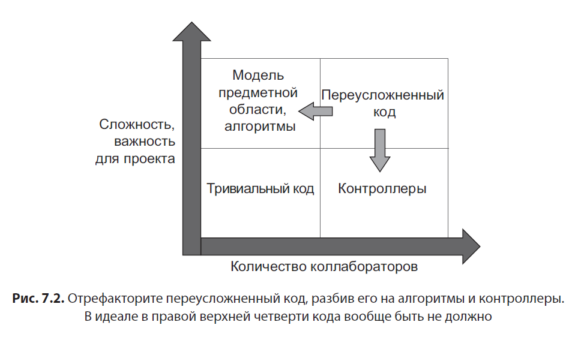

# Принципы юнит-тестирования, 2021, (Хориков Владимир)

## Структура книги

Одиннадцать глав этой книги разделены на четыре части. 

В **части I** изложены основы юнит-тестирования, а также напоминаются наиболее общие практики юнит-тестирования:
Глава 1 показывает цели юнит-тестирования, в ней приводится краткий обзор того, как отличить хороший тест от плохого.
В главе 2 анализируется определение юнит-тестирования и обсуждаются две основные школы в области юнит-тестирования.
Глава 3 рассматривает некоторые базовые вопросы — такие как структура юнит-тестов, переиспользование тестовых данных и параметризация тестов.

В **части II** мы перейдем к сути дела — вы увидите, какими свойствами должен обладать хороший юнит-тест, а также узнаете, как провести рефакторинг тестов для повышения их качества:
В главе 4 определяются четыре характеристики, по которым можно оценить качество теста, а также предоставляется общая система координат, которая используется на протяжении всей книги.
В главе 5 объясняется, для чего нужны моки (mocks), и анализируется их связь с хрупкостью тестов.
В главе 6 рассматриваются три стиля юнит-тестирования и то, какой из этих стилей производит тесты лучшего качества и почему.
Глава 7 показывает, как провести рефакторинг раздутых, чрезмерно усложненных тестов и получить тесты, сочетающие в себе максимальную эффективность с минимальными затратами на сопровождение.

В **части III** изучаются вопросы интеграционного тестирования:
В главе 8 рассматривается интеграционное тестирование в целом, его достоинства и недостатки.
В главе 9 обсуждаются моки (mocks) и как работать с ними так, чтобы максимально повысить эффективность ваших тестов.
В главе 10 рассматривается работа с реляционными базами данных в тестах.

В главе 11 **части IV** представлены стандартные антипаттерны юнит-тестирования.

## Часть 1 Общая картина

### Глава 1. Цель юнит-тестирования

Различия между хорошими и плохими тестами не ограничиваются вкусами или личными предпочтениями. На практике эти различия влияют на весь проект — они могут либо помочь вам успешно завершить проект, либо привести к его провалу.

Характеристики корпоративного приложения:

- высокая сложность бизнес-логики;

- большой срок жизни проекта;

- умеренные объемы данных;

- низкие или средние требования к быстродействию

..снижение скорости разработки называется программная энтропия (software entropy).

Недостаток юнит-тестирования заключается в том, что тесты требуют начальных вложений, и иногда весьма значительных. Но в долгосрочной перспективе они окупаются, позволяя проекту расти на более поздних стадиях.

Хотя юнит-тесты помогают развитию проекта, просто писать тесты недостаточно. Плохо написанные тесты не меняют общей картины.

Проекту с плохоми тестами понадобится больше времени для того, чтобы войти в фазу стагнации, но стагнация все равно неизбежна.


Плохие тесты замедляют проект: дают много ложных срабатываний, не помогают выявлять баги, работают медленно и создают сложности с сопровождением. Многие компании пишут тесты без четкого понимания того, способствуют ли они развитию проекта.

Составляющая затрат на сопровождение определяется количеством времени, ушедшего на:

- рефакторинг теста при рефакторинге нижележащего кода;

- выполнение теста при каждом изменении кода;

- отвлечение на ложные срабатывания теста;

- затраты на чтение теста при попытке понять, как работает нижележащий код.

Легко создать тесты, общая польза которых близка к нулю или даже отрицательна из-за высоких затрат на сопровождение. Чтобы сделать возможным стабильный рост проекта, необходимо сосредоточиться исключительно на тестах с высоким качеством — только такие тесты стоят того, чтобы включать их в ваш проект.

Тесты — это тоже код. Их следует рассматривать как часть кодовой базы, предназначенную для решения конкретной проблемы: обеспечения правильности приложения. Юнит-тесты, как и любой другой код, также подвержены ошибкам и требуют сопровождения.

**Использование метрик покрытия для оценки качества тестов**

Метрика покрытия (coverage metric) показывает, какая доля исходного кода была выполнена хотя бы одним тестом — от 0 до 100 %.

`Code coverage (test coverage) = Количество выполненных строк кода / Общее количество строк кода`

`Branch coverage = Количество покрытых ветвей / Общее количество ветвей`

Крайним выражением ситуации с частично тестируемыми результатами является тестирование без проверок (assertion-free testing): когда вы пишете тесты, которые вообще не содержат никаких проверочных команд.

..если обернуть все тесты в блоки try/catch и не включать в них проверки (assertions), то такие тесты всегда проходят успешно..

Метрики покрытия не могут сказать, насколько исчерпывающими являются ваши тесты; не могут они сказать и то, достаточно ли вы создали тестов.

Вместо того чтобы сосредоточиться на тестировании действительно важных вещей, люди начнут искать способы для достижения этой искусственной цели. Юнит-тестирование и без того достаточно сложно. Установление произвольной цели в виде конкретного процента покрытия только отвлекает разработчиков и мешает им обдумывать то, что и зачем они тестируют.

Автоматизированного способа проверки качества тестов не существует. Вам придется руководствоваться субъективной оценкой.

**Какими должны быть успешные тесты?**

Автоматизированные тесты должны быть интегрированы в цикл разработки. В идеале они должны выполняться при каждом изменении кода.

Важно направить ваши усилия по юнит-тестированию на самые критические части системы, уделяя остальным частям лишь поверхностное внимание. В большинстве случаев самой важной является часть, содержащая бизнес-логику, — модель предметной области (доменная модель). Тестирование бизнес-логики обеспечивает тестам наилучшую эффективность.

Некоторые тесты — например, интеграционные — могут выходить за пределы модели предметной области и проверять, как работает система в целом, включая некритические части вашей кодовой базы. И это нормально. Но в первую очередь сосредоточиться нужно именно на модели предметной области.

Важно включать в проект только тесты, обладающие наибольшей эффективностью. В первом приближении эффективность тестов можно рассматривать как разницу между защитой от багов и затратами на сопровождение.

**Итоги**

- Код проекта становится хуже по мере роста проекта. Каждый раз, когда вы что-то изменяете в коде, возрастает ее энтропия, или степень беспорядка в ней. Если не принять должных мер (таких как постоянная чистка и рефакторинг), система непрерывно усложняется и дезорганизуется. Тесты помогают справиться с этой тенденцией. Они становятся своего рода «подушкой безопасности» — средством, которое обеспечивает защиту от багов.

- Писать юнит-тесты важно. Не менее важно писать хорошие юнит-тесты. Проекты с плохими тестами и проекты без тестов вообще приходят к одинаковому результату: либо стагнация, либо множество багов с каждым новым релизом.

- Целью юнит-тестирования является обеспечение стабильного роста проекта. Хорошие юнит-тесты помогают предотвратить стагнацию и сохранить темп разработки со временем. С такими тестами вы будете уверены в том, что изменения не приведут к багам. В свою очередь, это упростит рефакторинг кода или добавление новой функциональности.

- Не все тесты одинаково полезны. С каждым тестом связаны плюсы и минусы, которые необходимо тщательно оценивать. Включайте в проект только наиболее эффективные тесты и избавляйтесь от всех остальных. И код приложения, и код тестов — обязательство, а не актив (liabilities, not assets).

- Возможность покрытия кода юнит-тестами — хороший критерий оценки качества этого кода, но он работает только в одном направлении. Это хороший негативный признак (если юнит-тестирование кода невозможно, значит, это код плохого качества), но плохой позитивный признак (возможность юнит-тестирования кода не гарантирует качество этого кода).

- Аналогичным образом метрики покрытия служат хорошим негативным, но плохим позитивным признаком. Низкий процент покрытия — хороший признак проблем с тестами, но высокий процент покрытия еще не означает высокого качества тестов.

- Branch coverage предоставляет более качественную информацию о полноте тестов, чем code coverage, но по нему все равно нельзя судить о том, достаточно хороши ваши тесты или нет. Ни одна из метрик покрытия не учитывает наличия проверок (assertions) и ветвей выполнения в сторонних библиотеках, используемых в вашем проекте.

- Установление конкретного процента покрытия как цели создает неправильный стимул. Обеспечивать высокий процент покрытия для основных частей вашей системы хорошо, но не следует превращать этот высокий процент в требование.

- Успешные тесты обладают следующими свойствами:
  
  - интегрирован в цикл разработки;
  - проверяет только самые важные части вашего кода;
  - дает максимальную защиту от багов с минимальными затратами на сопровождение.

- Чтобы добиться цели юнит-тестирования (то есть обеспечить стабильный рост проекта), необходимо:
  
  - научиться отличать хорошие тесты от плохих;
  - научиться рефакторить тесты для повышения их качества.

### Глава 2. Что такое юнит-тест?

Cводка различий между школами:

|                    | Изоляция    | Юнит — это              | Использование моков для                        |
| ------------------ | ----------- | ----------------------- | ---------------------------------------------- |
| Лондонская школа   | Юнитов      | Класс                   | Коллабораторов (любых изменяемых зависимостей) |
| Классическая школа | Юнит-тестов | Класс или набор классов | Совместных (shared) зависимостей               |

Совместной (shared) зависимостью называется зависимость, к которой имеют доступ более одного теста и которая предоставляет им возможность влиять на результаты друг друга. Типичный пример совместной зависимости — статическое изменяемое поле. База данных — другой типичный пример совместной зависимости.
Приватной (private) зависимостью называется зависимость, которая не является совместной.
Внепроцессной (out-of-process) зависимостью называется зависимость, работающая вне процесса приложения; это посредник (proxy) к данным, которых еще нет в памяти. В подавляющем большинстве случаев внепроцессная (out-of-process) зависимость соответствует совместной (shared) зависимости, но не всегда. Например, база данных — это одновременно и внепроцессная, и совместная зависимость. Но если эта база данных будет запускаться в контейнере Docker перед каждым тестом, она перейдет в категорию внепроцессной, но не совместной, так как у каждого теста будет свой экземпляр этой базы данных. Аналогичным образом база данных, доступная только для чтения, также является внепроцессной, но не совместной, несмотря на то что она используется несколькими тестами. Тесты не могут изменить состояние такой базы данных, а следовательно, не могут влиять на результаты друг друга.

Коллаборатор (collaborator) — это изменяемая зависимость. Например, класс, предоставляющий доступ к базе данных, является коллаборатором (при условии что доступ не только для чтения). Store также является коллаборатором, потому что его состояние может изменяться со временем.

...

Вместо того чтобы искать способы тестирования большого сложного графа взаимосвязанных классов, следует сконцентрироваться на том, чтобы у вас изначально не было такого графа классов. Как правило, большой граф классов является результатом плохого проектирования кода.

...

тест является интеграционным, когда он проверяет две или более единицы поведения

...

Так как сквозные тесты оказываются наиболее затратными в отношении сопровождения, лучше выполнять их на более поздней стадии билд-процесса, после прохождения всех юнит- и интеграционных тестов. Возможно даже их выполнение только на билд-сервере, а не на машинах отдельных разработчиков.

...

Между интеграционными и сквозными тестами не существует четкой границы из-за того что не всегда удается решить проблемы со всеми внепроцессными зависимостями и вам все равно придется использовать тестовые заглушки.

**Итоги**

- В этой главе было уточнено определение юнит-теста. Юнит-тест:
  
  - проверяет правильность работы *одной единицы поведения*
  
  - делает это быстро
  
  - и в изоляции *от других тестов*

- Больше всего разногласий вызывает аспект изоляции. Эти разногласия привели к формированию двух школ юнит-тестирования: классической (детройтской) и лондонской (мокистской). Различия во взглядах на изоляцию также влияют на представления о том, что собой представляет юнит, а также как нужно работать с зависимостями тестируемой системы.
  
  - Лондонская школа считает, что изолированы друг от друга должны быть юниты (units under test) — единицы кода, чаще всего класс. Все его зависимости, за исключением неизменяемых, должны быть заменены тестовыми заглушками в тестах.
  
  - Классическая школа считает, что изолированы друг от друга должны быть сами юнит-тесты, а не юниты. Кроме того, тестируется единица поведения, а не единица кода. Таким образом, только совместные (shared) зависимости должны заменяться тестовыми заглушками. Совместными называются зависимости, предоставляющие тестам возможность влиять на результаты друг друга.

- Основные преимущества лондонской школы — улучшенная детализация, простота тестирования больших графов взаимосвязанных классов и простота нахождения функциональности, содержащей ошибку, при отказе теста.

- Преимущества лондонской школы на первый взгляд кажутся привлекательными. Тем не менее они создают ряд потенциальных проблем. Во-первых, концентрация на единицах кода ошибочна: тесты должны проверять единицы поведения, а не кода. Кроме того, невозможность юнит-тестирования фрагмента кода является хорошим показателем проблем с кодом. Тестовые заглушки не решают эти проблемы, а только скрывают их. И наконец, хотя простота нахождения ошибочного кода полезна, это, как правило, не является серьезной проблемой для классической школы, так как вы почти всегда знаете, что вызвало ошибку, — это тот код, который вы редактировали последним.

- Самой большой проблемой лондонской школы юнит-тестирования является проблема излишней спецификации — привязка тестов к деталям имплементации тестируемой системы.

- Интеграционный тест — это тест, который не удовлетворяет как минимум одному критерию юнит-теста. Сквозные (end-to-end) тесты составляют подмножество интеграционных тестов; они проверяют систему с точки зрения конечного пользователя. Сквозные тесты обращаются напрямую ко всем или почти ко всем внепроцессным зависимостям, с которыми работает ваше приложение.

- Канонический источник информации по классическому стилю — книга Кента Бека (Kent Beck) «Test-Driven Development: By Example». За информацией о лондонском стиле обращайтесь к книге «Growing Object-Oriented Software, Guided by Tests» Стива Фримена (Steve Freeman) и Ната Прайса (Nat Pryce). По теме управления зависимостями я рекомендую книгу «Dependency Injection: Principles, Practices, Patterns» Стивена ван Дьюрзена (Steven van Deursen) и Марка Симана (Mark Seemann).

### Глава 3. Анатомия юнит-теста

**Структура юнит-теста**

**Паттерн AAA**

В паттерне AAA каждый тест разбивается на три части: arrange (подготовка), act (действие) и assert (проверка). Также иногда этот паттерн называется 3A.

**Паттерн «GIVEN-WHEN-THEN»**
Возможно, вы также слышали о паттерне «Given-When-Then», похожем на AAA. Этот паттерн также рекомендует разбить тест на три части:

- Given — соответствует секции подготовки (arrange);

- When — соответствует секции действия (act);

- Then — соответствует секции проверки (assert).

В отношении построения теста эти два паттерна ничем не отличаются. Единственное отличие заключается в том, что структура «Given-When-Then» более понятна для не-программиста. Таким образом, она лучше подойдет для тестов, которые вы собираетесь показывать людям, не имеющим технической подготовки.

**Избегайте множественных секций arrange, act и assert**

Когда вы видите несколько секций действий, разделенных секциями проверки и, возможно, секциями подготовки, это означает, что тест проверяет несколько единиц поведения. И как обсуждалось в главе 2, такой тест уже не является юнит-тестом — это интеграционный тест. И все равно их желательно разбивать на несколько тестов.

**Избегайте команд if в тестах**

Тест должен быть простой последовательностью шагов без ветвлений. Если есть команда if, то тест проверяет слишком много и его нужно разбить на несколько тестов. Это относится как к юнит-тестам, так и к интеграционным тестам.

**Насколько большой должна быть каждая секция?**

Секция подготовки может быть большой, но если она становится слишком большой, то лучше выделить отдельные операции в приватные методы или в отдельный класс-фабрику. Для организации переиспользования кода можно использовать паттерны «Мать объектов» (Object Mother) и «Построитель тестовых данных» (Test Data Builder).

Секция действия должна быть не больше одной строки, но это правило можно нарушить в случае служебного или инфраструктурного кода. Однако, необходимо проверять каждый такой случай на возможные нарушения инкапсуляции.

Секция проверки может содержать несколько проверок, если они относятся к одной единице поведения. Однако, если секция проверки становится слишком большой, это может указывать на недостаток абстракции в коде. В таком случае, возможно, стоит добавить методы проверки равенства (equality members) в класс объекта для упрощения проверок.

**Нужна ли завершающая (teardown) фаза?**

Некоторые выделяют завершающую секцию после подготовки, действия и проверки. В ней можно удалить файлы, закрыть подключение к базе данных и т.д. Однако большинству юнит-тестов завершение не требуется.

**Выделение тестируемой системы**

SUT - ключевой элемент тестирования, предоставляющий доступ к поведению для проверки. Точка входа - класс, инициирующий поведение.

`Тесты должны описывать поведение приложения, а не просто перечислять его функции. Описание должно быть понятным для всех, включая бизнес.`

> Мне особенно нравится атрибут [Fact] — именно тем, что он называется Fact, а не Test. Он подчеркивает правило, упоминавшееся в главе 2: каждый тест должен рассказывать историю. Эта история — отдельный атомарный сценарий или факт, относящийся к предметной области задачи, а прохождение теста показывает, что этот факт является истинным. Если тест не проходит, значит, факт перестал быть истинным и его нужно переписать, либо сама система нуждается в исправлении.
> Я рекомендую пользоваться таким подходом при написании юнит-тестов. Ваши тесты не должны ограничиваться простым перечислением того, что делает рабочий код. Вместо этого они должны предоставлять высокоуровневое описание поведения приложения. В идеале это описание должно быть понятным не только программистам, но и бизнесу.

**Переиспользование тестовых данных между тестами**

<u>Проход 1 (неправильный)</u>

Инициализация их в конструкторе теста (или методе SetUp).

Подход позволяет значительно сократить объем кода в тестах.

Недостатки:

- сильная связность между тестами

- ухудшается читаемость (приходится смотреть в два места)

<u>Подход 2</u>

Написать фабричные методы.

Использование приватных фабричных методов для инициализации общего кода позволяет сократить код теста, сохраняя контекст, и не связывает тесты друг с другом при условии достаточной гибкости методов.

Исключение для правила переиспользования тестовых данных - создание тестовых данных в конструкторе, если они используются всеми или почти всеми тестами в проекте. Это особенно актуально для интеграционных тестов, работающих с базой данных. Однако, лучше создать базовый класс и инициализировать базу данных в его конструкторе, а не в отдельных классах тестов.

**Именование юнит-тестов**

Имя тестового метода читается намного проще, когда оно описывает тестируемое поведение доступным и понятным языком.

Одна из самых распространенных (и, пожалуй, одна из наименее полезных) рекомендаций выглядит так:
`[ТестируемыйМетод] _ [Сценарий] _ [ОжидаемыйРезультат]`

Для написания выразительных, читаемых имен тестов:

- не следуйте жесткой структуре именования тестов. Высокоуровневое описание сложного поведения не удастся втиснуть в узкие рамки такой структуры. Сохраняйте свободу самовыражения;

- выбирайте имя теста так, словно вы описываете сценарий не-программисту, знакомому с предметной областью задачи (например, бизнес-аналитику);

- разделяйте слова символами подчеркивания. Это поможет улучшить читаемость, особенно длинных имен.

Хотя я использую паттерн [ИмяКласса]Tests при выборе имен классов тестов, это не означает, что тесты ограничиваются проверкой только этого класса. Рассматривайте класс в [ИмяКласса]Tests как точку входа — API, при помощи которого можно проверить единицу поведения.

Не включайте имя тестируемого метода в название теста.

Формулировку should be («должно быть») следует рассматривать как еще один распространенный антипаттерн.

**Параметризованные тесты**

Параметризированные тесты уменьшают объем тестового кода, но усложняют понимание тестовых методов.

Существует баланс между объемом тестового кода и его понятностью. Объединять положительные и отрицательные тестовые сценарии в одном методе стоит только тогда, когда по входным параметрам можно легко определить, какой сценарий чему соответствует. В противном случае лучше разделить их. Если поведение становится слишком сложным, лучше не использовать параметризованные тесты, а описать каждый сценарий отдельным тестом.

Следует избегать параметра expected в тестовых методах.

**Итоги**

- Все юнит-тесты должны строиться по схеме AAA: подготовка (Arrange), действие (Act), проверка (Assert). Если тест состоит из нескольких секций подготовки, действий или проверки, это указывает на то, что тест проверяет сразу несколько единиц поведения. Если этот тест — юнит-тест, разбейте его на несколько тестов: по одному для каждого действия.
- Секция действия, содержащая более одной строки, — признак проблем с API тестируемой системы. Клиент должен не забывать выполнять эти действия совместно, чтобы не привести к нарушению логической целостности. Такие нарушения называются нарушениями инвариантов. Защита вашего кода от потенциальных нарушений инвариантов называется инкапсуляцией.
- Чтобы выделить тестируемую систему в тестах, присвойте ей имя sut. Чтобы разделить три секции теста, либо включите в них соответствующий комментарий (Arrange, Act, Assert), либо вставьте пустые строки между секциями.
- Переиспользование кода инициализации тестовых данных должно осуществляться с помощью фабричных методов (вместо конструктора тест-класса). Такой подход поддерживает изоляцию между тестами и улучшает читаемость.
- Не используйте жесткую структуру именования тестов. Присваивайте имена тестам так, как если бы вы описывали сценарий непрограммисту, знакомому с предметной областью. Разделяйте слова в имени подчеркиваниями и не включайте имя тестируемого метода в название теста.
- Параметризованные тесты помогают сократить объем кода, необходимого для похожих тестов. Недостаток параметризованных тестов — ухудшение читаемости, так как тесты становятся более общими.
- Assertion-библиотеки помогают улучшить читаемость кода за счет реструктуризации порядка слов в проверках в тестах.

## Часть 2 Обеспечение эффективной работы тестов

### Глава 4. Четыре аспекта хороших юнит-тестов

Четыре атрибута хороших юнит-тестов являются фундаментальными. Все существующие и хорошо известные концепции автоматизации могут быть сведены к этим четырем атрибутам:

- защита от багов

- устойчивость к рефакторингу

- быстрая обратная связь

- простота поддержки

**Первый аспект: защита от багов**

Чем больше кода в проекте, тем выше вероятность ошибок. Поэтому важно разработать защиту от багов для обеспечения роста проекта в долгосрочной перспективе.

Тест также должен иметь актуальный набор проверок (assertions), просто выполнить код недостаточно.

Важность кода зависит не только от его объема, но и от сложности и значимости для бизнес-логики. Код, содержащий сложную бизнес-логику, более важен, чем инфраструктурный код, так как ошибки в нем могут нанести наибольший ущерб.

Тестирование тривиального кода не имеет смысла.

Ваш код должен учитывать не только свой код, но и код, написанный другими людьми, например, библиотеки, фреймворки и внешние системы. Тесты должны проверять работу вашего кода в комбинации с этими элементами для обеспечения оптимальной защиты.

**Второй аспект: устойчивость к рефакторингу**

Чтобы оценить, насколько тест хорош в плане устойчивости к рефакторингу, смотрите на то, сколько этот тест выдает ложных срабатываний: чем меньше, тем лучше.

Плохо, когда тесты написаны так, что они падают при любом изменении тестируемого кода.

Преимущества тестов:

- Тесты помогают обнаружить ошибки в коде до его использования, что делает их исправление дешевле

- Уверенность в том, что изменения в коде не вызовут ошибок, позволяет проводить больше рефакторинга, что способствует улучшению качества кода проекта.

Не следует полностью отказываться от любых попыток рефакторинга. Правильный подход здесь — проанализировать тесты в проекте и приступить к снижению их хрупкости.

Лучший способ структурировать тест - это создать историю, связанную с предметной областью. Если такой тест не проходит, это указывает на разрыв между историей и реальным поведением приложения. Только такие сбои тестов полезны, так как они предоставляют ценную информацию о том, что пошло не так. Все остальные сбои являются отвлекающим шумом.

Тесты должны находиться как можно дальше от внутренних механизмов кода и проверять только конечный результат.

Сложнее всего справиться с ложными срабатываниями, которые не приводят к ошибкам компиляции. Они выглядят как настоящие ошибки и требуют больше времени для разбора.

В начале проекта не нужно чистить код, но с течением времени его качество ухудшается, поэтому необходим регулярный рефакторинг.

Рефакторинг требует устойчивых тестов, чтобы избежать ложных срабатываний. Многие разработчики не уделяют этому должного внимания, но это важно для больших проектов.

**Третий и четвертый аспекты: быстрая обратная связь и простота поддержки**

Быстрые тесты ускоряют обратную связь и уменьшают затраты на исправление ошибок, в то время как медленные тесты увеличивают время необнаружения ошибок и могут привести к увеличению затрат на их исправление.

Хорошие юнит-тесты должны быть простыми в поддержке, что оценивается затратами на сопровождение кода. Это включает в себя простоту понимания и запуска тестов, а также качество кода тестов, которое не должно уступать качеству рабочего кода.

**В поисках идеального теста**

Нет утилиты для измерения эффективности теста, но его можно оценить по четырем атрибутам и принять решение о его полезности для проекта.

Лучше иметь небольшой набор высокоэффективных тестов, чем много посредственных.

Сквозные (end-to-end) тесты проверяют систему с точки зрения пользователя, проходя через все компоненты, включая интерфейс, базу данных и внешние приложения. Они обеспечивают наилучшую защиту от багов, но медленные и не могут обеспечить быструю обратную связь.

Тривиальные тесты покрывают простой код, вероятность сбоя в котором невелика. Они быстро дают обратную связь и устойчивы к рефакторингу, но могут быть тавтологическими и бессмысленными.

Тесты, которые быстро выявляют ошибки в коде, но имеют много ложных срабатываний, называются хрупкими. Они могут упасть при любом рефакторинге, независимо от изменения функциональности. Такие тесты фокусируются на том, как работает приложение, что препятствует дальнейшему рефакторингу. Вместо этого тест должен проверять, что делает приложение. Эти тесты выполняются быстро и обеспечивают хорошую защиту от багов, но обладают недостаточной устойчивостью к рефакторингу.

Устойчивость к рефакторингу важно довести до максимума, сохраняя тесты быстрыми и избегая сквозных тестов. Компромисс - баланс между обнаружением ошибок и скоростью обратной связи.

Борьба с хрупкостью тестов (с ложными срабатываниями) становится первоочередной задачей на пути к построению эффективных тестов.

**Пирамида тестирования**

Концепция пирамиды тестирования предписывает определенное соотношение разных типов тестов в проекте:

- юнит-тесты

- интеграционные тесты

- сквозные тесты

Пирамида тестирования представляет три типа тестов, где ширина уровня обозначает долю тестов определенного типа в проекте. Чем шире уровень, тем больше тестов. Высота уровня показывает, насколько близки эти тесты к эмуляции поведения конечного пользователя. Сквозные тесты расположены на вершине — они ближе всего имитируют конечного пользователя. Разные типы тестов выбирают разные компромиссы между быстротой обратной связи и защитой от багов. Тесты более высоких уровней отдают предпочтение защите от багов, тогда как тесты нижних уровней выводят на первый план скорость выполнения. Юнит-тесты более сбалансированы, поэтому их обычно больше. Однако, есть исключения, например, если приложение содержит только базовые операции создания, чтения, обновления и удаления (CRUD) с минимумом бизнес-правил, пирамида тестирования будет больше напоминать прямоугольник с равным количеством юнит- и интеграционных тестов, без сквозных тестов.

**Выбор между тестированием по принципу «черного ящика» и «белого ящика»**

Тестирование по принципу «черного ящика» проверяет функциональность системы без знания ее внутренней структуры.

Тестирование по принципу «белого ящика» проверяет внутренние механизмы приложения на основе исходного кода, а не на основе требований или спецификаций.

Оба метода тестирования имеют свои плюсы и минусы. Тестирование по принципу "белого ящика" обычно более тщательное, но результаты могут быть хрупкими и не связаны с бизнес-логикой. Тестирование по принципу "черного ящика" лучше, но может пропустить ошибки. Лучше всего комбинировать оба метода. Используйте утилиты, показывающие покрытие кода для выявления непротестированных частей приложения, но затем тестируйте их так, словно вам ничего не известно о внутренней структуре этого кода.

**Итоги**

- Хороший юнит-тест должен обладать четырьмя фундаментальными атрибутами, которые могут использоваться для анализа любых автоматизированных тестов (юнит-, интеграционных или сквозных):
  
  - защита от багов
  
  - устойчивость к рефакторингу
  
  - быстрая обратная связь
  
  - простота поддержки

- Защита от багов показывает, несколько хорошо тест справляется с выявлением ошибок (регрессий). Чем больше кода проверяет тест (как вашего, так и кода библиотек и фреймворков, задействованных в проекте), тем выше вероятность того, что тест обнаружит ошибку.

- Устойчивость к рефакторингу определяет, насколько тест хрупок: может ли он перенести рефакторинг рабочего кода, не выдавая ложных срабатываний.

- Ложное срабатывание представляет собой «ложную тревогу»: тест падает, но покрываемая им функциональность работает. Ложные срабатывания негативно влияют на проект:
  
  - если тесты падают без веской причины, они притупляют вашу готовность реагировать на проблемы в коде. Со временем вы привыкаете к таким сбоям и перестаете обращать на них внимание. А это может привести к игнорированию настоящих ошибок, которые затем попадают в продуктив;
  
  - с другой стороны, при частых ложных срабатываниях вы начинаете все меньше и меньше доверять вашим тестам. Они уже не воспринимаются как что-то, на что вы можете положиться. Отсутствие доверия приводит к уменьшению рефакторинга, так как вы пытаетесь свести к минимуму потенциальные ошибки.

- Ложные срабатывания появляются в результате привязки тестов к деталям имплементации тестируемой системы. Чтобы избежать такой привязки, тест должен проверять конечный результат, а не действия, которые для этого потребовались.

- Защита от багов и устойчивость к рефакторингу составляют метрику точности теста. Тест точен, когда он выдает хороший сигнал (способен находить ошибки) с минимально возможным шумом (ложных срабатываний).

- Ложные срабатывания не оказывают заметного отрицательного влияния в начале проекта. С ростом проекта они начинают играть все более важную роль — столь же важную, как ложноотрицательные срабатывания (незамеченные ошибки).

- Быстрая обратная связь — мера того, насколько быстро выполняется тест.

- Простота поддержки состоит из двух компонентов:
  
  - сложность понимания теста. Чем меньше тест, тем проще он читается;
  
  - сложность выполнения теста. Чем меньше внепроцессных зависимостей, тем проще поддерживать их в работоспособном состоянии.

- Эффективность теста определяется произведением этих четырех атрибутов. Если один из атрибутов равен нулю, то эффективность всего теста тоже равна нулю.

- Невозможно создать тест, который имеет максимальные показатели по всем четырем атрибутам, потому что первые три — защита от багов, устойчивость к рефакторингу и быстрая обратная связь — являются взаимоисключающими. Тест может максимизировать только два атрибута из трех.

- Устойчивость к рефакторингу не должна быть предметом для компромиссов, потому что этот атрибут в основном сводится к бинарному выбору: тест либо устойчив к рефакторингу, либо нет. Компромисс между атрибутами сводится к выбору между защитой от багов и быстротой обратной связи.

- Пирамида тестирования предписывает определенное соотношение юнит-, интеграционных и сквозных тестов: сквозных тестов должно быть меньше всего, юнит-тестов — больше всего, а интеграционных тестов — где-то посередине.

- Разные типы тестов в пирамиде принимают разные компромиссы между быстротой обратной связи и защиты от багов. Сквозные тесты отдают предпочтение защите от багов, а юнит-тесты — быстрой обратной связи.

- Используйте тестирование по принципу «черного ящика» при написании тестов. Используйте тестирование по принципу «белого ящика» при анализе тестов.

### Глава 5. Моки и хрупкость тестов

**Отличия моков от стабов**

Тестовая заглушка (test double) — общий термин, описывающий любые разновидности фиктивных зависимостей в тестах. Английский вариант термина происходит от stunt double — дублеров актеров на съемках. 

Существуют пять типов тестовых заглушек (пустышки (dummy), стабы (stub), шпионы (spy), моки (mock) и фейки (fake)), которые можно разбить на две категории: моки и стабы. Spy функционально эквивалентны mock; dummy и fake делают то же, что и stub.

Моки используются для создания симуляции и проверки того, как тестируемая система взаимодействует с другими системами, на которые она полагается. Это включает в себя вызовы, которые тестируемая система делает к этим зависимостям, чтобы изменить их состояние.

Стабы помогают эмулировать входные взаимодействия — то есть вызовы, совершаемые тестируемой системой к ее зависимостям для получения входных данных.

Моки помогают эмулировать и проверять взаимодействия между тестируемой системой и ее зависимостями, тогда как стабы только эмулируют эти взаимодействия.

Различия между stub, dummy и fake в том, насколько они сложны. Dummy представляет собой простое, зашитое в код значение (к примеру, null или произвольная строка). Она используется для удовлетворения сигнатуры метода тестируемой системы и не влияет на результат. Stub имеет более сложное устройство. Это полноценная зависимость, которая настраивается для возвращения разных значений для разных сценариев. Наконец, fake в большинстве случаев — то же самое, что и stub. Различие — в цели их создания: fake обычно создается для замены зависимостей, которых еще не существует.

Важно понимать различие между mock (инструмент) и mock (тестовая заглушка). Mock-инструмент(класс фрейсворка) может использоваться для создания обоих типов тестовых заглушек: mock и stub.

Проверка взаимодействий со стабами — часто встречающийся антипаттерн, приводящий к хрупкости тестов. Вызов от тестируемой системы к стабу не является частью конечного результата этой тестируемой системы. Такой вызов — всего лишь средство для получения результата; стаб предоставляет входные данные, по которым тестируемая система затем генерирует результат.

Практика проверки того, что не является частью конечного результата, также называется излишней спецификацией (overspecification). Чаще всего излишняя спецификация встречается при проверке взаимодействий. Проверка взаимодействий со стабами — ошибка, которую довольно легко обнаружить, потому что тесты не должны проверять никакие взаимодействия со стабами.

Когда тестовая заглушка является одновременно и моком, и стабом, она все равно называется моком, а не стабом. В основном это объясняется тем, что нужно выбрать одно имя, но отчасти и тем, что факт принадлежности к мокам важнее принадлежности к стабам.

Концепции моков и стабов связаны с принципом CQS (Command Query Separation, то есть «разделение команд и запросов»). Принцип CQS утверждает, что каждый метод должен быть либо командой, либо запросом, но не и тем и другим одновременно. Команды — методы, которые производят побочные эффекты и не возвращают никакого значения (возвращают void). Примеры побочных эффектов: изменение состояния объекта, изменение файла в файловой системе и т. д. Запросы определяются противоположным образом — они не производят побочных эффектов и возвращают значение. Код с таким четким разделением проще читается. Чтобы определить, что делает метод, достаточно посмотреть на его сигнатуру, не углубляясь в подробности реализации. Cледование принципу CQS не всегда возможно. Существуют методы, для которых оправдано как наличие побочного эффекта, так и возвращение значения. Классический пример — stack.Pop(). Тестовые заглушки, заменяющие команды, становятся моками. Тестовые заглушки, заменяющие запросы, становятся стабами.

**Наблюдаемое поведение и детали имплементации**

Метрика устойчивости к рефакторингу самая важная, так как наличие у юнит-теста этой устойчивости — по большей части бинарный выбор (она либо есть, либо нет).

Избежать привязки к деталям имплементации тестируемого кода можно только одним способом: проверять конечный результат, (наблюдаемое поведение системы) и отделять тесты от деталей имплементации настолько, насколько это возможно. Другими словами, тесты должны сосредоточиться на том, что система делает, а не на том, как она это делает. Что же именно является деталью имплементации и чем она отличается от наблюдаемого поведения?

Весь рабочий код можно классифицировать по двум измерениям:

- публичный или приватный API (API — программный интерфейс);

- наблюдаемое поведение или детали имплементации.

Различия между наблюдаемым поведением и деталями имплементации менее очевидны. Чтобы код мог считаться частью наблюдаемого поведения системы, он должен решать одну из следующих задач:

- предоставлять операцию, которая помогает клиенту достичь одну из его целей. Операция — метод, который выполняет вычисление и/или создает побочный эффект;

- предоставлять доступ к состоянию системы, которое помогает клиенту достичь одну из его целей. Состояние — текущее состояние системы.

Любой код, который не делает ни того ни другого, является деталью имплементации.

В идеале публичный API системы должен совпадать с ее наблюдаемым поведением, а все детали имплементации должны быть скрыты от клиента. Такая система будет иметь хорошо спроектированный API

Существует хорошее эмпирическое правило, которое поможет вам определить, происходит ли в классе утечка деталей имплементации. Если количество операций, которые должны быть вызваны клиентом для достижения одной цели, больше 1, то в классе, скорее всего, происходит утечка деталей имплементации. В идеале каждая отдельная цель должна достигаться одной операцией.

Инкапсуляция защищает код от нарушений логической целостности и упрощает сопровождение кодовой базы, предотвращая утечку деталей реализации и снижая когнитивную нагрузку при программировании. Это помогает обеспечить стабильный рост проекта в долгосрочной перспективе.

Существует похожий принцип: tell-don’t-ask. Он был сформулирован Мартином Фаулером (https://martinfowler.com/bliki/TellDontAsk.html) и означает упаковку данных с функциями, работающими с этими данными. Этот принцип может рассматриваться как следствие из принципа инкапсуляции. Инкапсуляция кода является целью, тогда как совместная упаковка данных и функций, а также сокрытие деталей имплементации — средствами для достижения этой цели:

- сокрытие деталей имплементации убирает внутреннее устройство класса от клиентов, таким образом снижая риск его повреждения;

- упаковка данных вместе с операциями помогает предотвратить нарушение инвариантов класса этими операциями.

Связь между юнит-тестами и API: делая детали имплементации приватными, мы повышаем устойчивость тестов к рефакторингу.

Хорошо спроектированный API должен раскрывать минимум операций и состояния, открывая только необходимый код для достижения целей клиентов. Остальное должно быть скрыто за приватным API.

**Связь между моками и хрупкостью тестов**

<u>Определение гексагональной архитектуры</u>

Типичное приложение состоит из двух слоев: предметной области и сервисов приложения. Слой предметной области содержит бизнес-логику, а слой сервисов приложения координирует взаимодействие между слоем предметной области и внешним миром.

Комбинация слоя сервисов приложения и слоя предметной области образует гексагон, который представляет ваше приложение. Он может взаимодействовать с другими приложениями, представленными другими гексагонами. Другими приложениями могут быть SMTP-сервисы, сторонние системы, шины сообщений и т. д. Группа взаимодействующих гексагонов образует гексагональную архитектуру.

Термин «гексагональная архитектура» был предложен Алистером Кокберном (Alistair Cockburn). Он подчеркивает три важных принципа:

- *Разделение обязанностей между слоем предметной области и слоем сервисов приложения*. Бизнес-логика - важнейшая часть приложения, и слой предметной области должен отвечать только за нее. Сервисы приложения должны взаимодействовать с внешними приложениями и базой данных, а также преобразовывать входные запросы в операции на доменных классах.

- *Взаимодействия внутри приложения*. Гексагональная архитектура говорит, что классы предметной области должны зависеть только друг от друга, а не от классов слоя сервисов приложения. Это помогает разделить обязанности между слоями и изолировать слой предметной области от внешнего мира.

- *Взаимодействия между приложениями*. Приложения соединяются с вашим через общий интерфейс. Никто не может обращаться к слою предметной области напрямую. Гексагон показывает, как приложения соединяются с вашим или из него. Количество соединений не ограничено.

Каждый слой в приложении имеет свое поведение и детали реализации. Например, слой предметной области имеет операции и состояния, которые помогают слою сервисов достичь целей. Принципы хорошо спроектированного API применимы как к слою в целом, так и к его классам.

Когда вы делаете API каждого слоя хорошо спроектированным, ваши тесты также имеют фрактальную структуру. Тесты проверяют поведение, которое помогает достичь одинаковых целей на разных уровнях. Тест для слоя сервисов проверяет, как сервис достигает общей цели, поставленной внешним клиентом. Тест для доменного класса проверяет промежуточную цель, которая является частью общей цели.

Каждый тест должен быть связан с конкретным бизнес-требованием и иметь смысл для эксперта в предметной области. Если тест не делает этого, то он может быть хрупким. Наблюдаемое поведение проходит от внешних слоев к центру и связано с бизнес-сценариями. Тесты, проверяющие код с хорошо спроектированным API, также связаны с бизнес-требованиями, потому что эти тесты завязываются только на наблюдаемое поведение.

Открытый API кода должен быть связан с бизнес-требованиями. Это применимо к большинству классов и сервисов приложения, но в меньшей степени к служебному и инфраструктурному коду, так как задачи, которые они решают, часто слишком низкоуровневые для связи с бизнес-сценарием.

<u>Внутрисистемные и межсистемные взаимодействия</u>

Внутрисистемные взаимодействия — это взаимодействия между классами внутри вашего приложения. Межсистемные взаимодействия — это взаимодействия между вашим приложением и внешними приложениями.

Внутрисистемные взаимодействия являются деталями имплементации; межсистемные взаимодействия — нет.

Моки хороши для проверки связи вашей системы с другими, но не очень хороши для проверки связи между частями вашей системы, потому что тесты становятся хрупкими и трудно изменяемыми.

Межсистемное взаимодействие (например, обращение к сервису SMTP) — уважительная причина для применения моков. Оно не делает тест хрупким, потому что такие взаимодействия должны остаться без изменения даже после рефакторинга. Использование моков — хороший способ убедиться в этом.

**Еще раз о различиях между классической и лондонской школами юнит-тестирования**

Лондонская школа предлагает использовать моки для всех зависимостей, кроме неизменяемых, и не делает различий между внутрисистемными и межсистемными взаимодействиями. Это может привести к созданию тестов, завязанных на детали имплементации, что делает их не устойчивыми к рефакторингу. Классическая школа предлагает заменять на моки только те зависимости, которые совместно используются тестами, что обычно являются внепроцессными зависимостями. Однако, классическая школа тоже поощряет избыточное использование моков.

<u>Не все внепроцессные зависимости должны заменяться моками</u>

Взаимодействия с внепроцессной зависимостью, которую нельзя увидеть извне, являются деталями имплементации. Они не обязаны оставаться без изменений после рефакторинга, а следовательно, не должны проверяться с использованием моков.

Использование моков для внепроцессных зависимостей, которые вы полностью контролируете, может сделать ваши тесты хрупкими. Тесты не должны ломаться каждый раз, когда вы меняете структуру таблицы или тип параметра хранимой процедуры. База данных и приложение должны рассматриваться как единая система.

<u>Использование моков для проверки поведения</u>

Моки обычно не проверяют поведение. Они просто показывают, как классы работают вместе для достижения цели.

Моки связаны с поведением, когда они проверяют взаимодействия, выходящие за пределы приложения, и когда результаты этих взаимодействий заметны снаружи.

### Глава 6. Стили юнит-тестирования

**Три стиля юнит-тестирования**

- проверка выходных данных;

- проверка состояния;

- проверка взаимодействий.

В одном тесте можно применить один, два или даже все три стиля.

<u>Проверка выходных данных</u>

Этот стиль юнит-тестирования применим только к коду, который не изменяет глобального или внутреннего состояния, поэтому единственным компонентом, который нуждается в проверке, становится его возвращаемое значение.

Проверка выходных данных также называется функциональным стилем юнит-тестирования. Название происходит из функционального программирования — методологии программирования, отдающей предпочтение коду без побочных эффектов.

Этот стиль юнит-тестирования применим только к коду, написанному в функциональном стиле, а такой код редко встречается в большинстве языков объектно-ориентированного программирования. Тем не менее существуют приемы, которыми вы можете воспользоваться, для того чтобы преобразовать ваши тесты так, чтобы они проверяли выходные данные вместо состояния или взаимодействий.

<u>Проверка состояния</u>

Стиль юнит-тестирования, при котором тест проверяет состояние системы после завершения операции. Термин «состояние» в этом стиле тестирования может означать состояние самой тестируемой системы, одного из ее коллабораторов или внепроцессной зависимости — например, базы данных или файловой системы.

<u>Проверка взаимодействий</u>

Этот стиль использует моки для проверки взаимодействий между тестируемой системой и ее коллабораторами

*Классическая школа юнит-тестирования предпочитает проверку состояния, а не проверку взаимодействий. Лондонская школа делает противоположный выбор. Обе школы используют проверку выходных данных.*

**Сравнение трех стилей юнит-тестирования**

Сравнение по четырем атрибутам хорошего юнит-теста:

- защита от багов;

- устойчивость к рефакторингу;

- быстрая обратная связь;

- простота поддержки.

Тестирование выходных данных производит тесты наивысшего качества. Такие тесты редко завязываются на детали имплементации, а следовательно, устойчивы к рефакторингу. Они также компактны, а значит, обладают наилучшей сопровождаемостью.

Тестирование состояния требует дополнительных мер для предотвращения хрупкости тестов: вы должны следить за тем, чтобы не раскрыть приватное состояние. Так как тесты, проверяющие состояние, обычно имеют больший размер, чем тесты, проверяющие выходные данные, они также создают больше проблем с сопровождением. Проблемы сопровождения иногда можно преодолеть (но не исключить) использованием вспомогательных методов и объектов-значений.

Тестирование взаимодействий также требует дополнительных мер для предотвращения хрупкости тестов. Проверяйте только те взаимодействия, которые выходят за границу приложения и результаты работы которых видны внешнему миру. Тесты, проверяющие взаимодействия, уступают по сопровождаемости тестам, проверяющим выходные данные или состояние. Моки обычно занимают много места, что затрудняет чтение тестов.

**Функциональная архитектура**

Функциональным программированием называется программирование, основанное на использовании математических функций. Математическая функция (также называемая чистой (pure) функцией) — это функция (или метод), не имеющая скрытых входов или выходов. Все входы или выходы математической функции должны быть явно выражены в сигнатуре ее метода, которая состоит из имени, аргументов и возвращаемого типа. Математическая функция всегда выдает один и тот же результат для заданного параметра, сколько бы раз эта функция ни вызывалась.

Явно выраженные входные и выходные значения сильно упрощают тестирование математических функций, потому что тесты получаются короткими, простыми и легкими для понимания и сопровождения. Математические функции — единственная разновидность методов, к которым может применяться тестирование на основании проверки выходных данных. Такие тесты обладают наилучшей сопровождаемостью и наименьшей вероятностью выдать ложные срабатывания.

Побочные эффекты и исключения являются скрытыми выходными данными. Ссылки на внутреннее или внешнее состояние являются скрытыми входными данными. Прямота и открытость математических функций делает их в высшей степени подходящими для юнит-тестирования.

Существует хороший способ определения того, является ли метод математической функцией: попробуйте заменить вызов метода его возвращаемым значением и посмотрите, приведет ли это к изменению поведения программы. Возможность замены вызова метода соответствующим значением называется ссылочной прозрачностью (referential transparency).

Цель функционального программирования — отделение бизнес-логики от побочных эффектов.

Функциональная архитектура помогает достичь такого разделения выведением побочных эффектов на границы бизнес-операций. Такой подход максимизирует объем кода, написанного в чисто функциональном стиле, одновременно сводя к минимуму код, работающий с побочными эффектами.

Функциональная архитектура делит весь код на две категории: функциональное ядро (immutable core) и изменяемая оболочка (mutable shell). Функциональное ядро принимает решения. Изменяемая оболочка поставляет входные данные функциональному ядру и преобразует решения, принимаемые ядром, в побочные эффекты.

Иными словами, изменяемая оболочка должна быть настолько «глупой», насколько возможно. Такая конфигурация позволяет вам покрыть функциональное ядро тестами, проверяющими выходные данные, тогда как на долю изменяемой оболочки остается намного меньшее количество интеграционных тестов.

**Сравнение функциональных и гексагональных архитектур**

Различие между функциональной и гексагональной архитектурами проявляются в их отношении к побочным эффектам. Функциональная архитектура вытесняет все побочные эффекты за границы слоя предметной области. С другой стороны, гексагональная архитектура не возражает против побочных эффектов, производимых слоем предметной области, при условии что они ограничиваются только этим слоем предметной области. Функциональную архитектуру можно рассматривать как гексагональную архитектуру, возведенную в абсолют.

**Недостатки функциональной архитектуры**

К сожалению, не во всех приложениях можно использовать функциональную архитектуру. И даже если ее можно реализовать, выигрыш от сопровождаемости часто перевешивается потерями быстродействия и возрастанием размера кодовой базы.

Класс из функционального ядра должен работать не с коллаборатором, а с результатом его работы, то есть со значением.

Применение функциональной архитектуры оправданно не для всех кодовых баз. Всегда применяйте функциональную архитектуру стратегически, учитывая сложность и важность вашей системы. Если кодовая база слишком проста или не настолько важна, начальные вложения, необходимые для функциональной архитектуры, не окупятся.

Не гонитесь за чистотой функционального подхода, если эта чистота дается слишком высокой ценой. В большинстве случаев у вас будет сочетание стилей проверки выходных данных и состояния с небольшой примесью тестов, проверяющих взаимодействия, и это нормально. Цель этой главы заключается не в том, чтобы побудить вас перевести все ваши тесты к стилю проверки выходных данных, а в том, чтобы перевести настолько много их, насколько возможно в разумных пределах.

### Глава 7. Рефакторинг для получения эффективных юнит-тестов

**Определение кода для рефакторинга**

Значительное улучшение качества тестов обычно возможно только при рефакторинге тестируемого кода. Между тестовым и рабочим кодом существует тесная связь.

<u>Четыре типа кода</u>

Весь код проекта можно разделить на 4 категории:

- модель предметной области и алгоритмы (высокая сложность или важность для проекта, мало коллабораторов) обеспечивает наибольшую эффективность юнит-тестов;

- тривиальный код (низкая сложность или важность для проекта, мало коллабораторов) вообще не следует тестировать;

- контроллеры (низкая сложность или важность для проекта, много коллабораторов) должны тестироваться интеграционными тестами;

- переусложненный код (высокая сложность или важность для проекта, много коллабораторов) должен разделяться на контроллеры и сложный код.



Тестирование сложного и важного кода дает наибольшую пользу, потому что соответствующие тесты лучше всего защищают от багов.

Коллаборатором называется зависимость, которая является изменяемой и/или внепроцессной. Юнит-тесты, покрывающие код с большим количеством коллабораторов, требуют высоких затрат на сопровождение. Чтобы привести коллабораторы к необходимому состоянию, а затем проверить их состояние или взаимодействия с ними, придется написать код, занимающий немало места.

Чем важнее или сложнее код, тем меньше у него должно быть коллабораторов.

> Помните: лучше вообще не писать тест, чем написать плохой тест.

<u>Использование паттерна «Простой объект» для разделения переусложненного кода</u>

Для разделения переусложненного кода следует воспользоваться паттерном проектирования «Простой объект» (Humble Object).

Этот паттерн ввел Джерард Месарош (Gerard Meszaros) в своей книге «xUnit Test Patterns: Refactoring Test Code» (Addison-Wesley, 2007) как один из способов борьбы со связыванием кода, но он имеет гораздо более широкое применение.


Паттерн "Простой объект" помогает упростить сложный код, чтобы его было легче тестировать. Он перемещает основную часть кода (бизнес-логику) в отдельный класс, а оставшийся код становится контроллером, который просто управляет этим кодом.

Гексагональные и функциональные архитектуры реализуют паттерн «Простой
объект». Гексагональная архитектура требует разделения бизнес-логики и взаимодействий с внепроцессными зависимостями. Функциональная архитектура
отделяет бизнес-логику от взаимодействий со всеми коллабораторами, не только
внепроцессными.

Бизнес-логику и координацию можно рассматривать в контексте глубины и ширины кода. Ваш код может быть либо глубоким (сложным или важным), либо
широким (работающим со многими коллабораторами), но никогда не должен
быть и тем и другим.

Другие примеры — паттерны MVP (Model-View-Presenter) и MVC (Model-View-Controller). Эти два паттерна помогают разделить бизнес-логику (модель, Model), аспекты UI (представление — View) и координацию между ними (презентер или контроллер — Presenter/Controller). Презентер и контроллер являются простыми объектами: они связывают представление с моделью.
Другим примером служит паттерн «Агрегат» из Domain-Driven Design1. Одна из его целей заключается в сокращении связности между классами посредством их группировки в кластеры — агрегаты. Между классами в этих кластерах существует сильная связность, но сами кластеры слабо зависят друг от друга. Такая структура уменьшает общее количество взаимодействий в коде. В свою очередь, снижение связности приводит к упрощению тестирования.

Разделение между бизнес-логикой и координацией облегчает тестирование и упрощает код, что важно для долгосрочного роста проекта.

**Анализ оптимального покрытия юнит-тестов**

Тестирование сложного и важного кода отлично защищает проект от багов, а малое число коллабораторов экономит на сопровождении тестов.

Код с высокой сложностью и большим количеством коллабораторов должен быть разделен на бизнес-логику и контроллеры.

Контроллеры тестируются интеграционными тестами.

<u>Нужно ли тестировать предусловия (preconditions)?</u>

Тестируйте предусловия, если они имеют смысл с точки зрения предметной области; в противном случае тестировать их не следует.

**Условная логика в контроллерах**

В том, что касается отделения бизнес-логики от координации, существуют три
важных атрибута:

- тестируемость доменной модели, которая зависит от количества и типа коллабораторов в классах предметной области;

- простота контроллера, зависящая от присутствия точек принятия решений
  (ветвления) в контроллере;

- быстродействие, определяемое как количество обращений к внепроцессным
  зависимостям.

В любой конкретной ситуации можно достичь только двух из этих трех атрибутов:

- перемещение всех внешних операций чтения и записи к границам бизнес-операции сохраняет простоту контроллера и тестируемость доменной модели,
  но с потерями для быстродействия;

- внедрение внепроцессных зависимостей в доменную модель сохраняет быстродействие и простоту контроллера, но с потерями для тестируемости доменной модели;

- разбиение процесса принятия решений на более мелкие шаги помогает с быстродействием и тестируемостью модели предметной области, но с потерями
  для простоты контроллера.

Разбиение процесса принятия решений на более мелкие шаги — компромисс с оптимальным набором достоинств и недостатков. Рост сложности контроллера
можно преодолеть при помощи следующих двух паттернов:

- паттерн «CanExecute/Execute» вводит для каждого метода Do() метод CanDo(),
  успешное выполнение которого становится предусловием для Do(). Этот
  паттерн фактически исключает принятие решений из контроллера, потому
  что вызов Do() без CanDo() невозможен;

- события предметной области помогают отслеживать важные изменения
  в модели предметной области, а затем преобразовать эти изменения в обращения к внепроцессным зависимостям. Этот паттерн избавляет контроллер
  от обязанностей по отслеживанию изменений. [Merging domain events before dispatching](http://mng.bz/YeVe)

Тестировать абстракции проще, чем то, что они абстрагируют. Доменные события — абстракции для предстоящих обращений к внепроцессным зависимостям.
Изменения в доменных классах — абстракции для предстоящих изменений
в базе данных.

## Часть III Интеграционное тестирование

### Глава 8. Для чего нужно интеграционное тестирование?

**Что такое интеграционный тест?**

Интеграционным тестом является любой тест, который не является юнит-тестом.

Интеграционные тесты проверяют, как ваша система работает в интеграции
с внепроцессными зависимостями.

Интеграционные тесты покрывают контроллеры; юнит-тесты покрывают алгоритмы и доменную модель.

Тесты, покрывающие четверть контроллеров, иногда также могут быть юнит-тестами, если все внепроцессные зависимости заменить моками.

Интеграционные тесты обеспечивают лучшую защиту от багов и устойчивость
к рефакторингу; юнит-тесты более просты в поддержке и дают более быструю
обратную связь.

Разрабатывать интеграционные тесты сложнее, чем юнит-тесты: их
эффективность по метрике защиты от багов и устойчивости к рефакторингу должна быть выше, чем у юнит-тестов, для того чтобы скомпенсировать дополнительную сложность в поддержке и медленную обратную связь. Пирамида
тестирования отражает этот компромисс: большинство тестов должны составлять быстрые и простые в поддержке юнит-тесты при меньшем количестве
медленных и более сложных в поддержке интеграционных тестов, проверяющих
правильность системы в целом.

- Проверяйте как можно больше пограничных случаев бизнес-сценария
  юнит-тестами. Используйте интеграционные тесты для покрытия одного
  позитивного пути, а также всех пограничных случаев, которые не могут быть
  покрыты юнит-тестами.

- Форма пирамиды тестирования зависит от сложности проекта. Простые проекты содержат небольшой объем кода в доменной модели, а следовательно,
  могут иметь одинаковое количество юнит- и интеграционных тестов. В наиболее тривиальных случаях юнит-тестов может не быть вообще.

Принцип Fail Fast призывает к быстрому обнаружению ошибок в программе; он
является допустимой альтернативой интеграционному тестированию.

Принцип Fail Fast («быстрый отказ») означает, что текущая операция должна останавливаться при возникновении любой неожиданной ошибки. Этот принцип повышает стабильность вашего приложения за счет следующих факторов:

- сокращения цикла обратной связи — чем скорее вы обнаружите ошибку, тем проще ее исправить. Исправление ошибки, попавшей в продуктив, обходится на порядки дороже, чем исправление той же ошибки в ходе разработки;

- защиты состояния базы данных — ошибки могут приводить к повреждению состояния приложения. После того как поврежденное состояние проникнет в базу данных, исправить эти ошибки будет намного труднее. Быстрые отказы помогут предотвратить распространение повреждений.

Предусловия(precondition) являются одним из примеров принципа Fail Fast в действии.

**Какие из внепроцессных зависимостей должны проверяться напрямую**

Управляемые зависимости представляют собой внепроцессные зависимости, доступ к которым осуществляется только через ваше приложение. Взаимодействия
с управляемыми зависимостями не видимы извне. Типичный пример — база
данных приложения.

Неуправляемые зависимости — внепроцессные зависимости, доступные для
других приложений. Взаимодействия с неуправляемыми зависимостями видны
снаружи. Типичные примеры — сервер SMTP и шина сообщений.

Взаимодействия с управляемыми зависимостями являются деталями имплементации; взаимодействия с неуправляемыми зависимостями являются частью
наблюдаемого поведения вашей системы.

Используйте реальные экземпляры управляемых зависимостей в интеграционных тестах; заменяйте неуправляемые зависимости моками.

Иногда внепроцессная зависимость обладает свойствами как управляемых, так
и неуправляемых зависимостей. Типичный пример — база данных, доступная для
других приложений. Наблюдаемую часть такой базы следует интерпретировать
как неуправляемую зависимость; заменяйте ее моками в тестах. Рассматривайте
остальную часть зависимости как управляемую — проверяйте ее итоговое состояние, а не взаимодействия с ней.

Очень важно проверять состояние базы данных независимо от данных, использованных как входные параметры. Для этого интеграционный тест отдельно запрашивает информацию о пользователе и компании в секции проверки, создает новые экземпляры userFromDb и companyFromDb и только потом проверяет их состояние. Такой подход гарантирует, что тест проверит как запись, так и чтение из базы данных, и таким образом обеспечивает максимальную защиту от багов. Само чтение должно быть выполнено с использованием того же кода, который используется во внутренней реализации контроллера; в данном примере это код классов Database, UserFactory и CompanyFactory.

**Использование интерфейсов для абстрагирования зависимостей**

Интерфейсы с одной реализацией не являются абстракциями и способствуют
слабой связности не более чем конкретные классы, реализующие эти интерфейсы. Чтобы интерфейс был полноценной абстракцией, он должен иметь как минимум две реализации.

Попытки предвидеть будущие реализации таких интерфейсов нарушают
принцип YAGNI. Сокращение YAGNI означает «You aren’t gonna need it» (то есть «Вам это не понадобится»); этот принцип предписывает не тратить время на функциональность, которая не нужна прямо сейчас. Вам не следует ни разрабатывать такую функциональность, ни изменять существующий код с расчетом на появление такой функциональности в будущем. Две основные причины для такого подхода:

- Упущенные возможности. Если вы тратите время на функциональность, которая прямо сейчас не нужна бизнесу, это время будет отнято у действительно нужной функциональности — той, которая нужна в данный момент. Кроме того, когда бизнес попросит эту функциональность, требования к ней, с большой вероятностью, уже изменятся, и вам придется вносить изменения в написанный код. Такая работа неэффективна. Лучше реализовать функциональность «с нуля», когда возникнет непосредственная необходимость в ней.

- Чем меньше кода в проекте, тем лучше. Написание кода «на всякий случай», без непосредственной необходимости, повышает стоимость поддержки кода приложения. Лучше отложить написание новой функциональности настолько, насколько это возможно.

> [«OCP vs YAGNI»]([OCP vs YAGNI &middot; Enterprise Craftsmanship](https://enterprisecraftsmanship.com/posts/ocp-vs-yagni))

Единственная причина для использования интерфейсов с единственной реализацией - возможность использования моков. Используйте такие интерфейсы только для неуправляемых зависимостей. Используйте конкретные классы для управляемых зависимостей.

Использование интерфейсов с одной реализацией для внутрипроцессных зависимостей — признак проблем с кодом. Такие интерфейсы обычно используют для
мокирования и проверки взаимодействий между классами предметной области,
что приводит к привязке тестов к деталям имплементации тестируемого кода.

**Основные приемы интеграционного тестирования**

Выделите явное место для модели предметной области в коде. Четкая граница
между классами предметной области и контроллерами помогает отличать юниттесты от интеграционных.

Лишние уровни абстракции отрицательно влияют на вашу способность понимать
код. Постарайтесь свести количество этих уровней к минимуму. В большинстве
бэкенд-систем достаточно всего трех слоев: предметной области, сервисов приложения и инфраструктуры.

Слой инфраструктуры обычно состоит из алгоритмов, которые не принадлежат доменной модели, а также кода, обеспечивающего доступ к внепроцессным зависимостям.

> «Все проблемы в программировании можно решить путем добавления нового уровня абстракции (кроме проблемы наличия слишком большого количества уровней абстракции)».
> Дэвид Дж. Уилер

Лишние абстракции также затрудняют юнит- и интеграционное тестирование. Кодовые базы со слишком большим количеством слоев обычно не имеют четкой границы между контроллерами и моделью предметной области. Также существует намного более сильная тенденция к раздельной проверке каждого слоя. Эта тенденция приводит к большому количеству интеграционных тестов, обладающих низкой эффективностью, где каждый из тестов проверяет только код конкретного слоя и заменяет моками нижележащие слои. Конечный результат всегда один: недостаточная защита от багов в сочетании с низкой устойчивостью к рефакторингу.

Циклическая зависимость возникает в том случае, если два или более класса прямо или косвенно зависят друг от друга.

Циклические зависимости увеличивают когнитивную нагрузку при попытках
разобраться в коде. Типичный пример — обратный вызов (когда вызываемая
сторона уведомляет вызывающую о результате своей работы). Разорвите цикл
введением объекта-значения; используйте этот объект-значение для возвращения
результата от вызываемой стороны к вызывающей.

Множественные секции действий в тестах оправданны только в том случае, если
тест работает с внепроцессными зависимостями, которые трудно привести в нужное состояние. Никогда не включайте несколько действий в юнит-тест, потому
что юнит-тесты не работают с внепроцессными зависимостями. Многофазные
тесты почти всегда принадлежат к категории сквозных.

**Тестирование функциональности логирования**

Служебное логирование предназначено для персонала службы поддержки и системных администраторов; оно является частью наблюдаемого поведения приложения. Диагностическое логирование помогает разработчику понять, что происходит внутри приложения; оно относится к деталям имплементации.

Так как служебное логирование является бизнес-требованием, это требование
следует явно отразить в коде. Добавьте специальный класс DomainLogger, в котором перечисляются все требования к служебному логированию с стороны
бизнеса.

Относитесь к служебному логированию как к любой другой функциональности,
работающей с внепроцессными зависимостями. Используйте доменные события
для отслеживания изменений в доменной модели, преобразовывайте эти события
в обращения к DomainLogger в контроллерах.

Не тестируйте диагностическое логирование. В отличие от служебного, диагностическое логирование может выполняться непосредственно в модели предметной области.

Не злоупотребляйте диагностическим логированием. Избыточное диагностическое логирование загромождает код и снижает отношение «сигнал/шум» в логах.
В идеале диагностическое логирование должно применяться только для необработанных исключений.

Всегда явно внедряйте все зависимости (включая логеры) — либо через конструктор, либо через аргументы метода.

### Глава 9. Рекомендации при работе с моками

Моки стоит использовать лишь для неуправляемых зависимостей, чтобы тесты были устойчивыми к рефакторингу. Это 70% знаний о моках.

**Достижение максимальной эффективности моков**

При использовании моков старайтесь проверять взаимодействие с внешними сервисами (неуправляемыми зависимостями) на границе вашего приложения. Это поможет улучшить защиту и уменьшить влияние низкоуровнего рефакторинга на работу тестов. Также это позволит легче поддерживать совместимость с внешними системами.

Шпионы представляют собой моки, написанные вручную. Для классов, находящихся на границах системы, шпионы предпочтительнее моков. Они помогают переиспользовать код в фазе проверок, сокращая тем самым размер и улучшая читаемость тестов. С fluent-интерфейсом шпионов можно объединить несколько проверок в цепочку, образуя связные выражения, напоминающие естественный язык.

Не полагайтесь на рабочий код в тестовых проверках. Используйте отдельный набор литералов и констант в тестах. Если потребуется, скопируйте эти литералы и константы из рабочего кода. Тесты должны предоставить контрольную точку, которая не зависит от рабочего кода. В противном случае появляется риск создания тавтологических тестов (тестов, которые ничего не проверяют и содержат семантически бессмысленные проверки).

Можно игнорировать рекомендацию по проверке взаимодействий с неуправляемыми зависимостями на границах вашей системы. Типичный пример такого рода — логирование, т.к. точная структура сообщения не важна и нужно только проверить факт существования сообщения и хранящейся в нем информации.

**Практики мокирования**

Так как моки предназначены только для неуправляемых зависимостей, а контроллеры должны быть единственной частью кода, работающей с такими зависимостями, моки должны применяться только при тестировании контроллеров — в интеграционных тестах. Не используйте моки в юнит-тестах.
Количество моков, используемых в тесте, несущественно. Оно зависит исключительно от количества неуправляемых зависимостей, участвующих в операции.
Проверяйте как существование ожидаемых, так и отсутствие неожиданных обращений к мокам.
Используйте моки только с принадлежащими вам типами. Напишите для сторонних библиотек собственные адаптеры, предоставляющие доступ к неуправляемым зависимостям. Мокируйте эти адаптеры вместо нижележащих типов.

### Глава 10. Тестирование базы данных

Храните схему базы данных в системе контроля версий наряду с вашим исходным кодом. Схема базы данных состоит из таблиц, представлений, индексов, хранимых процедур и вообще всего, что составляет описание построения базы данных.

Справочные данные также являются частью схемы базы данных. Эти данные должны быть предварительно заполнены, чтобы приложение могло нормально функционировать. Чтобы отличить справочные данные от обычных, определите, может ли ваше приложение изменить эти данные. Если может — это обычные данные; в противном случае это справочные данные.

Создайте отдельный экземпляр базы данных для каждого разработчика. Еще лучше, если этот экземпляр будет размещаться на машине разработчика для максимальной скорости выполнения тестов.

Метод развертывания базы данных на основе состояния явно выражает состояние и позволяет утилите сравнения неявно управлять миграциями. Метод на основе миграций ориентирован на использование явных миграций, переводящих базу данных из одного состояния в другое. Явность состояния БД упрощает обработку конфликтов слияния, тогда как явные миграции помогают с трансформацией данных.

Отдавайте предпочтение методу на основе миграций, а не методу на основе состояния, потому что обработка трансформаций данных намного важнее конфликтов слияния. Применяйте все модификации к схеме базы данных (включая справочные данные) посредством миграций.

Бизнес-операции должны обновлять данные атомарно. Для обеспечения атомарности положитесь на механизм транзакций используемой базы данных.

Используйте паттерн unit of work там, где это возможно. Unit of work полагается на транзакции используемой базы данных. Этот паттерн также откладывает все обновления до конца бизнес-операции, что способствует повышению быстродействия.

Не переиспользуйте транзакции или экземпляры unit of work между секциями теста. Каждая секция подготовки, действия и проверки должна содержать собственную транзакцию или экземпляр unit of work.

Выполняйте интеграционные тесты последовательно. Параллельное выполнение требует значительных усилий, которые обычно неоправданны.
Многие фреймворки юнит-тестирования позволяют определять отдельные коллекции тестов и избирательно блокировать их параллелизацию. Создайте две такие коллекции (для юнит- и интеграционных тестов), а затем заблокируйте параллелизацию в коллекции с интеграционными тестами.


Проводите очистку тестовых данных в начале теста. Такое решение отрабатывает быстро, позволяет протестировать код в окружении, близком к продуктиву, и не может пропустить фазу очистки. С этим методом вам также не придется вводить отдельную фазу деинициализации (teardown).

Избегайте баз данных в памяти (таких как SQLite). Вы никогда не обеспечите хорошей защиты, если ваши тесты будут тестировать базу данных другого вендора. Используйте в тестах ту же систему управления базами данных, что и в рабочей версии.

Для сокращения размера тестов выделите несущественные части в приватные методы или вспомогательные классы:

- для секции подготовки используйте паттерн Object Mother, а не Test Data Builder;

- для секции действия создайте метод-декоратор;

- для секции проверки используйте fluent-интерфейс.

Порог для тестирования операций чтения должен быть выше, чем для операций записи. Тестируйте только самые сложные или важные операции чтения; остальные можно игнорировать.

Не тестируйте репозитории напрямую, только как часть общих интеграционных тестов. Тесты репозиториев создают слишком высокие затраты на сопровождение при слишком незначительном выигрыше в защите от багов.

## Часть IV Антипаттерны юнит‑тестирования

### Глава 11. Антипаттерны юнит‑тестирования

###### Юнит-тестирование приватных методов

Раскрытие приватных методов ради юнит-тестирования приводит к привязке тестов к деталям имплементации и в конечном итоге снижает устойчивость тестов к рефакторингу. Вместо того чтобы тестировать приватные методы напрямую, тестируйте их косвенно, как часть наблюдаемого поведения.

Если приватный метод слишком сложен для того, чтобы тестироваться как часть открытого API, в котором он используется, это указывает на недостающую абстракцию. Выделите эту абстракцию в отдельный класс, вместо того чтобы делать приватный метод публичным.

В редких случаях приватные методы принадлежат наблюдаемому поведению класса. Такие методы обычно являются контрактом между классом и ORM-библиотекой или фабрикой. Можно создать объект с приватным конструктором с использованием рефлексии в тестах (вы всего лишь повторяете за ORM-библиотекой).

###### Раскрытие приватного состояния

Не раскрывайте состояние, которое вы бы без этого предпочли оставить приватным, только ради юнит-тестирования. Ваши тесты должны взаимодействовать с тестируемой системой в точности так же, как и рабочий код; они не должны иметь особых привилегий.

> Расширение публичного API класса ради удобства его тестирования — плохая практика.

###### Утечка доменных знаний в тесты

Не ориентируйтесь ни на какую конкретную реализацию при написании тестов. Проверяйте рабочий код с точки зрения «черного ящика»; избегайте утечки знаний предметной области в тесты.

```java
public void addingTwoNumbers(int value1, int value2) {
    int expected = value1 + value2; // <---Утечка
    // Лучше: int expected = 4;
    int actual = Calculator.Add(value1, value2);
    Assert.Equal(expected, actual);
}
```

Тесты с учечкой обладают почти нулевой устойчивостью к рефакторингу и, как следствие, не эффективны. Такие тесты не смогут отличить настоящие ошибки от ложных срабатываний. Если в результате изменения алгоритма тесты перестанут проходить, разработчики с большой вероятностью просто скопируют новую версию этого алгоритма в тест, даже не пытаясь понять, почему тест стал падать.

###### Загрязнение кода

Загрязнение кода часто принимает форму различных переключателей.

Проблема с загрязнением кода заключается в том, что тестовый код смешивается с рабочим кодом, что повышает затраты на сопровождение последнего. Чтобы избежать этого антипаттерна, следует вынести тестовый код из рабочего кода.

###### Мокирование конкретных классов

Необходимость в мокировании конкретного класса для сохранения части его функциональности является результатом нарушения принципа единственной ответственности. Разделите этот класс на два: один содержит логику предметной области, а другой — взаимодействия с внепроцессной зависимостью (Humble Object pattern).

###### Работа со временем

Использование времени в виде неявного контекста загрязняет рабочий код и усложняет тестирование. Внедряйте время в виде явной зависимости — либо сервиса, либо простого значения. Там, где это возможно, отдавайте предпочтение простым значениям.

## Дополнительно

### Примеры из книги

###### Классы

```java
// получает массив продуктов и вычисляет скидку
public class PriceEngine {
    public decimal CalculateDiscount(params Product[] products){...}
} 
```

###### Методы

```java
Dispose() // метод для очистки после тестов [TearDown]
_sut.CleanUp(); // Вызывается после каждого теста в классе

// Приводит name к нужной длине, обрезает пробелы, проверяет на null и т.п.
public string NormalizeName(string name)

public class UserController {
    public void RenameUser(int userId, string newName) {
        User user = GetUserFromDatabase(userId);
        user.Name = newName;
        SaveUserToDatabase(user);
    }
}
```

###### Тестовые классы

```java
// Листинг 3.9. Общий код инициализации в базовом классе
public abstract class IntegrationTests : IDisposable
public class CustomerTests : IntegrationTests
```

###### Тестовые методы

```java
/*
[Fact] - Атрибут xUnit, обозначающий тест
[SetUp] [TearDown][Theory] [MemberData(nameof(Data))]
*/
Purchase_succeeds_when_enough_inventory()

Purchase_fails_when_not_enough_inventory()

Delivery_with_a_past_date_is_invalid()

Delivery_for_today_is_invalid()

Delivery_for_tomorrow_is_invalid()

The_soonest_delivery_date_is_two_days_from_now()

// Листинг 3.12. Два теста для проверки позитивного и негативного сценария
Can_detect_an_invalid_delivery_date(int daysFromNow)
The_soonest_delivery_date_is_two_days_from_now()

Discount_of_two_products()

/*
 Этот тест проверяет, что когда количество записей в текущем файле 
 достигает лимита, создается новый файл с одной записью
*/
A_new_file_is_created_when_the_current_file_overflows()

Sum_of_two_numbers()

MessageRenderer_uses_correct_sub_renderers()
Rendering_a_message()

GetById_executes_correct_SQL_code()

Creating_a_report()

Adding_a_product_to_an_order()
Sending_a_greetings_email()

Changing_email_from_corporate_to_non_corporate()

Customer_with_no_deliveries()
```

###### Вспомогательные методы в тестах

```java
Store store = createStoreWithInventory(Product.Shampoo, 10);

// Fluent Assertions
result.Should().Be(30) // читается лучше, чем Assert.Equal(30,result)

// Использование вспомогательных методов в тестовых проверках
sut.ShouldContainNumberOfComments(1).WithComment(text, author, now);
sut.Comments.Should().BeEquivalentTo(comment);
```

###### Функциональная архитектура

```java
// Листинг 6.12. Класс AuditManager после рефакторинга
public class AuditManager
{
    private readonly int _maxEntriesPerFile;
    public AuditManager(int maxEntriesPerFile) {
        _maxEntriesPerFile = maxEntriesPerFile;
    }
    public FileUpdate AddRecord(
            FileContent[] files,
            string visitorName,
            DateTime timeOfVisit
    ) {
        (int index, FileContent file)[] sorted = SortByIndex(files);
        string newRecord = visitorName + ';' + timeOfVisit;
        if (sorted.Length == 0) {
            return new FileUpdate(
                    "audit_1.txt", newRecord); // Возвращает инструкцию на обновление
        }
        (int currentFileIndex, FileContent currentFile) = sorted.Last();
        List<string> lines = currentFile.Lines.ToList();
        if (lines.Count < _maxEntriesPerFile) {
            lines.Add(newRecord);
            string newContent = string.Join("\r\n", lines);
            return new FileUpdate(
                    currentFile.FileName, newContent);
        } else {
            int newIndex = currentFileIndex + 1;
            string newName = $"audit_{newIndex}.txt";
            return new FileUpdate(
                    newName, newRecord); // Возвращает инструкцию на обновление
        }
    }
}
```

```java
@AllArgsConstructor
public class FileContent {
    public readonly string FileName;
    public readonly string[] Lines;
}

@AllArgsConstructor
public class FileUpdate {
    public readonly string FileName;
    public readonly string NewContent;
}
```

```java
// Листинг 6.13. Изменяемая оболочка, действующая по решению AuditManager
public class Persister {
    public FileContent[] ReadDirectory(string directoryName) {
        return Directory
                       .GetFiles(directoryName)
                       .Select(x = > new FileContent(
                Path.GetFileName(x),
                File.ReadAllLines(x))).ToArray();
    }

    public void ApplyUpdate(string directoryName, FileUpdate update) {
        string filePath = Path.Combine(directoryName, update.FileName);
        File.WriteAllText(filePath, update.NewContent);
    }
}
```

```java
// Листинг 6.14. Объединение функционального ядра с изменяемой оболочкой
public class ApplicationService {
    private readonly string _directoryName;
    private readonly AuditManager _auditManager;
    private readonly Persister _persister;

    public ApplicationService(
            string directoryName, int maxEntriesPerFile) {
        _directoryName = directoryName;
        _auditManager = new AuditManager(maxEntriesPerFile);
        _persister = new Persister();
    }

    public void AddRecord(string visitorName, DateTime timeOfVisit) {
        FileContent[] files = _persister.ReadDirectory(_directoryName);
        FileUpdate update = _auditManager.AddRecord(
                files, visitorName, timeOfVisit);
        _persister.ApplyUpdate(_directoryName, update);
    }
}
```

```java
// Листинг 6.15. Тест без моков
[Fact]
public void A_new_file_is_created_when_the_current_file_overflows(){
        var sut=new AuditManager(3);
        var files=new FileContent[]
        {
        new FileContent("audit_1.txt",new string[0]),
        new FileContent("audit_2.txt",new string[]
            {
                "Peter; 2019-04-06T16:30:00",
                "Jane; 2019-04-06T16:40:00",
                "Jack; 2019-04-06T17:00:00"
            })
        };

        FileUpdate update=sut.AddRecord(files,"Alice",DateTime.Parse("2019-04-06T18:00:00"));

        Assert.Equal("audit_3.txt",update.FileName);
        Assert.Equal("Alice;2019-04-06T18:00:00",update.NewContent);
}
```

###### Условная логика в контроллерах. Доменные события

```java
// Листинг 7.10. Изменение адреса электронной почты с использованием паттерна CanExecute/Execute
public string CanChangeEmail() {
    if (IsEmailConfirmed)
        return "Can't change a confirmed email";
    return null;
}

public void ChangeEmail(string newEmail, Company company) {
    Precondition.Requires(CanChangeEmail() == null);
    /* ... */
}

//Листинг 7.12. Класс User добавляет событие при изменении адреса электронной почты
public void ChangeEmail(string newEmail, Company company) {
    Precondition.Requires(CanChangeEmail() == null);
    if (Email == newEmail)
        return;
    UserType newType = company.IsEmailCorporate(newEmail)
            ? UserType.Employee
            : UserType.Customer;
    if (Type != newType) {
        int delta = newType == UserType.Employee ? 1 : -1;
        company.ChangeNumberOfEmployees(delta);
    }
    Email = newEmail;
    Type = newType;
    EmailChangedEvents.Add(
            new EmailChangedEvent(UserId, newEmail)); // Новое событие обозначает изменение имейла
   }
}

// идентификатор пользователя и новый имейл
public class EmailChangedEvent {
    public int UserId { get; }
    public string NewEmail { get; }
}

// Листинг 7.13. Обработка доменных событий контроллером
public string ChangeEmail(int userId, string newEmail) {
    object[] userData = _database.GetUserById(userId);
    User user = UserFactory.Create(userData);
    string error = user.CanChangeEmail();
    if (error != null)
        return error;
    object[] companyData = _database.GetCompany();
    Company company = CompanyFactory.Create(companyData);
    user.ChangeEmail(newEmail, company);
    _database.SaveCompany(company);
    _database.SaveUser(user);
    foreach(var ev in user.EmailChangedEvents)
    {
        _messageBus.SendEmailChangedMessage(
                ev.UserId, ev.NewEmail); //Обработка доменных событий
    }
    return "OK";
}
```

```java
//Листинг 7.14. Тестирование создания доменного события
[Fact]
public void Changing_email_from_corporate_to_non_corporate()
{
    var company = new Company("mycorp.com", 1);
    var sut = new User(1, "user@mycorp.com", UserType.Employee, false);

    sut.ChangeEmail("new@gmail.com", company);

    company.NumberOfEmployees.Should().Be(0);
    sut.Email.Should().Be("new@gmail.com");
    sut.Type.Should().Be(UserType.Customer);
    sut.EmailChangedEvents.Should().Equal(
            new EmailChangedEvent(1, "new@gmail.com")); // Одновременно проверяет размер коллекции и элемент коллекции
}
```

###### Тестирование функциональности логирования

```java
// Листинг 8.4. Выделение служебного логирования в класс DomainLogger
public void ChangeEmail(String newEmail, Company company) {
    _logger.Info( // Диагностическое логирование
            $"Changing email for user {UserId} to {newEmail}");
    Precondition.Requires(CanChangeEmail() == null);
    if (Email == newEmail)
        return;
    UserType newType = company.IsEmailCorporate(newEmail)
        ? UserType.Employee
        : UserType.Customer;
    if (Type != newType) {
        int delta = newType == UserType.Employee ? 1 : -1;
        company.ChangeNumberOfEmployees(delta);
        _domainLogger.userTypeHasChanged(
                UserId, Type, newType); // Служебное логирование
    }
    Email = newEmail;
    Type = newType;
    EmailChangedEvents.Add(new EmailChangedEvent(UserId, newEmail));
    _logger.Info( Диагностическое логирование
            $"Email is changed for user {UserId}");
}

//Листинг 8.5. DomainLogger как обертка для ILogger
public class DomainLogger implements IDomainLogger {
    private readonly ILogger _logger;

    public DomainLogger(ILogger logger) {
        _logger = logger;
    }

    public void userTypeHasChanged(int userId, UserType oldType, UserType newType) {
        _logger.Info(
                $"User {userId} changed type " +
                 $"from {oldType} to {newType}");
    }
}
```

```java
// Листинг 8.6. Замена DomainLogger в User доменным событием
public void changeEmail(String newEmail, Company company)
{
    _logger.Info("Changing email for user {UserId} to {newEmail}");
    Precondition.Requires(CanChangeEmail() == null);
    if (Email == newEmail)
        return;
    UserType newType = company.IsEmailCorporate(newEmail)
            ? UserType.Employee
            : UserType.Customer;
    if (Type != newType)        {
        int delta = newType == UserType.Employee?1:-1;
        company.ChangeNumberOfEmployees(delta);
        AddDomainEvent(
                new UserTypeChangedEvent(
                        UserId, Type, newType)); // Использует доменное событие вместо DomainLogger
    }
    Email = newEmail;
    Type = newType;
    AddDomainEvent(new EmailChangedEvent(UserId, newEmail));
    _logger.Info("Email is changed for user {UserId}");
}

// В листинге 8.7 показано, как выглядит код контроллера.

// Листинг 8.7. Новая версия UserController
public String changeEmail(int userId, String newEmail)
{
    object[] userData = _database.GetUserById(userId);
    User user = UserFactory.Create(userData);
    string error = user.CanChangeEmail();
    if (error != null)
        return error;
    object[] companyData = _database.GetCompany();
    Company company = CompanyFactory.Create(companyData);
    user.ChangeEmail(newEmail, company);
    _database.SaveCompany(company);
    _database.SaveUser(user);
    _eventDispatcher.Dispatch(user.DomainEvents); // Диспетчеризация доменных событий
    return "OK";
}

/*
Новый класс EventDispatcher преобразует доменные события в обращения к внепроцессным зависимостям:
 - EmailChangedEvent преобразуется в _messageBus.SendEmailChangedMessage();
 - UserTypeChangedEvent преобразуется в _domainLogger.UserTypeHasChanged().
*/
```

###### Диспетчер событий

```java
// Листинг 9.1. Класс UserController
public class UserController {
    private readonly Database _database;
    private readonly EventDispatcher _eventDispatcher;
    public UserController(
            Database database,
            IMessageBus messageBus,
            IDomainLogger domainLogger)
    {
        _database = database;
        _eventDispatcher = new EventDispatcher(
                messageBus, domainLogger);
    }
    public String changeEmail(int userId, string newEmail) {
        object[] userData = _database.GetUserById(userId);
        User user = UserFactory.Create(userData);
        string error = user.CanChangeEmail();
        if (error != null)
            return error;
        object[] companyData = _database.GetCompany();
        Company company = CompanyFactory.Create(companyData);
        user.ChangeEmail(newEmail, company);
        _database.SaveCompany(company);
        _database.SaveUser(user);
        _eventDispatcher.Dispatch(user.DomainEvents);
        return "OK";
    }
}
```

```java
//Листинг 9.2. Диспетчер событий
public class EventDispatcher {
    private readonly IMessageBus _messageBus;
    private readonly IDomainLogger _domainLogger;
    public EventDispatcher(
            IMessageBus messageBus,
            IDomainLogger domainLogger
    ) {
        _domainLogger = domainLogger;
        _messageBus = messageBus;
    }
    public void Dispatch(List<IDomainEvent> events) {
        foreach (IDomainEvent ev in events)
        {
            Dispatch(ev);
        }
    }
    private void Dispatch(IDomainEvent ev) {
        switch (ev) {
            case EmailChangedEvent emailChangedEvent:
                _messageBus.SendEmailChangedMessage(
                        emailChangedEvent.UserId,
                        emailChangedEvent.NewEmail);
                break;
            case UserTypeChangedEvent userTypeChangedEvent:
                _domainLogger.UserTypeHasChanged(
                        userTypeChangedEvent.UserId,
                        userTypeChangedEvent.OldType,
                        userTypeChangedEvent.NewType);
                break;
        }
    }
}
```

```java
//Листинг 9.3. Интеграционный тест
[Fact]
public void Changing_email_from_corporate_to_non_corporate()
{
    // Arrange
    var db = new Database(ConnectionString);
    User user = CreateUser("user@mycorp.com", UserType.Employee, db);
    CreateCompany("mycorp.com", 1, db);
    var messageBusMock = new Mock<IMessageBus>();
    var loggerMock = new Mock<IDomainLogger>(); // Подготавливает моки
    var sut = new UserController(
            db, messageBusMock.Object, loggerMock.Object);
    // Act
    String result = sut.ChangeEmail(user.UserId, "new@gmail.com");
    // Assert
    Assert.Equal("OK", result);
    object[] userData = db.GetUserById(user.UserId);
    User userFromDb = UserFactory.Create(userData);
    Assert.Equal("new@gmail.com", userFromDb.Email);
    Assert.Equal(UserType.Customer, userFromDb.Type);
    object[] companyData = db.GetCompany();
    Company companyFromDb = CompanyFactory.Create(companyData);
    Assert.Equal(0, companyFromDb.NumberOfEmployees);
    messageBusMock.Verify(
            x => x.SendEmailChangedMessage(
            user.UserId, "new@gmail.com"),
            Times.Once);
    loggerMock.Verify(
            x => x.UserTypeHasChanged(
            user.UserId,
            UserType.Employee,
            UserType.Customer),
            Times.Once); // Проверяет взаимодействия с моками
}
```

###### Шпион (вручную написанный мок)

```java
// Листинг 9.6. Шпион (вручную написанный мок)
public interface IBus
{
    void Send(string message);
}
public class BusSpy : IBus
{
    private List<string> _sentMessages =
            new List<string>();
    public void Send(string message)
    {
        _sentMessages.add(message); //Сохраняет все отправленные сообщения локально
    }
    public BusSpy shouldSendNumberOfMessages(int number)
    {
        Assert.Equal(number, _sentMessages.Count);
        return this;
    }
    public BusSpy withEmailChangedMessage(int userId, string newEmail)
    {
        string message = "Type: USER EMAIL CHANGED; " +
                         $"Id: {userId}; " +
                          $"NewEmail: {newEmail}";
        Assert.Contains(
                _sentMessages, x => x == message); // Проверяет, что сообщение было отправлено
        return this;
    }
}
```

```java
// Листинг 9.7. Использование шпиона из листинга 9.6
// [Fact]
public void Changing_email_from_corporate_to_non_corporate()
{
    var busSpy = new BusSpy();
    var messageBus = new MessageBus(busSpy);
    var loggerMock = new Mock<IDomainLogger>();
    var sut = new UserController(db, messageBus, loggerMock.Object);
    /* ... */
    busSpy.shouldSendNumberOfMessages(1)
            .withEmailChangedMessage(user.UserId, "new@gmail.com");
}
```

###### Антипаттерны юнит‑тестирования

```java
//Листинг 11.1. Класс со сложным приватным методом
public class Order
{
    private Customer _customer;
    private List<Product> _products;
    public string GenerateDescription()
    {
        return $"Customer name: {_customer.Name}, " +
                $"total number of products: {_products.Count}, " +
                 $"total price: {GetPrice()}"; //Сложный приватный метод используется намного более простым публичным методом
    }
    private decimal GetPrice() //Сложный приватный метод
    {
        decimal basePrice = /* Вычисление на основании _products */;
        decimal discounts = /* Вычисление на основании _customer */;
        decimal taxes = /* Вычисление на основании _products */;
        return basePrice - discounts + taxes;
    }
}
```

```java
// Листинг 11.2. Выделение сложного приватного метода
public class Order
{
    private Customer _customer;
    private List<Product> _products;
    public string GenerateDescription()
    {
        var calc = new PriceCalculator();
        return $"Customer name: {_customer.Name}, " +
                $"total number of products: {_products.Count}, " +
                 $"total price: {calc.Calculate(_customer, _products)}";
    }
}
public class PriceCalculator
{
    public decimal Calculate(Customer customer, List<Product> products)
    {
        decimal basePrice = /* Вычисление на основании products */;
        decimal discounts = /* Вычисление на основании customer */;
        decimal taxes = /* Вычисление на основании products */;
        return basePrice - discounts + taxes;
    }
}
```

```java
// Листинг 11.14. Разбиение StatisticsCalculator на два класса
public class DeliveryGateway : IDeliveryGateway
{
    public List<DeliveryRecord> getDeliveries(int customerId)
    {
        /* Обращение к внепроцессной зависимости
        для получения списка товаров */
    }
}
public class StatisticsCalculator
{
    public (double totalWeight, double totalCost) calculate(
        List<DeliveryRecord> records)
{
    double totalWeight = records.Sum(x => x.Weight);
    double totalCost = records.Sum(x => x.Cost);
    return (totalWeight, totalCost);
}
}


// Листинг 11.15. Контроллер после рефакторинга
public class CustomerController
{
    private readonly StatisticsCalculator _calculator;
    private readonly IDeliveryGateway _gateway;
    public CustomerController(
            StatisticsCalculator calculator,
            IDeliveryGateway gateway) // Две разных зависимости
    {
        _calculator = calculator;
        _gateway = gateway;
    }
    public string getStatistics(int customerId)
    {
        var records = _gateway.getDeliveries(customerId);
        (double totalWeight, double totalCost) = _calculator
            .calculate(records);
        return
                $"Total weight delivered: {totalWeight}. " +
                 $"Total cost: {totalCost}";
    }
}
```

```java
// Листинг 11.17. Текущая дата и время как явная зависимость
public interface IDateTimeServer
{
    DateTime Now { get; 
}

public class DateTimeServer : IDateTimeServer
{
    public DateTime Now => DateTime.Now;
}

public class InquiryController
{
    private readonly IDateTimeServer _dateTimeServer;
    public InquiryController(
            IDateTimeServer dateTimeServer) // Внедряет время как сервис
    {
        _dateTimeServer = dateTimeServer;
    }
    public void ApproveInquiry(int id)
    {
        Inquiry inquiry = GetById(id);
        inquiry.Approve(_dateTimeServer.Now); // Внедряет время как значение
        SaveInquiry(inquiry);
    }
}
```

### Заметки

(Kent Beck) «Test-Driven Development: By Example» (Addison-Wesley Professional, 2002)

«Growing Object-Oriented Software, Guided by Tests» (Addison-Wesley Professional, 2009)

xUnit Test Patterns: Refactoring Test Code, Addison-Wesley, 2007. (На русском языке: Месарош Джерард. Шаблоны тестирования xUnit: рефакторинг кода тестов. : Пер. с англ. — М. : ООО «И.Д. Вильямс», 2016

Arrange/Act/Assert — сокращенно AAA

Given-When-Then

«Dependency Injection: Principles, Practices, Patterns» Стивена ван Дьюрзена (Steven van Deursen) и Марка Симана (Mark Seemann) (Manning Publications, 2018)

«Entity vs. Value Object: The ultimate list of differences» по адресу http://mng.bz/KE9O

«Мать объектов» (Object Mother) и «Построитель тестовых данных» (Test Data Builder)

system under test, SUT

Принцип CQS (Command Query Separation, то есть «разделение команд и запросов»)

Принцип: tell-don’t-ask. Он был сформулирован Мартином Фаулером (https://martinfowler.com/bliki/TellDontAsk.html) и означает упаковку данных с функциями, работающими с этими данными.

Термин «гексагональная архитектура» был предложен Алистером Кокберном (Alistair Cockburn)

Внутрисистемные и межсистемные взаимодействия

Функциональная архитектура

За более глубоким изложением темы функционального программирования обращайтесь на сайт Скотта Влашина (Scott Wlaschin) и к его книгам (https://fsharpforfunandprofit.com/books)

Побочные эффекты (side effects)

ссылочной прозрачностью (referential transparency)

Код, принимающий решения, часто называется функциональным ядром (functional core) (также известен как неизменяемое ядро, immutable core). Код, действующий по результатам этих решений, называется изменяемой оболочкой (mutable shell)

Паттерн «Простой объект» (Humble Object)

Domain-Driven Design: Tackling Complexity in the Heart of Software, Эрик Эванс (Eric Evans), Addison-Wesley, 2003

Паттерн «Активная запись» (Active Record)

Паттерн «CanExecute/Execute»

Статья «Merging domain events before dispatching» по адресу http://mng.bz/YeVe

Принцип Fail Fast («быстрый отказ») означает, что текущая операция должна останавливаться при возникновении любой неожиданной ошибки

внепроцессные зависимости: Управляемые зависимости и Неуправляемые зависимости

Статья «OCP vs YAGNI» (https://enterprisecraftsmanship.com/posts/ocp-vs-yagni)

Стив Фримен (Steve Freeman) и Нэт Прайс (Nat Pryce) в своей книге «Growing Object-Oriented Software, Guided by Tests» (Addison-Wesley Professional, 2009) называют эти два типа служебным (support) и диагностическим (diagnostic) логированием

fluent-интерфейс

тавтологические тесты

Паттерн unit of work

Необходимость в мокировании конкретного класса для сохранения части его функциональности является результатом нарушения принципа единственной ответственности.

Блог по адресу https://enterprisecraftsmanship.com

события предметной области

EventDispatcher

[Merging domain events before dispatching](http://mng.bz/YeVe)
